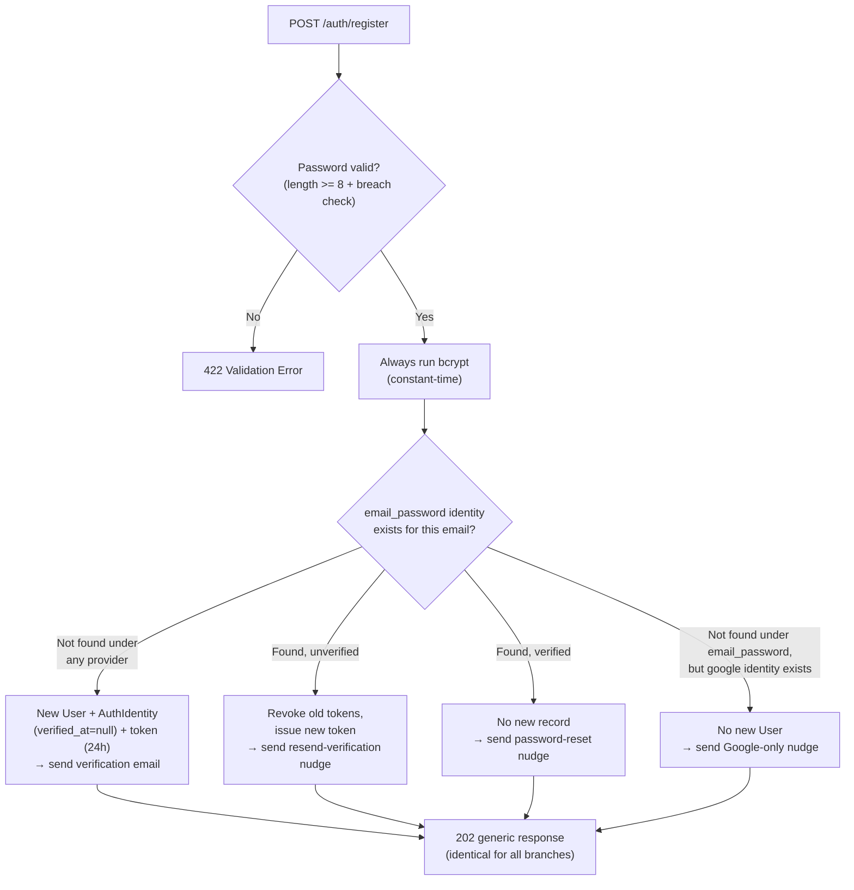

# Tech Plan: Register & Email Verification

> Ticket    : 01-register-email-verification
> Author    : Anhar Solehudin (@anhsbolic)
> Date      : 2026-08-19
> Status    : Draft
> Refs      : `AGENTS.md` (root + backend), `docs/spec/domains/account/features/01-register-email-verification.md`, `docs/spec/domains/account/invariants.md`, `docs/spec/domains/account/threat-model.md`, `api/openapi.yaml`, `docs/project/kencleng-erd.md` §1, `docs/project/kencleng-backend-tech-stack.md`

---

## 📋 Summary — start here

*Derived from sections 1, 2, 5, 7, and 14 below — condensed, not reinterpreted.*

**What & why** — The account domain's first vertical slice: public
registration with `email_password`, email verification via single-use
token, and resend-verification. The backend is greenfield
(`internal/domain/` is empty), so this builds the domain package,
repository layer, transport handlers, and the first three migrations
from scratch. The defining constraint is anti-enumeration: every
register/resend branch returns an identical `202` generic response, and
the four internal branches must take equivalent wall-clock time.

**Scope**
- Three public endpoints: `POST /auth/register`, `POST /auth/verify-email`, `POST /auth/verify-email/resend`
- New `domain/account` package: entity, repository, service
- Three migrations: `users`, `auth_identities`, `auth_tokens`
- New platform packages: `secrets` (bcrypt), `breachcheck` (HaveIBeenPwned), `notification` (fake sender)
- Rate-limiting middleware for `/auth/*`
- Password policy (length ≥8 + breach check, fail-open)
- Single-use verification token with 24h expiry
- Anti-enumeration: uniform `202` response + constant-time branches
- Not included: login, JWT issuance, Google OAuth, password reset, MFA, account linking

**Decision flow diagram**



**Key decisions**
- PII encryption functions (`platform/crypto/`) authored by a human — Tier 0 fenced, prerequisite before Build
- Password hashing in new `platform/secrets/` (bcrypt wrapper, non-fenced)
- Email sender as interface in `platform/notification/` with `FakeSender` (v1 = logged, no SMTP)
- Constant-time anti-enumeration via "always bcrypt" — dummy hash on no-op branches
- Token generation in-service using `crypto/rand` (32 bytes, hex-encoded, SHA-256 stored)

**Top risks**

| Risk | Why it matters |
|---|---|
| `platform/crypto/` encrypt/decrypt/HMAC functions are Tier 0 fenced — agent cannot write them | Hard blocker: repository cannot insert encrypted PII without them |
| Email send inside DB transaction holds locks during network I/O | Violates transactions best practice; must send after commit |
| Rate limiter map grows without eviction | Memory leak under sustained traffic; needs idle-key cleanup |
| HaveIBeenPwned client uses `http.DefaultClient` (no timeout) | Hung API call blocks goroutine indefinitely; must construct client with explicit timeout |

**Open items needing human input**
1. **Tier 0 crypto blocker** — human must author `platform/crypto/` encrypt/decrypt/HMAC functions before Build stage starts
2. **INV-account-08 verification description inconsistency** — invariant doc's Verification field omits `revoked_at IS NULL`; needs human to fix spec
3. **Rate limit RPS/burst values for `/auth/*`** — tech stack says "stricter" but specifies no concrete numbers

---

<!-- Audience boundary: above is the human-readable digest for
review/approval. Below is the full execution-grade plan — same
decisions, same scope, expanded to file/line precision, rule IDs, and
full option comparisons. Nothing below contradicts the digest above;
it's the same source of truth at higher resolution. -->

---

## 1. Background

The Kencleng backend is at scaffold stage: `internal/domain/` contains
only `.gitkeep`, `internal/transport/http/` has only `doc.go`, and
`migrations/` has only `.gitkeep`. The platform layer
(`internal/platform/`) has working connection pooling
(`db/db.go` — `Open(ctx, databaseURL) (*pgxpool.Pool, error)`), ES256
key loading (`auth/keys.go`), and encryption/HMAC key material loading
(`crypto/keys.go` — `New(encryptionKeyB64, hmacKeyB64) (*Keys, error)`,
32-byte keys validated). But the actual encrypt/decrypt/HMAC functions
in `platform/crypto/` do not exist yet — the package holds only the key
holder, and it is Tier 0 file-path-fenced per `AGENTS.md` §3.

This feature is the account domain's first vertical slice (task #1 in
`docs/spec/domains/account/tasks.md`, Tier 1, serial group S1). It
delivers three public endpoints: registration, email verification, and
resend-verification. The defining security constraint is
anti-enumeration: per the threat model (resolved 2026-08-05), the
register and resend endpoints must return a uniform `202` generic
response regardless of the email's actual state in the system, and the
four internal branches of register must take equivalent wall-clock time
so a timing side-channel doesn't leak which branch ran. The feature
spec (Assumption B) leaves the exact constant-time mechanism to the
implementing agent.

Two invariants are directly in scope: INV-account-01 (per-provider
uniqueness, requires a concurrent-insert race test) and INV-account-08
(single-use, time-bound tokens, requires a concurrent double-submit
test with the full 3-clause redemption guard).

## 2. Scope

**In scope:**
- `POST /auth/register` — new user registration with anti-enumeration
  (4 branches: new / unverified-existing / verified-existing /
  Google-only-conflict)
- `POST /auth/verify-email` — token redemption with single-use guard
- `POST /auth/verify-email/resend` — resend verification with
  old-token revocation
- New `internal/domain/account/` package: `entity.go`,
  `repository.go`, `repository_db.go`, `service.go`, `service_test.go`
- Three migrations: `users`, `auth_identities`, `auth_tokens` (with
  unique indexes, partial index, `set_updated_at()` trigger function)
- New `internal/platform/secrets/` — bcrypt wrapper (HashPassword,
  ComparePassword)
- New `internal/platform/breachcheck/` — HaveIBeenPwned k-anonymity
  client with explicit timeout, fail-open
- New `internal/platform/notification/` — Sender interface +
  FakeSender (logged, no SMTP)
- Rate-limiting middleware in `internal/transport/http/` for `/auth/*`
- Error-to-Problem-Details mapping in `internal/transport/http/`
- `cmd/server/main.go` wiring for new routes, services, middleware
- `go get goqu golang.org/x/time/rate` (dependencies not yet in
  `go.mod`)

**Out of scope (explicit):**
- Login & session management (task #3 — JWT issuance is Tier 0 fenced)
- Google OAuth login/register (task #2)
- Forgot & reset password (task #4)
- Account linking / set-password (task #5)
- MFA TOTP (task #6)
- Role assignment (task #8)
- Real SMTP email delivery — v1 uses fake/logged sender per
  `kencleng-phase3-detail.md`
- `golang-migrate` CLI installation/config — migrations are run
  manually via CLI per tech stack doc, not embedded in app startup

## 3. Requirements

| Condition | Requirement | Source/Note |
|---|---|---|
| Register: new email | Create User + AuthIdentity (email_password, verified_at=null) + token (24h), send verification email, respond 202 generic (no user_id) | Feature spec AC §1; Assumption A |
| Register: unverified existing | No new record; resend-verification flow (revoke old, new token, email), respond 202 generic (identical to new) | Feature spec AC §2 |
| Register: verified existing | No new record; password-reset nudge email, respond 202 generic (identical) | Feature spec AC §3 |
| Register: Google-only conflict | No new User; Google-only nudge email, respond 202 generic (identical) | Feature spec AC §5; Assumption C |
| Register: password validation | ≥8 chars + HaveIBeenPwned breach check; 422 if fails; checked before enumeration-sensitive branching | Feature spec AC §4; tech stack §Password Policy |
| Register: breach check fail-open | If HaveIBeenPwned API unreachable, proceed without check (logged) | Feature spec AC §1; tech stack §Breach-List Check |
| Register: constant-time | All 4 branches take equivalent wall-clock time + DB-write-shaped work | Feature spec Assumption B; threat model §1 |
| Verify-email: valid token | Set AuthIdentity.verified_at = now, respond 200 | Feature spec AC §verify-email |
| Verify-email: expired | 410 Token Expired, no state change | Feature spec AC; openapi.yaml |
| Verify-email: not found / already used | 404, no state change | Feature spec AC; openapi.yaml |
| Verify-email: revoked (superseded) | 404, no state change — enforced by `revoked_at IS NULL` in guard | Feature spec AC; INV-account-08 |
| Verify-email: concurrent double-submit | Exactly one succeeds (200), other gets 404 | Feature spec AC; INV-account-08 |
| Resend: unverified match | Revoke old tokens, issue new token, send email, respond 202 generic | Feature spec AC §resend |
| Resend: no match / verified / google-only | No token, no email, respond 202 generic (identical) | Feature spec AC §resend |
| Rate limit | Stricter `/auth/*` limit on all 3 endpoints; 429 on excess | Feature spec AC; threat model §1 |
| INV-account-01 | Per-provider uniqueness; concurrent duplicate registration fails cleanly | invariants.md INV-account-01 |
| INV-account-08 | Token redemption guard: `used_at IS NULL AND revoked_at IS NULL AND expires_at > now()` | invariants.md INV-account-08 |
| PII encryption | primary_email + identifier stored as AES-GCM ciphertext; *_hash columns as HMAC-SHA256 for lookup | ERD §1; AGENTS.md golden rules |
| SQL parameterization | All SQL via goqu, never fmt.Sprintf or string concatenation | AGENTS.md golden rules |
| Error handling | Errors wrapped with `fmt.Errorf("...: %w", err)`; never swallowed | AGENTS.md golden rules |
| Error responses | RFC 9457 Problem Details; no internal leakage | AGENTS.md golden rules; openapi.yaml |
| No secrets in logs | Log the fact + outcome, not the payload (email, password, token) | AGENTS.md golden rules |

## 4. Rules & Validation

- **R1 (Register — new user)** given an email not yet registered under
  `email_password`, and a valid password (≥8 chars, not in breach-list
  or breach-check API unreachable), when register is submitted, then a
  new `User` + `AuthIdentity` (`provider_type=email_password`,
  `verified_at=null`) is created, a single-use verification token
  (`auth_tokens`, `purpose=email_verification`, `expires_at = now() +
  24h`) is generated, a verification email is sent, and the API
  responds `202` with a generic accepted message (no `user_id`).

- **R2 (Register — unverified existing)** given an email already
  registered under `email_password` and unverified, when register is
  submitted, then no new `User`/`AuthIdentity` is created; instead the
  same internal action as `verify-email/resend` fires (old unused
  tokens revoked, new one issued, resend-verification email sent), and
  the API responds `202` with the same generic message as R1.

- **R3 (Register — verified existing)** given an email already
  registered under `email_password` and verified, when register is
  submitted, then no new record is created, a password-reset nudge
  email is sent, and the API responds `202` with the same generic
  message.

- **R4 (Register — Google-only conflict)** given an email registered
  only under a `google` `AuthIdentity` (no `email_password` identity
  exists), when register is submitted, then no new `User` is created, a
  Google-only nudge email is sent, and the API responds `202` with the
  same generic message.

- **R5 (Register — password validation order)** given a password that
  fails the length policy (<8 chars) or is found in the breach-list,
  when submitted, then `422` Validation Error — this check happens
  **before** any enumeration-sensitive branching (R1-R4), so it doesn't
  leak whether the email is registered.

- **R6 (Register — breach check fail-open)** given the HaveIBeenPwned
  API is unreachable, when a valid password is submitted, then
  registration proceeds without the breach check (fail-open, logged
  via observability logging, not `user_logs`).

- **R7 (Register — constant-time anti-enumeration)** given any of the
  four register branches (R1-R4), when executed, then the response
  shape and wall-clock time must not leak which branch ran — all
  branches perform equivalent-cost work (bcrypt computation +
  DB-write-shaped operation). Test:
  `TestRegister_GenericResponse_AllBranches`,
  `TestRegister_GenericResponse_Timing`.

- **R8 (Verify-email — valid token)** given a valid, unexpired, unused
  token, when submitted, then `AuthIdentity.verified_at` is set to
  now, response `200`.

- **R9 (Verify-email — expired)** given an expired token
  (`expires_at <= now()`), when submitted, then `410` Token Expired,
  no state change.

- **R10 (Verify-email — not found / already used)** given a token that
  doesn't exist or was already used (`used_at IS NOT NULL`), when
  submitted, then `404`, no state change.

- **R11 (Verify-email — revoked)** given a revoked token (superseded
  by a later resend, `revoked_at IS NOT NULL` while `used_at IS NULL`
  and unexpired), when submitted, then `404`, no state change —
  enforced by the `revoked_at IS NULL` clause in the redemption guard.
  Test: `TestVerifyEmail_RevokedToken_Rejected`.

- **R12 (Verify-email — concurrent double-submit)** given the same
  valid token submitted twice concurrently, then exactly one request
  succeeds (`200`), the other gets `404` — guarded by `UPDATE ... WHERE
  used_at IS NULL AND revoked_at IS NULL AND expires_at > now()` (full
  3-clause predicate per INV-account-08 statement). Test:
  `TestVerifyEmail_TokenSingleUse_Concurrent`.

- **R13 (Resend — unverified match)** given an email matching an
  existing unverified `email_password` identity, when resend is
  requested, then previous unused token(s) for that identity are
  revoked (`revoked_at`), a new token is issued, a new verification
  email is sent, and the API responds `202` generic.

- **R14 (Resend — no match / verified / google-only)** given an email
  that doesn't match any account, matches an already-verified account,
  or matches only a `google` identity, when resend is requested, then
  no new token is created and no email is sent, but the API response is
  identical (`202` generic) to R13.

- **R15 (Rate limit)** given too many requests on any of the three
  `/auth/*` endpoints, when the rate limit is exceeded, then `429`.
  Test: `TestResend_RateLimited`.

- **R16 (INV-account-01 — concurrent duplicate registration)** given
  two concurrent registration attempts for the same email under
  `email_password`, then exactly one succeeds and the other fails
  cleanly (DB unique index `ux_auth_identities_provider_identifier`).
  Test: `TestRegister_ConcurrentDuplicateEmail_Race` (≥100 goroutines
  per tasks.md KPI).

- **R17 (Register — Google-only conflict generic response)** given the
  Google-only-conflict branch (R4), when executed, then the response is
  identical to every other branch — no distinguishing status code or
  message. Test: `TestRegister_GoogleOnlyConflict_GenericResponse`.

- **R18 (Register — password policy)** given a password <8 chars or
  found in breach-list, when submitted, then `422` with field-level
  error on `password`. Test: `TestRegister_PasswordPolicy`.

- **R19 (Register — breach check fail-open test)** given the
  HaveIBeenPwned API is unreachable, when a valid password is
  submitted, then registration proceeds. Test:
  `TestRegister_BreachCheck_FailOpen`.

## 5. Decision Log

| Option considered | Why rejected/accepted |
|---|---|
| **A. Human authors `platform/crypto/` encrypt/decrypt/HMAC functions** | **Chosen.** `platform/crypto/` is Tier 0 fenced (AGENTS.md §3) — agent cannot write these. The package's stated purpose is PII encryption-at-rest; it already holds the key material. A human session writes the functions once; this and every future domain consumes them. Without this prerequisite, the repository cannot insert encrypted PII. |
| B. New `platform/secrets/` handles both PII encryption and password hashing | Rejected — splits crypto across two packages and contradicts the ERD's design intent that `platform/crypto/` owns PII encryption. |
| C. Inline PII encryption in the domain service | Rejected — violates architecture principle that shared infra lives in `platform/`; every future domain would duplicate. |
| **A. New `platform/secrets/` package wrapping bcrypt** | **Chosen.** Password hashing is used in register, reset-password (task #4), and set-password (task #5) — three features. A thin wrapper (`HashPassword`, `ComparePassword`) avoids repeating the bcrypt import pattern. Doc.go clarifies it's for credential hashing, distinct from `crypto/`'s PII encryption. Import: `golang.org/x/crypto/bcrypt` (already indirect dep via minio). |
| B. `domain/account/service` imports bcrypt directly | Rejected — would duplicate the import pattern across 3 features that need password hashing. |
| **A. `platform/notification/` Sender interface + FakeSender** | **Chosen.** v1 email is fake/logged (no SMTP per `kencleng-phase3-detail.md`). The interface (`SendVerificationEmail`, `SendNudgeEmail`) creates a clean seam — when real SMTP is added later (notification domain), only the implementation swaps, not the service. Placed in `platform/` since email sending is shared infra. |
| B. `domain/account/service` takes a `SendEmailFunc` callback | Rejected — less structured; the notification domain will eventually own real email delivery, and an interface is the right seam. |
| **A. `platform/breachcheck/` as a separate package** | **Chosen.** HaveIBeenPwned client is an external HTTP call with its own timeout/fail-open logic, reusable by reset-password (task #4). Separate package keeps the concern isolated. Client constructed once with explicit timeout (not `http.DefaultClient`), reused across calls. |
| B. Breach check inlined in `domain/account/service` | Rejected — would need to be duplicated in reset-password service later. |
| **A. Token generation in the service using `crypto/rand`** | **Chosen.** 32 random bytes, hex-encoded for user-facing token, SHA-256 for storage. Self-contained, ~10 lines. If password-reset reuses it, extract later (YAGNI). |
| B. `platform/token/` package | Rejected — overkill for 10 lines; YAGNI until a second consumer appears. |
| **A. Per-endpoint rate limiter middleware in `transport/http/`** | **Chosen.** Uses `rate.NewLimiter` (`golang.org/x/time/rate`). Applied to the three `/auth/*` routes. Middleware is a transport-layer concern. Limiter map includes idle-key eviction (per `go/rate-limiting.md` best practice — unbounded map is a memory leak). |
| B. `platform/ratelimit/` package | Rejected — middleware is transport-layer concern; the `ratelimit` platform package stays empty. |
| **A. Three migration files (up/down), numbered sequentially** | **Chosen.** Migration 000001 creates `set_updated_at()` trigger function + `users` table; 000002 creates `auth_identities`; 000003 creates `auth_tokens`. SQL from the ERD. Unique indexes and partial indexes in the same migration as their table. All new tables — additive, no backfill needed. |
| B. Single migration for all three tables | Rejected — less granular rollback; separate files match `golang-migrate` convention. |
| **A. "Always bcrypt" constant-time approach** | **Chosen.** The service always performs one `bcrypt.GenerateFromPassword` call regardless of which branch executes. On branches that don't need a new password hash (verified, Google-only), the bcrypt call is a "dummy" — result discarded. All 4 branches take ~100ms (bcrypt default cost), eliminating the CPU-time side-channel. For DB-time uniformity, all branches perform DB-write-shaped work per Assumption B (exact mechanism left to Build stage). |
| B. Artificial delay / sleep | Rejected — fragile, adds latency uniformly, doesn't match real workload shape. |
| **A. One handler file per endpoint group in `transport/http/`** | **Chosen.** `auth_register.go`, `auth_verify_email.go`, `middleware.go`, `errors.go`. `errors.go` defines sentinel errors (`ErrTokenExpired`, `ErrTokenNotFound`, `ErrValidation`) and a central `WriteProblem(w, err)` mapping to RFC 9457. Standard `net/http` Go 1.22+ pattern routing. |
| B. Single `auth.go` handler file | Rejected — harder to navigate as more auth endpoints are added in later tasks. |

## 6. Backward Compatibility

- **Database**: three new tables (`users`, `auth_identities`,
  `auth_tokens`) — purely additive, no existing tables altered. No
  existing data affected (greenfield). Down migrations drop tables +
  trigger function. No backfill needed (no existing rows).
- **API**: three new endpoints (`POST /auth/register`,
  `POST /auth/verify-email`, `POST /auth/verify-email/resend`) — purely
  additive. No existing endpoints changed. The `openapi.yaml` was
  already updated (2026-08-05 per Assumption A) to reflect the `202`
  generic response for register.
- **Existing clients/data**: no existing clients (greenfield). No
  existing data (greenfield).
- **Deprecation path**: none — new feature, no deprecated behavior.
- **Dependencies**: `go.mod` gains `goqu` and `golang.org/x/time/rate`
  as direct deps. `golang.org/x/crypto` transitions from indirect to
  direct (bcrypt import in `platform/secrets/`).

## 7. Edge Cases & Risks

| Risk | Likelihood | Severity | Mitigation |
|---|---|---|---|
| `platform/crypto/` encrypt/decrypt/HMAC functions don't exist — Tier 0 fenced, agent cannot write them | Certain (current state) | High — hard blocker | Human authors the functions in a paired session before Build starts (Decision 1). Without them, repository cannot insert encrypted PII. |
| Email send inside DB transaction holds locks during I/O | Medium if naive | High — violates transactions best practice (`postgresql/transactions-and-locking.md` §1) | All DB writes (insert user + auth_identity + token, or revoke + insert token) commit first; email send happens after commit. If email fails post-commit, user can use resend — DB state is correct. |
| Rate limiter map grows without eviction | High if per-IP map with no cleanup | Medium — memory leak under sustained traffic | Limiter map includes idle-key eviction (background sweep or TTL) per `go/rate-limiting.md`. Limit/burst configurable, not hardcoded. |
| HaveIBeenPwned client uses `http.DefaultClient` (no timeout) | Avoided by design | High — hung API call blocks goroutine indefinitely | Construct `http.Client` once with explicit `Timeout` (e.g. 5s) at service init; reuse across calls. Use `http.NewRequestWithContext` for ctx-aware deadline. Per `go/http-client-and-transport.md`. |
| Concurrent duplicate registration — orphaned `users` row on rollback | Low (unique index catches it) | Medium — orphaned row if transaction not used | Single transaction wrapping all inserts (users + auth_identities + auth_tokens). Second goroutine's `auth_identities` INSERT fails on `ux_auth_identities_provider_identifier`; entire transaction rolls back cleanly. Test: R16. |
| INV-account-08 guard missing `revoked_at IS NULL` clause | Medium if following test description not statement | High — revoked token could redeem | Implementation uses the full 3-clause predicate from the invariant Statement: `used_at IS NULL AND revoked_at IS NULL AND expires_at > now()`. The Verification field's 2-clause version is a doc error (Open Item #2). |
| Timing side-channel between register branches (DB work differs) | Medium | High — leaks which branch ran | "Always bcrypt" approach (Decision 8) handles CPU time. DB-time uniformity: all branches do DB-write-shaped work per Assumption B. Exact mechanism left to Build stage per spec. |
| Error response leaks internal details (SQL error, stack trace) | Low if using central error mapper | High — information disclosure | `errors.go` central `WriteProblem(w, err)` maps sentinel errors to RFC 9457 Problem Details. No raw error strings in responses. Per AGENTS.md golden rule. |
| PII (email) logged in plaintext | Low if disciplined | High — UU PDP violation | Log the fact + outcome, not the payload (AGENTS.md). No `fmt.Sprintf("%+v", user)`. No `log.Printf("register email=%s", email)`. Log user_id after creation, not email. Per `go/secrets-and-sensitive-logging.md`. |
| HMAC key rotation orphans all lookup hashes | Very low (no rotation in v1) | Medium — all lookups break | Tech stack accepts no rotation in v1 (manual one-off script if needed). Not a blocker. Per `go/secrets-and-key-management.md` — rotation plan documented even if not implemented. |
| Empty token string accepted by verify-email | Medium if no validation | Low — service returns 404 anyway | Handler rejects empty token at boundary (input validation per `go/input-validation-and-injection.md` §3). |
| Breach check error logged with password hash | Low if disciplined | High — credential leak | Log only the fact ("breach check API unreachable") + error category, not the password or hash. Per `go/secrets-and-sensitive-logging.md` §1. |
| `users.primary_email_hash` unique index conflicts with `auth_identities.identifier_hash` on concurrent insert | Low (different tables) | Low — both catch the duplicate, different error paths | Service handles unique-violation from either table cleanly (maps to 202 generic, not an error response). |

---

<!-- Secondary marker: sections 1-7 above still favor narrative/table
form; 8-13 below are file/line-precise implementation detail. Both
halves are inside the executor-facing part of the document — the only
audience split that matters for review purposes is the one above,
between the Summary and section 1. -->

---

## 8. Interface Contract

Per `backend/AGENTS.md`: standard `net/http` with Go 1.22+ pattern
routing; repository layer uses `goqu` query builder (never raw string
concatenation); errors wrapped with `fmt.Errorf("...: %w", err)`;
PII fields follow the `{field}` (BYTEA, AES-GCM) + `{field}_hash`
(TEXT, HMAC-SHA256) pattern; error responses in RFC 9457 Problem
Details; no secrets/PII in logs.

**DB Schema changes** (three new tables, SQL from ERD §1):

Migration 000001 — `set_updated_at()` trigger function + `users`:
```sql
CREATE OR REPLACE FUNCTION set_updated_at()
RETURNS TRIGGER AS $$
BEGIN
    NEW.updated_at = now();
    RETURN NEW;
END;
$$ LANGUAGE plpgsql;

CREATE TABLE users (
    id                  UUID PRIMARY KEY,
    name                TEXT NOT NULL,
    primary_email       BYTEA NOT NULL,
    primary_email_hash  TEXT NOT NULL,
    created_at          TIMESTAMPTZ NOT NULL DEFAULT now(),
    updated_at          TIMESTAMPTZ NOT NULL DEFAULT now()
);

CREATE UNIQUE INDEX ux_users_primary_email_hash ON users (primary_email_hash);

CREATE TRIGGER trg_users_updated_at
BEFORE UPDATE ON users
FOR EACH ROW EXECUTE FUNCTION set_updated_at();
```

Migration 000002 — `auth_identities`:
```sql
CREATE TABLE auth_identities (
    id                 UUID PRIMARY KEY,
    user_id            UUID NOT NULL REFERENCES users(id) ON DELETE CASCADE,
    provider_type      TEXT NOT NULL CHECK (provider_type IN ('email_password', 'google', 'phone_otp')),
    identifier         BYTEA NOT NULL,
    identifier_hash    TEXT NOT NULL,
    credential_secret  TEXT,
    verified_at        TIMESTAMPTZ,
    created_at         TIMESTAMPTZ NOT NULL DEFAULT now(),
    updated_at         TIMESTAMPTZ NOT NULL DEFAULT now()
);

CREATE UNIQUE INDEX ux_auth_identities_provider_identifier
    ON auth_identities (provider_type, identifier_hash);

CREATE INDEX ix_auth_identities_user_id ON auth_identities (user_id);

CREATE TRIGGER trg_auth_identities_updated_at
BEFORE UPDATE ON auth_identities
FOR EACH ROW EXECUTE FUNCTION set_updated_at();
```

Migration 000003 — `auth_tokens`:
```sql
CREATE TABLE auth_tokens (
    id          UUID PRIMARY KEY,
    user_id     UUID NOT NULL REFERENCES users(id) ON DELETE CASCADE,
    purpose     TEXT NOT NULL CHECK (purpose IN ('email_verification', 'password_reset')),
    token_hash  TEXT NOT NULL,
    expires_at  TIMESTAMPTZ NOT NULL,
    used_at     TIMESTAMPTZ,
    revoked_at  TIMESTAMPTZ,
    created_at  TIMESTAMPTZ NOT NULL DEFAULT now()
);

CREATE UNIQUE INDEX ux_auth_tokens_token_hash ON auth_tokens (token_hash);
CREATE INDEX ix_auth_tokens_user_purpose ON auth_tokens (user_id, purpose);

CREATE INDEX ix_auth_tokens_valid ON auth_tokens (user_id, purpose)
    WHERE used_at IS NULL AND revoked_at IS NULL;
```

Down migrations: drop tables + trigger (reverse order: 000003 →
000002 → 000001); 000001 drops `set_updated_at()` function (only after
all triggers using it are dropped).

**API changes** (three new endpoints, from `api/openapi.yaml`):
```
POST /auth/register
  Request:  { name: string (1-255), email: string (email), password: string (min 8) }
  Responses: 202 GenericAcceptedMessage | 422 ValidationProblem | 429 Problem
  Security: [] (public)

POST /auth/verify-email
  Request:  { token: string }
  Responses: 200 { message: string } | 410 Problem (token expired) | 404 Problem | 429 Problem
  Security: [] (public)

POST /auth/verify-email/resend
  Request:  { email: string (email) }
  Responses: 202 GenericAcceptedMessage | 429 Problem
  Security: [] (public)
```

**Business logic flow (concise):**
```
Register(ctx, name, email, password):
  1. Validate password length >= 8  → ErrValidation if fails (R5, R18)
  2. Breach check (k-anonymity, fail-open)  → ErrValidation if breached (R6, R19)
  3. Always run bcrypt(password)  [constant-time — result used or discarded] (R7)
  4. Compute HMAC(email) → identifier_hash
  5. Lookup auth_identity by (email_password, identifier_hash):
     - found, unverified → resend branch: revoke old tokens, issue new, send nudge (R2)
     - found, verified   → nudge branch: send password-reset nudge (R3)
     - not found:
       - check google identity by (google, identifier_hash):
         - found → Google-only nudge branch: send Google nudge (R4, R17)
         - not found → new user branch: insert user + auth_identity + token, send verification email (R1)
  6. All branches return 202 generic (identical response shape + timing) (R7)
  7. Email send happens AFTER transaction commit (not inside)

VerifyEmail(ctx, token):
  1. Compute SHA-256(token) → token_hash
  2. Atomic UPDATE auth_tokens SET used_at = now()
     WHERE token_hash = $1 AND used_at IS NULL AND revoked_at IS NULL AND expires_at > now()
     [full 3-clause predicate — INV-account-08] (R12)
  3. If 0 rows affected:
     - if token exists and expired → 410 (R9)
     - else → 404 (not found / already used / revoked) (R10, R11)
  4. If 1 row affected: set auth_identity.verified_at = now() (R8)
  5. Respond 200

ResendVerification(ctx, email):
  1. Compute HMAC(email) → identifier_hash
  2. Lookup auth_identity by (email_password, identifier_hash):
     - found, unverified:
       - revoke old tokens (UPDATE auth_tokens SET revoked_at = now()
         WHERE user_id = $1 AND purpose = 'email_verification'
         AND used_at IS NULL AND revoked_at IS NULL)
       - issue new token (24h)
       - send verification email (R13)
     - found, verified / not found / google-only:
       - no token, no email (R14)
  3. Always return 202 generic (identical)
```

## 9. Architecture / Plan

Implementation sequence (dependency-ordered):

```
1.  go get goqu golang.org/x/time/rate
2.  migrations/ (3 up+down files + trigger function)
3.  platform/secrets/ (bcrypt wrapper: HashPassword, ComparePassword)
4.  platform/breachcheck/ (HaveIBeenPwned k-anonymity client, explicit timeout)
5.  platform/notification/ (Sender interface + FakeSender)
6.  domain/account/entity.go (User, AuthIdentity, AuthToken structs)
7.  domain/account/repository.go (Repository interface — ports)
8.  domain/account/repository_db.go (goqu + pgx implementation — adapter)
9.  domain/account/service.go (Register, VerifyEmail, ResendVerification)
10. domain/account/service_test.go (table-driven + concurrency tests)
11. transport/http/errors.go (sentinel errors + WriteProblem)
12. transport/http/middleware.go (rate limit with idle-key eviction)
13. transport/http/auth_register.go (POST /auth/register handler)
14. transport/http/auth_verify_email.go (verify + resend handlers)
15. cmd/server/main.go wiring
```

Steps 2-5 can be parallelized (no interdependencies). Steps 6-9 are
sequential (entity → interface → impl → service). Steps 10-14 depend
on 9. Step 15 last.

**Prerequisite**: human-authored `platform/crypto/` functions
(Encrypt, Decrypt, HMAC). Without them, step 8 cannot encrypt PII.

## 10. Implementation Details

Reference file:function + signature. Full snippet only for genuinely
novel logic.

**File**: `backend/go.mod`
- Change: `go get github.com/doug-martin/goqu/v9 golang.org/x/time/rate`; `golang.org/x/crypto` transitions indirect → direct (bcrypt)

**File**: `backend/migrations/000001_create_users.{up,down}.sql`
- Change: new migration — `set_updated_at()` function + `users` table + unique index + trigger (see §8)

**File**: `backend/migrations/000002_create_auth_identities.{up,down}.sql`
- Change: new migration — `auth_identities` table + unique index `(provider_type, identifier_hash)` + user_id index + trigger (see §8)

**File**: `backend/migrations/000003_create_auth_tokens.{up,down}.sql`
- Change: new migration — `auth_tokens` table + unique index `token_hash` + user_purpose index + partial valid index (see §8)

**File**: `backend/internal/platform/secrets/secrets.go` (new)
- `HashPassword(password string) (string, error)` — wraps `bcrypt.GenerateFromPassword`, default cost
- `ComparePassword(hash, password string) error` — wraps `bcrypt.CompareHashAndPassword`

**File**: `backend/internal/platform/breachcheck/client.go` (new)
- `type Client struct { httpClient *http.Client; baseURL string }`
- `NewClient(timeout time.Duration) *Client` — constructs `http.Client` with explicit `Timeout` (per `go/http-client-and-transport.md`), not `http.DefaultClient`
- `IsBreached(ctx context.Context, password string) (bool, error)` — k-anonymity: SHA-1 hash, send first 5 hex chars to `api.pwnedpasswords.com/range/{prefix}`, compare suffix locally. Returns `(false, nil)` on API unreachable (fail-open, logged).
- `http.Client` constructed once at init, reused across calls (per `go/http-client-and-transport.md` §2)

**File**: `backend/internal/platform/notification/sender.go` (new)
- `type Sender interface { SendVerificationEmail(ctx context.Context, to, token string) error; SendNudgeEmail(ctx context.Context, to, nudgeType string) error }`
- `type FakeSender struct{}` — logs recipient + type via `log.Printf`, no SMTP. Nudge types: `"resend_verification"`, `"password_reset"`, `"google_only"`.

**File**: `backend/internal/domain/account/entity.go` (new)
- `type User struct { ID uuid.UUID; Name string; PrimaryEmailCiphertext []byte; PrimaryEmailHash string; CreatedAt, UpdatedAt time.Time }`
- `type AuthIdentity struct { ID uuid.UUID; UserID uuid.UUID; ProviderType string; IdentifierCiphertext []byte; IdentifierHash string; CredentialSecret *string; VerifiedAt *time.Time; CreatedAt, UpdatedAt time.Time }`
- `type AuthToken struct { ID uuid.UUID; UserID uuid.UUID; Purpose string; TokenHash string; ExpiresAt time.Time; UsedAt *time.Time; RevokedAt *time.Time; CreatedAt time.Time }`

**File**: `backend/internal/domain/account/repository.go` (new)
- `type Repository interface { InsertUser(ctx context.Context, tx pgx.Tx, user *User) error; InsertAuthIdentity(ctx context.Context, tx pgx.Tx, identity *AuthIdentity) error; InsertAuthToken(ctx context.Context, tx pgx.Tx, token *AuthToken) error; FindAuthIdentityByIdentifierHash(ctx context.Context, providerType, identifierHash string) (*AuthIdentity, error); FindAuthTokenByHash(ctx context.Context, tokenHash string) (*AuthToken, error); RedeemToken(ctx context.Context, tokenHash string) (bool, error); SetVerifiedAt(ctx context.Context, identityID uuid.UUID, verifiedAt time.Time) error; RevokeTokens(ctx context.Context, userID uuid.UUID, purpose string) error }`
- All methods take `context.Context` as first param (per AGENTS.md convention)
- `RedeemToken` uses the atomic `UPDATE ... WHERE used_at IS NULL AND revoked_at IS NULL AND expires_at > now()` guard — returns `true` if 1 row affected, `false` if 0 rows

**File**: `backend/internal/domain/account/repository_db.go` (new)
- `type RepositoryDB struct { db *pgxpool.Pool; cryptoKeys *crypto.Keys }`
- Implements `Repository` using `goqu` for all SQL (per AGENTS.md — never `fmt.Sprintf`)
- `InsertUser`: encrypts `primary_email` via `crypto.Encrypt(email, keys.EncryptionKey)`, computes HMAC via `crypto.HMAC(email, keys.HMACKey)`
- `InsertAuthIdentity`: same encryption pattern for `identifier`
- All inserts use goqu's `DefaultDialect` with parameterized queries

**File**: `backend/internal/domain/account/service.go` (new)
- `type Service struct { repo Repository; db *pgxpool.Pool; secrets *secrets.Hasher; breachCheck *breachcheck.Client; emailSender notification.Sender; cryptoKeys *crypto.Keys }`
- `Register(ctx context.Context, name, email, password string) error` — orchestrates R1-R7, R16-R19
- `VerifyEmail(ctx context.Context, token string) error` — orchestrates R8-R12
- `ResendVerification(ctx context.Context, email string) error` — orchestrates R13-R15
- Token generation: `generateToken() (plainToken, tokenHash string, err error)` — 32 bytes `crypto/rand`, hex-encoded, SHA-256 hash
- Constant-time: all register branches call `secrets.HashPassword(password)` (bcrypt); new-user branch stores the result, other branches discard it
- Transaction: `Register` uses `db.BeginTx(ctx, nil)` for all inserts; commits before sending email
- Sentinel errors: `ErrTokenExpired`, `ErrTokenNotFound`, `ErrValidation` (defined in `transport/http/errors.go` or a shared errors file)

**File**: `backend/internal/transport/http/errors.go` (new)
- Sentinel errors: `ErrTokenExpired`, `ErrTokenNotFound`, `ErrValidation`, `ErrRateLimited`
- `func WriteProblem(w http.ResponseWriter, status int, problemType, title, detail string)` — writes RFC 9457 Problem Details with `application/problem+json` content type
- `func WriteValidationError(w http.ResponseWriter, errors []FieldError)` — writes `ValidationProblem` with `errors[]`
- No internal details leaked (AGENTS.md golden rule)

**File**: `backend/internal/transport/http/middleware.go` (new)
- `func RateLimit(rps float64, burst int) func(http.Handler) http.Handler` — uses `rate.NewLimiter`, per-IP key (public endpoints, anonymous users)
- Limiter map with idle-key eviction (background sweep or TTL) per `go/rate-limiting.md`
- Returns `429` Problem Details on excess
- RPS/burst values: TBD — verify (Open Item #3)

**File**: `backend/internal/transport/http/auth_register.go` (new)
- `func RegisterHandler(svc *account.Service) http.HandlerFunc` — parses `RegisterRequest`, validates at boundary, calls `svc.Register`, writes `202` generic or `422`/`429` error

**File**: `backend/internal/transport/http/auth_verify_email.go` (new)
- `func VerifyEmailHandler(svc *account.Service) http.HandlerFunc` — parses `VerifyEmailRequest`, rejects empty token at boundary, calls `svc.VerifyEmail`, writes `200` or `410`/`404`/`429`
- `func ResendVerificationHandler(svc *account.Service) http.HandlerFunc` — parses `ResendVerificationRequest`, calls `svc.ResendVerification`, writes `202` generic or `429`

**File**: `backend/cmd/server/main.go`
- Change: wire `account.Service` with dependencies (db, cryptoKeys, secrets, breachCheck client, emailSender); register routes with rate-limit middleware:
```go
authMux := http.NewServeMux()
authMux.HandleFunc("POST /auth/register", authHandler.Register)
authMux.HandleFunc("POST /auth/verify-email", authHandler.VerifyEmail)
authMux.HandleFunc("POST /auth/verify-email/resend", authHandler.ResendVerification)
mux.Handle("/auth/", ratelimit.RateLimit(rps, burst)(authMux))
```

## 11. Files Changed / Files NOT Changed

| File | Change Type | Description |
|---|---|---|
| `backend/go.mod` | Edit | Add `goqu`, `golang.org/x/time/rate` as direct deps; `golang.org/x/crypto` indirect → direct |
| `backend/migrations/000001_create_users.{up,down}.sql` | New | `set_updated_at()` + `users` table + unique index + trigger |
| `backend/migrations/000002_create_auth_identities.{up,down}.sql` | New | `auth_identities` table + unique index + user_id index + trigger |
| `backend/migrations/000003_create_auth_tokens.{up,down}.sql` | New | `auth_tokens` table + unique index + user_purpose index + partial valid index |
| `backend/internal/platform/secrets/secrets.go` | New | bcrypt wrapper (HashPassword, ComparePassword) |
| `backend/internal/platform/breachcheck/client.go` | New | HaveIBeenPwned k-anonymity client with explicit timeout, fail-open |
| `backend/internal/platform/notification/sender.go` | New | Sender interface + FakeSender (logged, no SMTP) |
| `backend/internal/domain/account/entity.go` | New | User, AuthIdentity, AuthToken structs |
| `backend/internal/domain/account/repository.go` | New | Repository interface (ports) |
| `backend/internal/domain/account/repository_db.go` | New | goqu + pgx implementation (adapter), uses crypto.Encrypt/HMAC |
| `backend/internal/domain/account/service.go` | New | Register, VerifyEmail, ResendVerification + token generation |
| `backend/internal/domain/account/service_test.go` | New | Table-driven + concurrency tests (R1-R19) |
| `backend/internal/transport/http/errors.go` | New | Sentinel errors + WriteProblem (RFC 9457) |
| `backend/internal/transport/http/middleware.go` | New | Rate limit middleware with idle-key eviction |
| `backend/internal/transport/http/auth_register.go` | New | POST /auth/register handler |
| `backend/internal/transport/http/auth_verify_email.go` | New | POST /auth/verify-email + resend handlers |
| `backend/cmd/server/main.go` | Edit | Wire account.Service, register routes with rate-limit middleware |

| File | Reason untouched |
|---|---|
| `backend/internal/platform/crypto/keys.go` | Tier 0 fenced — human authors encrypt/decrypt/HMAC in a separate paired session (Decision 1) |
| `backend/internal/platform/crypto/doc.go` | Tier 0 fenced |
| `backend/internal/platform/auth/keys.go` | Tier 0 fenced — JWT signing not in scope for this feature |
| `backend/internal/platform/auth/doc.go` | Tier 0 fenced |
| `backend/internal/platform/ratelimit/doc.go` | Rate limiting implemented as transport middleware, not in platform package |
| `backend/internal/platform/storage/` | Not needed for this feature (no file storage) |
| `backend/internal/platform/scheduler/` | Not needed for this feature (no background jobs) |
| `backend/internal/transport/http/doc.go` | Package doc, no change needed |
| `api/openapi.yaml` | Already updated (2026-08-05 per Assumption A) — no further changes |
| `docs/spec/domains/account/*` | Spec files — agent must not edit (AGENTS.md §4) |

## 12. Testing Checklist

Derived 1:1 from §4. Every rule ID (R1-R19) has at least one
corresponding line.

- [ ] R1: register new email → creates User + AuthIdentity (verified_at=null) + token (24h), sends verification email, responds 202 generic (no user_id)
- [ ] R2: register unverified existing email → no new record, resend flow (revoke old, new token, email), 202 generic (identical to R1)
- [ ] R3: register verified existing email → no new record, password-reset nudge email, 202 generic (identical)
- [ ] R4: register Google-only conflict email → no new User, Google-only nudge email, 202 generic (identical)
- [ ] R5: register with invalid password (<8 chars or breached) → 422 before enumeration branching (doesn't leak email state)
- [ ] R6: register with HaveIBeenPwned API unreachable → proceeds without breach check (fail-open, logged)
- [ ] R7: `TestRegister_GenericResponse_AllBranches` — all 4 branches return identical 202 response shape; `TestRegister_GenericResponse_Timing` — all 4 branches take equivalent wall-clock time
- [ ] R8: verify-email with valid, unexpired, unused token → sets verified_at, responds 200
- [ ] R9: verify-email with expired token → 410, no state change
- [ ] R10: verify-email with non-existent or already-used token → 404, no state change
- [ ] R11: `TestVerifyEmail_RevokedToken_Rejected` — revoked token (superseded by resend) → 404, no state change
- [ ] R12: `TestVerifyEmail_TokenSingleUse_Concurrent` — same token submitted twice concurrently → exactly one 200, other 404 (full 3-clause guard)
- [ ] R13: resend with unverified email_password match → revokes old tokens, issues new, sends email, 202 generic
- [ ] R14: resend with no match / verified / google-only → no token, no email, 202 generic (identical to R13)
- [ ] R15: `TestResend_RateLimited` — too many requests on `/auth/*` → 429
- [ ] R16: `TestRegister_ConcurrentDuplicateEmail_Race` — ≥100 concurrent goroutines registering same email → exactly one succeeds, rest fail cleanly (INV-account-01)
- [ ] R17: `TestRegister_GoogleOnlyConflict_GenericResponse` — Google-only branch response identical to other branches (no distinguishing status/message)
- [ ] R18: `TestRegister_PasswordPolicy` — password <8 chars or breached → 422 with field-level error on `password`
- [ ] R19: `TestRegister_BreachCheck_FailOpen` — HaveIBeenPwned API unreachable → registration proceeds
- [ ] `go test -race` clean (per AGENTS.md §3 — Tier 1 feature)
- [ ] `make verify` passes (lint, unit, race, contract, security-layer-A, integration)
- [ ] `gosec`/`gitleaks`/`govulncheck` — 0 findings or explicit accepted-risk note

## 13. Testing Examples & Common Mistakes

| Mistake | Error/Behavior | Fix |
|---|---|---|
| Email send inside DB transaction | Transaction holds locks during email I/O (even fake/logged) — violates `postgresql/transactions-and-locking.md` | Send email after `tx.Commit()`. If email fails post-commit, user uses resend — DB state is correct. |
| Using `http.DefaultClient` for HaveIBeenPwned | No timeout — hung API blocks goroutine indefinitely | Construct `http.Client{Timeout: 5*time.Second}` once at init, reuse. Per `go/http-client-and-transport.md`. |
| Rate limiter map without eviction | Memory leak — map grows unbounded under traffic | Background sweep or TTL on idle limiter entries. Per `go/rate-limiting.md`. |
| Using 2-clause token guard (`used_at IS NULL AND expires_at > now()`) | Revoked token (superseded by resend) still redeems | Use full 3-clause predicate: `used_at IS NULL AND revoked_at IS NULL AND expires_at > now()` (INV-account-08 statement, not its Verification field) |
| Early return on "email not found" branch (no bcrypt) | Timing side-channel — "not found" returns in <1ms, "found" takes ~100ms | Always run `bcrypt.GenerateFromPassword` on all branches; discard result on no-op branches (Decision 8) |
| Logging email in plaintext | PII leak — UU PDP violation | Log the fact ("registration attempt") + outcome, not the email. Log user_id after creation. Per `go/secrets-and-sensitive-logging.md`. |
| Logging error from HaveIBeenPwned client verbatim | Error may embed HTTP response body with sensitive data | Log sanitized summary (error code/category), not raw error string. Per `go/secrets-and-sensitive-logging.md` §1. |
| Raw error string in 422/404/410 response | Internal leakage (SQL error, file path) | Central `WriteProblem(w, err)` maps sentinel errors to RFC 9457 Problem Details. Per AGENTS.md golden rule. |
| String-matching DB errors (`strings.Contains(err.Error(), "unique violation")`) | Silent breakage if driver error message changes | Use `errors.Is`/`errors.As` with typed errors or pgx's `pgconn.PgError` code check. Per `go/error-wrapping.md`. |
| Not wrapping errors with `%w` | `errors.Is`/`errors.As` chain broken upstream | Always `fmt.Errorf("...: %w", err)`. Per AGENTS.md §2. |
| Empty token accepted by verify-email handler | Service returns 404 (no match), but wastes a DB round-trip | Reject empty token at handler boundary (input validation). Per `go/input-validation-and-injection.md` §3. |
| `users` insert + `auth_identities` insert in separate transactions | Concurrent race: second goroutine's `auth_identities` fails, but first's `users` row is orphaned | Single transaction wrapping all inserts; rollback is clean. |

---

## 14. Open Items

### Active — need external input or verification

1. **Tier 0 crypto blocker.** `platform/crypto/` is file-path-fenced
   (AGENTS.md §3). The agent cannot write the `Encrypt`,
   `Decrypt`, `HMAC` functions that the package needs. These are a
   hard prerequisite: without them, the repository layer cannot
   encrypt `primary_email`/`identifier` for insertion. A human
   session must author these before this feature's Build stage
   starts. *(Explicit in raw docs — 02-gap-analysis Area 4,
   03-solutioning Decision 1.)*

2. **INV-account-08 verification description inconsistency.** The
   invariant's Statement says the guard is `used_at IS NULL AND
   revoked_at IS NULL AND expires_at > now()` (3 clauses), but its
   Verification field only says `WHERE used_at IS NULL AND
   expires_at > now()` (2 clauses, missing `revoked_at IS NULL`). The
   feature spec's threat breakdown and acceptance criteria confirm
   the 3-clause version is correct. Implementation will follow the
   3-clause predicate. The invariant doc should be updated for
   consistency — but per AGENTS.md §4, the agent must not edit spec
   files, so this needs a human to fix
   `docs/spec/domains/account/invariants.md` INV-account-08's
   Verification field. *(Explicit in raw docs — 02-gap-analysis
   Area 3.)*

3. **Rate limit RPS/burst values for `/auth/*`.** The tech stack says
   "stricter rate limit on `/auth/*`" but doesn't specify concrete
   numbers. The implementation needs explicit RPS and burst values.
   The middleware is designed to be configurable (not hardcoded), but
   default values are needed for wiring and testing. *(Not specified
   anywhere in raw docs or specs.)*

### Resolved (kept for reference)

(none yet — this is the first synthesis pass)
