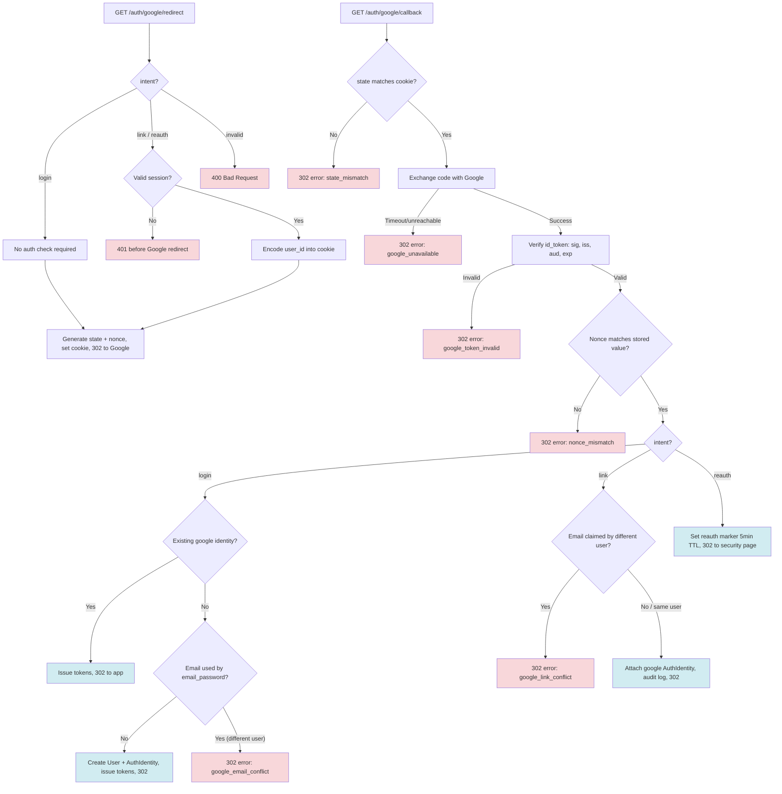

# Tech Plan: Google OAuth Login/Register

> Ticket    : 02-google-oauth-login-register
> Author    : AI agent (synthesized from exploration logs)
> Date      : 2026-08-22
> Status    : Draft
> Refs      : docs/spec/1-account/features/02-google-oauth-login-register.md, backend/AGENTS.md, api/openapi/account.yaml

---

## Summary — start here

**What & why** — The account domain needs Google OAuth as an alternative authentication path alongside email/password. Two shared endpoints (GET /auth/google/redirect + GET /auth/google/callback) handle login, registration, account linking, and re-authentication, distinguished by an intent query param. The no-auto-merge rule (blocking account takeover via email match) and CSRF/replay protection (state/nonce) are the security-critical pieces requiring human review.

**Scope**
- Two new GET endpoints: Google OAuth redirect + callback
- New refresh_tokens table migration (token issuance pulled into this task)
- New Google OAuth platform client (token exchange, JWKS verification)
- Cookie utility for state/nonce/user_id storage
- Token issuance primitives (IssueTokens method — reusable by task #3)
- In-memory reauth marker store (sync.Map with TTL eviction)
- link/reauth intent handler-level JWT verification
- Audit log entry for link intent success only

**Decision flow diagram**



**Key decisions**
- Token issuance pulled into this task (Option C) — eliminates hard dependency on task #3
- golang-jwt/jwt/v5 + manual JWKS fetch for id_token verification — new dependency
- Cookie utility in transport/http/cookie.go — JSON-encoded, base64, 10-min Max-Age
- Handler-level JWT verification for link/reauth — conditional auth based on intent param
- In-memory sync.Map for reauth markers — no Redis dependency; markers lost on restart (acceptable for 5-min TTL)

**Top risks**
| Risk | Why it matters |
|---|---|
| Incorrect id_token verification allows token forgery | Full account takeover via forged Google token |
| Missing auth check for link/reauth intent | Attacker links their Google account to any user |
| No-auto-merge rule bypassed | Email-match auto-linking enables account takeover via unverified provider claim |

**Open items needing human input** — 2 active items (Caddy routing for /auth/* — root-level session needed; error-code set v2 + audit action_type vocabulary pending frontend sign-off). See section 14.

---

## 1. Background

The account domain currently supports email/password registration with email verification (task #1, implemented). Google OAuth is the second authentication path, specified in docs/spec/1-account/features/02-google-oauth-login-register.md as Fitur 1B.

The two endpoints (GET /auth/google/redirect + GET /auth/google/callback) are shared across three business flows: login/register (this task), account linking (task #05), and MFA-disable re-authentication (task #06). The intent query param (login, link, reauth) distinguishes the flows. This task implements the full OAuth mechanics plus the login intent's business rules; link and reauth mechanics are implemented here but their intent-specific business rules will be extended by tasks #05 and #06.

A cross-task dependency exists: the callback needs to issue access + refresh tokens on successful login, but token issuance was originally scoped to task #3 (Login and Session Management). Per Decision 1 (Option C), minimal token issuance primitives are pulled into this task to eliminate the hard dependency. Task #3 will then build login, MFA check, lockout, refresh rotation, and logout on top of these primitives.

The no-auto-merge rule is the most security-critical business rule: when a Google login returns an email already claimed by an email_password identity for a different user, the system must NOT automatically merge the accounts. This prevents account takeover via an unverified email claim (e.g., a Google Workspace admin provisioning an address without proving inbox control). The same rule applies to the link intent — no code path creates or attaches an identity without an explicit, authenticated action from the account owner.

## 2. Scope

**In scope:**
- GET /auth/google/redirect?intent={login|link|reauth} — state/nonce generation, cookie setting, 302 to Google
- GET /auth/google/callback?code=...&state=... — state/nonce validation, token exchange, id_token verification, intent-based branching
- New refresh_tokens table (migration 000004) — minimal schema for token issuance
- New user_logs table (migration 000005) — minimal schema for audit logging (link intent success)
- IssueTokens(ctx, userID) service method — JWT ES256 access token + refresh token row creation
- Google OAuth platform client — code exchange, JWKS fetch with cache-on-miss, id_token verification (RS256, iss, aud, exp, nonce)
- Cookie utility — setOAuthStateCookie / readOAuthStateCookie with structured data (state, nonce, intent, user_id)
- Handler-level JWT verification for link/reauth intents
- In-memory reauth marker store (sync.Map with TTL eviction, 5-min TTL)
- Audit log entry for link intent success (user_logs — "account linking baru" per Fitur 9)
- New dependencies: github.com/golang-jwt/jwt/v5
- New env vars: FRONTEND_URL (for redirect destinations)

**Out of scope (explicit):**
- Login endpoint (POST /auth/login) — task #3
- MFA check at login — task #3
- Login attempt lockout (login_attempts table) — task #3
- Refresh token rotation + reuse detection (INV-account-03, INV-account-04) — task #3
- Logout endpoint — task #3
- Unlink Google (POST /account/security/google/unlink) — task #05
- Set password (POST /account/security/set-password) — task #05
- MFA disable consuming the reauth marker — task #06
- Redis infrastructure (reverted to in-memory sync.Map per user decision)
- Caddyfile routing fix for /auth/* paths — root-level session, flagged as open item

## 3. Requirements

| Condition | Requirement | Source/Note |
|---|---|---|
| intent=login redirect | No auth check; generate random state + nonce, store in short-TTL (~10 min) HttpOnly cookie, 302 to Google consent screen | Feature spec redirect AC-1 |
| intent=link/reauth redirect without session | 401 before any Google redirect | Feature spec redirect AC-2 |
| intent=link/reauth redirect with session | Encode session user_id into the same cookie alongside state/nonce | Feature spec redirect AC-3 |
| State validation at callback | state param must match cookie; reject (302 error) before any Google API call | Feature spec callback AC, threat: CSRF |
| Nonce validation at callback | id_token nonce claim must match stored nonce; reject, no state change | Feature spec callback AC, threat: replay |
| id_token verification | Signature (RS256 against Google JWKS), issuer (accounts.google.com), audience (GOOGLE_CLIENT_ID), expiry, nonce | Feature spec callback AC, threat model component 4 |
| id_token claims invalid (sig/iss/aud/exp) | Reject with 302 error redirect (google_token_invalid); only a nonce mismatch produces nonce_mismatch | Feature spec callback AC, threat model component 4: spoofing |
| Fixed redirect_uri | GOOGLE_REDIRECT_URI from env var, never from request | Threat model component 4: open redirect |
| login + existing google identity | Issue access + refresh tokens, 302 to app | Feature spec callback table row 1 |
| login + no identity + email not used | Create User + AuthIdentity (google, verified_at=now), issue tokens, 302 to app | Feature spec callback table row 2 |
| login + email used by email_password (different user) | No auto-merge; 302 to /login with error param, no new records | Feature spec callback table row 3, threat: account takeover |
| link + email claimed by different user | Reject; 302 to security page with error param, no new AuthIdentity | Feature spec callback table row 4 |
| link + no conflict | Attach google AuthIdentity to session user_id, write audit log, 302 to app | Feature spec callback table row 5, Fitur 9 |
| reauth | No AuthIdentity/token changes; set short-lived reauth marker (5 min), 302 to security page | Feature spec callback table row 6, Assumption A |
| Google API timeout/unreachable | Clean 503-equivalent error redirect, not raw 500/timeout | Threat model component 4: DoS |
| Concurrent duplicate Google registration | Unique index (provider_type, identifier_hash) catches race; clean error handling | INV-account-01 |
| Google identities created already verified | verified_at = now() at insert, never passing through null | invariants.md State machines section (`auth_identities.verified_at`) |
| No secrets/tokens in logs | Log fact + outcome, not payload (state, nonce, code, id_token, tokens) | AGENTS.md golden rule |
| Error responses do not leak internals | No stack traces, raw SQL, file paths in error redirects | AGENTS.md golden rule |
| PII encryption pattern | Identifier (email) encrypted + HMAC hashed per existing pattern | AGENTS.md golden rule, entity.go |
| Explicit authz check for link/reauth | Check visible and testable on its own, not just a query filter | AGENTS.md golden rule |
| Google OAuth client timeout | HTTP client with explicit timeout for token exchange call | best-practices: go/http-client-and-transport.md |
| Cookie security attributes | HttpOnly + Secure + SameSite=Lax (OAuth redirect flow requires Lax, not Strict) | best-practices: restapi/csrf-and-cookie-security.md |
| State comparison constant-time | Use subtle.ConstantTimeCompare for state/nonce comparison | best-practices: restapi/anti-enumeration.md |
| Separate keys per purpose | JWT signing key (ES256, existing) separate from Google client secret and PII encryption/HMAC keys | best-practices: go/secrets-and-key-management.md |

## 4. Rules and Validation

- **R1 (login redirect, no auth)**: Given intent=login, When GET /auth/google/redirect is called, Then no auth check is performed, random state + nonce are generated, both are stored in a short-TTL (~10 min) HttpOnly cookie, and the response is 302 to Google consent screen.
- **R2 (link/reauth redirect, no session)**: Given intent=link or intent=reauth without a valid authenticated session, When GET /auth/google/redirect is called, Then 401 is returned before any Google redirect.
- **R3 (link/reauth redirect, with session)**: Given intent=link or intent=reauth with a valid session, When GET /auth/google/redirect is called, Then the session user_id is encoded into the same cookie (alongside state/nonce), and the response is 302 to Google.
- **R4 (state mismatch)**: Given state does not match the cookie, When GET /auth/google/callback is called, Then reject with 302 error redirect (state_mismatch), no Google API call made.
- **R5 (nonce mismatch)**: Given the id_token nonce claim does not match the stored nonce, When callback is called, Then reject with 302 error redirect (nonce_mismatch), no state change.
- **R6 (Google API timeout)**: Given the token-exchange call to Google times out or Google is unreachable, When callback is called, Then respond with 302 error redirect (google_unavailable), not a raw 500/timeout.
- **R7 (login, existing google identity)**: Given intent=login and an existing google AuthIdentity for the email, When callback is called with valid state/nonce/id_token, Then issue access + refresh tokens, 302 to app.
- **R8 (login, new user)**: Given intent=login, no existing google identity, and the email is not used by email_password, When callback is called, Then create User + AuthIdentity (provider_type=google, verified_at=now), issue tokens, 302 to app.
- **R9 (login, no auto-merge)**: Given intent=login, no existing google identity, and the email is already used by email_password for a different user, When callback is called, Then 302 to /login with error param (google_email_conflict), no new records created.
- **R10 (link, email conflict)**: Given intent=link and the email is claimed by a different user, When callback is called, Then reject with 302 error redirect (google_link_conflict), no new AuthIdentity created.
- **R11 (link, no conflict)**: Given intent=link and the email is not claimed by a different user, When callback is called, Then attach a new google AuthIdentity to the session user_id (not a new User), write a user_logs entry (action_type=account_linking — Fitur 9's "account linking baru"), 302 to app.
- **R12 (reauth)**: Given intent=reauth, When callback is called with valid state/nonce/id_token, Then no AuthIdentity or token changes occur; a short-lived (5 min) reauth marker tied to the session user_id is set, 302 to security page.
- **R13 (fixed redirect_uri)**: Given any callback, When constructing the token exchange request, Then the redirect_uri is always GOOGLE_REDIRECT_URI from env var, never taken from the request.
- **R14 (Google identity verified_at)**: Given a new google AuthIdentity is created, When it is inserted, Then verified_at is set to now() — google identities never pass through null.
- **R15 (concurrent duplicate)**: Given two concurrent Google registrations for the same email, When both attempt to insert, Then the unique index (provider_type, identifier_hash) fails one cleanly (INV-account-01), the error is handled without crashing.
- **R16 (no secrets in logs)**: Given any log statement in the OAuth flow, When it executes, Then state, nonce, code, id_token, access_token, and refresh_token values are never logged — only the fact and outcome.
- **R17 (sanitized error logging)**: Given an error from the Google OAuth client (token exchange or JWKS fetch), When logging it, Then a sanitized category is logged (e.g. "timeout", "http error"), not the raw error string which may embed tokens or PII.
- **R18 (invalid intent)**: Given an intent value other than login/link/reauth, When GET /auth/google/redirect is called, Then 400 Bad Request.
- **R19 (missing code or state at callback)**: Given the callback is called without code or state query params, When the handler processes it, Then 302 error redirect (state_mismatch), no Google API call.
- **R20 (cookie expired/missing at callback)**: Given the state cookie is expired or missing, When callback is called, Then 302 error redirect (state_mismatch), no Google API call.
- **R21 (JWKS refresh-on-miss)**: Given verification encounters a key ID not present in the cached JWKS, When VerifyIDToken looks up the signing key, Then the JWKS is refetched once and verification retried; a cache miss never becomes a permanent failure.
- **R22 (explicit HTTP timeout)**: Given an outbound call to Google's token endpoint, When the OAuth client constructs it, Then it uses an http.Client with an explicit timeout (10s) and http.NewRequestWithContext — never http.DefaultClient.
- **R23 (constant-time comparison)**: Given state and nonce values are compared at callback, When either comparison executes, Then subtle.ConstantTimeCompare is used for both, never `==`.
- **R24 (state cookie attributes)**: Given the OAuth state cookie is set, When the redirect response is written, Then the cookie has HttpOnly, Secure (always in non-dev), SameSite=Lax, MaxAge=600, Path=/auth/google.
- **R25 (inline session verification boundary)**: Given intent=link or intent=reauth requires a valid session, When GoogleRedirectHandler authenticates the request, Then the ES256 access token is verified inline via golang-jwt/jwt/v5 with the public key passed as a handler dependency, and platform/auth/ remains unmodified.
- **R26 (invalid id_token claims)**: Given the id_token fails signature, issuer, audience, or expiry verification, When callback is called, Then reject with 302 error redirect (google_token_invalid), no state change; only a nonce mismatch produces nonce_mismatch (R5).

## 5. Decision Log

| Option considered | Why rejected/accepted |
|---|---|
| **A. Reorder: task #3 first** | Rejected — tasks.md places #2 before #3 intentionally; Google OAuth is simpler than full login+lockout+MFA. |
| **B. Stub token issuance in task #2** | Rejected — introduces temporary abstraction that might not match task #3 real interface, causing rework. |
| **C. Pull minimal token issuance into task #2 (chosen)** | Chosen — eliminates dependency. ~50-80 lines of code. Task #3 inherits and builds on the primitives. Creates refresh_tokens table + IssueTokens method. |
| **D. Implement both tasks together** | Rejected — violates one-vertical-slice-per-session; too large for a Tier 1 feature. |
| **A. coreos/go-oidc for OAuth client** | Rejected — full OIDC library is overkill for two HTTP calls + one JWT verification. |
| **B. golang-jwt/jwt/v5 + manual JWKS fetch (chosen)** | Chosen — new dependency but lightweight. ~40 lines for JWKS keyfunc with cache-on-miss. Token exchange is single http.Post. More control than go-oidc, fewer abstractions. |
| **C. Raw net/http + standard library** | Rejected — maximum control but most code to write and maintain. JWT verification without a library is error-prone. |
| **A. Handler-level cookie utility (chosen)** | Chosen — two functions in transport/http/cookie.go. Keeps cookie logic close to where it is used without over-abstracting. |
| **B. Platform package for cookies** | Rejected — over-engineering for now; only OAuth uses cookies. |
| **A. Handler-level JWT verification (chosen)** | Chosen — handler checks intent first, verifies JWT inline using golang-jwt/jwt/v5 with the public key passed as a dependency. Does NOT touch platform/auth/ (Tier 0 fenced). Explicit, testable. Task #3 can later extract a shared helper if needed. |
| **B. Conditional middleware** | Rejected — middleware reading query params to decide auth is unusual and hard to test. |
| **A. In-memory sync.Map for reauth markers (chosen)** | Chosen — no Redis dependency needed. Markers lost on restart (acceptable for 5-min TTL). Same eviction pattern as rate limiter in middleware.go. |
| **B. Redis-backed marker store** | Rejected (reverted per user decision) — Redis is not in docker-compose.yml, no Redis client in go.mod. Adding Redis requires root-level infra changes outside backend/ boundary. |

## 6. Backward Compatibility

- **Database**: migration 000004 is additive (new table refresh_tokens). No existing column is altered. Down migration drops the new table. No backfill needed — the table starts empty.
- **API**: the new GET /auth/google/redirect and GET /auth/google/callback endpoints are purely additive. No existing endpoint changes. The existing /auth/register, /auth/verify-email, /auth/verify-email/resend routes continue to work unchanged.
- **Existing clients/data**: no existing data is affected. Users registered via email/password are unaffected — they can optionally link Google later (task #05). No migration of existing user records is needed.
- **Deprecation path**: none. The new endpoints coexist with existing auth endpoints.

## 7. Edge Cases and Risks

| Risk | Likelihood | Severity | Mitigation |
|---|---|---|---|
| Incorrect id_token verification (wrong algorithm, missing aud/iss check) | Low if using library correctly | High — full account takeover via forged token | Use golang-jwt/jwt/v5 with explicit iss, aud, exp validation; RS256 only; test with forged tokens (R5, R26) |
| Missing auth check for link/reauth intent | Low — handler checks intent explicitly | High — attacker links Google to any user | Explicit conditional check in handler before redirect; test TestGoogleRedirect_LinkReauthRequireAuth (R2) |
| No-auto-merge rule bypassed | Low — no code path auto-merges | High — account takeover via unverified email claim | No code path creates/attaches identity without explicit authenticated action; test TestGoogleCallback_NoAutoMerge_Login, TestGoogleCallback_NoAutoMerge_Link (R9, R10) |
| Google JWKS keys rotate, cached keys stale | Medium — Google rotates periodically | Medium — valid tokens rejected | JWKS cache with refresh-on-miss; do not cache forever at startup |
| Clock skew between server and Google | Low | Medium — freshly-issued tokens rejected | Small leeway (e.g. 60s) in exp validation |
| State cookie expired before user returns from Google | Medium — user takes >10 min on Google | Low — user redirected to error, can retry | 10-min TTL is a deliberate trade-off; error redirect is recoverable |
| Concurrent Google login for same email | Low — two browsers, same account | Medium — one insert fails | Unique index (provider_type, identifier_hash) catches race; clean error handling per INV-account-01 (R15) |
| Google API client has no timeout | Avoided by design | High — goroutine hangs indefinitely | Construct http.Client with explicit Timeout (10s); use http.NewRequestWithContext (best-practices: go/http-client-and-transport.md) |
| Error from Google client logged verbatim | Low if sanitized | Medium — may embed tokens or PII | Sanitize error to category string before logging (best-practices: go/secrets-and-sensitive-logging.md) (R17) |
| Cookie not Secure in dev (HTTP) | By design in dev | Low — dev only | Secure flag conditional on APP_ENV; always set in non-dev |
| State comparison not constant-time | Low if using subtle | Low — timing side-channel on state value | Use subtle.ConstantTimeCompare (best-practices: restapi/anti-enumeration.md) |
| refresh_tokens table missing indexes for task #3 queries | By design — task #3 adds them | Low — task #2 only inserts, does not query refresh_tokens | Ship 000004 with minimal schema; task #3 adds indexes for rotation/reuse queries |
| user_logs table does not exist yet | Resolved — migration 000005 added to this task | Low — minimal schema created; DB-level REVOKE constraint deferred to task #08 | Migration 000005 creates user_logs with minimal columns; task #08 adds REVOKE UPDATE/DELETE and additional action_types |

---

## 8. Interface Contract

Per backend/AGENTS.md: SQL parameterized via goqu (never string concatenation); errors wrapped with fmt.Errorf("...: %w", err); PII encrypted (ciphertext + HMAC hash); no secrets in logs; error responses use Problem Details format; explicit authz checks at handler/service boundary; standard net/http with Go 1.22+ pattern routing; table-driven tests; doc comments on exported functions.

**DB Schema changes** (migration 000004_create_refresh_tokens):

```sql
CREATE TABLE refresh_tokens (
    id              UUID PRIMARY KEY,
    user_id         UUID NOT NULL REFERENCES users(id) ON DELETE CASCADE,
    family_id       UUID NOT NULL,
    token_hash      TEXT NOT NULL,
    expires_at      TIMESTAMPTZ NOT NULL,
    revoked_at      TIMESTAMPTZ,
    replaced_by_id  UUID,
    created_at      TIMESTAMPTZ NOT NULL DEFAULT now()
);

CREATE UNIQUE INDEX ux_refresh_tokens_token_hash ON refresh_tokens (token_hash);
CREATE INDEX ix_refresh_tokens_user_id ON refresh_tokens (user_id);
CREATE INDEX ix_refresh_tokens_active ON refresh_tokens (user_id)
    WHERE revoked_at IS NULL AND replaced_by_id IS NULL;
```

Down: `DROP TABLE IF EXISTS refresh_tokens;`

Note: rotation/reuse-detection indexes and constraints (INV-account-03, INV-account-04) are deferred to task #3. This migration creates only the minimal schema needed for token issuance.

**DB Schema changes** (migration 000005_create_user_logs):

```sql
CREATE TABLE user_logs (
    id           UUID PRIMARY KEY,
    user_id      UUID NOT NULL REFERENCES users(id) ON DELETE CASCADE,
    action_type  TEXT NOT NULL,
    created_at   TIMESTAMPTZ NOT NULL DEFAULT now()
);

CREATE INDEX ix_user_logs_user_id ON user_logs (user_id);
```

Down: `DROP TABLE IF EXISTS user_logs;`

Note: the DB-level immutability constraint (`REVOKE UPDATE, DELETE ON user_logs FROM kencleng_app` per INV-account-11) is deferred to task #08, which owns the full user_logs design (all action_types, trigger points across tasks #08/#06/#05). This migration creates only the minimal schema needed for the link intent audit log entry. Task #08 will add the REVOKE constraint and any additional columns/action_types via a later migration.

**API changes:**

```
GET /auth/google/redirect?intent={login|link|reauth}   (new, public)
  -> 302 to Google consent screen (sets state/nonce cookie)
  -> 401 if intent=link/reauth without session
  -> 400 if intent is invalid

GET /auth/google/callback?code=...&state=...            (new, public)
  -> 302 to frontend (success: tokens as cookies; error: ?error={code})
  Error codes: state_mismatch, nonce_mismatch, google_token_invalid,
               google_unavailable, google_email_conflict, google_link_conflict
  (google_token_invalid = id_token fails sig/iss/aud/exp; nonce_mismatch = replay)
```

**Business logic flow (concise):**

```
GoogleRedirect(ctx, intent, sessionUserID):
  validate intent in {login, link, reauth}
  if intent in {link, reauth}:
    if sessionUserID is nil: return 401
  state = randomString(32)
  nonce = randomString(32)
  cookie = encodeJSON({state, nonce, intent, user_id: sessionUserID})
  setCookie(HttpOnly, Secure, SameSite=Lax, MaxAge=600, Path=/auth/google)
  url = googleAuthURL(client_id, redirect_uri, scope, state, nonce)
  return 302(url)

GoogleCallback(ctx, code, state, cookie):
  cookieData = readCookie()
  if state != cookieData.state (constant-time): return 302Error(state_mismatch)
  tokens = exchangeCode(code, redirect_uri)  // HTTP client with 10s timeout
    on timeout/error: return 302Error(google_unavailable)
  idToken, err = verifyIDToken(tokens.id_token, jwks, client_id, cookieData.nonce)
    on err == ErrNonceMismatch:   return 302Error(nonce_mismatch)
    on err != nil:                return 302Error(google_token_invalid)
  email = idToken.email
  emailHash = HMAC(email)
  switch cookieData.intent:
    case "login":
      googleIdentity = FindAuthIdentityByIdentifierHash("google", emailHash)
      if googleIdentity != nil:
        tokens = IssueTokens(googleIdentity.UserID)
        setAuthCookies(tokens)
        return 302(appURL)
      epIdentity = FindAuthIdentityByIdentifierHash("email_password", emailHash)
      if epIdentity != nil:
        return 302Error(google_email_conflict)  // no auto-merge
      // new user
      user = create User + AuthIdentity(google, verified_at=now) in tx
      tokens = IssueTokens(user.ID)
      setAuthCookies(tokens)
      return 302(appURL)
    case "link":
      googleIdentity = FindAuthIdentityByIdentifierHash("google", emailHash)
      if googleIdentity != nil and googleIdentity.UserID != cookieData.user_id:
        return 302Error(google_link_conflict)
      // attach identity to existing user
      insertAuthIdentity(cookieData.user_id, "google", email, verified_at=now)
      writeUserLog(cookieData.user_id, "account_linking")
      return 302(securityPageURL)
    case "reauth":
      reauthMarker.Set(cookieData.user_id, now+5min)
      return 302(securityPageURL)

IssueTokens(ctx, userID):
  accessToken = signJWT(ES256, {sub: userID, exp: now+15min}, keys.Private)
  refreshToken = randomString(32)
  refreshTokenHash = sha256(refreshToken)
  insertRefreshToken({id: uuid, user_id: userID, family_id: uuid,
    token_hash: refreshTokenHash, expires_at: now+30d})
  return accessToken, refreshToken
```

## 9. Architecture / Plan

1. **Migration 000004**: create refresh_tokens table (minimal schema, no rotation indexes).
1b. **Migration 000005**: create user_logs table (minimal schema for audit logging; REVOKE constraint deferred to task #08).
2. **Entity**: add RefreshToken struct to entity.go. Add UserLog struct to entity.go.
3. **Repository**: add InsertRefreshToken and InsertUserLog to Repository interface + RepositoryDB implementation.
4. **Platform Google OAuth client** (new package `internal/platform/googleoauth/`):
   - `Client` struct with `http.Client` (10s timeout), `clientID`, `clientSecret`, `redirectURI`, JWKS cache.
   - `ExchangeCode(ctx, code) (*TokenResponse, error)` — POST to Google token endpoint.
   - `VerifyIDToken(ctx, idToken, expectedNonce) (*Claims, error)` — verify signature against JWKS, iss, aud, exp, nonce. Nonce mismatch is returned as a distinguishable `ErrNonceMismatch` (→ nonce_mismatch); every other verification failure maps to google_token_invalid.
   - JWKS keyfunc with cache-on-miss: fetch from `https://www.googleapis.com/oauth2/v3/certs`, cache for 15 min, refresh on key-not-found.
5. **Handler-level JWT verification** (inline in `transport/http/auth_google.go`):
   - The handler verifies the app's own ES256 access token inline using `golang-jwt/jwt/v5` with `jwt.WithValidMethods([]string{"ES256"})` and the public key passed as a handler dependency. Does NOT touch `platform/auth/` (Tier 0 fenced path). Task #3 can later extract a shared helper if needed — possibly as a human-paired change.
6. **Service layer** (`google_oauth.go`):
   - Add `googleOAuth *googleoauth.Client` to Service struct; update NewService constructor.
   - `GoogleRedirect(ctx, intent string, sessionUserID *uuid.UUID) (redirectURL string, cookieValue string, err error)`
   - `GoogleCallback(ctx, code, state string, cookieValue string) (result CallbackResult, err error)` — returns intent-specific result (tokens to set, redirect URL, error code).
   - `IssueTokens(ctx, userID uuid.UUID) (accessToken, refreshToken string, err error)` — signs JWT, creates refresh_tokens row.
7. **Cookie utility** (`transport/http/cookie.go`):
   - `setOAuthStateCookie(w, state, nonce, intent string, userID *uuid.UUID)` — JSON encode, base64, set cookie.
   - `readOAuthStateCookie(r) (state, nonce, intent string, userID *uuid.UUID, err error)` — read and decode.
   - `setAuthCookies(w, accessToken, refreshToken string)` — set access token cookie (short TTL) and refresh token cookie (HttpOnly, Secure, SameSite=Strict, 30d).
8. **Handlers** (`transport/http/auth_google.go`):
   - `GoogleRedirectHandler(svc, authKeys)` — reads intent query param, conditionally verifies JWT for link/reauth, calls service, sets cookie, writes 302.
   - `GoogleCallbackHandler(svc, frontendURL)` — reads code/state, reads cookie, calls service, sets auth cookies or error redirect, writes 302.
9. **Reauth marker store** (`transport/http/auth_google.go` or separate file):
   - `sync.Map` with background eviction goroutine (same pattern as RateLimit middleware).
   - `SetReauthMarker(userID, expiry)`, `CheckReauthMarker(userID) bool`.
10. **Wiring** (`cmd/server/main.go`):
    - Add GOOGLE_CLIENT_ID, GOOGLE_CLIENT_SECRET, GOOGLE_REDIRECT_URI to requireEnv (already in .env.example).
    - Add FRONTEND_URL to requireEnv.
    - Construct googleoauth.Client, pass to account.NewService (updated constructor).
    - Register GET /auth/google/redirect and GET /auth/google/callback on authMux.
11. **Tests**: unit tests for service (fakeRepo + fake Google client), handler tests, integration test for callback branching.

## 10. Implementation Details

**File**: `backend/internal/domain/account/entity.go`
- Change: add RefreshToken struct (ID, UserID, FamilyID, TokenHash, ExpiresAt, RevokedAt, ReplacedByID, CreatedAt).
- Change: add UserLog struct (ID, UserID, ActionType, CreatedAt).

**File**: `backend/internal/domain/account/repository.go`
- Change: add `InsertRefreshToken(ctx, tx, token *RefreshToken) error` to Repository interface.
- Change: add `InsertUserLog(ctx, tx, log *UserLog) error` to Repository interface.

**File**: `backend/internal/domain/account/repository_db.go`
- Change: implement InsertRefreshToken using goqu Insert, same pattern as InsertAuthToken.
- Change: implement InsertUserLog using goqu Insert, same pattern as InsertAuthToken.

**File**: `backend/internal/domain/account/service.go`
- Change: add `googleOAuth *googleoauth.Client` field to Service struct. Update NewService to accept the new dependencies (6th and 7th parameters: googleOAuth, authKeys).
- Change: add `authKeys *auth.Keys` field to Service struct (for IssueTokens JWT signing). Update NewService.

**File**: `backend/internal/domain/account/google_oauth.go` (new)
- `GoogleRedirect(ctx, intent, sessionUserID) (redirectURL, cookieValue, error)` — validates intent, generates state/nonce, calls googleOAuth.AuthURL().
- `GoogleCallback(ctx, code, state, cookieValue) (CallbackResult, error)` — validates state, exchanges code, verifies id_token, branches on intent.
- `IssueTokens(ctx, userID) (accessToken, refreshToken, error)` — signs ES256 JWT, inserts refresh_tokens row.
- CallbackResult struct: `{ RedirectURL string; Error string; AccessToken, RefreshToken string }`.

**File**: `backend/internal/platform/googleoauth/client.go` (new)
- `Client` struct: httpClient (10s timeout), clientID, clientSecret, redirectURI, jwksCache.
- `NewClient(clientID, clientSecret, redirectURI string) *Client`
- `ExchangeCode(ctx, code) (*TokenResponse, error)` — POST to https://oauth2.googleapis.com/token.
- `VerifyIDToken(ctx, idToken, expectedNonce) (*Claims, error)` — parse + verify JWT using golang-jwt/jwt/v5 with JWKS keyfunc; returns `ErrNonceMismatch` for a replayed nonce, generic error otherwise (R26).
- `AuthURL(state, nonce string) string` — build Google consent URL.
- Claims struct: Email, Sub, Iss, Aud, Exp, Nonce.

**File**: `backend/internal/transport/http/auth_google.go` (inline JWT verification)
- JWT verification is done inline in the handler using `golang-jwt/jwt/v5` with `jwt.WithValidMethods([]string{"ES256"})` and the `*ecdsa.PublicKey` passed as a handler dependency (loaded via `auth.Load` at startup). Does NOT modify `platform/auth/keys.go` (Tier 0 fenced path — root AGENTS.md section 3). The public key is passed to the handler constructor, not imported from platform/auth.

**File**: `backend/internal/transport/http/cookie.go` (new)
- `setOAuthStateCookie(w, state, nonce, intent, userID)` — JSON encode {state, nonce, intent, user_id}, base64, set cookie (HttpOnly, Secure if non-dev, SameSite=Lax, MaxAge=600, Path=/auth/google).
- `readOAuthStateCookie(r) (state, nonce, intent, userID, err error)` — read + decode.
- `setAuthCookies(w, accessToken, refreshToken)` — set two cookies: access (short TTL, HttpOnly), refresh (HttpOnly, Secure, SameSite=Strict, 30d).

**File**: `backend/internal/transport/http/auth_google.go` (new)
- `GoogleRedirectHandler(svc, verifyToken func(string) (uuid.UUID, error))` — reads intent, conditionally verifies JWT, calls svc.GoogleRedirect, sets cookie, writes 302.
- `GoogleCallbackHandler(svc, frontendURL)` — reads code/state/cookie, calls svc.GoogleCallback, sets auth cookies or error redirect, writes 302.
- Reauth marker store: `var reauthMarkers sync.Map` with background eviction.

**File**: `backend/cmd/server/main.go`
- Change: add GOOGLE_CLIENT_ID, GOOGLE_CLIENT_SECRET, GOOGLE_REDIRECT_URI, and FRONTEND_URL to requireEnv.
- Change: construct googleoauth.Client, pass to account.NewService (updated signature).
- Change: register `GET /auth/google/redirect` and `GET /auth/google/callback` on authMux.

**File**: `backend/.env.example`
- Change: none needed — FRONTEND_URL, GOOGLE_CLIENT_ID, GOOGLE_CLIENT_SECRET, and GOOGLE_REDIRECT_URI are already present (verified against the current file; GOOGLE_REDIRECT_URI already points at :8090 for dev).

**File**: `backend/go.mod`
- Change: add `github.com/golang-jwt/jwt/v5`.

**File**: `backend/migrations/000004_create_refresh_tokens.up.sql` (new)
- Change: CREATE TABLE refresh_tokens (see section 8).

**File**: `backend/migrations/000004_create_refresh_tokens.down.sql` (new)
- Change: DROP TABLE IF EXISTS refresh_tokens.

**File**: `backend/migrations/000005_create_user_logs.up.sql` (new)
- Change: CREATE TABLE user_logs (see section 8). Minimal schema: id, user_id, action_type, created_at. No REVOKE constraint (deferred to task #08).

**File**: `backend/migrations/000005_create_user_logs.down.sql` (new)
- Change: DROP TABLE IF EXISTS user_logs.

## 11. Files Changed / Files NOT Changed

| File | Change Type | Description |
|---|---|---|
| migrations/000004_create_refresh_tokens.{up,down}.sql | New | refresh_tokens table (minimal schema for issuance) |
| migrations/000005_create_user_logs.{up,down}.sql | New | user_logs table (minimal schema for audit logging; REVOKE deferred to task #08) |
| internal/domain/account/entity.go | Edit | Add RefreshToken + UserLog structs |
| internal/domain/account/repository.go | Edit | Add InsertRefreshToken + InsertUserLog to interface |
| internal/domain/account/repository_db.go | Edit | Implement InsertRefreshToken + InsertUserLog |
| internal/domain/account/service.go | Edit | Add googleOAuth + authKeys deps; update NewService |
| internal/domain/account/google_oauth.go | New | GoogleRedirect, GoogleCallback, IssueTokens methods |
| internal/domain/account/google_oauth_test.go | New | Unit tests with fakeRepo + fake Google client |
| internal/platform/googleoauth/client.go | New | Google OAuth client (exchange, verify, auth URL) |
| internal/transport/http/cookie.go | New | OAuth state cookie + auth token cookie utilities |
| internal/transport/http/auth_google.go | New | GoogleRedirectHandler + GoogleCallbackHandler + reauth marker store + inline JWT verification |
| internal/transport/http/auth_google_test.go | New | Handler tests |
| cmd/server/main.go | Edit | Wire Google client, FRONTEND_URL, new routes |
| .env.example | No change needed | FRONTEND_URL + GOOGLE_* vars already present; GOOGLE_REDIRECT_URI already :8090 for dev |
| go.mod / go.sum | Edit | Add golang-jwt/jwt/v5 |

| File | Reason untouched |
|---|---|
| internal/platform/crypto/ | Tier 0 fenced — no changes to encryption/HMAC |
| internal/platform/auth/ | Tier 0 fenced — JWT verification done inline in handler, not in this package |
| internal/domain/donation/ | No overlap with account domain |
| internal/domain/disbursement/ | No overlap with account domain |
| api/openapi/account.yaml | No spec changes (endpoints already defined) |
| docs/spec/1-account/ | Spec is the source of truth — not edited by implementing agent |
| Caddyfile | Root-level boundary — flagged as open item, not modified from backend/ session |
| docker-compose.yml | Root-level boundary — no Redis added (reverted to in-memory) |

## 12. Testing Checklist

Derived 1:1 from section 4.

- [ ] R1: login redirect requires no auth, generates state+nonce, sets cookie, 302 to Google
- [ ] R2: link/reauth redirect without session returns 401 before Google redirect
- [ ] R3: link/reauth redirect with session encodes user_id into cookie, 302 to Google
- [ ] R4: state mismatch at callback returns 302 error (state_mismatch), no Google API call
- [ ] R5: nonce mismatch in id_token returns 302 error (nonce_mismatch), no state change
- [ ] R6: Google API timeout returns 302 error (google_unavailable), not raw 500
- [ ] R7: login with existing google identity issues tokens, 302 to app
- [ ] R8: login with no identity and unused email creates User + AuthIdentity, issues tokens
- [ ] R9: login with email used by email_password (different user) returns 302 error (google_email_conflict), no auto-merge
- [ ] R10: link with email claimed by different user returns 302 error (google_link_conflict)
- [ ] R11: link with no conflict attaches google AuthIdentity, writes user_logs (action_type=account_linking), 302 to app
- [ ] R12: reauth sets 5-min marker, no token/identity changes, 302 to security page
- [ ] R13: redirect_uri is always from env var, never from request
- [ ] R14: new google AuthIdentity has verified_at=now at insert
- [ ] R15: concurrent duplicate Google registration fails cleanly via unique index
- [ ] R16: no secrets (state, nonce, code, id_token, tokens) in any log statement
- [ ] R17: Google client errors are sanitized to category before logging
- [ ] R18: invalid intent value returns 400
- [ ] R19: missing code or state at callback returns 302 error (state_mismatch)
- [ ] R20: expired/missing cookie at callback returns 302 error (state_mismatch)
- [ ] R21: JWKS refresh-on-miss — unknown kid triggers refetch + retry, not permanent failure
- [ ] R22: Google OAuth http.Client has explicit timeout, uses NewRequestWithContext (not http.DefaultClient)
- [ ] R23: State and nonce comparisons use subtle.ConstantTimeCompare
- [ ] R24: Cookie has HttpOnly, Secure (non-dev), SameSite=Lax, MaxAge=600, Path=/auth/google
- [ ] R25: JWT verification for link/reauth is inline (does not touch platform/auth/)
- [ ] R26: id_token failing sig/iss/aud/exp returns 302 error (google_token_invalid); nonce mismatch alone yields nonce_mismatch

## 13. Testing Examples and Common Mistakes

| Mistake | Error/Behavior | Fix |
|---|---|---|
| Using http.DefaultClient for Google token exchange | Goroutine hangs indefinitely if Google is slow | Construct http.Client with 10s timeout; use http.NewRequestWithContext |
| Logging Google client error verbatim | May embed tokens or PII in log output | Sanitize to category string ("timeout", "http error") before logging |
| Using SameSite=Strict for state cookie | OAuth redirect from Google is cross-origin; Strict blocks the cookie | Use SameSite=Lax for the state cookie; Strict is for the refresh token cookie |
| Comparing state with == instead of subtle.ConstantTimeCompare | Timing side-channel on state value | Use subtle.ConstantTimeCompare |
| Not verifying nonce in id_token | Replay attack with stolen id_token | Verify nonce claim matches stored value |
| Accepting any JWT algorithm in id_token | Algorithm confusion attack (e.g. HS256 with public key) | Explicitly accept RS256 only in golang-jwt config |
| Caching JWKS forever at startup | Key rotation causes permanent verification failure | Cache with TTL + refresh-on-miss |
| Creating google AuthIdentity with verified_at=nil | Violates the `auth_identities.verified_at` state machine (invariants.md — google identities start verified) | Set verified_at=now() at insert |
| Auto-merging on email match | Account takeover via unverified email claim | No code path creates/attaches identity without explicit authenticated action |
| Forgetting to check auth for link/reauth intent | Attacker links Google to any user | Conditional check in handler before redirect |
| Not clearing state cookie after callback | Cookie replay on subsequent callback | Clear cookie after reading (set MaxAge < 0) |

---

## 14. Open Items

### Active — need external input or verification

1. **GOOGLE_REDIRECT_URI routing through Caddy.** The .env.example has `GOOGLE_REDIRECT_URI=http://localhost:8090/auth/google/callback` (updated for dev — direct to backend, bypassing Caddy). But the Caddyfile only routes `/api/*` to the backend (:8090); the path `/auth/google/callback` (no `/api` prefix) would be routed to the frontend (:3000) through Caddy. Dev workaround: use direct `:8090` (already set). Non-dev requires a Caddyfile fix (root-level session, outside backend/ boundary per AGENTS.md section 7). This is the known infra gap from backend/AGENTS.md section 5.

2. **Error-code set v2 + audit action_type vocabulary — frontend sign-off.** The callback now distinguishes `google_token_invalid` (id_token fails signature/issuer/audience/expiry, R26) from `nonce_mismatch` (replayed nonce only, R5), and `user_logs.action_type=account_linking` is pinned as the canonical literal for link-success audit entries (R11). Frontend must confirm both before their implementation begins — extends the `?error={code}` contract adopted in Resolved item 5.

### Resolved (kept for reference)

1. ~~**Redis for reauth markers**~~ RESOLVED — use in-memory sync.Map instead. User decided against Redis (not in docker-compose, no client in go.mod, adding Redis requires root-level infra change outside backend/ boundary). In-memory sync.Map with TTL eviction chosen; markers lost on restart (acceptable for 5-min TTL).

2. ~~**user_logs table migration ownership**~~ RESOLVED — add minimal migration 000005 (create user_logs with id, user_id, action_type, created_at) as part of this task. The DB-level REVOKE UPDATE/DELETE constraint (INV-account-11) is deferred to task #08, which owns the full user_logs design. Decision made by human review of techplan recommendations, 2026-08-22.

3. ~~**VerifyAccessToken in platform/auth/ — Tier 0 classification**~~ RESOLVED — do NOT modify platform/auth/ (Tier 0 fenced path). JWT verification is done inline in the handler using golang-jwt/jwt/v5 with the public key passed as a handler dependency. This avoids the fenced path entirely. Task #3 can later extract a shared helper if needed. Decision made by human review of techplan recommendations, 2026-08-22.

4. ~~**reauth marker TTL confirmation**~~ RESOLVED — adopt 5 minutes, matching the state/nonce cookie TTL per feature spec Assumption A. One re-auth-freshness convention rather than two. Decision made by human review of techplan recommendations, 2026-08-22.

5. ~~**Error redirect query param names**~~ RESOLVED — adopt `?error={code}` with codes: state_mismatch, nonce_mismatch, google_token_invalid, google_unavailable, google_email_conflict, google_link_conflict. (Frontend confirmation of the final code set is tracked as Active item 2.) Decision made by human review of techplan recommendations, 2026-08-22.

6. ~~**FRONTEND_URL env var**~~ RESOLVED — add to .env.example with dev default `http://localhost:3000`, add to requireEnv in main.go. Decision made by human review of techplan recommendations, 2026-08-22.

7. ~~**Access token cookie vs in-memory**~~ RESOLVED — use cookie-based delivery (the only option compatible with the 302 redirect contract in the feature spec). In-memory access token would require a non-redirect endpoint, contradicting the spec. If the frontend later prefers in-memory storage, they can add a token-exchange endpoint (POST /auth/token that reads the cookie and returns JSON). Decision made by human review of techplan recommendations, 2026-08-22.
