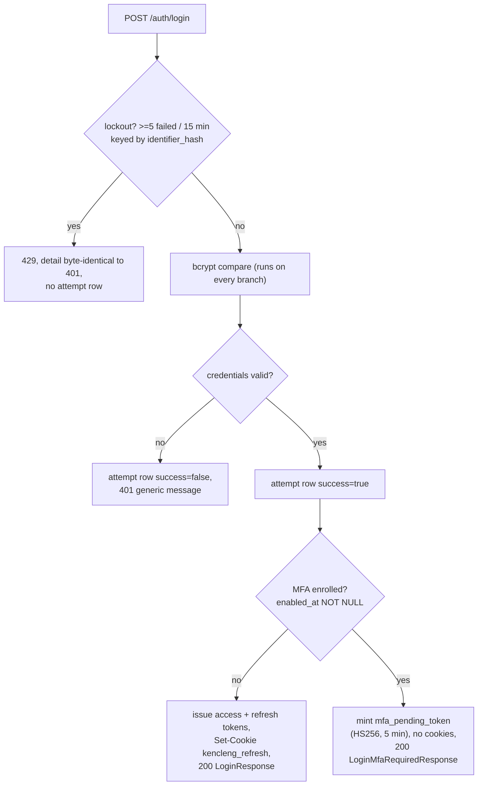

# Tech Plan: Login & Session Management (account #03)

> Ticket    : account domain task #3 — `docs/spec/1-account/features/03-login-session-management.md`
> Author    : ox-alpha (agent) — for Anhar's review
> Date      : 2026-08-26
> Updated   : 2026-08-26 — all Open Items resolved with Anhar; Summary + section 14 regenerated
> Status    : Approved by Anhar
> Approach  : Vertical slice adding the four `/auth` session endpoints on top of the existing first-generation token primitives, with persistent two-stage lockout and rotate-on-use refresh tokens
> Refs      : root + backend `AGENTS.md`; exploration logs `.local-agents/works/account/03-login-session-management/1-explore/logs/`; `api/openapi/{index,account,common}.yaml`; `docs/spec/1-account/{invariants,threat-model,tasks}.md`; `docs/project/kencleng-erd.md`

---

## 📋 Summary — start here

**What & why** — The account domain has registration, email verification, and Google OAuth, but no password login and no session lifecycle beyond first-generation token issuance. This slice adds `POST /auth/login`, `/auth/login/mfa`, `/auth/refresh`, `/auth/logout`: credential login with anti-enumeration semantics, persistent two-stage lockout (Fitur 2C), TOTP/backup-code completion behind a verifier seam, rotate-on-use refresh tokens with family-wide reuse detection, and idempotent logout.

**Scope**
- Four new public endpoints wired under the existing per-IP rate limiter
- New tables: `login_attempts` plus schema-pre-settled `mfa_totp_secrets`, `mfa_backup_codes`, `user_roles` (ERD DDL verbatim; owned long-term by tasks #6/#8)
- Refresh rotation + reuse detection (Tier 0 fenced sub-area — human pair/rewrite before merge)
- HS256 `mfa_pending_token` under a new dedicated secret + `purpose` claim defense-in-depth
- Refresh-only cookie helpers, 401/429 Problem Details vocabulary

**Decision flow diagram**



**Key decisions**
- Sequencing: create the four missing tables' migrations in this slice (schema-pre-settle); MFA code verification sits behind a fail-closed `mfaVerifier` seam until task #6 lands
- Tier 0: agent drafts everything; named JWT/rotation files go through mandatory human pair/rewrite before merge
- `mfa_pending_token`: separate HS256 secret (`MFA_PENDING_TOKEN_SECRET`) + `purpose` claim kept; 5-min TTL; never persisted
- Rotation: guarded parent UPDATE + child INSERT in one transaction; race-loser treated identically to reuse detection (whole-family revocation)
- Lockout: checked before credential verification; rejected attempts write no row; 429 detail byte-identical to the 401 detail (openapi amended accordingly, approved 2026-08-26)
- `/auth/login` sets a refresh-only cookie (does not reuse `writeAuthCookies`)
- Pre-existing shared-proxy-IP rate-limit weakness: deferred, flagged follow-up

**Top risks**
- Concurrent-refresh correctness (rotation race) → atomic guarded UPDATE, single-tx child insert, `-race` + ≥100-goroutine stress harness
- Token-type confusion (`mfa_pending` accepted as an access token) → cryptographic key separation + `purpose` claim, both tested
- Enumeration/timing side channels at login → always-run bcrypt including dummy compare on wrong-email, identical response bodies across failure modes

**Open items needing human input** — none open; all 13 raised items are Resolved in section 14 (decisions + applied doc/contract changes recorded there). Remaining human action is process-level: review this plan's diff set, then the Tier 0 paired pass happens during build per Resolved #13.

---

<!-- Audience boundary: above is the human-readable digest for
review/approval. Below is the full execution-grade plan — same
decisions, same scope, expanded to file/line precision, rule IDs, and
full option comparisons. Nothing below contradicts the digest above;
it's the same source of truth at higher resolution. -->

---

## 1. Background

Features 01 (register/email verification) and 02 (Google OAuth) shipped the account domain's identity layer: `auth_identities` lookups by HMAC `identifier_hash`, bcrypt hashing via `platform/secrets`, and first-generation session issuance (`IssueTokens`, `google_oauth.go:483` — ES256 access JWT without a `purpose` claim, random refresh token stored as SHA-256 hash with a fresh `family_id`). The `refresh_tokens` table was created rotation-ready (`family_id`, `replaced_by_id`, `revoked_at`, partial active index) but remains insert-only: no read, rotate, revoke, or reuse-detection path exists.

The feature spec (`docs/spec/1-account/features/03-login-session-management.md`, all open items resolved 2026-08-05) defines the remaining session surface: password login with anti-enumeration semantics, persistent lockout folded in from Fitur 2C (5 failed attempts / trailing 15 minutes, two stages keyed differently), MFA-completion login driven by a short-lived `mfa_pending_token`, strict rotate-on-use refresh with family revocation, and idempotent logout. Tasks #1–#2 are implemented although `tasks.md`'s tracker still reads "not started" — this is the next serial slice (S1: #1→#2→#3→…).

Two structural constraints shape the plan. First, the Tier 0 fence: JWT signing/verification and refresh-token rotation/reuse-detection logic are human-authored-or-rewritten per `tasks.md`'s KPI table and root `AGENTS.md` §3 — feature 02 set the precedent of implementing verification inline outside `platform/auth/` with a recorded human-reviewed decision. Second, a sequencing dependency: `/auth/login` must read `mfa_totp_secrets.enabled_at` and return `roles[]`/`mfa_enabled` in every `LoginResponse`, but those tables belong to unstarted tasks #6/#8; the approved resolution (below) pre-settles their schemas in this slice while leaving their logic (enrollment, role assignment) entirely to their own tasks.

## 2. Scope

**In scope:**
- `POST /auth/login`, `POST /auth/login/mfa`, `POST /auth/refresh`, `POST /auth/logout` — handlers, service methods, repository methods
- Persistent lockout: `login_attempts` writes + threshold queries, password stage (keyed `identifier_hash`) and MFA stage (keyed `user_id`)
- Refresh rotation, reuse detection, logout revocation on `refresh_tokens`
- `mfa_pending_token` mint/verify (HS256, separate secret, `purpose` claim) and the `purpose:"access"` claim on ES256 access tokens
- Access-token verifier/middleware hardening (wrong-key + wrong-purpose rejection) as defense-in-depth for protected endpoints
- Migrations 000006+: `login_attempts`, plus schema-only `mfa_totp_secrets`, `mfa_backup_codes`, `user_roles`
- Transport: refresh-only cookie set/clear helpers, sentinel-error → Problem Details mappings for 401/429, env wiring for `MFA_PENDING_TOKEN_SECRET`

**Out of scope (explicit):**
- TOTP secret generation/encryption and enrollment endpoints (`mfa_totp_secrets` writes) — task #6; this slice's verifier seam fails closed
- Backup-code generation — task #6 (verification-side consumption only, seam-scoped)
- Role assignment API and `user_roles` writes — task #8 (read-only consumption here)
- Multi-tab refresh coordination (BroadcastChannel) — frontend track per spec Assumption D
- Reverse-proxy `X-Forwarded-For` handling in the rate limiter — flagged follow-up, separately approved for deferral
- Edits to `docs/spec/*` files (any spec change goes through you; the one approved contract edit — the login 429 response in `api/openapi/account.yaml` — was applied 2026-08-26, see Resolved Open Item 6). The generated bundle `api/openapi.yaml` is regenerated mechanically from sources and committed alongside them per api/README.md.
- Root-level infra (e.g. the known Caddyfile `handle /api/*` prefix gap)

## 3. Requirements

| Condition | Requirement | Source/Note |
|---|---|---|
| Valid `email_password` creds, no MFA enrolled, not locked out | Record attempt `success=true`; issue ES256 access JWT (15 min) + refresh token (30 d, fresh `family_id`); set refresh cookie `HttpOnly+Secure+SameSite=Strict`; `200 LoginResponse` | Feature spec AC |
| Valid creds, MFA enrolled | Attempt `success=true` recorded; **no** refresh cookie, **no** session tokens; `200 LoginMfaRequiredResponse{mfa_pending_token}` | Flow ordering per phase0 Fitur 2 |
| Wrong email or wrong password | Identical `401` Problem body both cases (`"Email atau password salah."`); attempt `success=false` | Anti-enumeration |
| ≥5 failed attempts / trailing 15 min for `identifier_hash` | Reject **before** credential verification; **no** attempt row; `429` with detail byte-identical to the 401 case | Fitur 2C; spec error table |
| Unverified `email_password` identity | Login still succeeds; verification enforced by other domains at point of restricted action | Spec AC |
| Post-password-step proof carrier | `mfa_pending_token` = stateless HS256 JWT `{sub, purpose:"mfa_pending", exp}`, 5-min TTL, secret distinct from ES256 keys; never persisted | Assumption A/B (resolved) |
| MFA-stage lockout | Same 5/15-min threshold keyed `(user_id, stage='mfa')`, checked before code verification | Assumption C (resolved) |
| Correct TOTP / correct unused backup code after valid pending token | Attempt `(stage='mfa', success=true)`; complete login exactly like the no-MFA branch; backup code `used_at` set at most once and only while `enabled_at IS NOT NULL` | INV-account-06 |
| Expired/malformed pending token | `401`, no tokens, no attempt row | Identity not reliably known |
| Wrong code with valid pending token | Attempt `(stage='mfa', success=false)`; `401`, no tokens | |
| Refresh with currently-valid token | Atomic guarded UPDATE (`replaced_by_id IS NULL AND revoked_at IS NULL` [+ unexpired]); new refresh same `family_id`; old row's `replaced_by_id` set; cookie replaced; `200 RefreshResponse` | INV-account-03 |
| Rotated token presented again | Every token in the `family_id` revoked; `401` | INV-account-04 |
| Two concurrent refreshes, same valid token | Exactly one `200`; loser treated identically to reuse detection (family revoked, forcing re-login) | Accepted trade-off (Assumption D) |
| Logout with/without cookie | `revoked_at` set when present; cookie cleared; always `204` | Idempotent |

## 4. Rules & Validation

- **R1 (login happy path)**: Given valid credentials, no MFA enrolled, not locked out, When submitted, Then a `login_attempts` row exists (`success=true`, `stage='password'`), response is `200` `LoginResponse{status:"ok", access_token, access_token_expires_at?, user}` with an ES256 JWT (15 min TTL), a refresh token (30 d, fresh `family_id`) is persisted hash-only, and `Set-Cookie: kencleng_refresh=…; HttpOnly; SameSite=Strict` (+`Secure` off dev only) is present. *Test proves: `TestLogin_Success_NoMfa`.*
- **R2 (MFA required)**: Given valid creds and `mfa_totp_secrets.enabled_at IS NOT NULL`, When submitting, Then attempt row `success=true` exists, **no** `Set-Cookie` and **no** token in body, `200` `{status:"mfa_required", mfa_pending_token}`. *Test: `TestLogin_MfaRequired_NoTokensIssuedYet`.*
- **R3 (generic invalid credentials)**: Given wrong email, When submitting, Then `401` body equals — byte-for-byte — the body returned for wrong password; attempt row `success=false`. *Test: `TestLogin_GenericErrorMessage`.*
- **R4 (password-stage lockout)**: Given ≥5 `success=false` rows for the `identifier_hash` within the trailing 15 minutes, When submitting anything, Then rejection happens before bcrypt-of-submitted-password result is used, **no new attempt row** is written, and `429` carries the identical detail text to R3's body. *Test: `TestLogin_Lockout_5Failed15Min`.*
- **R5 (unverified login allowed)**: Given `verified_at IS NULL` on the `email_password` identity, When logging in validly, Then login succeeds per R1. *Test: `TestLogin_UnverifiedIdentity_Succeeds`.*
- **R6 (pending-token shape)**: The minted `mfa_pending_token` verifies only under HS256 with `MFA_PENDING_TOKEN_SECRET`, carries `purpose="mfa_pending"` and ≤5-min expiry; it fails verification at any access-token verifier. *Tests: `TestAuthMiddleware_RejectsWrongSigningKey`, `TestAuthMiddleware_RejectsNonAccessPurposeToken`.*
- **R7 (MFA-stage lockout)**: Given ≥5 failed `stage='mfa'` rows for the pending token's `user_id` / 15 min, When submitting any code, Then reject `429` (generic-detail pattern) before reading/verifying the code, no attempt row. *Test: `TestLoginMfa_Lockout_5Failed15Min`.*
- **R8 (TOTP completion)**: Given valid unexpired pending token and a correct `totp_code` (verifier seam returns success), Then attempt `(user_id, 'mfa', true)` recorded and the flow completes exactly like R1's issuance half. *(Success path fake-tested until task #6 provides the real verifier.)* *Test: `TestLoginMfa_TotpSuccess_CompletesLogin`.*
- **R9 (backup-code completion)**: As R8 with `backup_code`, plus that code's `used_at` transitions NULL→timestamp at most once, and only while `enabled_at IS NOT NULL`. *Tests: `TestInvariant_Account06_BackupCodeSingleUse`, `TestInvariant_Account06_DisabledMfaInvalidatesCodes` (seam-scoped until #6).*
- **R10 (invalid pending token)**: Given expired/malformed/wrong-key token, When submitted, Then `401`, no tokens issued, **no** attempt row. *Test: `TestLoginMfa_InvalidPendingToken`.*
- **R11 (wrong code)**: Given valid pending token and incorrect code, Then attempt `(user_id,'mfa',false)` recorded, `401`, no tokens. *Test: `TestLoginMfa_WrongCode`.*
- **R12 (refresh rotation)**: Given a cookie whose token row satisfies `revoked_at IS NULL AND replaced_by_id IS NULL AND expires_at > now()`, When refreshing, Then exactly-one-winner guarded UPDATE sets `replaced_by_id` to the new child row created **in the same transaction** (a child-insert failure rolls back the parent mark), same `family_id`, new cookie replaces old, `200 RefreshResponse`. *Test: `TestRefresh_Rotates_IssuesChild_SameFamily`.*
- **R13 (refresh unauthenticated)**: Missing or expired cookie ⇒ `401`. *Test: `TestRefresh_MissingOrExpiredCookie_401`.*
- **R14 (reuse detection)**: Presenting a row with `replaced_by_id IS NOT NULL` ⇒ every row sharing its `family_id` ends with `revoked_at IS NOT NULL` (including already-rotated descendants), `401`. *Test: `TestRefresh_ReuseDetection_FamilyRevoked` (A→B→C replay-A scenario).*
- **R15 (concurrent refresh)**: ≥2 simultaneous refreshes with the same valid token ⇒ exactly one `200`; the loser's outcome equals R14's (family revoked). Clean under `-race` with ≥100-goroutine stress harness asserting the invariant. *Test: `TestRefresh_ConcurrentRequests_ExactlyOneWins` (+stress variant).*
- **R16 (logout idempotent)**: With valid cookie ⇒ that row's `revoked_at` set, cookie cleared (`MaxAge<0`), `204`; without cookie ⇒ still `204`, no error, no DB write required. *Tests: `TestLogout_RevokesAndClears`, `TestLogout_NoCookie_Still204`.*
- **R17 (purpose/signing-key separation enforced at verification)**: An access-token verifier rejects (a) any token failing ES256 verification under the app public key and (b) any token lacking `purpose="access"`; the pending-token verifier rejects anything not HS256/`mfa_pending`. No code path issues session tokens from `/auth/login` when MFA is enrolled. *Tests: the two `TestAuthMiddleware_*` names + R2's assertion.*
- **R18 (timing discipline)**: Every login branch executes bcrypt-shaped work — wrong-email burns a dummy `ComparePassword` against a fixed hash; no branch returns before doing comparable CPU work. *Test: `TestLogin_TimingShape_NoEarlyReturn` (structural assertion over injected hasher call log).*
- **R19 (log hygiene)**: No log line ever contains tokens, cookies, passwords, or plaintext emails; failures log fact + `user_id` + sanitized category only. *Test: marker-based leak sweep mirroring `auth_google_test.go`'s approach.*
- **R20 (data-access discipline)**: All new SQL is goqu-built and prepared (never concatenated); migrations are additive CREATE TABLE pairs, reversible, never altering existing tables. *Verification: `make verify` + `make migrate-up`/`make migrate-down` round-trip in CI/integration.*

Count-check: R1–R20 ⇒ 20 rule IDs, each with ≥1 named test/verification above; section 12 mirrors these 1:1.

## 5. Decision Log

| Option considered | Why rejected/accepted |
|---|---|
| **D1 sequencing — A: build MFA/user_roles fully now** | Rejected: collides with tasks #6/#8 table ownership, breaks Group-B/C parallelization premise, scope explosion |
| **D1 — B: defer MFA endpoints** | Rejected: spec deliberately folds MFA into this slice; half-delivery contradicts the feature contract |
| **D1 — C: schema-pre-settle + verifier seam** | **Chosen (approved 2026-08-26).** Create all four tables now from ERD DDL; TOTP/backup verification behind a fail-closed `mfaVerifier` interface until #6. Empty-table semantics ≡ today's reality (nobody enrolled, nobody has roles) — no silent weakening; `enabled_at`/`roles` are real queries. Consequence: #6/#8 owners must be told migrations 000006+ are taken; `/auth/login/mfa` success-path fake-tested until #6 |
| **D2 Tier 0 authorship — A: fully human-paired authorship** | Rejected for velocity; kept as fallback |
| **D2 — B: extend feature-02 inline precedent silently** | Rejected: tasks.md fences the *concern*, not just the path; routing around the spirit |
| **D2 — C: agent drafts, human pair/rewrites named files** | **Chosen (approved).** Satisfies KPI boolean "human-authored or human-rewritten"; Tier 0 set = JWT mint/verify helpers (proposed home `platform/auth/token.go` via paired session) + rotation/reuse-detection repo/service core |
| **Pending-token design — purpose claim only, shared key** | Rejected: claim check is application logic that can be buggy/omitted; spec Assumption A explicitly chose cryptographic separation |
| **Pending-token design — separate HS256 secret + purpose claim kept** | **Chosen** (spec-resolved 2026-08-05): wrong-purpose tokens fail signature verification outright; claim adds defense-in-depth |
| **Rotation mechanics — guard UPDATE then insert child separately** | Rejected: transient child-insert failure after parent mark bricks the family via reuse detection |
| **Rotation mechanics — guarded parent UPDATE + child INSERT in one tx** | **Chosen**: atomic win + child creation; loser path needs no disambiguation because spec Assumption D makes race-loser ≡ attacker |
| **Race-loser handling — grace window for honest multi-tab** | Rejected: spec Assumption D keeps rotation strict; multi-tab solved frontend-side (BroadcastChannel) later |
| **429 body — follow `common.yaml` example text** | Rejected: contradicts feature-spec anti-enumeration rule (feature spec outranks openapi per root AGENTS.md §1 order) |
| **429 body — byte-identical detail to 401 + openapi amendment request** | **Chosen (approved).** Implement per spec rule; login-specific 429 response definition applied to openapi (approved by human; shared component stays for register/resend/forgot) |
| **Cookie delivery — reuse `writeAuthCookies` at `/auth/login`** | Rejected: would over-deliver an access cookie the contract doesn't define (access goes in body) |
| **Cookie delivery — new refresh-only writer/clearer** | **Chosen**: matches contract exactly; OAuth callback path unchanged |
| **Rate-limiter X-Forwarded-For fix in-slice** | Deferred (approved): pre-existing flaw, scope discipline; flagged follow-up |
| **JWT library — golang-jwt/jwt/v5 (already a dep since feature 02)** | Chosen by prior recorded human decision (2026-08-22); no new dependency |

### Dedup & reconciliation notes (rules.md §2)

Raw logs are mutually consistent (single authorship chain; stage-3 decisions supersede stage-2 observations — most-recent-wins applied throughout). Genuine conflicts exist only **against external docs**, all previously flagged and none silently picked:

1. Feature spec "Risk tier" § ("same ES256 key") vs its own Assumption A (separate HS256 secret) → **Assumption A wins** (dated, more specific resolution); stale wording listed as an Open Item for you to fix in the doc.
2. `common.yaml TooManyRequests` example detail vs feature-spec identical-to-401 rule → feature-spec rule wins; openapi amended accordingly (2026-08-26, approved — see Resolved Open Item 6).
3. Threat-model component 2 predates Assumption A/C (no MFA-stage lockout row, no key separation) → implementation follows the feature spec; threat-model revision requested (Open Item 5).
4. `tasks.md` tracker ("not started") vs reality (#1/#2 shipped) → reality wins; tracker fix requested (Open Item 7).

## 6. Backward Compatibility

- **Database**: additive only — four `CREATE TABLE` pairs; zero `ALTER` on existing tables; no backfill (all new tables start empty, which correctly models "no MFA enrolled / no roles assigned" today). `down` migrations drop only the new tables. Existing rows/data untouched.
- **API**: purely additive — four new public endpoints; register/verify/resend/OAuth handlers and routes unchanged. Error-shape convention (RFC 9457 Problem Details) extended with two new type URIs (`errors/invalid-credentials`, `errors/too-many-requests` reuse), no shape change to existing responses.
- **Existing clients/tokens**: OAuth-issued access tokens lack the `purpose` claim — acceptable: sandbox, no deployed clients; the *existing* `GoogleTokenVerifier` (link/reauth gating) stays lenient so the OAuth flow is unaffected; the strict purpose-checking verifier applies to new/future protected endpoints. The `kencleng_refresh` cookie name and attributes are reused as-is, so browser-visible cookie behavior for existing sessions is consistent.
- **Deprecation path**: none needed (nothing removed).

## 7. Edge Cases & Risks

| Risk | Likelihood | Severity | Mitigation |
|---|---|---|---|
| Rotation race lets two children share one parent (breaks INV-03) | Low | **High** — session-integrity invariant broken silently | Single-statement guarded UPDATE is the only writer of `replaced_by_id`; child INSERT in same tx; R15 stress test with ≥100 goroutines under `-race` |
| `mfa_pending_token` accepted by a protected endpoint as an access token (token confusion) | Low | **High** — privilege escalation | Cryptographic key separation (fails signature verification outright) + `purpose` claim check; both layers individually tested (R6/R17) |
| Enumeration side channel: wrong-email distinguishable from wrong-password (message or timing) | Medium if unhandled | **High** — account harvesting | Byte-identical Problem bodies (R3/R4); dummy bcrypt burn on wrong-email (R18); marker leak-sweep (R19) |
| Lockout bypass by distributed sources (per-identifier only, no per-IP dimension) | Medium | Medium — credential stuffing continues at scale | Accepted residual risk per threat model (documented); in-memory per-IP limiter still applies to all `/auth/*` |
| All clients share one rate-limit bucket behind reverse proxy (`r.RemoteAddr` = proxy IP) — pre-existing flaw amplified by four hot new endpoints | Medium | Medium — cross-client throttling/DoS lockstep | Known in-code limitation; X-Forwarded-For fix deferred as approved follow-up |
| Stubbed `mfaVerifier` masks integration surprises when task #6 lands | Medium | Medium — rework confined to seam | Seam interface mirrors `breachChecker`/`googleOAuthClient` patterns; #6 plugs real verifier; fake-tested paths enumerated in R8/R9 |
| Migration-number collision if tasks #6/#8 start concurrently and create their own tables | Low | Medium — duplicate table errors | Approved schema-pre-settle; ownership note **applied** to `docs/spec/1-account/tasks.md` (2026-08-26, Resolved Open Item 9) | |
| Second CSRF layer absent on cookie-authenticated endpoints (contract specifies SameSite=Strict only; best-practice checklist wants custom-header/double-submit too) | Low | Medium — CSRF beyond same-site boundaries | **Accepted** (Anhar, 2026-08-26): Strict-only sufficient for v1 sandbox (no untrusted same-site subdomains); recorded in threat-model residual-risk entry #6; revisit trigger = frontend API client landing |
| `login_attempts` grows unbounded (append-only, no retention job defined anywhere) | Certain over time | Low — BRIN index keeps audit queries cheap; storage cost slow | **Accepted** (Anhar, 2026-08-26): unbounded growth OK for v1 sandbox, INV-account-06-style acceptance; a future standalone housekeeping task (hard-delete-worker precedent) is the vehicle if ever needed |
| Child-insert failure mid-refresh leaves client logged out unexpectedly | Low | Low — safe direction (fail toward re-login) | Same-tx rollback prevents worse parent-marked-without-child state (R12) |
| Dev/prod cookie `Secure` divergence leaks refresh cookie over plain HTTP in dev | Low | Low — dev-only by design | `cookieSecure = appEnv != "development"` preserved; existing convention |

## 8. Interface Contract

Repo conventions applied (root + backend `AGENTS.md`): money n/a here; **all SQL via goqu prepared statements**; PII columns keep the established ciphertext+HMAC pattern (`primary_email` decrypted on read via `crypto.Decrypt` with `EncryptionKey`; lookups always via `*_hash`, never against ciphertext); **error responses use RFC 9457 Problem Details** (`application/problem+json`) and never leak internals; **explicit authorization checks** at handler/service boundary; exported functions carry doc comments; no secrets/PII/tokens in logs.

**DB Schema changes** (verbatim ERD DDL; migration files `000006`–`000009`, numbering order TBD-coordinated — see Open Item 4):

```sql
-- 000006 (this slice owns)
CREATE TABLE login_attempts (
    id               UUID PRIMARY KEY,
    identifier_hash  TEXT NOT NULL,
    user_id          UUID REFERENCES users(id) ON DELETE SET NULL,
    stage            TEXT NOT NULL DEFAULT 'password'
                       CHECK (stage IN ('password', 'mfa')),
    success          BOOLEAN NOT NULL,
    attempted_at     TIMESTAMPTZ NOT NULL DEFAULT now()
);
CREATE INDEX ix_login_attempts_identifier_time
    ON login_attempts (identifier_hash, attempted_at DESC);
CREATE INDEX ix_login_attempts_user_stage_time
    ON login_attempts (user_id, stage, attempted_at DESC)
    WHERE user_id IS NOT NULL;
CREATE INDEX ix_login_attempts_attempted_at_brin
    ON login_attempts USING BRIN (attempted_at);

-- 000007–000009 (schema-pre-settle per D1-C; ERD DDL verbatim;
-- long-term owners: task #6 / task #8)
CREATE TABLE mfa_totp_secrets (
    user_id           UUID PRIMARY KEY REFERENCES users(id) ON DELETE CASCADE,
    secret_encrypted  BYTEA NOT NULL,
    enabled_at        TIMESTAMPTZ,
    created_at        TIMESTAMPTZ NOT NULL DEFAULT now(),
    updated_at        TIMESTAMPTZ NOT NULL DEFAULT now()
);
CREATE TRIGGER trg_mfa_totp_secrets_updated_at
BEFORE UPDATE ON mfa_totp_secrets
FOR EACH ROW EXECUTE FUNCTION set_updated_at();

CREATE TABLE mfa_backup_codes (
    id          UUID PRIMARY KEY,
    user_id     UUID NOT NULL REFERENCES users(id) ON DELETE CASCADE,
    code_hash   TEXT NOT NULL,
    used_at     TIMESTAMPTZ,
    created_at  TIMESTAMPTZ NOT NULL DEFAULT now()
);
CREATE INDEX ix_mfa_backup_codes_user_id ON mfa_backup_codes (user_id);
CREATE INDEX ix_mfa_backup_codes_unused  ON mfa_backup_codes (user_id) WHERE used_at IS NULL;

-- Verified against kencleng-erd.md:485-495 (2026-08-26)
CREATE TABLE user_roles (
    id          UUID PRIMARY KEY,
    user_id     UUID NOT NULL REFERENCES users(id) ON DELETE CASCADE,
    role        TEXT NOT NULL CHECK (role IN ('admin', 'kurator')),
    granted_by  UUID REFERENCES users(id) ON DELETE SET NULL,
    granted_at  TIMESTAMPTZ NOT NULL DEFAULT now(),
    UNIQUE (user_id, role)
);
CREATE INDEX ix_user_roles_user_id ON user_roles (user_id);
CREATE INDEX ix_user_roles_role   ON user_roles (role);
```

No changes to `users`, `auth_identities`, `auth_tokens`, `refresh_tokens`, `user_logs`.

**API changes** (wire shapes from `api/openapi/account.yaml:113-234,703-842`; hand-written DTOs per `auth_register.go` precedent):

| Endpoint | Request | Success | Errors |
|---|---|---|---|
| `POST /auth/login` | `{email, password}` | `200` `oneOf LoginResponse{status:"ok", access_token, access_token_expires_at?, user:User}` \| `LoginMfaRequiredResponse{status:"mfa_required", mfa_pending_token}`; refresh cookie set only in the no-MFA branch | `401` `Problem{type:"…/errors/invalid-credentials", title:"Invalid Credentials", detail:"Email atau password salah."}`; `429` same title/detail, `type:"…/errors/too-many-requests"`, status 429 |
| `POST /auth/login/mfa` | `{mfa_pending_token, totp_code?, backup_code?}` (exactly one code field) | `200 LoginResponse` + refresh cookie | `401` (invalid pending token or wrong code); `429` (MFA-stage lockout, generic-detail pattern) |
| `POST /auth/refresh` | refresh cookie only (never body/bearer) | `200 RefreshResponse{access_token, access_token_expires_at}` + replacement cookie | `401` (missing/expired/revoked/reuse-detected — one indistinguishable body) |
| `POST /auth/logout` | refresh cookie optional | `204` always, cookie cleared | none documented |

`User` object assembled server-side: `id, name, email (plaintext via decrypt-on-read), email_verified (verified_at on email_password identity), roles[] (user_roles join — empty until #8), auth_providers[] (auth_identities aggregation), mfa_enabled (EXISTS enabled_at), created_at`.

**Business logic flow** (ordering is contractual):

```
LOGIN:  parse+validate → lockout? (count identifier_hash/password/15min >=5)
          → yes: 429, STOP (no writes)
        → fetch identity by (provider=email_password, HMAC(email))
        → bcrypt compare (dummy burn if identity==nil; always runs)
        → mismatch: INSERT attempt(success=false) → 401 generic
        → match:    INSERT attempt(success=true)
        → enabled_at IS NOT NULL?
            → yes: mint mfa_pending_token (HS256, {sub, purpose:mfa_pending,
                   exp<=5min}, MFA_PENDING_TOKEN_SECRET) → 200 mfa_required
            → no:  IssueTokens-equivalent (ES256 access 15 min w/ purpose:access
                   + refresh 30 d, new family_id) in one tx → Set-Cookie → 200

LOGIN/MFA: parse → verify pending token (HS256+secret, purpose, exp) → fail: 401, STOP
        → lockout? (count user_id/mfa/15min >=5) → yes: 429, STOP (no writes)
        → mfaVerifier.Verify(ctx, userID, totp_code|backup_code)
            → false: INSERT attempt(mfa,false) → 401
            → true (backup): guarded used_at UPDATE (single-use, enabled-checked)
        → INSERT attempt(mfa,true) → issue tokens like LOGIN-no-MFA → cookie → 200

REFRESH: read kencleng_refresh → absent: 401
        → hash lookup → row rotated-or-revoked-or-expired?
            → yes: UPDATE family SET revoked_at WHERE family_id=? AND revoked_at IS NULL → 401
            → no:  BEGIN TX
                     UPDATE refresh_tokens SET replaced_by_id=:child
                       WHERE token_hash=:h AND replaced_by_id IS NULL
                         AND revoked_at IS NULL AND expires_at > now() RETURNING user_id, family_id
                       → 0 rows => ROLLBACK => family revoke (as above) → 401   [race-loser == reuse]
                     INSERT child (new uuid, same family_id, hash(plain), exp+30d)
                   COMMIT → new plain value ONLY in Set-Cookie → 200 RefreshResponse

LOGOUT: read cookie → present? UPDATE revoked_at (guarded revoked_at IS NULL)
        → clear cookie (MaxAge<0) → 204 (both branches)
```

## 9. Architecture / Plan

Layering follows the existing vertical-slice shape: transport handler (parse/validate/shape) → domain service (business rules, sentinels) → Repository port (goqu adapter). New seams follow the house DI pattern (`breachChecker`, `googleoauth` client): `mfaVerifier` (fail-closed stub), injectable clock (`now func() time.Time`) so lockout-window math is deterministically testable, and the Tier 0 JWT helper functions injected into the service like `authKeys` today.

Migration strategy: golang-migrate plain-SQL pairs, applied via `make migrate-up`; additive-first (nothing alters existing tables, satisfying migrations-safety discipline); `down` tested by round-trip in the integration pass. Integration tests (real Postgres, `//go:build integration`) cover rotation concurrency (R14/R15) where a fake repo cannot prove the invariant; unit tests with fakes cover everything else; `go test -race ./...` gates the slice per backend AGENTS.md §3.

Runbook vs Techplan evaluation (rules.md §3): the migrations ride the normal `golang-migrate` path inside this feature — no independent execution order, no separate cleanup/rollback procedure, no cron/script sub-component — so **everything folds into this techplan; no separate linked document**. (The Admin bootstrap seed script belongs to task #8, not here.)

Execution order: migrations → domain entities/repo methods → Tier 0 JWT helpers (human-paired) → service methods → transport handlers/cookies/errors → main.go wiring → unit tests → integration/race suite → `make verify`.

## 10. Implementation Details

Signatures indicative; exact naming settled at build time within the stated shapes.

**File**: `backend/internal/domain/account/entity.go`
- Change: add `LoginAttempt` struct (`ID, IdentifierHash, UserID *uuid.UUID, Stage, Success bool, AttemptedAt time.Time`); extend `RefreshToken` doc (rotation live as of this slice).

**File**: `backend/internal/domain/account/login.go` (new)
- Change: `func (s *Service) Login(ctx, email, password string) (LoginResult, error)`; `func (s *Service) LoginMfa(ctx, pendingToken, totpCode, backupCode string) (LoginResult, error)`; `func (s *Service) Refresh(ctx, refreshTokenPlain string) (RefreshResult, error)`; `func (s *Service) Logout(ctx, refreshTokenPlain string) error`. Sentinels: `ErrInvalidCredentials`, `ErrLockedOut`, `ErrMfaPendingInvalid`. `LoginResult` discriminates ok / mfa-required and carries the minted pending token. Constructor gains `mfaVerifier`, `nowFn`, pending-token mint/verify funcs (Tier 0 paired).

**File**: `backend/internal/domain/account/repository.go` + `repository_db.go`
- Change: port + goqu adapter methods — `InsertLoginAttempt(ctx, tx, *LoginAttempt)`; `CountRecentFailedAttempts(ctx, key Stage Key shape) (int, error)` (two key shapes: identifier_hash / user_id+stage); `FindRefreshTokenByHash(ctx, hash) (*RefreshToken, error)`; `RotateRefreshToken(ctx, tx, oldHash string, child *RefreshToken) (rotated bool, err error)` — the guarded `UPDATE … WHERE … RETURNING user_id, family_id` + child INSERT inside the caller's tx; `RevokeRefreshToken(ctx, tx, hash)`; `RevokeRefreshTokenFamily(ctx, tx, familyID)`; `GetLoginUserView(ctx, userID) (*LoginUserView, error)` — aggregate assembling `LoginResponse.user` fields incl. `crypto.Decrypt` of `primary_email` (first decrypt-on-read path; key discipline per encryption-at-rest: HMAC≠encryption key already holds).

**File**: `backend/internal/platform/auth/token.go` (new — **Tier 0, human-paired**)
- Change: `MintAccessToken(private, userID, purpose="access")`; `VerifyAccess(public, token) (userID, error)` enforcing ES256 + `purpose:"access"`; `MintMFAPending(secret32, userID)` / `VerifyMFAPending(secret32, token) (userID, error)` enforcing HS256 + `purpose:"mfa_pending"` + expiry. Startup validation for `MFA_PENDING_TOKEN_SECRET` mirrors `crypto.New`'s 32-byte base64 discipline. If pairing decides these live elsewhere, only the home changes — not the guarantees (R6/R17).

**File**: `backend/internal/domain/account/mfa_verifier.go` (new)
- Change: `type MfaVerifier interface { VerifyTOTP(ctx, userID, code string) (bool, error); VerifyBackupCode(ctx, tx pgx.Tx, userID, code string) (bool, error) }` + `stubMfaVerifier` returning `(false, nil)` — fails closed until task #6 supplies the real one (flag/TODO marker per feature-lifecycle practice, not commented-out code).

**File**: `backend/internal/transport/http/auth_login.go` (new)
- Change: `LoginHandler(svc, cookieSecure)`, `LoginMfaHandler(svc, cookieSecure)`, `RefreshHandler(svc, cookieSecure)`, `LogoutHandler(svc, cookieSecure)`; DTO decode/validation per `auth_register.go` pattern; response shaping incl. conditional cookie set.

**File**: `backend/internal/transport/http/cookie.go`
- Change: `writeRefreshCookie(w, cookieSecure, value)` (HttpOnly, Secure-cond, Strict, Path="/", MaxAge 30 d) and `clearRefreshCookie(w, cookieSecure)`. `writeAuthCookies` untouched (OAuth callback contract).

**File**: `backend/internal/transport/http/errors.go`
- Change: `MapServiceError` gains `ErrInvalidCredentials`→401 (`…/errors/invalid-credentials`, `"Email atau password salah."`), `ErrLockedOut`→429 (**same title/detail**, `…/errors/too-many-requests`), `ErrMfaPendingInvalid`→401.

**File**: `backend/cmd/server/main.go`
- Change: `requireEnv("MFA_PENDING_TOKEN_SECRET", …)`; load/validate secret; construct verifier funcs + stub `mfaVerifier`; register four routes on `authMux` (inherit `RateLimit` wrapper automatically).

**File**: `backend/migrations/000006_login_attempts.{up,down}.sql` (+ `000007_mfa_totp_secrets`, `000008_mfa_backup_codes`, `000009_user_roles`)
- Change: DDL per section 8; downs are symmetric DROPs (order-safe wrt FKs).

**Tests** beside code per convention: `login_test.go` (table-driven), `service_test.go` extensions, `integration_test.go` (`//go:build integration`) for R12/R14/R15 against real Postgres.

## 11. Files Changed / Files NOT Changed

| File | Change Type | Description |
|---|---|---|
| `internal/domain/account/entity.go` | Edit | +`LoginAttempt`; RefreshToken doc update |
| `internal/domain/account/login.go` | New | Login/LoginMfa/Refresh/Logout services, sentinels |
| `internal/domain/account/mfa_verifier.go` | New | Verifier seam + fail-closed stub |
| `internal/domain/account/repository.go` | Edit | Port methods (attempts, rotation, revocation, user view) |
| `internal/domain/account/repository_db.go` | Edit | goqu implementations incl. guarded rotate |
| `internal/platform/auth/token.go` | New (Tier 0) | Mint/verify both token purposes — human-paired |
| `internal/transport/http/auth_login.go` | New | Four handlers |
| `internal/transport/http/cookie.go` | Edit | Refresh-only cookie helpers |
| `internal/transport/http/errors.go` | Edit | 401/429 mappings |
| `cmd/server/main.go` | Edit | Env, secret validation, wiring, routes |
| `migrations/000006–000009` | New | Four additive table pairs |
| `internal/domain/account/login_test.go` et al. | New | Unit + `//go:build integration` suites |

| File | Reason untouched |
|---|---|
| `api/openapi.yaml` | Amendment (login-specific 429) is a human spec decision — requested, not applied by agent (AGENTS.md §4) |
| `docs/spec/**`, `docs/project/**` | Authority separation — spec edits go through you; several stale spots listed in Open Items |
| `internal/transport/http/auth_google*.go` | OAuth flow unchanged; lenient legacy verifier preserved for link/reauth |
| `internal/transport/http/middleware.go` | Rate limiter reused as-is; X-Forwarded-For deferred |
| `internal/platform/ratelimit/doc.go` | Stale package doc — flagged (adjacent to Open Item 7), not in this slice's scope |
| `frontend/**`, root `Caddyfile` | Directory boundary / known root-level infra gap |
| donation/disbursement domains | Out of scope |

## 12. Testing Checklist

Derived 1:1 from section 4 — count-check run: 20/20 rule IDs covered.

- [ ] R1 `TestLogin_Success_NoMfa` — 200 shape, attempt row, cookie attributes, 15-min/30-d TTLs
- [ ] R2 `TestLogin_MfaRequired_NoTokensIssuedYet` — no Set-Cookie, no tokens, pending token present
- [ ] R3 `TestLogin_GenericErrorMessage` — wrong-email body == wrong-password body (byte-equal)
- [ ] R4 `TestLogin_Lockout_5Failed15Min` — 5th-failure trigger, no row on rejection, 429 body == 401 body modulo status; window boundary (14:59 vs 15:01) cases
- [ ] R5 `TestLogin_UnverifiedIdentity_Succeeds`
- [ ] R6 pending-token mint/verify unit tests incl. wrong-secret rejection (feeds `TestAuthMiddleware_RejectsWrongSigningKey`)
- [ ] R17 `TestAuthMiddleware_RejectsWrongSigningKey`, `TestAuthMiddleware_RejectsNonAccessPurposeToken`; plus assert no issuance path from `/auth/login` when enrolled (pairs with R2)
- [ ] R7 `TestLoginMfa_Lockout_5Failed15Min` — keyed user_id/stage, checked pre-code, no row on rejection
- [ ] R8 `TestLoginMfa_TotpSuccess_CompletesLogin` (fake verifier)
- [ ] R9 `TestInvariant_Account06_BackupCodeSingleUse`, `TestInvariant_Account06_DisabledMfaInvalidatesCodes` (seam-scoped)
- [ ] R10 `TestLoginMfa_InvalidPendingToken` — expired, malformed, wrong-key variants
- [ ] R11 `TestLoginMfa_WrongCode` — attempt(mfa,false), 401, no tokens
- [ ] R12 `TestRefresh_Rotates_IssuesChild_SameFamily` — guarded UPDATE semantics; child-insert failure rolls back parent mark (tx test)
- [ ] R13 `TestRefresh_MissingOrExpiredCookie_401`
- [ ] R14 `TestRefresh_ReuseDetection_FamilyRevoked` — A→B→C replay-A ⇒ A,B,C revoked; post-revocation use of C also rejected
- [ ] R15 `TestRefresh_ConcurrentRequests_ExactlyOneWins` + ≥100-goroutine stress variant, run under `-race` (also in CI gate)
- [ ] R16 `TestLogout_RevokesAndClears`, `TestLogout_NoCookie_Still204`
- [ ] R18 `TestLogin_TimingShape_NoEarlyReturn` — injected hasher records comparable calls on every branch
- [ ] R19 marker-based log-leak sweep (tokens/cookies/password/emails) across all four handlers
- [ ] R20 `make verify` green; `make migrate-up` → `make migrate-down` → `make migrate-up` round-trip in integration; grep gate: no raw SQL concatenation in new files

## 13. Testing Examples & Common Mistakes

| Mistake | Error/Behavior | Fix |
|---|---|---|
| Writing a `success=false` attempt row for a lockout-rejected attempt | Spec violation — inflates counter forever, locks identifier permanently | Only post-verification outcomes write rows (R4/R7 assert absence) |
| Checking lockout after bcrypt | Timing + cost asymmetry; lockout becomes advisory | Count query precedes credential verification |
| Returning different detail/message for wrong-email vs wrong-password | Enumeration channel | Single shared Problem constant asserted byte-equal (R3) |
| Early `return` on identity-not-found before bcrypt | Wall-clock distinguishes known vs unknown emails | Dummy `ComparePassword` against static hash (R18) |
| Reusing `writeAuthCookies` at `/auth/login` | Over-delivers undefined access cookie | Refresh-only writer |
| Issuing session tokens before MFA verification completes | Privilege escalation (threat-model EoP row) | Ordering asserted by R2's no-tokens assertion |
| Revoking only the presented token on reuse | INV-04 broken — stolen chain survives | Family-wide revoke by `family_id` (R14) |
| Parent-mark and child-insert in separate transactions | Transient insert error permanently bricks the family | One tx (R12) |
| Building the window query with `fmt.Sprintf` | Golden-rule violation, injection risk | goqu `Prepared(true)` everywhere (R20) |
| Logging the refresh token/cookie for "debuggability" | Secret leakage | Fact+user_id+category only (R19) |
| Silently patching `common.yaml`'s 429 example to satisfy the spec rule | Unauthorized spec edit (AGENTS.md §4) | Implement spec rule; spec changes only via explicit human approval (done 2026-08-26, Resolved Open Item 6) |

## 14. Open Items

### Active — need external input or verification

none open

### Resolved (kept for reference)

1. ~~**Sequencing of mfa/user_roles dependencies**~~ **RESOLVED — Option C (schema-pre-settle + fail-closed verifier seam).** Anhar, 2026-08-26. Consequence: this slice owns migrations 000006–000009; #6/#8 own logic only.
2. ~~**Tier 0 authorship mode**~~ **RESOLVED — agent drafts; mandatory human pair/rewrite of named Tier 0 files before merge.** Anhar, 2026-08-26.
3. ~~**429 body conflict (contract example vs feature-spec rule)**~~ **RESOLVED — implement feature-spec rule; contract amended accordingly (see #6).** Anhar, 2026-08-26.
4. ~~**Shared-proxy-IP rate-limit weakness**~~ **RESOLVED — deferred as flagged follow-up, not absorbed into this slice.** Anhar, 2026-08-26.
5. ~~**ERD `login_attempts` DDL follow-up (spec prose)**~~ **RESOLVED — already applied upstream** (ERD annotated `[ADDED — 2026-08-05]`); only the feature spec's prose lagged (fixed, see #11).
6. ~~**openapi.yaml 429 amendment**~~ **RESOLVED — implemented 2026-08-26 with explicit human approval.** New `LockedOutGenericCredentials` response component added to `api/openapi/account.yaml` (title/detail byte-identical to the 401: "Email atau password salah."; type URI stays `errors/too-many-requests`; status 429); `/auth/login` and `/auth/login/mfa` both `$ref` it; shared `TooManyRequests` untouched for register/resend/forgot/reset. Bundle regenerated via redocly and committed alongside sources per api/README.md. Side-fix: `api/package.json` bundle script output path corrected (`../openapi.yaml` → `openapi.yaml`) — it had been writing the bundle to the repo root instead of `api/openapi.yaml`, contradicting api/README.md; stray repo-root artifact removed. Pre-existing redocly lint error (`security-defined`) + warnings confirmed present on pristine tree — unrelated baseline.
7. ~~**Second CSRF layer on cookie endpoints**~~ **RESOLVED — Option A (accept & document), Anhar 2026-08-26.** `SameSite=Strict` alone is the v1 mitigation: no untrusted same-site subdomains exist in the sandbox topology; residual gaps (same-site siblings, non-SameSite browsers, text/plain JSON-CSRF nuisance on refresh/logout) are accepted and recorded under threat-model residual-risk entry #6. Revisit trigger: frontend track landing — the centralized React API client is the natural place to add a custom header at near-zero cost if ever needed. No code added to this slice.
8. ~~**`login_attempts` retention policy**~~ **RESOLVED — Option A (accept unbounded growth for v1), Anhar 2026-08-26.** Same genre as INV-account-06's accepted backup-code accumulation: append-only audit rows with BRIN-indexed time queries; hot lockout lookups are index-targeted and size-insensitive; sandbox-scale volume is GBs/year at worst. No housekeeping worker in this slice — if real usage ever demands it, the right vehicle is a standalone hard-delete-style task (precedent: notification domain's `05-hard-delete-worker`). Recorded in threat-model residual-risk entry #7.
9. ~~**Migration-number coordination with tasks #6/#8**~~ **RESOLVED — Option B applied 2026-08-26 (human-approved).** Migration-ownership note added to `docs/spec/1-account/tasks.md` under "Parallel / serial grouping": migrations `000006`–`000009` are created by task #3 as schema-pre-settle; tasks #6/#8 own table logic only and must not re-create them. The note lives where future #6/#8 sessions look first. Residual `TBD — verify`: final on-disk migration filenames confirmed at build time (`000006_login_attempts`, then `000007_mfa_totp_secrets`, `000008_mfa_backup_codes`, `000009_user_roles`).
10. ~~**Threat-model component 2 revision**~~ **RESOLVED — Option A (agent drafted & applied, human reviews diff), Anhar 2026-08-26.** Four edits to `docs/spec/1-account/threat-model.md`: (1) component-2 Spoofing row now covers MFA-stage brute force (`stage='mfa'`, user_id-keyed, checked pre-code, no row on rejection, generic body); (2) Tampering row now covers `mfa_pending_token` type confusion with the two-layer mitigation (separate HS256 secret = cryptographic guarantee + `purpose` claim defense-in-depth); (3) DoS row residual now records the shared-proxy-IP limiter weakness with its accepted deferral; (4) "Knowingly accepted residual risk" gained entries #6 (CSRF acceptance) and #7 (`login_attempts` growth acceptance). All additive documentation of previously approved decisions; review via git diff.
11. ~~**Feature-spec stale wording (shared-key claim)**~~ **RESOLVED — applied 2026-08-26 (human-approved).** "Risk tier & rationale" § parenthetical corrected from "both … signed with the same ES256 key" to "the access token's ES256 keypair and the `mfa_pending_token`'s separate HS256 secret — see Assumption A", aligning it with the doc's own resolved Assumption A. Single-clause change; no other stale occurrences in the doc.
12. ~~**`tasks.md` status tracker staleness**~~ **RESOLVED — applied 2026-08-26.** Tracker rows updated from git-history ground truth: #1/#2 → merged (commit refs cited in Notes), #3 → in progress, #4–#8 not started; #6/#8 notes cross-reference the task-#3 migration pre-settle; dated footnote explains the correction.
13. ~~**Tier 0 pairing session mechanics**~~ **RESOLVED — Option B (draft-then-paired-pass), Anhar 2026-08-26.** Agent builds everything including Tier 0 files with heavy doc-comments and exhaustive tests; a dedicated human paired rewrite/review pass covers ONLY the Tier 0 set (`internal/platform/auth/token.go` JWT mint/verify for both token purposes; `domain/account/repository_db.go` rotation methods; `domain/account/login.go` reuse/race-loser branch) BEFORE `make verify` sign-off and commit — nothing Tier 0 gets committed without that pass. The build report must carry an explicit "Tier 0 files awaiting paired rewrite" flag list per this decision.
