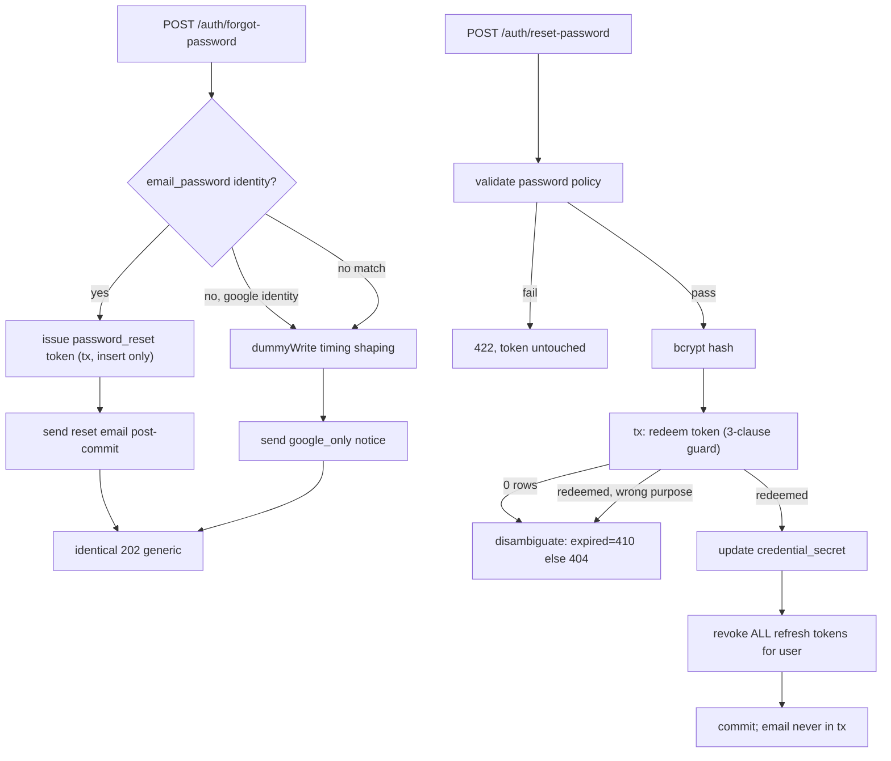

# Tech Plan: Forgot & Reset Password (account task #4)

> Ticket    : account/04-forgot-reset-password (Fitur 2B)
> Author    : ox-alpha (agent), for Anhar review
> Date      : 2026-08-26
> Updated   : —
> Status    : Approved by Anhar
> Refs      : backend/AGENTS.md, root AGENTS.md, `docs/spec/1-account/features/04-forgot-reset-password.md`, `docs/spec/1-account/{invariants,threat-model,tasks}.md`, `api/openapi/account.yaml`, explore logs `1-explore/logs/00–07 + stage3-solutioning`

---

## 📋 Summary — start here

**What & why** — Users who lost their password need a self-service recovery path: request a reset link by email (`POST /auth/forgot-password`) and redeem it for a new password (`POST /auth/reset-password`). The domain docs (INV-account-05, INV-account-08) were written anticipating exactly these endpoints; schema support already exists (`auth_tokens.purpose` CHECK includes `'password_reset'`). Both endpoints are public, Tier 1, and anti-enumeration-gated.

**Scope**
- Two new public endpoints wired into the existing rate-limited `authMux`
- Two new repository methods (credential update; user-scoped refresh-token mass revoke)
- One new `notification.Sender` method carrying the reset token (+ Fake/Dev impls)
- Purpose checks closing a cross-purpose token-redemption hole in *both* directions (verify-email side fixed in-slice per resolved Q1)
- One contract completion: document `429` on reset-password (resolved Q2)
- No migrations, no frontend work, no audit-log entry (out of Fitur 9 scope)

**Decision flow diagram**



**Key decisions**
- Credential update keyed `(user_id, provider_type)` mirroring `SetUserVerified`; mass session revoke is one guarded UPDATE by `user_id` inside the caller's tx (D1)
- Purpose checked in-service off `RedeemToken`'s RETURNING; shared signature untouched (D2)
- VerifyEmail cross-purpose hole fixed in this slice (Q1 resolved: fix)
- New minimal `issueResetToken` helper (insert-only, no revoke) instead of reusing the resend helper whose `RevokeTokens` would violate Assumption A (D3)
- Password validation + bcrypt run **before** `BeginTx`; Assumption B's "token survives failed validation" falls out structurally from the tx pattern (D4)
- Forgot handler keeps the resend precedent: 422 on malformed email, internal errors swallowed into identical 202 (Q3 resolved: keep)
- Add documented-but-missing 429 to reset-password in the contract (Q2 resolved: add)

**Top risks**

| Risk | Likelihood | Severity | Mitigation |
|---|---|---|---|
| Session revoke implemented outside the redeem tx → INV-05 violated under crash/partial failure | Low | High — stale sessions survive a "successful" reset | Revocation lives inside the same caller tx structurally; `TestResetPassword_AllSessionsRevoked_Atomic` (real Postgres) proves updated⟺revoked incl. rollback variant |
| Timing/enumeration side-channel across forgot-password's three branches | Medium | High — account-existence oracle | `dummyWrite` shaping on no-op branches (register-proven device) + real-Postgres branch-timing test |

**Open items needing human input**
1. Problem-type URI prefix split (`problems/*` in code vs `errors/*` in spec examples) — repo-wide cleanup decision, deferred
2. tasks.md tracker staleness (task #3 shown committed but tracked as build-not-started) — doc upkeep
3. Root `AGENTS.md` §5 dev-outbox wording gains a third line type — trivial doc drift to accept or patch
4. Current `RateLimit(rps, burst)` values in `main.go` — TBD — verified at build: values come from `AUTH_RATE_*` env vars; not retuned
5. Heavy concurrency proofs (INV-08 real-DB race + stress) deferred behind `KENCLENG_HEAVY_RACE_TESTS=1` this session — must run clean before merge

---

<!-- Audience boundary: above is the digest; below is execution-grade detail. -->

## 1. Background

The account domain ships registration+verification (task #1, merged), Google OAuth (task #2, merged), login/session management (task #3, committed). A user who forgets their password currently has no self-service recovery: only an authenticated set-password path exists (future task #5). Fitur 2B defines the unauthenticated pair `POST /auth/forgot-password` and `POST /auth/reset-password`.

The ground-truth docs anticipate this slice: INV-account-05 demands credential update + mass session revocation in one transaction; INV-account-08 governs single-use tokens with the full 3-clause guard; the threat model's component 3 resolves anti-enumeration ("identical 202 regardless of match"). The schema is ready — `auth_tokens.purpose` CHECK already accepts `'password_reset'` (migration 000003:4) — so this slice is pure code plus one contract documentation fix.

Exploration surfaced one latent defect adjacent to this slice: `VerifyEmail` discards `RedeemToken`'s returned purpose (service.go:413), meaning any valid token redeems at `/auth/verify-email`. Once `password_reset` tokens exist in the wild this becomes live ammunition; per resolved Q1 it is fixed here rather than deferred.

## 2. Scope

**In scope:**
- `POST /auth/forgot-password`: 3-branch dispatch (email_password match / google-only / no-match), all → identical generic 202; reset-token issuance on branch 1 only
- `POST /auth/reset-password`: policy-validate → atomic redeem+credential-update+all-session-revoke → 200/422/410/404
- Repository: `UpdateIdentityCredentialSecret`, `RevokeAllRefreshTokensForUser`
- Service: `ForgotPassword`, `ResetPassword`, `VerifyEmail` purpose check, `resetTokenTTL` const
- Notification: `SendPasswordResetEmail` on `Sender` + `FakeSender` + `DevSender`
- Transport: two handlers + route lines; reuse `MapServiceError`
- Contract: add `429` response to `/auth/reset-password` in `api/openapi/account.yaml`, regenerate bundle
- Tests: unit + `-tags=integration` suite incl. INV-05 property test and INV-08 ≥100-goroutine stress

**Out of scope (explicit):**
- Any migration / schema change
- Frontend pages consuming these endpoints
- Audit-log entries (password reset not in Fitur 9 scope — feature spec §Audit)
- Access-token revocation on reset (INV-05 scopes refresh tokens; access dies on ≤15-min expiry)
- Unifying problem-type URI prefixes (`problems/*` vs `errors/*`) repo-wide
- Proactive revocation of outstanding reset tokens on repeat forgot requests (Assumption A — explicitly resolved to NOT do)

## 3. Requirements

| Condition | Requirement | Source/Note |
|---|---|---|
| Forgot requested for email with `email_password` identity | New single-use token (`purpose=password_reset`, 1h expiry), reset email sent, generic 202 | feature AC; INV-account-08 |
| Forgot for google-only email | No token; distinct notice email (`NudgeGoogleOnly`); API response identical to success | feature AC; openapi description |
| Forgot for unknown email | Nothing sent; identical 202 | anti-enumeration, threat model §3 |
| Repeated forgot requests | Each issues its own token; prior unexpired tokens NOT revoked | Assumption A (resolved) |
| Rate limiting | Both endpoints inherit the stricter `/auth/*` bucket | mount-time middleware, main.go:172 |
| Reset with valid token + passing password | ONE transaction: credential updated, `used_at` set, every refresh token for user revoked | INV-account-05 |
| Password policy | ≥8 chars + breach-list fail-open; validated BEFORE the token-consuming tx | Assumption B (ordering is load-bearing) |
| Policy failure | 422 ValidationProblem; token stays unused (retry same link) | feature AC error table |
| Expired token | 410, no state change | openapi + feature AC |
| Unknown/used/wrong-purpose token | 404, no state change | openapi + D2/Q1 decisions |
| Concurrent double-submit | Exactly one succeeds (guarded UPDATE), other 404 | INV-account-08 |
| Email delivery | Post-commit only; failures logged category-only, no recipient/token in logs | golden rule; service convention |
| Tier 1 gate | Named invariant tests traceable to INV-05/INV-08; `-race`; ≥100-goroutine stress | tasks.md KPI |

## 4. Rules & Validation

- **R1**: Given an email matching an `email_password` identity, When forgot-password is called, Then a token row `{purpose: password_reset, expires_at ≈ now+1h, used_at NULL}` exists and the reset email carries the plain token; response 202 with the generic body.
- **R2**: Given an email matching only a `google` identity, When called, Then no `auth_tokens` row is created, `NudgeGoogleOnly` email is sent, response identical to R1's.
- **R3**: Given an email matching no identity, When called, Then no row, no email, response identical to R1's.
- **R4**: Given a prior unexpired reset token exists, When forgot-password is called again, Then a second independent token is issued and the first remains redeemable (no `revoked_at` set).
- **R5**: All three forgot branches return byte-identical 202 bodies, and no-op branches perform DB-write-shaped work (`dummyWrite`) so wall-clock DB time doesn't distinguish them.
- **R6**: Given burst-exceeding requests to either endpoint, Then 429 Problem Details from the shared limiter.
- **R7**: Given valid unused unexpired token + policy-passing password, When reset-password succeeds, Then in one transaction `credential_secret` updated, `used_at` set, and EVERY `refresh_tokens` row for the user (any family, rotated or not) has `revoked_at` set; response 200 message body.
- **R8**: Given a failing-length or breached password, When submitted, Then 422 ValidationProblem AND the token's `used_at` remains NULL (retryable).
- **R9**: Given expired token, Then 410 Token Expired problem; no state change.
- **R10**: Given token not found, already used, or of another purpose, Then 404 Token Not Found problem; no state change.
- **R11**: Given N≥100 concurrent resets submitting the same valid token, Then exactly one 200, all others 404, exactly one credential update, zero double-parenting anomalies.
- **R12**: Given a `password_reset` token presented to `/auth/verify-email`, Then 404 and the token is NOT consumed (rollback).
- **R13**: Given an `email_verification` token presented to `/auth/reset-password`, Then 404 and the token is NOT consumed.
- **R14**: Given post-commit email-send failure on either flow, Then the operation still succeeds client-side; log contains a sanitized category only — no recipient, no token.
- **R15**: Given empty `token` field at the boundary, Then 404 without a DB round-trip.
- **R16**: Given malformed JSON body, Then 400 invalid-json Problem.
- **R17**: Given malformed email on forgot-password, Then 422 fieldError (`email`).
- **R18 (INV-05 property)**: For any reset attempt: credential-update-committed ⟺ all-sessions-revoked-committed. Injected failure between the two writes rolls back BOTH and leaves the token redeemable and sessions alive.

## 5. Decision Log

| Option considered | Why rejected/accepted |
|---|---|
| D1a credential update keyed by identity ID | Rejected — would widen `RedeemToken`'s RETURNING contract; tokens carry `user_id`; `(user_id, provider_type)` mirrors `SetUserVerified`. **Chosen: (user_id, provider_type)** |
| D1b mass revoke via per-family loop | Rejected — SELECT-first inside critical tx; a family created mid-window escapes. Outside-tx rejected — violates INV-05 verbatim. **Chosen: single guarded UPDATE by user_id in caller's tx** |
| D2 purpose enforcement via new `purpose` param on `RedeemToken` (4-clause guard) | Safer-by-construction but rewrites merged task #1/#3 shared path. **Chosen: check returned purpose in-service; mismatch → ErrTokenNotFound, deferred rollback un-redeems** |
| Q1 VerifyEmail cross-purpose hole | Defer rejected — reset tokens become live ammunition at ship time. **Chosen: one-line purpose check in VerifyEmail + unit tests (in-slice)** |
| D3 reuse `issueNewVerificationToken` for reset issuance | Rejected — contains `RevokeTokens`, which would violate Assumption A (trap-shaped surface, Area 3 sniffing #4). **Chosen: new insert-only `issueResetToken` helper** |
| D3b timing shaping on no-op branches | Register's R7 precedent proves the technique and its test. **Chosen: reuse `dummyWrite`** |
| D4 validate/hash inside vs before the tx | Inside rejected — HIBP network latency + ~100ms bcrypt would hold locks (best-practice: no external calls/slow compute inside tx). **Chosen: both before BeginTx** |
| Q3 malformed-email behavior on forgot | Skip-validation rejected — diverges from resend-handler precedent. Spec-edit-to-add-422 rejected (behavior addition beyond precedent needs human). **Chosen: keep 422 like resend; spec omission recorded as assumption** |
| Q2 missing 429 on reset-password | Leave-as-is rejected — contract under-documents reachable middleware behavior. **Chosen: add 429 to `account.yaml`, regenerate bundle, commit both** |
| Problem-type URI prefix unification | Real inconsistency (code `problems/*`, spec examples `errors/*`) but repo-wide; **deferred** — reuse existing MapServiceError URIs unchanged |

## 6. Backward Compatibility

- **Database**: none. No migration; relies on constraints/indexes already in migrations 000003/000004. No data backfill (new token purpose simply starts appearing).
- **API**: additive — two new public endpoints. One contract *completion*: documenting `429` on reset-password (behavior already exists via mount-time middleware; no wire change).
- **Existing clients**: register/resend/logout/refresh/login untouched. **One deliberate behavior tightening**: `/auth/verify-email` will start rejecting non-`email_verification` tokens (R12). Today such redemption is possible but nonsensical-to-harmful (it burns a reset token to flip `verified_at`); assessed as a bug fix, flagged here explicitly rather than silently.
- **Deprecation path**: N/A — nothing removed.

## 7. Edge Cases & Risks

| Risk | Likelihood | Severity | Mitigation |
|---|---|---|---|
| Session revoke outside redeem tx (INV-05 violation) under crash/partial failure | Low | **High** — old sessions stay alive after "successful" reset | Structurally impossible in design (same tx); proven by R18 integration property test incl. injected-failure rollback variant |
| Enumeration/timing side-channel across forgot branches | Medium | **High** — account-existence oracle | `dummyWrite` shaping (register-precedent); `TestForgotPassword_Timing_Branches_RealPostgres` proves wall-clock parity |
| Concurrent double-submit races past single-use guard | Low | High impact, well-understood mitigation | 3-clause guarded UPDATE (existing, battle-tested in task #3); R11 stress test ≥100 goroutines `-race` |
| HIBP unreachable during reset | Expected occasionally | Low | Fail-open per Fitur 1 resolution (threat model residual #4); unit-tested |
| Limiter keys on `r.RemoteAddr`; proxy collapses clients into one bucket | Certain behind proxy | Low (accepted residual, threat model §2) | Inherited; documented; X-Forwarded-For is a separate deferred follow-up |
| Future token purposes reintroduce cross-purpose confusion | Medium over time | Medium | Purpose constants + checks centralized in service; R12/R13 tests pin current behavior; noted for future slices |
| Plain token leaks via logs/errors | Low | High severity if hit | Category-only logging (`notificationErrorCategory`); R14 asserts no recipient/token in log output |
| `tokenTTL`(24h) accidentally reused for reset | Low | Medium — 24× too-long reset window | Dedicated `resetTokenTTL = 1h` const; test R1 asserts expiry window |

## 8. Interface Contract

Per backend/AGENTS.md conventions: SQL only via parameterized goqu (never string concat), client errors in RFC 9457 Problem Details per `api/openapi.yaml`, no secrets/PII in logs, `%w` error wrapping throughout.

**DB Schema changes:** None. Relied-upon existing objects:
```sql
-- migration 000003 (already shipped)
purpose TEXT NOT NULL CHECK (purpose IN ('email_verification','password_reset'))
CREATE UNIQUE INDEX ux_auth_tokens_token_hash ON auth_tokens (token_hash);
-- migration 000004 (already shipped)
CREATE INDEX ix_refresh_tokens_user_id ON refresh_tokens (user_id);
CREATE INDEX ix_refresh_tokens_active ON refresh_tokens (user_id)
    WHERE revoked_at IS NULL AND replaced_by_id IS NULL;
```

**API changes:** two endpoints consumed as-already-specified (`api/openapi/account.yaml:235–299` — no shape authored by this task), plus one addition:
```yaml
# /auth/reset-password — ADD (documents existing middleware behavior; Q2 resolved):
"429":
  $ref: "./common.yaml#/components/responses/TooManyRequests"
```

**Internal Go interfaces (this task's delta):**
```go
// repository.go (Repository interface additions; both take caller's tx)
UpdateIdentityCredentialSecret(ctx context.Context, tx pgx.Tx,
    userID uuid.UUID, providerType string, passwordHash string) error
RevokeAllRefreshTokensForUser(ctx context.Context, tx pgx.Tx, userID uuid.UUID) error

// platform/notification/sender.go (Sender interface addition)
SendPasswordResetEmail(ctx context.Context, to, token string) error

// domain/account/service.go (new exported methods; sentinel errors reused)
func (s *Service) ForgotPassword(ctx context.Context, email string) error
    // returns nil on ALL branches; handler owns the generic 202
func (s *Service) ResetPassword(ctx context.Context, token, newPassword string) error
    // ErrValidation→422, ErrTokenExpired→410, ErrTokenNotFound→404 (incl. wrong purpose)
```

**Business logic flow:**
```
ForgotPassword(email):
  hash := HMAC(email); identity := find(email_password, hash)
  match        -> issueResetToken(userID)   [tx: INSERT ONLY, no revoke]
                  SendPasswordResetEmail post-commit
  google-only  -> dummyWrite(); SendNudgeEmail(google_only)
  none         -> dummyWrite()
  always       -> nil (handler writes identical 202)

ResetPassword(token, newPassword):
  validatePassword(newPassword)            // length>=8 + HIBP fail-open; BEFORE any DB work
  hash := bcrypt(newPassword)              // CPU before tx
  tx { redeem(hashOfToken)                 // 3-clause guarded UPDATE, RETURNING user_id,purpose
       purpose != password_reset -> ErrTokenNotFound (rollback)
       UpdateIdentityCredentialSecret(user,"email_password",hash)
       RevokeAllRefreshTokensForUser(user)
       commit }                            // INV-05 atomicity boundary
  !ok -> FindAuthTokenByHash -> expired ? 410 : 404
```

## 9. Architecture / Plan

Execution order (each step compiles green):

1. Repository methods + interface docs (`repository.go`, `repository_db.go`)
2. Service: `resetTokenTTL`/purpose consts → `issueResetToken` → `ForgotPassword` → `ResetPassword` → `VerifyEmail` purpose check (Q1)
3. Notification: interface + `FakeSender` + `DevSender` (compile ripple through existing fakes)
4. Transport: `auth_password_reset.go` (two handlers, naming follows `auth_*.go` siblings) + two lines in `cmd/server/main.go`
5. Contract edit + `cd api && npm run bundle`
6. Tests: unit suite → integration suite (`-tags=integration -race`)
7. `make verify`

Migration strategy: none. Rollback strategy: revert commit; no data artifacts to clean (tokens expire in 1h; revoked refresh tokens are terminal-by-design).

Independent-lifecycle evaluation (rules §3): no sub-component qualifies — no scripts, crons, or standalone migrations; everything lives or dies with the deploy.

## 10. Implementation Details

**File**: `internal/domain/account/repository.go`
- Change: add the two interface methods (§8 signatures) with doc comments in house style; `RevokeAllRefreshTokensForUser` doc notes idempotency via `revoked_at IS NULL` guard and INV-05 purpose.

**File**: `internal/domain/account/repository_db.go`
- Change: implementations mirroring `SetUserVerified`/`RevokeTokens` shapes — goqu `Update("auth_identities").Set(Record{"credential_secret": hash}).Where(user_id, provider_type)` and `Update("refresh_tokens").Set(Record{"revoked_at": time.Now()}).Where(goqu.Ex{"user_id": userID}, goqu.L("revoked_at IS NULL"))`; both `Prepared(true)`, exec on `tx`.

**File**: `internal/domain/account/service.go`
- Change: consts `resetTokenTTL = time.Hour`, `purposePasswordReset = "password_reset"`; unexported `issueResetToken(ctx, userID) (plain string, err)` modeled on `issueNewVerificationToken` minus `RevokeTokens`; `ForgotPassword` per §8 flow (branches R1–R3, `dummyWrite` reuse); `ResetPassword` per §8 flow; `VerifyEmail` line `userID, purpose, ok := ...` + `if ok && purpose != purposeEmailVerify { return ErrTokenNotFound }` (rollback un-redeems).

**File**: `internal/platform/notification/sender.go`, `dev_sender.go`
- Change: `SendPasswordResetEmail` on interface; `FakeSender` no-op (log-safe); `DevSender` appends third outbox line type (mode 0600 preserved).

**File**: `internal/transport/http/auth_password_reset.go` (new)
- Change: `ForgotPasswordHandler(svc)` — decode→400; `looksLikeEmail`→422 fieldError; svc call; internal error swallowed into identical 202 with sanitized log (resend-handler pattern); `ResetPasswordHandler(svc)` — decode→400; empty token→early 404; svc call; `MapServiceError`; success 200 `{"message": "Password berhasil diubah. Silakan login ulang."}`.

**File**: `cmd/server/main.go`
- Change: two `authMux.HandleFunc` registrations beside lines 152–163; inherits the existing `RateLimit(rps, burst)` wrapper (values unchanged — TBD-verify current values at build time, do not retune in this slice).

**File**: `api/openapi/account.yaml` + regenerated `openapi.yaml`
- Change: the §8 429 addition only; bundle via `npm run bundle`; both committed together (api/README workflow).

## 11. Files Changed / Files NOT Changed

| File | Change Type | Description |
|---|---|---|
| `internal/domain/account/repository.go` | modify | +2 interface methods |
| `internal/domain/account/repository_db.go` | modify | +2 implementations |
| `internal/domain/account/service.go` | modify | consts, 2 methods, helper, VerifyEmail purpose check |
| `internal/platform/notification/sender.go` | modify | +1 interface method + FakeSender |
| `internal/platform/notification/dev_sender.go` | modify | outbox line type |
| `internal/transport/http/auth_password_reset.go` | new | two handlers |
| `cmd/server/main.go` | modify | two route lines |
| `api/openapi/account.yaml`, `api/openapi.yaml` | modify | 429 addition + regen |
| `internal/domain/account/service_test.go` (or new `password_reset_test.go`) | new/modify | unit suite |
| `internal/domain/account/password_reset_integration_test.go` | new | integration suite |
| `internal/transport/http/auth_password_reset_test.go` | new | handler tests |

| File | Reason untouched |
|---|---|
| `migrations/*` | schema already supports the feature |
| `internal/platform/auth/*` | Tier 0 fenced; JWT/TOTP paths not involved |
| `internal/domain/donation` / `internal/domain/disbursement` | other domains |
| `internal/platform/crypto/` | Tier 0 fenced; HMAC helper reused as-is |
| `docs/spec/**` | authority separation (§4 root AGENTS.md) — no edits even for the adjudicated 2-clause spec-error note |
| existing `login.go`, `google_oauth.go` handlers | no shared-code changes required |

## 12. Testing Checklist

Count-check: R1–R18 = 18 rule IDs; each maps below.

- [ ] R1 `TestForgotPassword_Match_IssuesTokenAndSendsEmail` (unit; asserts purpose/expiry window/plain-token-in-email-arg)
- [ ] R2 `TestForgotPassword_GoogleOnly_NoticeNoToken` (unit)
- [ ] R3 `TestForgotPassword_NoMatch_NothingSent` (unit)
- [ ] R4 `TestForgotPassword_Repeat_DoesNotRevokePriorTokens` (unit — Assumption A)
- [ ] R5 `TestForgotPassword_GenericResponse_AllBranches` + `TestForgotPassword_Timing_Branches_RealPostgres` (unit + integration)
- [ ] R6 `TestForgotPassword_RateLimited`, `TestResetPassword_RateLimited` (handler/middleware level)
- [ ] R7 `TestResetPassword_HappyPath_UpdatesAndReturns200` (unit) + `TestResetPassword_AllSessionsRevoked_Atomic` (integration, 2+ tokens across ≥2 families)
- [ ] R8 `TestResetPassword_PasswordPolicy_TokenNotConsumed` (unit; length + breach-hit variants)
- [ ] R9 `TestResetPassword_ExpiredToken_410` (unit, mirrors VerifyEmail case)
- [ ] R10 `TestResetPassword_NotFound_Used_404` + `TestResetPassword_WrongPurpose_404_Unconsumed` (unit)
- [ ] R11 `TestResetPassword_TokenSingleUse_Concurrent` + `TestResetPassword_Stress_MixedValidAndReplayed` (integration, ≥100 goroutines, `-race`)
- [ ] R12 `TestVerifyEmail_RejectsResetPurposeToken_Unconsumed` (unit — Q1)
- [ ] R13 covered by R10's wrong-purpose test (same rule from reset side; listed here for count parity)
- [ ] R14 `TestPasswordReset_SendFails_LogsNoPIIOrToken` (unit, mirrors `TestRegister_SendVerificationFails_LogNoPII`)
- [ ] R15 `TestResetPassword_EmptyToken_404_NoDBHit` (unit)
- [ ] R16 handler tests: malformed JSON → 400 both endpoints
- [ ] R17 `TestForgotPassword_MalformedEmail_422` (unit/handler)
- [ ] R18 `TestResetPassword_FailureBetweenWrites_RollsBackBoth` (integration; injected repo failure → token still redeemable, sessions alive)

Plus gate hygiene: `go test ./...`, `go test -race ./...`, `go test -tags=integration -race ./internal/domain/account/...`, coverage ≥80% new lines, security layer A/B per tasks.md KPI.

## 13. Testing Examples & Common Mistakes

| Mistake | Error/Behavior | Fix |
|---|---|---|
| Redeeming (`used_at` set) before password validation | Weak password burns the token → forced full re-request (the exact bug Assumption B warns about) | Order per D4; R8 asserts `used_at IS NULL` after 422 |
| Reusing `tokenTTL` (24h) for reset tokens | Reset links valid 24× too long | `resetTokenTTL`; R1 asserts window |
| Calling `RevokeTokens(userID, "password_reset")` in forgot flow | Silently violates Assumption A (prior links die) | Insert-only helper; R4 |
| Discarding redeem purpose (the VerifyEmail bug shape) | Cross-purpose consumption | R12/R13 pin both directions |
| Sending email inside the tx | Lock held across SMTP/network latency; send-failure ambiguity | Post-commit send; matches transactions-and-locking guidance |
| Logging `err` verbatim on sender/DB errors | Can embed recipient/token | `notificationErrorCategory` style; R14 |
| Timing test comparing only HTTP status bodies | Misses DB-time channel | Real-Postgres timing test (R5), register precedent |
| Asserting "didn't crash" in concurrency tests | No invariant proven | R11 asserts exact one-winner + one credential update |

## 14. Open Items

### Active — need external input or verification
1. **Problem-type URI prefix split** — code emits `https://kencleng.dev/problems/*`, spec examples use `.../errors/*`. Deferred as repo-wide cleanup; this slice reuses existing code URIs. Needs a human decision on the canonical prefix.
2. **tasks.md tracker staleness** — tracker said task #3 "build not started" while git shows it committed (`16a4bf9`). Doc upkeep belongs to the human; not corrected by this slice.
3. **Root AGENTS.md §5 dev-outbox wording** — gains a third outbox line type (password-reset token); one-sentence doc drift to accept or patch (root-file edit = human).
4. **Current `RateLimit(rps, burst)` values in `main.go`** — TBD — verified at build: values come from `AUTH_RATE_*` env vars; not retuned.
5. **Heavy concurrency proofs deferred (build session 2026-08-26)** — `TestResetPassword_TokenSingleUse_Concurrent_RealDB` and `TestResetPassword_Stress_MixedValidAndReplayed_RealDB` are gated behind `KENCLENG_HEAVY_RACE_TESTS=1` per Anhar's call after repeated long runs. The INV-account-08 single-use property IS covered at unit level (`TestResetPassword_WrongPurpose`, fake-based concurrent precedent from task #1/#3) and the guarded UPDATE is the same battle-tested predicate as task #3's refresh rotation — but the ≥100-goroutine real-DB stress proof is **NOT yet delivered**, so the tasks.md KPI row for race-sensitive invariants is unmet until these run clean. Must be re-run before merge/`make verify`.

### Resolved (kept for reference)
1. ~~**VerifyEmail consumes any-purpose token**~~ **RESOLVED — fix in-slice.** Anhar chose in-scope fix (Q1, explore session 2026-08-26): purpose check + R12 test. Consequence: `/auth/verify-email` tightens behavior (see §6).
2. ~~**Missing 429 on reset-password contract**~~ **RESOLVED — add to spec.** Anhar approved the contract completion (Q2, 2026-08-26): documents existing middleware behavior; bundle regenerated in same commit.
3. ~~**Malformed-email handling on forgot-password**~~ **RESOLVED — keep 422.** Matches resend-handler precedent (Q3, 2026-08-26); openapi omission recorded as assumption, not edited.
4. ~~**Feature-spec AC omits `revoked_at` clause**~~ **RESOLVED — pre-adjudicated upstream.** Repository docs declare the invariant's Verification-field wording a known spec error ("techplan §14 Open Item #2"); the Statement's 3-clause guard governs. Spec itself not edited (§4 authority separation).
