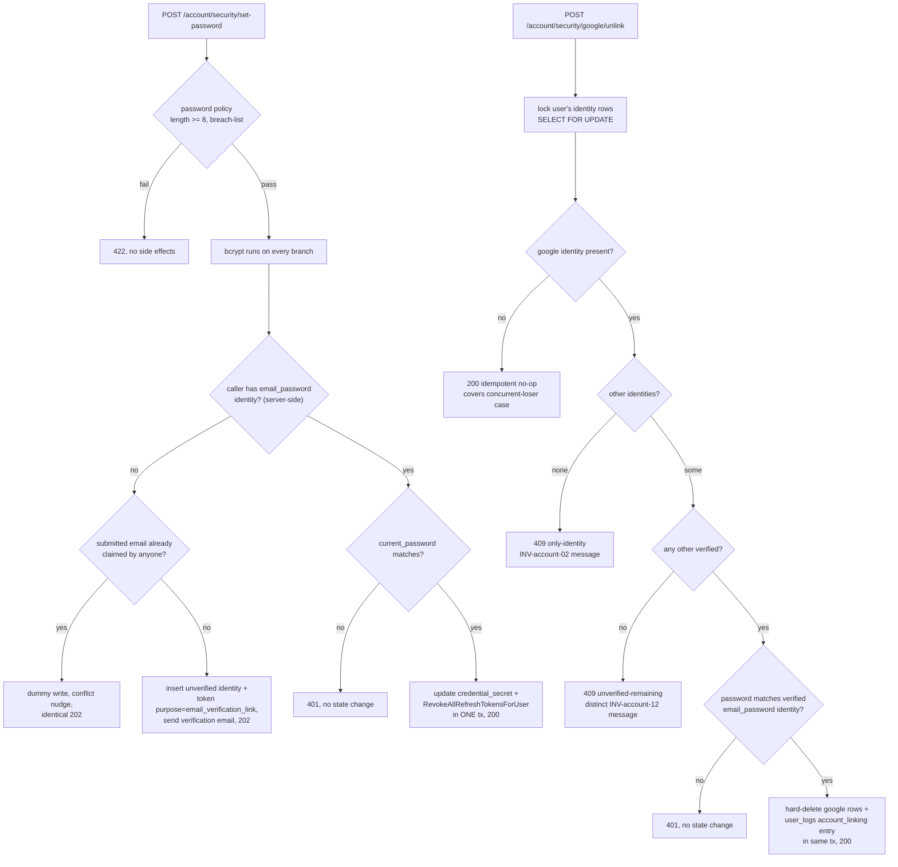

# Tech Plan: Account Linking (account #05)

> Ticket    : account domain task #5 — `docs/spec/1-account/features/05-account-linking.md`
> Author    : ox-alpha (agent) — for Anhar's review
> Date      : 2026-08-26
> Updated   : 2026-08-26 — all four Open Items resolved with Anhar (dispositions applied); section 7 risk cells + section 14 + Summary regenerated
> Status    : Approved
> Approach  : Vertical slice adding the two `/account/security` endpoints (unlink Google, set-password with server-side branching) on top of the existing identity/token primitives, plus the first-ever implementation of INV-account-05's user-wide session revocation and the backend's first always-authenticated route group
> Refs      : root + backend `AGENTS.md`; exploration logs `.local-agents/works/account/05-account-linking/1-explore/logs/` (9 files — note: the prompt's `~/kencleng-workspace/works/domains/...` path does not exist on disk; these logs are the raw material); `api/openapi/{index,common,account}.yaml` (sources) + `api/openapi.yaml` (generated bundle); `docs/spec/1-account/{invariants,threat-model,tasks}.md`; prior precedent `.local-agents/works/account/03-login-session-management/2-plan/techplan.md`; best-practices applied: `go/jwt-and-token-lifecycle`, `go/secrets-and-sensitive-logging`, `go/authorization-and-idor`, `go/testing-concurrency`, `go/integration-testing-setup`, `postgresql/transactions-and-locking`, `postgresql/migrations-safety`, `postgresql/encryption-at-rest`, `postgresql/audit-log-design`, `restapi/anti-enumeration`, `restapi/csrf-and-cookie-security`, `restapi/openapi-spec-first-drift`, `restapi/idempotency-and-versioning`

---

## 📋 Summary — start here

**What & why** — The account domain has registration, email verification, Google OAuth (including the `intent=link` attach direction), and (in progress) login/session management — but no way to remove a linked Google identity or to add/change an `email_password` credential outside initial registration. This slice adds `POST /account/security/google/unlink` and `POST /account/security/set-password`: unlink guarded by INV-account-02 + the newer stricter INV-account-12 with password re-authentication; set-password branching server-side into "add unverified identity + verification email" (anti-enumeration, mirrors registration) vs "change password in place + force-logout all sessions".

**Scope**
- Two new authenticated endpoints wired under a new `/account/security/*` route group
- First shared session-extraction middleware for the backend (cookie → Bearer, ES256, built outside the fenced `platform/auth/`)
- New repo operations: identities-by-user lookup, guarded identity delete, credential-secret update, and `RevokeAllRefreshTokensForUser` (INV-account-05 — written here first; Fitur 04 will reuse it)
- Migration 000010: widen `auth_tokens.purpose` CHECK with `email_verification_link` so the Branch-1 audit entry can be written truthfully at verification time
- One new nudge type (`set_password_conflict`) for the Branch-1 duplicate-email case
- Regenerate the stale `api/openapi.yaml` bundle (its `securitySchemes` went missing vs sources — mechanical fix)

**Decision flow diagram**



**Key decisions**
- Unlink atomicity via `SELECT … FOR UPDATE` + in-Go classification (not a single guarded DELETE) — three outcomes need distinct messages; concurrent loser maps to idempotent 200
- Unlink deletes **all** of the caller's google identities (multi-google users are reachable today via `intent=link`)
- Guard checks (409s / idempotent no-op) evaluated **before** password re-auth — a google-only user has no password to confirm yet
- Set-password branch selected server-side from identity existence, never a client flag; policy validation precedes any branching
- INV-account-05 lands here first (dependency inversion vs the spec's wording, accepted); implemented as one guarded UPDATE keyed `user_id`
- Branch-1 tokens carry a distinct `auth_tokens.purpose` value (migration 000010) so `/auth/verify-email` stays externally unchanged while writing the audit entry truthfully
- Session middleware lives in `transport/http`, reusing the existing `sessionToken()` helper; `platform/auth/` untouched (Tier 0 fence)

**Top risks**
- Race bypassing the unlink guard (INV-account-02/12) → row-lock serialization + `-race` ≥100-goroutine stress harness with invariant assertion
- Hijacked-session unlink/password change → password re-auth required on both, all sessions revoked on password change, named tests for each
- Partial application in Branch 2 (secret rotated without session revocation, or vice versa) → both writes in one transaction, asserted together in tests

**Open items needing human input** — none open; all four raised items are Resolved in section 14 (dispositions applied 2026-08-26). Remaining actions are process-level: your approval of this plan, the two spec-doc hygiene edits (Resolved #8), and filing the shared cross-cutting hardening ticket (Resolved #7/#9).

---
<!-- Audience boundary: above is the human-readable digest for
review/approval. Below is the full execution-grade plan — same
decisions, same scope, expanded to file/line precision, rule IDs, and
full option comparisons. Nothing below contradicts the digest above;
it's the same source of truth at higher resolution. -->
---

## 1. Background

Tasks #1 (register/email verification) and #2 (Google OAuth) shipped the account domain's identity layer: `auth_identities` with encrypted `identifier` + HMAC `identifier_hash` lookups, single-use `auth_tokens` behind the 3-clause redemption guard (INV-account-08), and the Google OAuth surface including `intent=link`, which attaches a **verified** google identity to the session user with an atomic `user_logs` audit entry (`callbackLink`, google_oauth.go:413). Task #3 (login/session) is Approved-with-techplan and partially present in the tree (login seams, refresh rotation primitives, migrations 000006–000009); task #4 (forgot/reset password) is **not started**.

Feature 05 closes the remaining linking directions: removing the Google identity (`unlink`) and adding an `email_password` identity to a Google-only account (`set-password` Branch 1), redesigned 2026-08-05 to also cover changing an existing password (Branch 2). The redesign introduced **INV-account-12** (unlink requires the *remaining* identity to be verified, not merely present — a stricter precondition than INV-account-02) and moved unlink from "no re-auth" to mandatory password confirmation.

Two structural facts shape this plan, both surfaced in exploration and accepted by Anhar (Stage 3 Q1–Q3, resolved 2026-08-26):

1. **Dependency inversion**: the feature spec says Branch 2's session revocation reuses "the INV-account-05 pattern as `04-forgot-reset-password.md`" — but Fitur 04 is unstarted and no user-scoped refresh-token revocation exists anywhere (`RevokeRefreshTokenFamily` is family-scoped). This slice therefore implements INV-account-05's primitive **first**, and Fitur 04 will reuse it, not the reverse. The S1 serial order (#3→#4→#5) is being deliberately jumped; nothing in this plan depends on #4's handler shape.
2. **Audit-at-verification wrinkle**: the spec requires Branch 1's audit entry when the new identity *becomes verified* — but `/auth/verify-email`'s redemption is purpose-blind and registration tokens are indistinguishable. Resolution (accepted): a third `auth_tokens.purpose` value issued only by Branch 1, letting `VerifyEmail` write the audit entry conditionally while keeping the endpoint externally unchanged.

## 2. Scope

**In scope:**
- `POST /account/security/set-password`, `POST /account/security/google/unlink` — handlers, service methods, repository methods, sentinel errors
- Server-side branch selection for set-password; Branch 1 (unverified identity creation + verification email + anti-enumeration incl. conflict nudge) and Branch 2 (in-place credential update + force-logout-all)
- Unlink: `FOR UPDATE`-serialized guard classification (INV-account-02/12), password re-auth, hard delete of all the caller's google identities, audit entry
- `RevokeAllRefreshTokensForUser` — INV-account-05 primitive (first implementation)
- Migration 000010 — widen `auth_tokens.purpose` CHECK to admit `email_verification_link`
- `VerifyEmail` conditional audit write keyed on the new purpose (endpoint contract unchanged)
- Shared session-extraction middleware for the new route group (access cookie → `Authorization: Bearer` fallback, ES256)
- Transport: sentinel→Problem mappings for the two distinct 409s + 401s; `/account/*` route mounting in `cmd/server/main.go`
- `platform/notification`: new `NudgeSetPasswordConflict` constant
- Regenerate `api/openapi.yaml` from sources (`npm run bundle`) and commit — fixes the stale bundle missing `components.securitySchemes`

**Out of scope (explicit):**
- User-facing post-action notifications ("Metode login baru berhasil ditambahkan ke akunmu", "Google berhasil dilepas dari akunmu") — cross-domain dependency on the unbuilt `notification` domain, explicitly deferred by the feature spec
- MFA enrollment/disable (`/account/security/mfa/*`) — task #6; the reauth-marker store remains #06's to consume
- `GET /account/me` — task #7
- Forgot/reset password (`/auth/forgot-password`, `/auth/reset-password`) — task #4, future reuser of `RevokeAllRefreshTokensForUser`
- Any edit to `docs/spec/*` (staleness recorded in Open Items; human-owned per root AGENTS §4) and to the openapi *source* files (both endpoints are already fully specified there post-redesign)
- Tier 0 fenced paths: `platform/auth/`, `platform/crypto/`, donation ledger, disbursement state machine
- Root-level infra (Caddyfile `handle /api/*` prefix gap — known, separate session)
- Frontend work of any kind

## 3. Requirements

| Condition | Requirement | Source/Note |
|---|---|---|
| Authenticated caller submits `set-password` | Server selects Branch 1 vs Branch 2 by whether the caller's `user_id` has an `email_password` identity — never a client-supplied flag | Feature AC "Branch selection"; request schema conditionally shaped like `MfaDisableRequest` |
| Either branch, password fails ≥8-char length or breach-list | `422` before any enumeration-sensitive branching or state change; breach-check unreachable → fail-open | Same ordering as registration (R5/R18 precedent) |
| Branch 1 (Google-only caller), email unclaimed | Create `AuthIdentity(provider=email_password, identifier=<email>, verified_at=NULL)` + single-use token in one tx; verification email after commit; respond generic `202`; **no re-auth required** | AC; adding an identity strengthens the account |
| Branch 1, email already claimed by ANY user's `email_password` identity (incl. race lost at unique index) | Identical generic `202`; distinct nudge email (`set_password_conflict`) instead of verification email; no identity, no token; DB-write-shaped timing parity (`dummyWrite`) | Anti-enumeration pattern reused from `/auth/register` |
| Branch 2 (has `email_password` identity), correct `current_password` | In ONE transaction: update that identity's `credential_secret` (identifier/email untouched) AND set `revoked_at=now()` on every non-revoked `refresh_tokens` row for the `user_id`; `200`; effective immediately, no verification step | INV-account-05; same-tx atomicity explicit in invariant |
| Branch 2, wrong `current_password` | `401`, no state change | Re-auth guard vs stolen-access-token window (15 min) |
| Unlink, google is the ONLY identity | `409`, problem type `errors/only-identity`, detail: "Google adalah satu-satunya metode login Anda. Atur email dan password dulu sebelum melepas tautan." | INV-account-02; openapi example verbatim |
| Unlink, another identity exists but unverified | `409`, **distinct** problem type `errors/unverified-remaining-identity`, detail: "Kamu sudah atur email dan password, tapi belum diverifikasi. Verifikasi email kamu dulu sebelum bisa melepas tautan Google." | INV-account-12; distinguishes "start set-password" from "finish verifying" |
| Unlink, guards pass, wrong `password` | `401`, no state change | Re-auth requirement (resolved 2026-08-05) |
| Unlink, guards pass, correct `password` | Hard-delete the caller's google identity row(s) + write `user_logs` entry (`action_type=account_linking`) in the same tx; `200 UnlinkGoogleResponse` | No soft-delete column exists; audit per Fitur 9 |
| Unlink, concurrent requests | Whole check-then-delete sequence atomic — guard cannot race past; concurrent loser (google row already gone) → idempotent `200` | Threat breakdown; assumption accepted (Q2) |
| Verification email redeemed (either flow) | Token single-use/time-bound per INV-account-08 (unchanged mechanics); `verified_at` set on the caller's `email_password` identity; if purpose = `email_verification_link`, additionally write `user_logs` entry (`action_type=account_linking`) in the same tx | Branch-1 audit "on successful verification, not at creation" |

## 4. Rules & Validation

- **R1 (Branch 1 happy path)**: Given an authenticated Google-only caller submitting an unclaimed `email` + policy-passing `password`, When submitted, Then a new unverified `email_password` `AuthIdentity` and an `auth_tokens` row with `purpose='email_verification_link'` exist in one committed transaction, a verification email carrying the plain token is sent after commit, and the response is `202` with the generic accepted message. *Test proves: `TestSetPassword_Branch1_CreatesUnverifiedIdentity_SendsVerification`.*
- **R2 (Branch 1 claimed email)**: Given the submitted email's HMAC matches an existing `email_password` identity of any user, When submitted, Then no identity/token is created, a `set_password_conflict` nudge is sent, a DB-write-shaped no-op occurs, and the `202` body is byte-identical to R1's. *Test: `TestSetPassword_Branch1_ClaimedEmail_NudgeNoIdentity_Generic202`.*
- **R3 (Branch 1 concurrent duplicate)**: Given two simultaneous Branch-1 submissions of the same email, When both hit the unique index `(provider_type, identifier_hash)`, Then exactly one creates identity+token; the loser rolls back cleanly (no orphaned rows), sends the conflict nudge, and returns the generic `202`. *Test: `TestSetPassword_ConcurrentDuplicateEmail_Race` (`-race`).*
- **R4 (policy precedes branching)**: Given a password failing length or breach-list on either branch, When submitted, Then `422` fires before any identity lookup/state change, and a breach-API outage yields fail-open (accepted) not `5xx`. *Tests: `TestSetPassword_PasswordPolicy_PrecedesBranching`, `TestSetPassword_BreachCheck_FailOpen`.*
- **R5 (generic-response parity)**: Given all Branch-1 outcomes (created / claimed / race-loser), When compared, Then response status and body are identical; bcrypt runs on every branch. *Test: `TestSetPassword_GenericResponse_AllBranches`.*
- **R6 (server-side branch selection)**: Given a Google-only caller whose body includes `current_password`, or an `email_password` caller whose body includes `email`, When submitted, Then the branch chosen is the server-determined one and extra fields are ignored. *Test: `TestSetPassword_BranchSelection_ServerSide`.*
- **R7 (Branch 2 atomic change)**: Given a correct `current_password` and policy-passing new password, When submitted, Then after the request: the identity's `credential_secret` verifies against the new password, `identifier_hash` is unchanged, and EVERY previously-non-revoked `refresh_tokens` row for the `user_id` has `revoked_at` set — all observed as one atomic outcome (a forced mid-failure leaves neither change applied). *Test: `TestSetPassword_Branch2_AllSessionsRevoked` (+ `TestSetPassword_Branch2_IdentifierUntouched` in the integration suite).*
- **R8 (Branch 2 wrong current password)**: Given a wrong `current_password`, When submitted, Then `401` Problem with the generic credentials vocabulary and zero rows changed anywhere. *Test: `TestSetPassword_Branch2_WrongCurrentPassword_Rejected`.* (Comparison burns comparable CPU time via the existing `compare` seam.)
- **R9 (unlink success)**: Given guards passing and correct `password`, When submitted, Then the caller's google identity row(s) are hard-deleted (row count for `(user_id,'google')` drops to 0), a `user_logs` row with `action_type='account_linking'` commits atomically, and the response is `200 UnlinkGoogleResponse{message}`. *Tests: `TestUnlinkGoogle_Success_HardDeletesAndAudits`; audit-value assertion per tasks.md KPI.*
- **R10 (INV-account-02 guard)**: Given google is the caller's only identity, When unlink requested, Then `409` with problem type `https://kencleng.dev/errors/only-identity` and the spec's Indonesian detail verbatim. *Test: `TestUnlinkGoogle_OnlyIdentity_Rejected409`.*
- **R11 (INV-account-12 guard)**: Given another identity exists but all non-google identities have `verified_at IS NULL`, When unlink requested, Then `409` with the **distinct** type `https://kencleng.dev/errors/unverified-remaining-identity`. *Test: `TestUnlinkGoogle_RejectsUnverifiedRemainingIdentity`.*
- **R12 (unlink re-auth + evaluation order)**: Guards are evaluated before re-auth (so the 409 cases are reachable by a passwordless Google-only caller, and a no-google-row request returns idempotent `200` without password); after guards pass, a wrong `password` yields `401` with no state change and a correct one proceeds to delete+audit. *Tests: `TestUnlinkGoogle_RequiresReauth`, `TestUnlinkGoogle_WrongPassword_Rejected`, `TestUnlinkGoogle_IdempotentNoGoogleRow_Returns200`.*
- **R13 (unlink concurrency guard)**: Given ≥100 concurrent unlink/verify interleavings against one user, When run under `-race`, Then at most one unlink succeeds to deletion, no successful unlink ever leaves the user identity-less or with an unverified-only remainder (INV-account-02/12 hold at every observed end-state), and losers land in {idempotent `200`} ∪ {correct 409} — never a spurious success-after-guard-failure. *Test: `TestUnlinkGoogle_ConcurrentRequests_GuardHolds` (stress harness per tasks.md KPI).*
- **R14 (verification redemption + conditional audit)**: Given a valid unredeemed token of either purpose, When `POST /auth/verify-email` redeems it, Then behavior matches today (3-clause redeem + set-verified, single-use under concurrency — existing `TestVerifyEmail_TokenSingleUse_Concurrent` keeps covering this) **and** when the redeemed purpose is `email_verification_link` a `user_logs` row (`action_type='account_linking'`) commits in the same transaction; registration-purpose redemptions write no such row. *Tests: `TestVerifyEmail_LinkPurpose_WritesLinkAudit`, `TestVerifyEmail_RegistrationPurpose_NoLinkAudit`.*
- **R15 (session enforcement)**: Given a request to any `/account/security/*` route without a token, with an expired token, with a garbage token, or signed by the wrong key, When received, Then `401` Problem Details (shape matching openapi's `responses/Unauthorized`) and the handler never executes; a valid access JWT via HttpOnly cookie or `Authorization: Bearer` both authenticate. *Tests: `TestRequireSession_MissingToken_401`, `TestRequireSession_ExpiredOrGarbageToken_401`, `TestRequireSession_BearerFallback_Accepted`.*
- **R16 (PII/token logging discipline)**: Across all new code paths, no plaintext identifier/email, password, hash, or plain token appears in any log line; email-send failures log sanitized categories only; the audit row stores `action_type` only (no payloads). *Verified by: targeted log-scan assertions added to the service tests (`TestSecurity_LogsFreeOfSecrets`) + existing `FakeSender` redaction suite; reviewed again at code-review gate.*

**Count-check**: R1–R16 — every rule ID above has ≥1 corresponding item in section 12. ✓

## 5. Decision Log

### D1 — INV-account-05 primitive shape

| Option | Why rejected/accepted |
|---|---|
| A. New `RevokeAllRefreshTokensForUser(ctx, tx, userID)` — single guarded UPDATE `WHERE user_id=$1 AND revoked_at IS NULL` | **Chosen.** One statement, atomic in the caller's tx, covered by `ix_refresh_tokens_user_id`; matches INV-account-05's wording exactly (includes already-rotated rows — deliberately no `replaced_by_id` guard, same reasoning as family revocation). Written here first; Fitur 04 reuses. |
| B. Loop families, call `RevokeRefreshTokenFamily` per family | Rejected — extra query + indirection; families are an internal lineage concept, the requirement is user-scoped. |

### D2 — Unlink atomicity mechanism

| Option | Why rejected/accepted |
|---|---|
| A. Single guarded `DELETE … WHERE EXISTS(verified other) RETURNING` | Rejected — affected-rows can't distinguish the two mandated 409 messages, nor the idempotent no-op case. |
| B. One tx: `SELECT … WHERE user_id=$1 FOR UPDATE` → classify in Go → conditional DELETE + audit | **Chosen.** Row locks serialize concurrent unlinks (loser classifies post-commit state under READ COMMITTED); three failure/success outcomes stay readable and unit-testable. Follows the repo's "correctness lives in Postgres behind guarded statements" philosophy. |

### D3 — Multi-google-identity users

| Option | Why rejected/accepted |
|---|---|
| A. Delete all of the caller's google identities under one guard | **Chosen** (Q2 accepted). The endpoint means "remove Google as a login method"; multi-google users are reachable today via `intent=link` (unique index only blocks same-email duplicates). |
| B. Reject until exactly one remains | Rejected — user-hostile, no security gain. |

### D4 — Branch selection signal

Reuse `FindIdentifierHashByUserAndProvider(userID, 'email_password').found` — no new lookup method needed for dispatch itself; a fuller identities-by-user query is added for the unlink guard anyway (D2). Server-side only per AC.

### D5 — Branch 1 conflict handling

Mirror registration exactly: pre-check by HMAC lookup → nudge + generic 202 + `dummyWrite` timing parity; unique-violation fallback (`isUniqueViolation`, SQLSTATE 23505) covers the pre-check race. New `NudgeSetPasswordConflict` constant; FakeSender/DevSender need no logic change (stringly-typed nudge contract, noted limitation in exploration Area 6).

### D6 — Branch 2 comparison target and mechanics

Compare via the existing `s.compare` seam against the caller's own identity's `credential_secret` (CPU burned on failure paths too, per R18 timing discipline precedent). Distinct from login-time lookup-by-identifier; reuses the existing `ErrInvalidCredentials`→401 mapping.

### D7 — Branch-1 audit truthfulness

| Option | Why rejected/accepted |
|---|---|
| A. Third `auth_tokens.purpose` value (`email_verification_link`) via migration 000010; `VerifyEmail` writes the audit conditionally | **Chosen** (Q1 accepted 2026-08-26). Redemption is already purpose-blind, so the endpoint stays externally unchanged; audit becomes truthful without heuristics; gives task #08's action_type vocabulary a durable distinction to build on. |
| B. Audit at identity-creation time | Rejected — violates the spec's explicit "not at initial creation". |
| C. Heuristics (created_at deltas) | Rejected — fragile under clock skew/concurrency. |

Micro-decision recorded: the audit entry reuses `action_type='account_linking'` (same literal as `callbackLink`) — both events are "login method changed" at Fitur-9 granularity; refinement belongs to task #08's vocabulary ownership.

### D8 — Session enforcement location

| Option | Why rejected/accepted |
|---|---|
| A. Inline extraction duplicated in each handler | Rejected — three+ upcoming authenticated surfaces (#4, #6, #7) would each roll their own check. |
| B. Small middleware over an `accountMux`, reusing `sessionToken()` + an inline ES256 verifier (pattern proven by `GoogleTokenVerifier`; `platform/auth/` untouched) | **Chosen.** Explicit authz boundary visible at one point per golden rule; naming/location finalized during build so later tasks share without breakage. |

### D9 — Contract repairs (corrected during synthesis)

| Option | Why rejected/accepted |
|---|---|
| A. Author a new `securitySchemes` block | Rejected — synthesis-time cross-check found `bearerAuth` **is** defined in `api/openapi/common.yaml:2`; only the generated bundle is stale. |
| B. Regenerate the bundle mechanically (`npm run bundle` in `api/`, commit output) | **Chosen.** Matches api/README.md's "do not edit openapi.yaml directly" and the task-03 precedent. If regeneration still drops `securitySchemes`, STOP and report — that would be a bundler bug, not a spec fix. |
| C. Edit the feature spec's stale References note ("both endpoints need a schema update") | Rejected as in-scope work — spec edits are human-owned (root AGENTS §4); recorded in Open Items instead. |

### Evaluation-order micro-decision (folded into R12)

Guards before re-auth: a Google-only caller has no password to confirm, so the 409s must be reachable pre-password; the idempotent no-op likewise returns without password (own-data visibility, zero leak). Password is the **last** gate before mutation.

## 6. Backward Compatibility

- **Database**: migration 000010 is additive — widening a CHECK constraint admits a new value; no existing row violates the old or new constraint; `auth_tokens` is small (per-registration issuance only), so the brief ACCESS EXCLUSIVE lock during DROP+ADD CONSTRAINT is negligible. **Down direction**: the down migration must first re-map or remove any `email_verification_link` rows (map back to `email_verification` — redemption is purpose-blind, so re-pointed rows remain semantically valid) before restoring the 2-value CHECK; documented in section 8 and tested both directions per `migrations-safety`.
- **API**: purely additive — two new endpoints; no existing path, schema, or error shape changes. `/auth/verify-email` keeps its exact wire contract (request/response/statuses); the conditional audit write is invisible externally.
- **Existing clients**: none consume the new endpoints yet (they don't exist). The refreshed bundle may surface the restored `securitySchemes` to tooling — that is a repair toward the sources' intent, not a breaking change; flagged for reviewer awareness.
- **Sessions/users**: Branch 2 force-logs-out all of a user's sessions — an intended, spec'd behavior for callers who opt into the action. Unlink kills no sessions (refresh tokens key on `users`, not identities).
- **Deprecation path**: none needed; the `set-password` naming question (one endpoint, two behaviors) is tracked as Open Item 1 for the openapi follow-up pass — any future split would be additive (new endpoint + deprecation window), not in-place.

## 7. Edge Cases & Risks

| Risk | Likelihood | Severity | Mitigation |
|---|---|---|---|
| Concurrent unlinks race past the INV-account-02/12 guard, leaving a user identity-less or verified-identity-less | Low (guarded design) | **High** — permanent lockout class | `FOR UPDATE` serialization (D2); `TestUnlinkGoogle_ConcurrentRequests_GuardHolds` with ≥100 goroutines under `-race`, asserting end-state invariants, not just "didn't crash" |
| Hijacked access token (15-min window) unlinks Google or rotates the password silently | Low | **High** — account takeover | Mandatory `password`/`current_password` re-auth (R8, R12); Branch 2 additionally revokes every session incl. the attacker's own (R7); both have named negative tests |
| Branch 2 applies secret rotation without session revocation (or vice versa) on a mid-tx failure | Very low (single tx) | **High** — silent INV-account-05 breach | Both writes in one transaction; R7's test asserts the combined post-state and a rolled-back failure leaves neither applied |
| Branch-1 enumeration/timing regression (response or DB-time differences across created/claimed/race-loser) | Low (patterns copied from shipped register code) | Medium — leaks account existence | Byte-identical bodies asserted (R5); `dummyWrite` DB-time parity; bcrypt on every branch; pattern already proven by `TestRegister_*` suite |
| Stale generated bundle drifts further (handler/spec mismatch class per `openapi-spec-first-drift`) | Medium if unregenerated | Medium — tooling/consumers trust the bundle | Mechanical regeneration + commit in this slice; bundler-drop-of-securitySchemes treated as a STOP-and-report condition (D9-B) |
| Multi-google-identity user surprised by "all" deletion | Low (rare population) | Low–Medium — intended semantics, documented | Q2-accepted delete-all decision; message/response conveys completion; revisit only if product wants granular unlink |
| Deadlock between unlink's `FOR UPDATE` on identity rows and concurrent `SetUserVerified` update | Very low — waits are one-directional (verifier never takes identity locks in reverse order) | Low | Fixed single-statement lock acquisition on one predicate; no multi-row ordered locking elsewhere in the tx; monitor, no special handling |
| Down migration fails because `email_verification_link` rows exist | Low (only if down run after real B1 traffic) | Low — operational hiccup | Down script re-maps the purpose value first (semantically safe — redemption is purpose-blind); tested both directions |
| CSRF against cookie-carried access token on the new mutation endpoints | Low (SameSite=Lax blocks cross-site POST cookie attachment; JSON-only bodies; 15-min TTL) | Medium — defense-in-depth gap | Deferral **accepted** 2026-08-26 (Resolved #7): tracked as a named cross-cutting hardening ticket (custom-header marker or double-submit at the session middleware — one change point covering all authenticated routes); not silently buried |
| User ends up with >1 `email_password` identity (flow-level guarantee only; no DB constraint enforces one-per-user) | Very low (requires out-of-band writes) | Low | Unlink re-auth compares against the verified email_password identity deterministically (ORDER BY created_at LIMIT 1 if ever ambiguous); noted for task #08's vocabulary/schema hardening pass |
| Rate limiter keys per-IP behind the future proxy (pre-existing weakness) | Known issue | Low | Carry-forward **accepted** 2026-08-26 (Resolved #9): bundled with Resolved #7 into the same cross-cutting ticket; preferred end-state is per-`user_id` keying via the session middleware, falling back to IP pre-auth |

## 8. Interface Contract

Repo conventions honored here (root + backend AGENTS.md): money N/A (no monetary fields on this surface); all SQL parameterized via goqu — never string-built; error responses to clients only via RFC 9457 Problem Details shapes defined in `api/openapi/`; PII (`identifier`) follows the established ciphertext + HMAC-hash storage pattern unchanged (this slice adds **no** new PII column); every authorization check explicit at the handler/service boundary (session middleware + service-level ownership of `userID` — no client-supplied user identifiers anywhere).

**DB Schema changes** (migration `migrations/000010_widen_auth_tokens_purpose.{up,down}.sql`):

```sql
-- up
ALTER TABLE auth_tokens DROP CONSTRAINT auth_tokens_purpose_check;
ALTER TABLE auth_tokens ADD CONSTRAINT auth_tokens_purpose_check
    CHECK (purpose IN ('email_verification', 'email_verification_link', 'password_reset'));

-- down (re-map first: redemption is purpose-blind, so re-pointed rows stay valid)
UPDATE auth_tokens SET purpose = 'email_verification'
    WHERE purpose = 'email_verification_link';
ALTER TABLE auth_tokens DROP CONSTRAINT auth_tokens_purpose_check;
ALTER TABLE auth_tokens ADD CONSTRAINT auth_tokens_purpose_check
    CHECK (purpose IN ('email_verification', 'password_reset'));
```

(Constraint name `auth_tokens_purpose_check` follows PostgreSQL's automatic naming for the inline CHECK in `000003_create_auth_tokens.up.sql`; verify with `\d auth_tokens` before running — if it differs, adjust. Everything else in this slice is DDL-free: `verified_at` nullable, the `(provider_type, identifier_hash)` unique index, and the user_id indexes all exist.)

**API changes** (contract already fully specified — sources win; no source edits in this slice):

```yaml
# api/openapi/account.yaml (unchanged, referenced here for the executor)
/account/security/google/unlink:   # POST; body UnlinkGoogleRequest{password}; 200 UnlinkGoogleResponse
  401: $ref responses/Unauthorized # 409 x2: errors/only-identity | errors/unverified-remaining-identity
/account/security/set-password:    # POST; body SetPasswordRequest{email?, current_password?, password}
  202: GenericAcceptedMessage      # Branch 1 — generic, anti-enumeration
  200: {message}                   # Branch 2 only
  401: Unauthorized                # Branch 2 only — wrong current_password
  422: ValidationError
```

Delta actually applied to the spec artifact: regenerate `api/openapi.yaml` from `openapi/index.yaml` (`cd api && npm run bundle`), restoring `components.securitySchemes.bearerAuth` (present in `common.yaml:2`, absent from the current bundle). Handler↔spec match (including both 409 error shapes) re-verified at code-review gate per `restapi/openapi-spec-first-drift`.

**Business logic flow (concise):**

```
SetPassword(ctx, userID, req):
  validatePassword(req.Password)                    # 422 before anything (R4)
  hash := HashPassword(req.Password)                # ALWAYS — timing parity
  hasEP := FindIdentifierHashByUserAndProvider(userID, "email_password").found
  if !hasEP:                                        # ---- Branch 1
     if FindAuthIdentityByIdentifierHash("email_password", HMAC(req.Email)) != nil:
        dummyWrite(); sendNudge(set_password_conflict); return nil        # generic 202
     tx {
        InsertAuthIdentity({user_id, email_password, Identifier:req.Email, verified_at:nil})
        InsertAuthToken({purpose:"email_verification_link", ...})          # single-use, 24h TTL
        on unique-violation: rollback; sendNudge(conflict); return nil     # race loser
     } commit
     sendVerificationEmail(req.Email, plainToken)   # AFTER commit, never inside tx
     return 202-generic
  else:                                             # ---- Branch 2
     secret := current identity.credential_secret
     compare(req.CurrentPassword, secret) != nil -> ErrInvalidCredentials # 401, no change
     tx {
        UpdateCredentialSecret(userID, hash)        # identifier untouched
        RevokeAllRefreshTokensForUser(userID)       # INV-account-05, same tx
     } commit -> 200

UnlinkGoogle(ctx, userID, password):
  tx {
     rows := SELECT id,provider_type,verified_at,credential_secret
             FROM auth_identities WHERE user_id=$1 FOR UPDATE       # serialize unlinks
     google := rows[provider=google]
     if google empty: commit; return 200            # idempotent no-op (incl. race loser)
     others := rows - google
     if others empty            -> ErrOnlyIdentity            # 409 only-identity
     if none(others.verified)   -> ErrRemainingUnverified     # 409 unverified-remaining
     compare(password, verifiedOther.secret) != nil -> ErrInvalidCredentials # 401
     DELETE FROM auth_identities WHERE id IN google.ids     # hard delete
     InsertUserLog({user_id, action_type:"account_linking"})
  } commit -> 200 UnlinkGoogleResponse

VerifyEmail (delta only): capture RedeemToken's returned purpose;
  if purpose == "email_verification_link": InsertUserLog(account_linking) in same tx
```

External-call discipline: verification/nudge emails are sent strictly after commit (existing pattern) — no network calls inside open transactions.

## 9. Architecture / Plan

Execution order:

1. **Migration 000010** (schema-pre-settle, task-03 precedent): create up/down, run `make migrate-up`, verify constraint name assumption, run `make migrate-down && make migrate-up` to prove reversibility before any Go code depends on it.
2. **Repository layer**: port additions in `repository.go`, adapter implementations in `repository_db.go` (goqu only). New methods: `FindAuthIdentitiesByUser` (id, provider_type, verified_at, credential_secret — for the unlink classification), `DeleteAuthIdentitiesByIDs`, `UpdateCredentialSecret` (single row, keyed `(user_id,'email_password')`), `RevokeAllRefreshTokensForUser`. All tx-taking per the established interface; `(nil, nil)`-on-not-found convention preserved where applicable.
3. **Domain service**: new `internal/domain/account/security.go` — `SetPassword`, `UnlinkGoogle`, sentinels `ErrOnlyIdentity`, `ErrRemainingUnverified`; `VerifyEmail` delta in `service.go` (capture purpose, conditional audit). Unit tests beside, fakes per the existing seam philosophy (`TxRunner`, `breachChecker`, `compare`, `notification.Sender`).
4. **Transport**: new `internal/transport/http/account_security.go` — `requireSession` middleware (reuses `sessionToken()`; local ES256 verifier mirroring `GoogleTokenVerifier`'s options: `WithValidMethods(["ES256"])`, `WithExpirationRequired`, leeway), `SetPasswordHandler`, `UnlinkGoogleHandler`; extend `MapServiceError` with the two new 409 sentinels. Handler tests stub the service seam (interface sliced like `googleOAuthService`).
5. **Wiring**: `cmd/server/main.go` — `accountMux` mounted under `RateLimit` + `requireSession`; reuse the already-loaded ECDSA public key.
6. **Contract**: regenerate `api/openapi.yaml`; verify `securitySchemes` present; commit bundle with sources untouched.
7. **Integration & race suite**: testcontainers integration tests (`//go:build integration`) for R7/R9/R13/R14 DB-level truths; `-race` everywhere per backend AGENTS §3 (Tier 0/1 adjacent).

Migration strategy detail: golang-migrate via existing Makefile targets; no backfill (no existing data qualifies); the down migration's re-map step makes it genuinely reversible even after Branch-1 traffic.

## 10. Implementation Details

**File**: `internal/domain/account/repository.go`
- Change: add four methods to the `Repository` interface with doc comments:
  - `FindAuthIdentitiesByUser(ctx, userID uuid.UUID) ([]AuthIdentity, error)` — non-encrypted fields populated; `Identifier` left empty per the read-path convention.
  - `DeleteAuthIdentitiesByIDs(ctx, tx pgx.Tx, ids []uuid.UUID) error` — caller-classified ids; hard delete.
  - `UpdateCredentialSecret(ctx, tx pgx.Tx, userID uuid.UUID, providerType, hashedSecret string) error` — single-row UPDATE; no plaintext ever reaches this layer.
  - `RevokeAllRefreshTokensForUser(ctx, tx pgx.Tx, userID uuid.UUID) error` — guarded by `revoked_at IS NULL`.

**File**: `internal/domain/account/repository_db.go`
- Change: implementations; `FindAuthIdentitiesByUser` scans `credential_secret`/`verified_at` as nullable (established `sql.Null*` pattern); the unlink transaction's `SELECT … FOR UPDATE` lives in the service via a new tx-taking finder variant OR as part of `FindAuthIdentitiesByUserTx(ctx, tx, userID)` — final naming at build; either way the lock is acquired inside the caller's transaction, never on the pool.

**File**: `internal/domain/account/security.go` (new)
- Change: `func (s *Service) SetPassword(ctx context.Context, userID uuid.UUID, email, currentPassword, newPassword string) error` — internally branches; returns `nil` for all generic-202 Branch-1 outcomes (mirroring `Register`'s contract), `ErrInvalidCredentials`/`ErrValidation` otherwise. `func (s *Service) UnlinkGoogle(ctx context.Context, userID uuid.UUID, password string) error` — implements the section-8 flow; sentinels `ErrOnlyIdentity`, `ErrRemainingUnverified` defined here. Constant `purposeEmailVerifyLink = "email_verification_link"` defined here (load-bearing literal as named constant per repo style).

**File**: `internal/domain/account/service.go`
- Change: `VerifyEmail` captures the purpose already returned by `RedeemToken` (currently discarded `_`) and conditionally writes the audit entry inside the same tx. No signature change.

**File**: `internal/platform/notification/sender.go`
- Change: add `NudgeSetPasswordConflict = "set_password_conflict"` to the constants block.

**File**: `internal/transport/http/account_security.go` (new)
- Change: `requireSession(verifier func(string) (uuid.UUID, error)) func(http.Handler)` middleware + `ES256SessionVerifier(publicKey *ecdsa.PublicKey)` (body mirrors `GoogleTokenVerifier`, minus OAuth framing) + `SetPasswordHandler` / `UnlinkGoogleHandler` following `RegisterHandler`'s decode→boundary-validate→service→Problem mapping shape. Request DTOs mirror openapi's conditionally-shaped schemas.

**File**: `internal/transport/http/errors.go`
- Change: two new cases in `MapServiceError` → 409 with the openapi problem-type URIs and verbatim Indonesian details.

**File**: `cmd/server/main.go`
- Change: construct `accountMux`, mount the two routes, wrap with `RateLimit(rps, burst)` + `requireSession(...)`; public-key already in scope for the OAuth verifier.

Full function bodies deliberately omitted (guardrail §7) — the section-8 flow block is the one novel-logic artifact worth keeping verbatim.

## 11. Files Changed / Files NOT Changed

| File | Change Type | Description |
|---|---|---|
| `backend/migrations/000010_widen_auth_tokens_purpose.up.sql` | new | widen purpose CHECK |
| `backend/migrations/000010_widen_auth_tokens_purpose.down.sql` | new | re-map + restore CHECK |
| `backend/internal/domain/account/repository.go` | modified | +4 interface methods |
| `backend/internal/domain/account/repository_db.go` | modified | +4 implementations (goqu) |
| `backend/internal/domain/account/security.go` | new | SetPassword, UnlinkGoogle, sentinels, purpose const |
| `backend/internal/domain/account/security_test.go` | new | table-driven units + race tests (R1–R13, R16) |
| `backend/internal/domain/account/service.go` | modified | VerifyEmail purpose capture + conditional audit (R14) |
| `backend/internal/domain/account/service_test.go` | modified | R14 unit coverage |
| `backend/internal/domain/account/integration_test.go` (or `security_integration_test.go`) | new/modified | testcontainers coverage R7/R9/R13/R14 (`integration` tag) |
| `backend/internal/platform/notification/sender.go` | modified | +1 nudge constant |
| `backend/internal/transport/http/account_security.go` | new | middleware + 2 handlers |
| `backend/internal/transport/http/account_security_test.go` | new | R15 + handler-contract tests |
| `backend/internal/transport/http/errors.go` | modified | +2 sentinel mappings |
| `backend/cmd/server/main.go` | modified | accountMux wiring |
| `api/openapi.yaml` | regenerated | mechanical bundle refresh (sources untouched) |

| File | Reason untouched |
|---|---|
| `backend/internal/platform/auth/**` | Tier 0 fenced — verifier lives inline in transport (task-02 precedent) |
| `backend/internal/platform/crypto/**` | Tier 0 fenced — PII pattern reused unchanged, no new PII columns |
| `backend/internal/domain/account/google_oauth.go` | `intent=link` side is done and unaffected by unlink |
| `backend/internal/domain/account/entity.go` | `AuthIdentity`/`UserLog` shapes already sufficient |
| `backend/internal/domain/account/login.go`, `mfa_verifier.go` | login/MFA flows orthogonal to this slice |
| `backend/internal/domain/donation/**`, `disbursement/**` | Tier 0 fenced, unrelated domain |
| `api/openapi/index.yaml`, `common.yaml`, `account.yaml` | contract already complete post-redesign; sources are authoritative |
| `docs/spec/**` | agent-edit prohibited (root AGENTS §4); staleness reported, not patched |
| `frontend/**` | directory boundary (root AGENTS §7) |
| root `Caddyfile` | known infra gap, root-level session |

## 12. Testing Checklist

Derived 1:1 from section 4 (count-check R1–R16 passed):

- [ ] R1 `TestSetPassword_Branch1_CreatesUnverifiedIdentity_SendsVerification` — unit (fakes) + integration assertion of committed rows (identity unverified + token purpose)
- [ ] R2 `TestSetPassword_Branch1_ClaimedEmail_NudgeNoIdentity_Generic202` — incl. byte-identical body vs R1
- [ ] R3 `TestSetPassword_ConcurrentDuplicateEmail_Race` — `-race`, concurrent pair through real unique index (integration)
- [ ] R4 `TestSetPassword_PasswordPolicy_PrecedesBranching` + `TestSetPassword_BreachCheck_FailOpen` — assert zero side-effect rows on 422/fail-open paths
- [ ] R5 `TestSetPassword_GenericResponse_AllBranches` — created/claimed/race-loser parity table
- [ ] R6 `TestSetPassword_BranchSelection_ServerSide` — misleading-field matrix both directions
- [ ] R7 `TestSetPassword_Branch2_AllSessionsRevoked` + `TestSetPassword_Branch2_IdentifierUntouched` — multi-session fixture (≥2 devices), atomicity probe (forced failure mid-tx leaves neither change)
- [ ] R8 `TestSetPassword_Branch2_WrongCurrentPassword_Rejected` — 401 + zero-row assertion
- [ ] R9 `TestUnlinkGoogle_Success_HardDeletesAndAudits` — exact `action_type='account_linking'` value asserted (tasks.md audit KPI)
- [ ] R10 `TestUnlinkGoogle_OnlyIdentity_Rejected409` — problem-type URI + verbatim detail
- [ ] R11 `TestUnlinkGoogle_RejectsUnverifiedRemainingIdentity` — distinct URI + detail
- [ ] R12 `TestUnlinkGoogle_RequiresReauth`, `TestUnlinkGoogle_WrongPassword_Rejected`, `TestUnlinkGoogle_IdempotentNoGoogleRow_Returns200` — ordering matrix (guard-before-password; no-op without password)
- [ ] R13 `TestUnlinkGoogle_ConcurrentRequests_GuardHolds` — ≥100-goroutine stress, `-race`, end-state invariant assertions
- [ ] R14 `TestVerifyEmail_LinkPurpose_WritesLinkAudit` + `TestVerifyEmail_RegistrationPurpose_NoLinkAudit`; existing `TestVerifyEmail_TokenSingleUse_Concurrent` re-run untouched (same-endpoint single-use proof)
- [ ] R15 `TestRequireSession_MissingToken_401`, `TestRequireSession_ExpiredOrGarbageToken_401`, `TestRequireSession_BearerFallback_Accepted` (+ wrong-key rejection inherited from the verifier-options copy)
- [ ] R16 `TestSecurity_LogsFreeOfSecrets` — log-output scan over exercised service paths; existing `FakeSender` redaction suite re-run

Gate commands (repo-defined, backend AGENTS §4): `make verify` (lint → unit → race → contract → security-A → integration) must exit 0; coverage ≥80% of new/changed lines per tasks.md KPI.

## 13. Testing Examples & Common Mistakes

| Mistake | Error/Behavior | Fix |
|---|---|---|
| Writing the Branch-1 audit at identity creation "because it's simpler" | Violates the spec's explicit not-at-creation rule; audit lies about account state | Audit rides the `email_verification_link` redemption inside its tx (R14) |
| Comparing `current_password` before the policy check | Fixable input mistake produces 401 noise / inconsistent ordering; policy errors gain side effects | Policy first (R4) — same ordering as registration |
| Treating the concurrent unlink loser as 409 | Users see "cannot unlink" after the action already succeeded | Classify post-lock: no google row → idempotent 200 (R12) |
| Asserting only "no panic" in race tests | Guard violations pass unnoticed | End-state invariants: identity count ≥1 and ≥1 verified remainder after every successful unlink (R13) — per testing-concurrency checklist |
| Sending the verification email inside the open tx | SMTP hang holds row locks (transactions-and-locking §1) | Send strictly post-commit; failures are non-fatal + sanitized-category logged (existing `sendVerification` pattern) |
| Hand-editing `api/openapi.yaml` to restore `securitySchemes` | Next bundle wipes the edit; drift deepens | Regenerate via `npm run bundle`; investigate bundler only if the drop persists (D9-B STOP condition) |
| Logging `plainToken` or recipient on send failure | Token/PII leak into logs (secrets-and-sensitive-logging §1) | Sanitized category only — copy `notificationErrorCategory`, don't improvise |
| Building the unlink DELETE with `fmt.Sprintf`'d id list | Breaks the parameterization golden rule; injection surface | goqu `Where(goqu.C("id").In(ids))` on prepared statements |
| Echoing the submitted email in the 202 body or validation errors | Enumeration aid despite generic status | Body/message constants only; values never echoed (register-handler precedent) |

## 14. Open Items

Lifecycle per rules.md § 8. Zero Active; nine Resolved.

### Active — need external input or verification

(none — all four raised items resolved 2026-08-26; see Resolved #6–#9)

### Resolved (kept for reference)

1. ~~**Q1 — Branch-1 audit mechanism**~~ **RESOLVED — Option A accepted (Anhar, 2026-08-26).** Third `auth_tokens.purpose` value via migration 000010; `/auth/verify-email` externally unchanged. Consequence: one more migration in this slice; down-migration carries a re-map step.
2. ~~**Q2 — unlink edge semantics**~~ **RESOLVED — both assumptions confirmed (Anhar, 2026-08-26).** Idempotent 200 on concurrently-already-deleted unlink; delete-all-google-identities semantics. Consequence: R12/R13 wording pins both.
3. ~~**Q3 — S1 serial-order inversion**~~ **RESOLVED — proceed accepted (Anhar, 2026-08-26).** Risk note records: inversion itself; `RevokeAllRefreshTokensForUser` authored here first with Fitur 04 obligated to reuse; no dependency on #4's handler shape; no file conflicts with #3's remaining work.
4. ~~**Missing `securitySchemes` in openapi**~~ **RESOLVED — misdiagnosis corrected during synthesis (this techplan, 2026-08-26).** Sources define it (`common.yaml:2`); only the generated bundle is stale. Consequence: fix is mechanical regeneration (D9-B), not authoring a definition.
5. ~~**INV-account-05 "nothing to reuse" gap**~~ **RESOLVED — dependency inversion accepted as part of Q3.** This slice authors the primitive; exploration Area 3's miscontext finding is thereby closed with a named owner (Fitur 04 reuses).
6. ~~**`set-password` naming / possible split**~~ **RESOLVED — defer accepted (Anhar, 2026-08-26).** Keep one endpoint this slice; revisit at the openapi follow-up pass, where the preferred disposition is **splitting** (`POST /account/security/change-password` for Branch 2) rather than renaming — Branch 2 is a re-authenticated mutation with its own error vocabulary, separate from Branch 1's add-identity flow. Consequence: none for build; future split is additive.
7. ~~**CSRF second-layer hardening**~~ **RESOLVED — deferral accepted (Anhar, 2026-08-26), scoped as a named cross-cutting ticket**, not open-ended: "authenticated-mutation CSRF hardening (custom-header marker or double-submit) at the session middleware". Rationale recorded: SameSite=Lax + JSON-only bodies + 15-min TTL are today's layers; hardening only the two new endpoints would create inconsistent semantics; the D8 middleware makes the future fix a single insertion point covering all authenticated routes.
8. ~~**Spec-doc hygiene**~~ **RESOLVED — ownership and timing agreed (Anhar, 2026-08-26):** Anhar makes three quick edits at/right after plan approval — (a) replace `05-account-linking.md`'s stale References bullet (sources are current post-redesign; only bundle regen remained, done in this slice); (b) correct task #3's tracker row to reflect partial in-tree reality; (c) update #5's tracker row after merge. Administrative record/reality convergence, not acceptance-criteria changes; remains your pen per root AGENTS §4.
9. ~~**Rate-limiter keying for authenticated routes**~~ **RESOLVED — carry-forward accepted (Anhar, 2026-08-26), bundled into the same cross-cutting ticket as #7.** Trigger condition: first reverse-proxy deployment / Caddyfile prefix fix. Preferred end-state: key by `user_id` from the D8 session middleware for authenticated routes (protects password-bearing endpoints from targeted per-account hammering behind shared NAT/proxy IPs), IP fallback pre-auth. Exposure until then is unchanged from tasks #1–#3.
