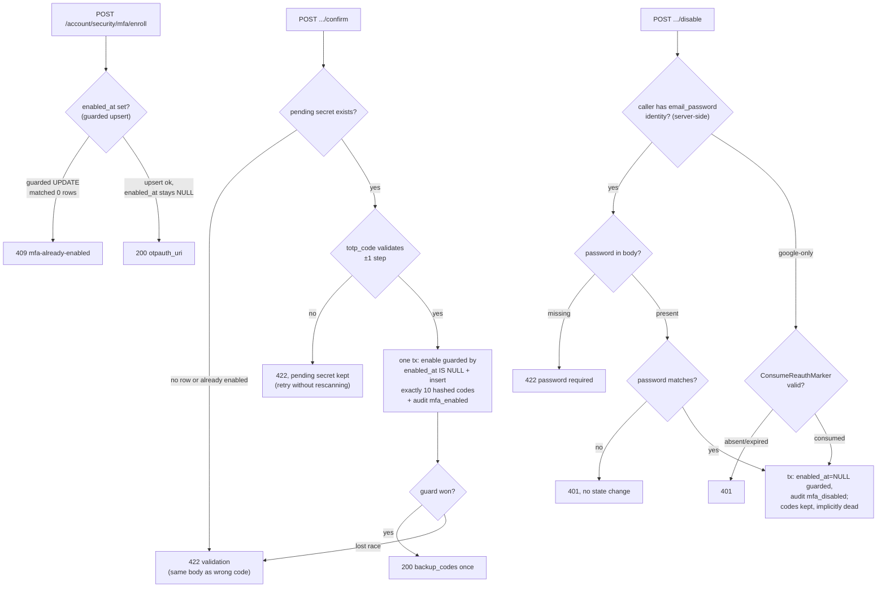

# Tech Plan: MFA TOTP Enrollment, Confirmation & Disable (account #06)

> Ticket    : account domain task #6 — `docs/spec/1-account/features/06-mfa-totp.md`
> Author    : ox-alpha (agent) — for Anhar's review
> Date      : 2026-08-27
> Updated   : 2026-08-27 — all three Open Items dispositioned (dispositions applied per Anhar's acceptance of agent recommendations); §2/§5/§6/§7/§8/§9/§10/§11/§12/§14 + Summary synced
> Status    : Approved by Anhar
> Approach  : Vertical slice adding the three `/account/security/mfa/*` endpoints: replace the fail-closed `stubMfaVerifier` with a real TOTP/backup-code verifier (Tier 0 fenced core), wire guarded enable/disable transactions behind the existing `/account/security/*` route group, and consume (not just check) the Google reauth marker
> Refs      : root + backend `AGENTS.md`; exploration logs `.local-agents/works/account/06-mfa-totp/1-explore/logs/` (8 files — note: the prompt's `~/kencleng-workspace/works/domains/...` path does not exist on disk; these logs are the raw material); `api/openapi/{index,common,account}.yaml` (sources) + `api/openapi.yaml` (generated bundle); `docs/spec/1-account/{invariants,threat-model,tasks}.md`; migrations 000007/000008 (schema-pre-settle owned by task #03 — logic only in this slice); prior precedent `.local-agents/works/account/05-account-linking/2-plan/techplan.md`; best-practices applied: `go/jwt-and-token-lifecycle`, `go/secrets-and-key-management`, `go/secrets-and-sensitive-logging`, `postgresql/encryption-at-rest`, `postgresql/audit-log-design`, `go/rate-limiting`, `postgresql/transactions-and-locking`, `go/testing-concurrency`

---

## 📋 Summary — start here

**What & why** — Login/session management (task #03) shipped with a deliberate hole: `/auth/login/mfa` consumes an `MfaVerifier` whose stub fails closed, so users cannot enroll in MFA and nobody can pass the MFA step. This slice fills that hole end-to-end: `POST /account/security/mfa/enroll` issues a `otpauth://` URI backed by an AES-GCM-encrypted secret at rest, `POST .../enroll/confirm` flips `enabled_at` behind a TOTP-proof guard and issues exactly 10 shown-once backup codes, and `POST .../disable` tears MFA down only after re-authentication (password for `email_password` callers, a consumed Google reauth marker for Google-only callers) — leaving old backup codes in place but permanently unusable per INV-account-06's implicit-invalidation decision.

**Scope**
- Real `MfaVerifier` implementation replacing the fail-closed stub (Tier 0 fenced sub-area — see section 14)
- Six new repository operations over the pre-existing `mfa_totp_secrets` / `mfa_backup_codes` tables (migrations 000007/000008 already landed; no new migrations)
- One guarded single-statement upsert that structurally cannot overwrite a live (`enabled_at`) secret — the 409-on-active-enrollment guarantee from the feature spec, enforced at write time
- `user_logs` audit entries (`mfa_enabled` / `mfa_disabled`) committed atomically with each state flip; user-facing notification deferred with the unbuilt `notification` domain (same disposition as task #05)
- New `ConsumeReauthMarker` (check **and** invalidate atomically) next to the existing task-#02 marker store
- Three handlers wired under the existing `RequireSession` + rate-limited `/account/security/*` group; real verifier injected in `cmd/server/main.go`
- One new Go dependency: `github.com/pquerna/otp`
- openapi source amended with the feature-spec-mandated enroll `409` + mechanical bundle regeneration (task-#05 D9-B precedent)

**Decision flow diagram**



**Key decisions**
- `pquerna/otp` for generation/validation (RFC 6238 defaults: SHA1, 6 digits, 30 s period, skew ±1 — authenticator-app interoperability), over hand-rolling HMAC-based TOTP
- Backup codes: 8 lowercase alphanumeric chars from `crypto/rand`, SHA-256-hashed at rest (the `auth_tokens.token_hash` pattern, not bcrypt — high-entropy random values, not user-chosen passwords); input normalized (lowercase, non-alphanumerics stripped) before hashing/comparison at every consumer
- Crypto stays at the repository-adapter boundary per `entity.go`'s doctrine — the verifier receives the **decrypted** base32 secret from the repository port; no `secret_hash` column is added because lookups key on `user_id` PK only (deliberate ciphertext-only column per `encryption-at-rest`)
- Confirm serializes through a guarded `UPDATE … WHERE enabled_at IS NULL` taken first inside the transaction (mirror of `RotateRefreshToken`'s parent-mark-then-child-insert shape); the race loser observes 0 affected rows and maps to the same 422 as any other failure
- Reauth for disable happens at the transport boundary: the handler consumes the Google marker or passes the submitted password; the service sees only `(userID, password)` and branches server-side on identity existence — `MfaDisable` stays transport-agnostic
- Audit literals `mfa_enabled`/`mfa_disabled` (new package constants; `user_logs.action_type` is unconstrained TEXT — verified — so no migration; vocabulary consolidation remains task #08's)

**Top risks**
- Re-enroll racing past a concurrent confirm could overwrite a **live** secret, silently breaking an active authenticator app → enforced structurally by the `ON CONFLICT … WHERE enabled_at IS NULL` upsert guard plus a ≥100-goroutine `-race` harness asserting zero overwrites
- Concurrent backup-code redemption double-spend → single-use redemption is one guarded SQL statement joining the enabled-check (INV-account-06 in one UPDATE), stress-tested for exactly-once `used_at`
- Hijacked-live-session disable / half-applied confirm → mandatory re-auth on disable; confirm's enable and code-insert commit-or-roll-back together in one transaction, asserted as combined post-states

**Open items needing human input** — none open; all three raised items are Resolved in section 14 (dispositions applied 2026-08-27). Remaining action is process-level: your approval of this plan, and the Tier 0 pairing session booked per Resolved #6 before code-review begins.

---

<!-- Audience boundary: above is the human-readable digest for
review/approval. Below is the full execution-grade plan — same
decisions, same scope, expanded to file/line precision, rule IDs, and
full option comparisons. Nothing below contradicts the digest above;
it's the same source of truth at higher resolution. -->

---

## 1. Background

Task #03 (login & session management) shipped the MFA-*step* machinery: `/auth/login/mfa` verifies a second factor, MFA-stage lockout keys on `user_id`, and `mfa_pending_token` minting/verification run on a dedicated HS256 secret. What it deliberately did not ship is the MFA-*lifecycle* machinery — nothing can enroll, confirm, or disable TOTP MFA. In its place sits `stubMfaVerifier` (`internal/domain/account/mfa_verifier.go`): both methods return `(false, nil)`, failing closed so no attacker can reach token issuance by submitting guesses, and so the endpoint's lockout bookkeeping was fully exercisable ahead of this task. The migrations were also pre-settled there: `mfa_totp_secrets` (000007) and `mfa_backup_codes` (000008) exist today, empty and unused except for `GetLoginUserView`'s `MFAEnabled` boolean.

Feature 06 closes the lifecycle. Its acceptance criteria pin three behaviors the current tree cannot express: (1) enrollment generates an encrypted secret and returns an `otpauth://` URI while `enabled_at` stays `NULL` — with re-enrollment **rejected (409)** once MFA is active, because a stray overwrite of a live `secret_encrypted` breaks the user's authenticator app while the system believes MFA is on; (2) confirmation requires a TOTP code proven against the pending secret (INV-account-07: no code path may set `enabled_at` without a successful verification in the same flow) and issues exactly 10 single-use backup codes returned once, hashed at rest; (3) disabling demands re-authentication — password for `email_password` callers, a short-lived server-side reauth marker (set by `GET /auth/google/redirect?intent=reauth`, built in task #02) for Google-only callers — and does **not** delete backup codes; they become permanently unusable via the enabled-check at verification time (INV-account-06's implicit-invalidation decision, knowingly-accepted residual risk §5 of the threat model).

Two facts surfaced in exploration shape this plan:

1. **The marker store checks but never consumes.** `CheckReauthMarker` (`transport/http/auth_google.go:109`) validates and sweeps expiry but leaves a valid marker in place. The feature spec requires the marker be *invalidated on use* so it cannot be replayed for a second disable. This is a genuine code-vs-spec inconsistency (recorded as such in exploration), resolved here by adding a consuming variant rather than mutating the existing checker's contract.
2. **INV-account-06's two clauses belong in one SQL statement.** Exploration identified that backup-code validity depends jointly on `used_at IS NULL` and the owner's `enabled_at IS NOT NULL` (external to the code table). Leaving the enabled-check to application-level sequencing reintroduces exactly the check-then-act race the guarded-statement philosophy exists to kill; the reconciliation below folds both clauses into the single redemption UPDATE.

## 2. Scope

**In scope:**
- `POST /account/security/mfa/enroll`, `POST /account/security/mfa/enroll/confirm`, `POST /account/security/mfa/disable` — handlers, service methods, repository methods, sentinel errors
- Real `MfaVerifier` (`totpVerifier`) replacing `stubMfaVerifier`: TOTP validation against the decrypted secret; single-use guarded backup-code redemption wired into the existing `LoginMfa` tx flow unchanged
- Repository surface: pending-secret upsert (enabled-state-guarded), secret read for verification (decrypt at the adapter), guarded enable, guarded disable, batch backup-code insert, joined guarded redemption
- Transport: three handlers extending the `securityService` seam; `MapServiceError` cases for the new sentinels; `ConsumeReauthMarker` beside the existing marker store; route registration under the existing `accountMux`
- Wiring: real verifier constructed in `cmd/server/main.go` (nil → stub fallback removed where superseded), `go.mod` dependency `github.com/pquerna/otp`
- Audit: `user_logs` rows with `action_type ∈ {mfa_enabled, mfa_disabled}` committed in the same tx as the state change
- Tests: unit suites beside each layer, testcontainers integration tests under the `integration` tag, ≥100-goroutine `-race` stress harnesses for the two race-sensitive invariants (tasks.md KPI)
- Contract artifact delta: `api/openapi/account.yaml` gains the enroll `409` response doc (amendment approved — Resolved #5); regenerate `api/openapi.yaml` via `npm run bundle`

**Out of scope (explicit):**
- User-facing notifications ("MFA berhasil diaktifkan di akunmu" etc.) — feature-spec Assumption B defers them with the unbuilt `notification` domain, exactly as task #05 did
- Login-time MFA-stage lockout behavior — specced and shipped by task #03; consumed here, not modified
- Any cleanup/housekeeping for accumulated `mfa_backup_codes` rows across disable/re-enable cycles — accepted residual risk (threat-model §5); if ever wanted, it is a standalone hard-delete task (notification-domain precedent), not slice scope
- Changes to `docs/spec/*` (human-owned per root AGENTS §4) and to openapi *sources* beyond the single approved `account.yaml` amendment above — anything else goes through you first
- Tier 0 fenced paths wholesale: `platform/auth/`, `platform/crypto/` are consumed as-is; the Tier 0 fenced *sub-area* (TOTP core) carries a dedicated authorship constraint — see section 14 and section 9
- `GET /account/me` (#7), role assignment (#8), frontend work, root infra (Caddyfile prefix gap)

## 3. Requirements

| Condition | Requirement | Source/Note |
|---|---|---|
| Authenticated caller hits `/mfa/enroll` while `enabled_at IS NULL` (or absent row) | New random TOTP secret generated, AES-GCM-encrypted at rest into `secret_encrypted` (same `platform/crypto` mechanism as all sensitive-at-rest fields — no new key scheme), `enabled_at` left `NULL`; response `200` with `otpauth_uri` | Feature AC §enroll |
| Caller re-invokes `/mfa/enroll` before confirming (abandoned/restarted enrollment) | Pending secret replaced by a fresh one; `enabled_at` remains `NULL` throughout; earlier QR silently invalidated | Feature AC §enroll; INV-account-07 makes repeated pre-enable cycles safe |
| Caller invokes `/mfa/enroll` while MFA is enabled | `409`, problem type `errors/mfa-already-enabled`, zero mutation — including if "enabled" became true concurrently with the request (write-time guard, not just a pre-read) | Feature AC §enroll; threat-table row "stray re-enroll" |
| Caller submits `/mfa/enroll/confirm` with a validating TOTP code against a pending secret | Single tx: `enabled_at` set to now via a guard matching `NULL` exactly once; exactly 10 backup codes generated, SHA-256-hashed at rest, returned in plaintext in the response once and never retrievable again; `user_logs` entry `mfa_enabled`; response `200` | Feature AC §confirm; INV-account-07 |
| Submitted confirm code fails validation | `422`, no state change — `enabled_at` stays `NULL`, pending secret survives so the user can retry without re-scanning | Feature AC §confirm |
| `/mfa/enroll/confirm` with no pending secret (never enrolled, or enrollment already confirmed) | `422` — byte-identical outcome to a wrong code; no distinguishing enumeration signal | Feature AC §confirm (self-targeting authenticated endpoint; anti-enumeration not required) |
| Two concurrent confirms on one pending enrollment | Exactly one commits (enable + its own 10 codes); the loser sees the guard match 0 rows and lands in the same `422`; backup-code count for the user ends at exactly 10, never 20 | Race-shape derived from INV-account-07's single-transition clause (synthesis; see §5 D4) |
| `email_password` caller submits correct `password` to `/mfa/disable` | `enabled_at` set back to `NULL` (guarded); `mfa_backup_codes` rows untouched — implicitly invalidated at verification time; `user_logs` entry `mfa_disabled`; `200` | Feature AC §disable; INV-account-06 implicit-invalidation decision |
| `email_password` caller submits wrong/missing `password` | Wrong → `401` no state change; missing → `422` field-required validation | Feature error table; boundary-validation precedent |
| Google-only caller calls `/mfa/disable` | Requires a currently-valid reauth marker which is **consumed on use**: valid → same outcome as the password path; absent/expired → `401`; a second disable call after consumption → `401` again | Feature AC §disable; spec's consume-on-use clause |
| Any TOTP or backup-code verification at login (`POST /auth/login/mfa`) for a user whose `enabled_at` is `NULL` | Backup codes reject **without writing `used_at`** — one guarded UPDATE carrying both clauses decides | INV-account-06 second sentence (exploration Area 2/6 reconciliation) |
| Same backup code presented twice while enabled | First redeems (`used_at` set once), second rejects | INV-account-06; tasks.md concurrency-KPI applies |

## 4. Rules & Validation

- **R1 (enroll happy path)**: Given an authenticated caller without MFA enabled, When `/mfa/enroll` is called, Then the response is `200` carrying an `otpauth://…` URI, and `mfa_totp_secrets` for the `user_id` holds a new `secret_encrypted` that decrypts to a valid base32 secret while `enabled_at` remains `NULL`. *Test proves: `TestMfaEnroll_StoresEncryptedSecret_ReturnsOtpauthURI`.*
- **R2 (enroll idempotent restart)**: Given enrollment invoked twice before any confirm, When the second completes, Then `secret_encrypted` equals the second issuance (old QR dead) and `enabled_at` is still `NULL`. *Test: `TestMfaEnroll_RestartOverwritesPendingSecret`.*
- **R3 (enroll rejected when active)**: Given `enabled_at IS NOT NULL`, When `/mfa/enroll` is called, Then `409` with problem type `https://kencleng.dev/errors/mfa-already-enabled` and `secret_encrypted` is byte-for-byte unchanged. *Test: `TestMfaEnroll_RejectsWhenAlreadyEnabled` (named per feature-spec threat table).*
- **R4 (enroll write-time guard)**: Given `/mfa/enroll` racing a concurrent confirm/disable such that the pre-read observed `enabled_at IS NULL` but the row was enabled before the upsert landed, When both complete, Then the upsert's `WHERE enabled_at IS NULL` matched 0 rows and the enroller got `409`; the live secret was never overwritten. *Test: `TestMfaEnroll_ConcurrentWithEnable_NeverOverwritesLiveSecret` (`-race` harness, part of the ≥100-goroutine suite).*
- **R5 (confirm enables — INV-account-07)**: Given a pending secret and a validating code, When confirm succeeds, Then `enabled_at` is non-null, exactly 10 `mfa_backup_codes` rows exist for the user with non-null `code_hash` and null `used_at`, the response lists the 10 plaintext codes, and a `user_logs` row `action_type='mfa_enabled'` committed in the same tx; given the confirm step is skipped/bypassed, Then no transition occurs. *Tests: `TestMfaConfirm_EnablesAndIssuesTenCodes_Audits`, `TestMfaEnroll_NoHalfEnabledState` (named per feature-spec threat table).*
- **R6 (confirm failure preserves pending)**: Given a wrong `totp_code`, When confirm is attempted, Then `422`, `enabled_at` still `NULL`, pending secret unchanged (subsequent confirm with a correct code succeeds without re-enrolling). *Test: `TestMfaConfirm_WrongCode_PreservesPendingSecret`.*
- **R7 (confirm without pending ≡ wrong code)**: Given no row or an already-enabled row, When confirm is attempted, Then the response is `422` with the identical problem shape/body as R6. *Test: `TestMfaConfirm_NoPending_IndistinguishableFromWrongCode`.*
- **R8 (concurrent confirm exactly-once)**: Given ≥100 concurrent confirms of one enrollment under `-race`, When the dust settles, Then exactly one requester received `200` with 10 codes, `enabled_at` flipped exactly once, `COUNT(mfa_backup_codes WHERE user_id)=10`, and every loser observed `422`. *Test: `TestMfaConfirm_Concurrent_ExactlyOneWinner_TenCodesTotal` (stress harness per tasks.md KPI).*
- **R9 (redemption is one guarded statement — INV-account-06)**: Given a matching unused `code_hash` for a user with `enabled_at IS NOT NULL`, When redeemed inside the caller's tx, Then exactly the first UPDATE marks `used_at`; a replayed presentation matches 0 rows; for a user with `enabled_at IS NULL` even an unredeemed matching code matches 0 rows and writes nothing. *Tests: `TestMfaBackupCode_SingleUseGuarded`, `TestMfaDisable_OldBackupCodesUnusable` (feature-spec-named; exercised from this slice's suite since only now does a real code corpus exist — naming rights stay with the spec's reference).*
- **R10 (login-path parity)**: Given `totpVerifier` swapped in for the stub, When `POST /auth/login/mfa` runs, Then existing lockout/pending-token/ordering behavior of task #03 is unchanged; a valid TOTP or backup code completes login, an invalid one records a failed `stage='mfa'` attempt. *Test: `TestLoginMfa_WithRealVerifier_CompletesAndFails` (unit-level, fake-backed verifier plus a thin real-verifier case).*
- **R11 (disable — email_password success + idempotency)**: Given a correct `password`, When disable runs, Then `enabled_at` returns to `NULL` (guarded UPDATE), backup-code rows remain with unchanged `used_at` values, `user_logs` gains `action_type='mfa_disabled'` atomically, response `200`; repeating disable with the correct password stays `200` (idempotent no-op, no duplicate audit row requirement violated). *Tests: `TestMfaDisable_Success_EmailPassword_Audits`, `TestMfaDisable_RepeatAfterDisable_Idempotent`.*
- **R12 (disable re-auth failures — email_password)**: Wrong password → `401`, zero rows changed anywhere; missing/empty password → `422` field-required Problem. *Test: `TestMfaDisable_RequiresReauth_EmailPassword` (named per feature-spec threat table), `TestMfaDisable_MissingPassword_422`.*
- **R13 (disable — Google-only marker)**: Given a Google-only caller, When disabling with a currently-valid marker, Then the marker is consumed atomically and the outcome mirrors R11; a second call finds the marker gone → `401`; missing/expired marker → `401`, zero state change. *Test: `TestMfaDisable_RequiresReauth_GoogleOnly` (named per feature-spec threat table), covering all three sub-cases.*
- **R14 (server-side provider detection)**: Given misleading body shapes (Google-only caller sending `password`, `email_password` caller sending an empty body that still parses), When disable executes, Then branching follows the server-determined identity set; extraneous fields ignored (task-#05 R6 precedent). Misleading `password` from a Google-only caller does **not** bypass the marker requirement. *Test: `TestMfaDisable_BranchSelection_ServerSide`.*
- **R15 (secret/code confidentiality)**: Across all new code paths, no log line contains the otpauth URI (embeds the secret), a plaintext or hashed backup code, a submitted TOTP code, or decrypted secret material; response bodies carry codes exactly once. *Test: `TestMfa_LogsFreeOfSecrets` (log-output scan over exercised paths, mirroring task-#05's R16 pattern); reviewed again at the code-review gate.*
- **R16 (session enforcement — inherited)**: All three routes sit under the existing `RequireSession` + rate-limited `/account/security/*` group; unauthenticated/expired/garbage tokens receive `401` before handlers execute. *Covered by re-running the existing `TestRequireSession_*` suite against the enlarged mux wiring — no new tests authored, registration asserted via `TestMfaRoutes_WiredBehindRequireSession`.*

**Count-check**: R1–R16 — every rule ID above has ≥1 corresponding item in section 12. ✓

## 5. Decision Log

### D1 — TOTP library

| Option | Why rejected/accepted |
|---|---|
| A. `github.com/pquerna/otp` | **Chosen.** De-facto Go TOTP library; `totp.Generate` (secret + otpauth URL with issuer/account) and `totp.ValidateCustom` (explicit skew control) cover everything; feature spec names it verbatim. Not yet in `go.mod` (verified) — one additive dependency; govulncheck gate covers supply-chain review per `dependency-and-supply-chain`. |
| B. Hand-rolled RFC 6238 over `crypto/hmac` + `encoding/base32` | Rejected — ~80 lines of footgun-prone novelty (encoding drift, hotp-prefix bugs) recreating what the library already proved; zero benefit for a sandbox project that treats correctness-under-review as the hard requirement. |

Interoperability parameters fixed to defaults (`SHA1, digits=6, period=30s, skew=1`): these are what mainstream authenticator apps emit; deviation buys nothing and breaks scan-and-go UX.

### D2 — Backup code material & hashing

| Option | Why rejected/accepted |
|---|---|
| A. 8 lowercase alphanumeric chars from `crypto/rand`; SHA-256 hex into `code_hash`; normalize input (strip non-alphanumerics, lowercase) before hash/compare everywhere | **Chosen.** ≈41 bits × 10 codes; guessing capped in practice by the mfa-stage lockout (≥5 fails/15 min). Matches the `auth_tokens.token_hash` discipline (hash-of-random, never plaintext at rest). Normalization lives in one package helper shared by confirm-generation, redemption, and future recovery UX. |
| B. bcrypt | Rejected — password-hardening pays off against human-chosen secrets; random per-account codes gain nothing and cost wall-clock parity complexity. |

### D3 — Where decryption happens (entity-doctrine conformance)

| Option | Why rejected/accepted |
|---|---|
| A. Repository adapter encrypts on write / decrypts on read; domain sees plaintext base32 only | **Chosen.** `entity.go` fixes the boundary: "ciphertext and HMAC hashes are storage concerns owned by the repository adapter; the service therefore never handles raw ciphertext." The verifier therefore takes the secret through the Repository port, keeping `platform/crypto` out of domain code (Tier 0 fence respected) and preserving fake-driven unit testing. |
| B. Verifier fetches `[]byte` ciphertext and calls `crypto.Decrypt` itself | Rejected — violates the stated doctrine, drags the fenced crypto primitive into `domain/account`, and splits the PII boundary across layers. |

### D4 — Confirmation serialization mechanism *(supersedes the exploration-log sketch)*

| Option | Why rejected/accepted |
|---|---|
| A. Guarded enable first (`UPDATE … SET enabled_at=now() WHERE user_id=$1 AND enabled_at IS NULL`), then insert 10 codes, one tx — loser rolls back to a generic 422 | **Chosen.** Mirrors the proven `RotateRefreshToken` parent-mark-then-child-insert shape (task #03); Postgres re-evaluates the guarded predicate after the winner commits under READ COMMITTED, so losers cannot insert orphan codes; INV-account-07's "at most once" becomes a row-count property. |
| B. Read-check-then-write (`SELECT enabled_at`, branch, update) inside the tx without predicates | Rejected — READ COMMITTED allows the two-step winner/loser interleaving this invariant class exists to prevent (`transactions-and-locking` §3); FOR UPDATE serialization works but is heavier than a single predicate UPDATE. |

### D5 — Re-enroll overwrite protection

| Option | Why rejected/accepted |
|---|---|
| A. Single upsert with a conflict-arm guard: `INSERT … ON CONFLICT (user_id) DO UPDATE SET secret_encrypted=EXCLUDED.secret_encrypted, updated_at=now() WHERE mfa_totp_secrets.enabled_at IS NULL` — 0 affected rows ⇒ `409` | **Chosen.** The whole 409-when-active guarantee collapses into one statement with no TOCTOU window; the feature spec's "stray re-enroll silently breaking a live setup" threat is structurally impossible rather than order-dependent. Novel enough to warrant the verbatim SQL in §8. |
| B. Pre-read `enabled_at`, then unconditional upsert | Rejected — exactly the race window R4 exists to close; a pre-read alone lets a concurrent confirm's enable be clobbered. |

### D6 — Reauth-marking split between transport and service

| Option | Why rejected/accepted |
|---|---|
| A. Handler consumes the Google marker / forwards the password; service branch-selection is provider-aware and sees only `(userID, password)` | **Chosen.** The marker is a transport artifact (`sync.Map` in `transport/http`); injecting it into the domain would invert the layering for no testability gain (the seam is trivially faked at the handler level either way). Service-side provider detection reuses `FindAuthIdentitiesByUser` (task-#05 pattern). |
| B. Domain-layer `ReauthChecker` dependency | Rejected — pulls an in-memory transport concept below the boundary; the closure-seam alternative (option C in exploration) adds a parameter for the one flow that doesn't need it. |

### D7 — Marker consumption semantics

Add `ConsumeReauthMarker(userID uuid.UUID) bool` using `sync.Map.LoadAndDelete` — atomic check-and-invalidate, satisfying the spec's consume-on-use clause without changing `CheckReauthMarker`'s (currently spec-looser) read-only contract; the background sweeper stays untouched. Restart-loss of markers is pre-accepted (task #02 techplan; 5-minute TTL).

### D8 — Error vocabulary & mapping

New sentinels: `ErrMfaAlreadyEnabled` (→ `409`, type `https://kencleng.dev/errors/mfa-already-enabled`), `ErrInvalidTOTPCode`, `ErrMfaNotPending` (both → `422` indistinguishable `ValidationError` per R7 — two internal reasons, one wire shape). Wrong-password disable reuses `ErrInvalidCredentials` → `401`. Missing password maps to the shared field-required validation writer. All cases land in `MapServiceError` alongside the task-#05 mappings.

### D9 — Audit literals

`actionMfaEnabled = "mfa_enabled"`, `actionMfaDisabled = "mfa_disabled"` as package constants beside `actionAccountLinking` (`google_oauth.go:44`). Verified: `user_logs.action_type` is unconstrained `TEXT` (migration 000005) — no CHECK to widen, hence **no migration in this slice**, unlike task #05's 000010. Vocabulary ownership/consolidation stays with task #08 per `entity.go`; enabling/disabling get distinct literals (mirroring Fitur 9's "MFA enable/disable" phrasing) rather than one value, since the distinction is free today and coercion later would require a data rewrite.

### D10 — openapi source amendment for the enroll 409 *(Open Item 1 disposition — accepted, Anhar 2026-08-27)*

| Option | Why rejected/accepted |
|---|---|
| A. Amend `account.yaml` in-slice (+ `npm run bundle`, delta flagged in the PR description) | **Chosen.** The 409 is settled truth (feature-spec Assumption A); regeneration is a mechanical task-#05-precedent step; deferring only adds drift round-trips. Human veto preserved at PR review — not a silent contract pick. |
| B. Hand Anhar a prepared diff, ship handler against feature spec regardless | Rejected as default — same endpoint state either way; option A collapses an approval cycle into standard review. Standby fallback if the amendment shape itself gets contested at PR review. |

### D11 — `otpauth://` account-name label *(Open Item 2 disposition — accepted, Anhar 2026-08-27)*

| Option | Why rejected/accepted |
|---|---|
| A. Plaintext primary email via the existing `GetLoginUserView` decrypt path | **Chosen.** Industry-standard authenticator-app labeling (decisive with multiple accounts per app); exposure surface self-only (URI in the owner's response, never logged per R15). Later migration would propagate only on re-enroll — accepted stickiness now that it's decided deliberately. |
| B. `users.name` | Rejected — mutable and ambiguous across users (labels collide or mislead after renames); saves no meaningful work since the decrypt path is already exercised on the enroll route. |
| C. `user_id` string | Rejected — opaque label garbage in app UIs; zero-decrypt benefit not worth permanent UX tax. |

### D12 — Tier 0 pairing checkpoint slotting *(Open Item 3 disposition — accepted, Anhar 2026-08-27)*

Pairing gates between **build-complete and code-review**: build lands `totpVerifier` bodies clearly marked draft-for-pairing, unit/integration suites pass against the draft first (tests double as the review harness), then the human-paired rewrite covers the crypto-bearing bodies before stage 4 reviews post-pairing code. Fallback if preferred instead: full self-authoring by Anhar from the interface contract (agent stops at scaffolding + fake-verifier tests). Blocks merge, not scaffold progress.

## 6. Backward Compatibility

- **Database**: none changed — 000007/000008 predate this slice (empty tables, no existing data to migrate or backfill). `updated_at` trigger on `mfa_totp_secrets` fires on the upsert path; down migrations already exist and remain reversible.
- **API**: purely additive — three new endpoints. `GET /account/me`, login, refresh, and all other surfaces untouched. The `securityService` interface grows additively (compile-time sealed by the concrete `*account.Service`). The one *documentation* delta is also additive: `api/openapi/account.yaml` documents the enroll `409` the handler has always been required to return (feature-spec-mandated), and the generated bundle is refreshed mechanically — no wire behavior changes versus any prior spec reading.
- **Existing clients**: none consume these endpoints (they don't exist). `POST /auth/login/mfa` clients observe one behavioral change only after a user voluntarily enrolls: responses shift from universal `mfa_required`-then-fail-closed to actual completions — strictly capability-enabling, never breaking.
- **Wiring risk acknowledged**: swapping the stub for the real verifier activates MFA completion system-wide. There is no feature flag beyond construction-time injection; mitigation is that enrollment requires the user's own authenticated opt-in — no population can trip into MFA unexpectedly.
- **Deprecation path**: none needed. The stub disappears with this slice (its TODO names task #06 explicitly); nothing external references it.

## 7. Edge Cases & Risks

| Risk | Likelihood | Severity | Mitigation |
|---|---|---|---|
| Re-enroll/upsert races past a concurrent confirm and overwrites a **live** secret → authenticator apps break while the system reports MFA enabled | Low (guarded design) | **High** — silent factor-bypass of a user's active second factor | Conflict-armed upsert (D5); R4's `-race` ≥100-goroutine harness asserts zero overwrites of enabled rows |
| Concurrent backup-code redemption double-spends one code (two logins, one `used_at`) | Low (single guarded statement) | **High** — breaks INV-account-06 exactly-once at the auth boundary | Redemption is one UPDATE carrying `used_at IS NULL` + the join to `enabled_at IS NOT NULL` (§8); R8/R9 stress suites assert end-state counts, per `testing-concurrency`'s invariant-not-"didn't-crash" bar |
| Confirm commits `enabled_at` without codes, or codes without enable (mid-tx failure classes) | Very low (single tx) | **High** — half-enabled state is precisely INV-account-07's prohibition | Both writes in one transaction behind the guarded enable-first ordering (D4-A); R5/R8 assert combined post-states including forced-failure rollback probes |
| Encryption-key loss renders all `secret_encrypted` undecryptable → permanent MFA lockout for enrolled users | Very low | Medium — accepted residual, same class as PII-key loss already accepted for the domain | No new key scheme (feature-spec mandate); recovery path is manual (key restore → else DB-assisted disable); documented here rather than solved with an escrow anti-pattern |
| Decryption of a stored secret fails (corruption/wrong key) during login verification | Very low | Medium — legitimate users hard-fail MFA step | Verifier returns `(false, err)`; internal error surfaces as generic 5xx-class handling upstream, never leaked detail; the failed attempt still records for observability (fail-safe direction) |
| Unthrottled confirm attempts spray TOTP guesses against a self-initiated pending enrollment | Low | Low–Medium — bounded blast radius | Only meaningful when the caller is already authenticated AND a pending enrollment exists; wrong-code path mutates nothing; general `/account/*` rate limiter (eviction-checked, `rate-limiting` checklist satisfied by reuse) bounds spray rate; no bespoke counter — revisit only with evidence |
| Google-only user disabled MFA while a stolen marker (<5 min) is in flight | Low | Medium — one-shot window by design | Marker consumed on first use (D7) — replay impossible; TTL short; same accepted exposure as the unlink re-auth decision (task #05 threat table) |
| User loses authenticator + all unused backup codes post-enrollment | Product-level inevitability | Low (sandbox scope) | Explicitly out of scope — no admin reset path exists in v1 spec; noted for future recovery-flow work, not silently buried |
| `pquerna/otp` supply-chain regression | Low | Low | Version pinned in `go.mod`; govulncheck gate runs in `make verify`; Tier 0 pairing covers the exact call sites |
| Stale `openapi.yaml` bundle drifts further once account.yaml gains the 409 | Medium if unbundled | Medium — tooling trusts the bundle | Bundle regeneration rides the same mechanical `npm run bundle` fix task-#05 applied; amendment dispositioned (Resolved #5, 2026-08-27) so no approval remains between edit and regen |

## 8. Interface Contract

Repo conventions honored here (root + backend AGENTS.md): money N/A (no monetary fields); all SQL parameterized via goqu prepared statements — never string-built; client-facing errors only via RFC 9457 Problem Details from `api/openapi/`; PII/at-rest policy: `secret_encrypted` is **deliberately ciphertext-only** — no `*_hash` companion column because lookups/uniqueness key exclusively on the `user_id` primary key (per `encryption-at-rest`'s "which columns need HMAC lookup vs ciphertext-only is deliberately decided" checklist — recording the decision explicitly to preempt review confusion); authorization explicit at the boundary: `userID` derives from the session context, never from a request parameter.

**DB Schema changes:** none (migrations 000007/000008 pre-settled by task #03; verified columns/indexes: `mfa_totp_secrets(user_id PK, secret_encrypted BYTEA, enabled_at TIMESTAMPTZ, updated_at trigger)`, `mfa_backup_codes(id UUID PK, user_id FK, code_hash TEXT, used_at TIMESTAMPTZ, ix_mfa_backup_codes_unused partial WHERE used_at IS NULL)`).

Critical statements (expressed as contract, implemented via goqu):

```sql
-- D5: conflict-armed pending-secret upsert (single statement, no TOCTOU)
INSERT INTO mfa_totp_secrets (user_id, secret_encrypted, created_at)
VALUES ($1, $2, now())
ON CONFLICT (user_id) DO UPDATE
    SET secret_encrypted = EXCLUDED.secret_encrypted,
        updated_at       = now()
    WHERE mfa_totp_secrets.enabled_at IS NULL;
-- 0 rows affected ⇒ MFA is (now) enabled ⇒ service maps to ErrMfaAlreadyEnabled (409)

-- D4: guarded enable (first statement of the confirm tx)
UPDATE mfa_totp_secrets SET enabled_at = now(), updated_at = now()
 WHERE user_id = $1 AND enabled_at IS NULL;

-- INV-account-06 folded into one redemption statement (runs inside LoginMfa's caller tx)
UPDATE mfa_backup_codes bc
   SET used_at = now()
  FROM mfa_totp_secrets s
 WHERE s.user_id      = bc.user_id
   AND bc.user_id     = $1
   AND bc.code_hash   = $2          -- sha256(normalize(code))
   AND bc.used_at     IS NULL
   AND s.enabled_at   IS NOT NULL;  -- implicit invalidation lives HERE, not app-side

-- guarded disable (idempotent repeat-safe)
UPDATE mfa_totp_secrets SET enabled_at = NULL, updated_at = now()
 WHERE user_id = $1 AND enabled_at IS NOT NULL;
```

**API changes** (from `api/openapi/account.yaml` sources — the 409 is amended into the source in this slice per D10):

```yaml
/account/security/mfa/enroll:            # POST, bearerAuth
  200: MfaEnrollResponse{otpauth_uri}    # implemented as specced
  # + 409 Problem errors/mfa-already-enabled  ← REQUIRED BY FEATURE SPEC;
  #    amended into source this slice (Resolved #5)
/account/security/mfa/enroll/confirm:    # POST, body {totp_code}
  200: MfaEnrollConfirmResponse{backup_codes[10]}
  422: ValidationError                   # wrong code OR no pending — identical shape (R7)
/account/security/mfa/disable:           # POST, optional body {password}
  200: {message}                         # both re-auth paths
  401: Unauthorized                      # wrong password / marker absent-consumed-expired
  # + 422 field-required                 # email_password caller, empty body (transport boundary)
```

**Business logic flow (concise):**

```
MfaEnroll(ctx, userID):
  base32 := pquerna totp.Generate(issuer:"Kencleng", account:<primary_email via GetLoginUserView>)  # D11
  rows := UpsertPendingMFASecret(userID, Encrypt(base32))   # D5 guard
  rows == 0 -> ErrMfaAlreadyEnabled
  return base32.URL()                                        # NEVER logged (R15)

MfaEnrollConfirm(ctx, userID, code):
  rec := GetMFATOTPSecretForVerify(userID)                   # adapter decrypts (D3)
  !found || rec.EnabledAt != nil -> ErrMfaNotPending         # ≡ ErrInvalidTOTPCode on the wire (R7)
  ValidateCustom(DecryptIn(rec.SecretPlain), code, skew±1)?  # pure compute
  false -> ErrInvalidTOTPCode                                # pending survives (R6)
  tx {
     ok := EnableMFATOTPIfPending(tx, userID)                # guarded-first (D4-A)
     !ok -> rollback; ErrMfaNotPending                       # lost race (R8)
     InsertMFABackupCodes(tx, 10× {ID, UserID, CodeHash})    # hashes of normalized plains
     InsertUserLog(tx, {action_type:"mfa_enabled"})
  } commit -> return plains                                  # response-only, shown once

MfaDisable(ctx, userID, password):
  identities := FindAuthIdentitiesByUser(userID)             # server-side branch (R14)
  if has email_password identity:
     password == "" -> ErrValidation(422 required)           # transport-visible field rule
     compare(storedBcrypt, password) != nil -> ErrInvalidCredentials  # 401, CPU burned either way
  else:                                                      # Google-only — marker consumed at HANDLER (D6);
                                                             # reaching here means reauth passed
  tx {
     SetMFADisabledIfEnabled(tx, userID)                     # guarded; 0 rows ⇒ idempotent 200 (R11)
     InsertUserLog(tx, {action_type:"mfa_disabled"})         # skip audit entry on 0-row no-op
  } commit -> 200                                            # codes untouched, implicitly dead (R9)

Transport delta (MfaDisableHandler only):
  body.password empty && caller google-only -> ConsumeReauthMarker(userID)? proceed : 401
  (marker state never crosses into the domain service)
```

External-call discipline: no network calls inside any open transaction (nothing here sends mail post-commit either — notification deferred outright).

## 9. Architecture / Plan

Execution order:

1. **Dependency**: add `github.com/pquerna/otp` to `go.mod` (pin); `go mod tidy`.
2. **Entity types** (`entity.go`): `MFABackupCode{ID, UserID, CodeHash, CreatedAt}` (storage shape). No ciphertext-bearing secret entity — the read port returns decrypted material (D3), so the secret travels as a value, not a persisted struct in domain hands.
3. **Repository layer**: six port methods in `repository.go` (doc comments per house style) + goqu implementations in `repository_db.go`: `UpsertPendingMFASecret`, `GetMFATOTPSecretForVerify`, `EnableMFATOTPIfPending`, `SetMFADisabledIfEnabled`, `InsertMFABackupCodes`, `RedeemMFABackupCode` (all tx-taking where the caller's tx semantics demand it; `(nil,nil)`/`(false,err)`-on-absent conventions preserved).
4. **Domain — Tier 0 core, draft-for-pairing**: `mfa_verifier.go`'s real implementation (`totpVerifier{repo, keys}` + `NewMfaVerifier(repo, keys)`) replaces the stub. Per D12's sequencing: build produces complete crypto-bearing bodies marked **draft-for-pairing**, with all suites passing against them; the human-paired rewrite (tasks.md Tier-0-sub-area KPI) then runs **before the code-review stage** — review sees post-pairing code. Gates merge, not scaffold progress.
5. **Domain — service methods**: new `internal/domain/account/mfa.go` hosting `MfaEnroll` / `MfaEnrollConfirm` / `MfaDisable`, the three sentinels, backup-code generate/normalize helpers, and audit constants; unit tests beside it.
6. **Transport**: extend `securityService`; add the three handlers in `account_security.go`; add `ConsumeReauthMarker` in `auth_google.go`; extend `MapServiceError` (`errors.go`).
7. **Wiring**: `cmd/server/main.go` — construct the real verifier (replacing the `nil` placeholder at line 133), register the three routes on `accountMux`; dev Swagger/OpenAPI surface reflects the amended source automatically.
8. **Contract artifact delta** (D10): amend `api/openapi/account.yaml` with the enroll `409` response, regenerate the bundle (`cd api && npm run bundle`), commit both — sources edit and mechanical regen travel together; verify bundler does not drop components (task-#05 D9-B STOP condition).
9. **Tier 0 pairing checkpoint** (D12): Anhar rewrites/approves the `totpVerifier` crypto-bearing bodies against the passing suites; recorded before code-review begins.
10. **Integration & race suite**: testcontainers coverage for the DB-level truths (guarded statements behave under real Postgres contention); `-race` harnesses per R4/R8/R9.

Migration strategy: N/A — explicitly none; the slice owns table *logic* only (tasks.md migration-ownership note, D1-C lineage).

## 10. Implementation Details

**File**: `backend/internal/domain/account/entity.go`
- Change: append `MFABackupCode` struct (ID, UserID, CodeHash string, CreatedAt time.Time). Deliberately no `MFATOTPSecret` persisted-entity — see D3. Doc comments note ciphertext-ownership at the adapter.

**File**: `backend/internal/domain/account/repository.go`
- Change: add six methods with full doc comments, including the guarded-semantics contracts (which predicate guards which statement, what ok=false means):
  - `UpsertPendingMFASecret(ctx context.Context, userID uuid.UUID, secretCiphertext []byte) (inserted bool, err error)`
  - `GetMFATOTPSecretForVerify(ctx context.Context, userID uuid.UUID) (secretBase32 string, enabledAt *time.Time, found bool, err error)` — adapter decrypts internally (D3)
  - `EnableMFATOTPIfPending(ctx context.Context, tx pgx.Tx, userID uuid.UUID) (ok bool, err error)`
  - `SetMFADisabledIfEnabled(ctx context.Context, tx pgx.Tx, userID uuid.UUID) (disabled bool, err error)`
  - `InsertMFABackupCodes(ctx context.Context, tx pgx.Tx, codes []MFABackupCode) error`
  - `RedeemMFABackupCode(ctx context.Context, tx pgx.Tx, userID uuid.UUID, codeHash string) (redeemed bool, err error)` — must carry BOTH INV-account-06 clauses (§8 SQL is the contract)

**File**: `backend/internal/domain/account/repository_db.go`
- Change: implementations via `pgDialect.Insert/Update` prepared statements; the `ON CONFLICT … DO UPDATE … WHERE` and joined-redemption forms encoded through goqu's upsert/`Returning` capabilities (fallback: `tx.Exec` with a goqu-generated parameterized literal if the builder chokes on the conflict-arm predicate — flagged honestly at build, still parameterized either way). Nullable scans follow the established `sql.Null*` pattern.

**File**: `backend/internal/domain/account/mfa_verifier.go`
- Change: remove `stubMfaVerifier` (TODO fulfilled); add `totpVerifier` implementing `MfaVerifier` — `VerifyTOTP` reads through the repository port, computes via `totp.ValidateCustom`; `VerifyBackupCode` normalizes + hashes then calls `RedeemMFABackupCode` inside the caller-supplied tx. Plus `NewMfaVerifier(repo Repository, keys *crypto.Keys) MfaVerifier`. **Tier 0 pairing checkpoint attaches to exactly these bodies.**

**File**: `backend/internal/domain/account/mfa.go` (new)
- Change: `func (s *Service) MfaEnroll(ctx context.Context, userID uuid.UUID) (string, error)` — sources the D11 label email via the existing `s.repo.GetLoginUserView(userID)` decrypt path (no new repo surface for it); `func (s *Service) MfaEnrollConfirm(ctx context.Context, userID uuid.UUID, totpCode string) ([]string, error)`; `func (s *Service) MfaDisable(ctx context.Context, userID uuid.UUID, password string) error`. Sentinels `ErrMfaAlreadyEnabled`, `ErrInvalidTOTPCode`, `ErrMfaNotPending`; helpers `generateBackupCodes(n int) ([]string, error)`, `normalizeBackupCode(string) string`; constants `backupCodeCount = 10`, `actionMfaEnabled`, `actionMfaDisabled`, `otpauthIssuer = "Kencleng"`. Load-bearing literals as named constants per repo style.

**File**: `backend/internal/domain/account/service.go`
- Change: none required — `mfa` field and constructor wiring already accept a verifier; production main swaps `nil` → `NewMfaVerifier(...)`. `stubMfaVerifier` default retained in `NewService` only as the nil-input safety net (tests constructing bare structs keep working), now unreachable in production wiring.

**File**: `backend/internal/transport/http/account_security.go`
- Change: extend `securityService` with the three signatures; add `MfaEnrollHandler`, `MfaEnrollConfirmHandler` (decode → required-field validation → service → Map), `MfaDisableHandler` — decode tolerating empty body; when password is empty, ask the account layer whether the caller is Google-only **via the service result path** (R14 keeps branch selection server-side; the handler's sole transport duty is the marker consume for the passwordless call, per D6) — final handler/service choreography settled at build with the constraint pinned by R13/R14.

**File**: `backend/internal/transport/http/auth_google.go`
- Change: `ConsumeReauthMarker(userID uuid.UUID) bool` via `LoadAndDelete` + expiry re-check; doc comment noting it fulfills the feature-06 consume-on-use clause. Existing functions untouched.

**File**: `backend/internal/transport/http/errors.go`
- Change: `MapServiceError` gains the `ErrMfaAlreadyEnabled` → 409 (type `https://kencleng.dev/errors/mfa-already-enabled`) case and routes the two 422-sentinels to the shared validation writer.

**File**: `backend/cmd/server/main.go`
- Change: `mfaVerifier := account.NewMfaVerifier(account.NewRepositoryDB(pool, keys), keys)` passed into `account.NewService(...)` replacing the bare `nil` (line 133); three `accountMux.HandleFunc("POST /account/security/mfa/...", ...)` registrations.

**File**: `backend/go.mod` / `go.sum`
- Change: `require github.com/pquerna/otp vX.Y.Z` (latest stable at build; govulncheck-gated).

Full function bodies deliberately omitted (guardrail §7) — §8's SQL and flow blocks are the one novel-logic artifact worth keeping verbatim.

## 11. Files Changed / Files NOT Changed

| File | Change Type | Description |
|---|---|---|
| `backend/internal/domain/account/entity.go` | modified | +`MFABackupCode` struct |
| `backend/internal/domain/account/repository.go` | modified | +6 port methods |
| `backend/internal/domain/account/repository_db.go` | modified | +6 goqu implementations |
| `backend/internal/domain/account/mfa_verifier.go` | modified | stub → real `totpVerifier` (**Tier 0 paired**) |
| `backend/internal/domain/account/mfa.go` | new | enroll/confirm/disable services, sentinels, code helpers, audit constants |
| `backend/internal/domain/account/mfa_test.go` | new | unit suites R1–R8, R11–R15 |
| `backend/internal/domain/account/mfa_integration_test.go` | new | testcontainers: guarded statements under contention, redemption joins (`//go:build integration`) |
| `backend/internal/domain/account/login_test.go` | modified | R10 real-verifier parity cases |
| `backend/internal/transport/http/account_security.go` | modified | +3 handlers, extended seam |
| `backend/internal/transport/http/account_security_test.go` | modified | handler-contract + marker-consumption tests |
| `backend/internal/transport/http/auth_google.go` | modified | +`ConsumeReauthMarker` |
| `backend/internal/transport/http/errors.go` | modified | +sentinel mappings |
| `backend/cmd/server/main.go` | modified | verifier wiring + route registration |
| `backend/go.mod`, `backend/go.sum` | modified | +`pquerna/otp` |
| `api/openapi/account.yaml` | modified | +enroll `409` response doc (D10 amendment, approved) |
| `api/openapi.yaml` | regenerated | mechanical bundle refresh (`npm run bundle`) |

| File | Reason untouched |
|---|---|
| `backend/.env.example` | Zero new env vars — issuer is a compile-time constant |
| `backend/migrations/**` | 000007/000008 pre-settled; verified no new schema need (incl. unconstrained `action_type`) |
| `backend/internal/platform/auth/**` | Tier 0 fenced; mfa_pending token machinery from task #03 consumed as-is |
| `backend/internal/platform/crypto/**` | Tier 0 fenced; consumed via existing `Encrypt`/`Decrypt` at the adapter |
| `backend/internal/platform/notification/**` | No new sender types — notifications deferred (out of scope) |
| `backend/internal/domain/account/login.go` | Consumer of `MfaVerifier`; its orchestration/lockout/ordering logic unchanged (R10 asserts parity only) |
| `backend/internal/domain/account/security.go`, `google_oauth.go` | Orthogonal flows; constants they export remain authoritative |
| `backend/internal/domain/donation/**`, `disbursement/**` | Tier 0 fenced, unrelated domains |
| `docs/spec/**` | Agent-edit prohibited (root AGENTS §4); gaps reported, not patched |
| `api/openapi/{index,common}.yaml` | No shape changes needed — only `account.yaml` carries the D10 amendment |
| `frontend/**` | Directory boundary (root AGENTS §7) |
| root `Caddyfile` | Known infra gap, root-level session |

## 12. Testing Checklist

Derived 1:1 from section 4 (count-check R1–R16 passed):

- [ ] R1 `TestMfaEnroll_StoresEncryptedSecret_ReturnsOtpauthURI` — unit + integration row assertions (decryptable round-trip, `enabled_at` NULL)
- [ ] R2 `TestMfaEnroll_RestartOverwritesPendingSecret` — second issuance replaces first; old URI dead
- [ ] R3 `TestMfaEnroll_RejectsWhenAlreadyEnabled` — 409, problem-type URI, `secret_encrypted` byte-unchanged
- [ ] R4 `TestMfaEnroll_ConcurrentWithEnable_NeverOverwritesLiveSecret` — interleaved enroll×{confirm,disable}, `-race`, ≥100 goroutines, zero enabled-row overwrites
- [ ] R5 `TestMfaConfirm_EnablesAndIssuesTenCodes_Audits` + `TestMfaEnroll_NoHalfEnabledState` — enabled flip, exactly-10 codes, plaintext shown once, `mfa_enabled` audit in-tx; skipped-verify path leaves NULL
- [ ] R6 `TestMfaConfirm_WrongCode_PreservesPendingSecret` — 422, retry-without-rescan subsequently succeeds
- [ ] R7 `TestMfaConfirm_NoPending_IndistinguishableFromWrongCode` — byte-identical 422 bodies
- [ ] R8 `TestMfaConfirm_Concurrent_ExactlyOneWinner_TenCodesTotal` — ≥100 goroutines, `-race`, end-state invariants
- [ ] R9 `TestMfaBackupCode_SingleUseGuarded` + `TestMfaDisable_OldBackupCodesUnusable` — replay rejects; disabled-owner codes reject with zero `used_at` writes; integration proves the joined UPDATE under real Postgres
- [ ] R10 `TestLoginMfa_WithRealVerifier_CompletesAndFails` — lockout bookkeeping & pending-token flow unchanged with the real verifier
- [ ] R11 `TestMfaDisable_Success_EmailPassword_Audits` + `TestMfaDisable_RepeatAfterDisable_Idempotent` — guarded disable, codes kept, `mfa_disabled` audit, idempotent repeat
- [ ] R12 `TestMfaDisable_RequiresReauth_EmailPassword` + `TestMfaDisable_MissingPassword_422` — 401-no-change / 422-required matrix
- [ ] R13 `TestMfaDisable_RequiresReauth_GoogleOnly` — valid-consumed / second-call-401 / absent-or-expired-401
- [ ] R14 `TestMfaDisable_BranchSelection_ServerSide` — misleading-body matrix both directions (incl. password-from-Google-only ≠ bypass)
- [ ] R15 `TestMfa_LogsFreeOfSecrets` — log-output scan: no otpauth URI, codes, TOTP inputs, secrets
- [ ] R16 `TestMfaRoutes_WiredBehindRequireSession` — routes registered under the guarded group; existing `TestRequireSession_*` re-run untouched

Gate commands (repo-defined, backend AGENTS §4): `make verify` (lint → unit → race → contract → security-A → integration) exits 0; ≥80% coverage on new/changed lines; audit-value tests assert exact `action_type` literals per tasks.md KPI; Tier-0 pairing sign-off recorded at the D12 checkpoint (post-build, pre-code-review).

## 13. Testing Examples & Common Mistakes

| Mistake | Error/Behavior | Fix |
|---|---|---|
| Pre-read `enabled_at` then unconditionally upsert (skipping the conflict-arm guard) | Concurrent confirm's live secret clobbered; authenticator apps die (R4's exact scenario) | The `WHERE enabled_at IS NULL` arm is load-bearing — treat the §8 SQL as contract, not suggestion |
| Enabled-check done in Go beside the redemption query | Disabled-owner's code still burns `used_at` (written then invalidated late) — corrupts INV-account-06 accounting and races | Fold `JOIN mfa_totp_secrets … enabled_at IS NOT NULL` into the redemption UPDATE |
| Codes inserted before the guarded enable in the confirm tx | Loser path could persist orphan codes against a foreign enable | Enable-first inside the tx; codes ride the winner's commitment only (D4-A) |
| Distinct error bodies for "wrong code" vs "no pending secret" | Free enumeration signal for zero benefit on a self-targeting endpoint | Collapse to identical `422` ValidationError (R7) |
| Consuming the marker inside the domain service | Transport state crosses the layer boundary; fakes proliferate; D6 inverted | Handler consumes; service receives credentials-as-data only |
| Logging the otpauth URI "for debugging" (contains the secret verbatim) | Full factor compromise via log tail | R15 scanner forbids it; log `user_id` + outcome only |
| Naïve `bcrypt.CompareHash` for backup codes / skipping normalization | Hash mismatch on `ABCD-EFGH` vs `abcdefgh` inputs; pointless CPU cost | One normalize→sha256 path shared by generator and verifier (D2) |
| Treating `INSERT … ON CONFLICT` row-count 0 as an error | It's the designed 409 signal (active MFA), not a driver fault | Map explicitly to `ErrMfaAlreadyEnabled`; distinguish from real exec errors |
| Double-auditing on idempotent repeat-disable | Noise rows conflate "attempted" with "changed" | Skip the audit write when the guarded disable affects 0 rows (R11) |
| Asserting race outcomes with sleeps / thread-count only | Violations pass unnoticed under scheduler variance | End-state invariants (row counts, transition counts) on ≥100-goroutine runs under `-race` — per `testing-concurrency` |

## 14. Open Items

Lifecycle per rules.md § 8. Zero Active; seven Resolved.

### Active — need external input or verification

(none — all three raised items dispositioned 2026-08-27; see Resolved #5–#7)

### Resolved (kept for reference)

1. ~~**Reconciliation: exploration area 2 vs stage-3 draft on the enabled-check location**~~ **RESOLVED — during synthesis (rules.md § 2, most-specific-wins): the two INV-account-06 clauses fold into the single redemption UPDATE** (joined `FROM mfa_totp_secrets`), superseding both the "verifier does it in two steps" sketch and the stage-3 two-method reading. Consequence: `RedeemMFABackupCode`'s contract is the §8 statement verbatim; R9 pins it.
2. ~~**Marker consume-on-use inconsistency**~~ **RESOLVED — D7:** new `ConsumeReauthMarker` (`LoadAndDelete` + expiry recheck) added beside the untouched `CheckReauthMarker`; the feature-spec clause is met without changing the existing checker's contract. Consequence: two exported marker functions coexist; sweeper unchanged.
3. ~~**Is a migration needed for new `user_logs.action_type` values?**~~ **RESOLVED — verified no:** `action_type` is unconstrained `TEXT` (migration 000005); unlike task #05's 000010 CHECK widening, this slice ships DDL-free. Consequence: file-changed table lists no migrations; task #08 retains vocabulary ownership.
4. ~~**Independent-lifecycle evaluation (rules.md § 3)**~~ **RESOLVED — none:** no cron/backfill/rollback component exists (code accumulation across re-enroll cycles is the deliberately-accepted residual, threat-model §5; a future housekeeping job would be a separate linked doc per precedent). Techplan stays single-document.
5. ~~**openapi source lacks the enroll `409`**~~ **RESOLVED — amend in-slice accepted (Anhar, 2026-08-27, agent recommendation).** Verified gap: `account.yaml:481-492` documents only `200` for `/mfa/enroll` while the feature spec's error table mandates `409`. Disposition (D10): the amendment + mechanical `npm run bundle` regeneration land with this slice, delta flagged in the PR description for standard review veto. Consequence: no approval remains between spec edit and regen; handler↔spec match re-verified at code-review gate per `openapi-spec-first-drift`.
6. ~~**`otpauth://` account-name label**~~ **RESOLVED — plaintext primary email accepted (Anhar, 2026-08-27, agent recommendation; D11).** Sourced via the existing `GetLoginUserView` decrypt path at enroll time (§10 note); alternatives rejected: `users.name` (mutable/ambiguous), `user_id` (opaque UX). Consequence: label migration later propagates only via user re-enrollment — stickiness deliberately accepted now that it's an explicit decision; exposure remains self-only and R15-forbidden-in-logs.
7. ~~**Tier 0 pairing checkpoint scheduling**~~ **RESOLVED — slot between build-complete and code-review accepted (Anhar, 2026-08-27, agent recommendation; D12).** Build lands `totpVerifier` bodies marked draft-for-pairing with passing suites; Anhar pairs/rewrites the crypto-bearing core before stage 4 reviews post-pairing code. Consequence: merge gate blocked until sign-off; scaffold progress unblocked; fallback (full self-authoring from the interface contract) recorded if preferred at session time.

---

*Synthesis note:* stage-3 solutioning sketches (raw log `stage3-solutioning.md`) were treated as input, not gospel — D4/D5's guarded-SQL mechanisms, D3's doctrine conformance, the 409 contract gap, and the §3-N/A evaluation all emerged from cross-checking those drafts against the actual tree (`mfa_verifier.go` doc comments, `repository.go` conventions, migration DDL, openapi sources) per retro lessons 1-2. Nothing in the digest departs from sections 1-13; where the drafts were less specific than the tree, the tree won.*
