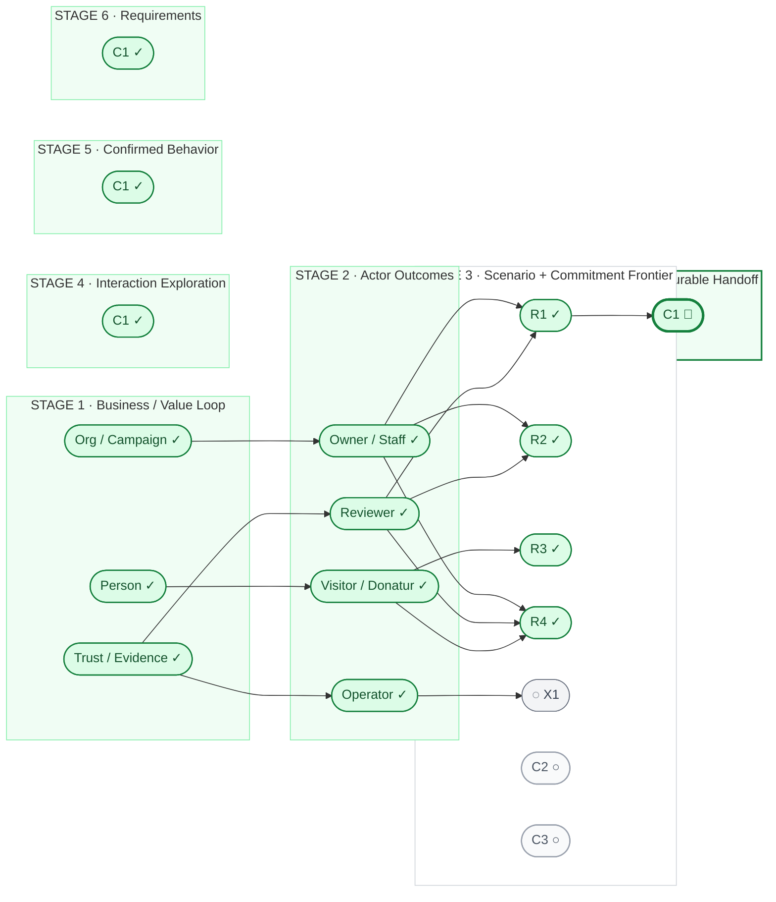

# Kencleng Pilot #3 — Control Tower

> **CONTROL TOWER / PROGRESS VIEW — NOT PRODUCT AUTHORITY**  
> This dashboard visualizes current position, lineage, dependency, readiness, and progress.  
> Owning Product / working artifacts remain authoritative for meaning and decisions. If this dashboard conflicts with an owning artifact, the owning artifact wins.
>
> **Status:** Experimental living dashboard for Pilot #3  
> **Working baseline:** `pilot/3-clean-delivery-baseline`

## Control Tower

Read left → right as product maturity / progression.

- **Stage areas are stations.**
- **Nodes are tracked product-work pointers.**
- **Commitments are the nodes that can travel from Stage 3B through Stage 4–7.**
- An ELIGIBLE commitment stays physically in Stage 3B until Stage 4 actually begins.
- A **READY** rail means it may depart; it does not mean it already moved.



### Signal legend

| Signal | Dashboard meaning |
| --- | --- |
| ✓ COMPLETE | Output is sufficiently complete for progression |
| ▶ ACTIVE | Currently being worked through |
| 🏁 ROUTE COMPLETE | Commitment has completed the Stage 4–7 pre-engineering route |
| ◆ ELIGIBLE | Commitment may enter Stage 4–7 now |
| ⛔ BLOCKED | A material semantic / product blocker remains, when established by an owning artifact |
| ⏳ WAITING | A material dependency must become real first, when established by an owning artifact |
| ○ PARKED | Tracked frontier placeholder; not currently re-gated / sequenced |
| ◌ PROBE | Cross-cutting exceptional probe; node type, not progress status |

### Rail legend

```text
────────▶  derivation / actual progression
- - - - ▶  product dependency
- READY ▶  eligible to enter the next station; not moved yet
·······▶  feedback / reopen when materially new evidence appears
```

## C1 end-to-end lifecycle

These are lifecycle fields, **not additional pre-engineering stages**.

| Lifecycle concern | Dashboard state | Owning artifact / evidence |
| --- | --- | --- |
| Overall C1 commitment | **IN PROGRESS / NOT COMPLETE** | [Stage 7 handoff](./pilot-3-stage-7-c1-engineering-handoff.md) defines the current handoff boundary |
| Pre-engineering route | **🏁 COMPLETE** | Stage 7 handoff |
| Engineering | **IN PROGRESS — READY FOR HUMAN DISPATCH** | Exploration Run `RUN-C1-ENG-EXPLORATION-001` complete; Techplan Run `RUN-C1-ENG-TECHPLAN-001` prepared and its gated model approved for this Run |
| Independent cold-start handoff validation | **COMPLETE FOR THIS C1 TASK** | Stage 2 evidence shows a fresh reader reconstructed the task, authority route, scoped behavior, engineering decision space, and exclusions; this does not verify product behavior or generalize beyond this task |
| Verified real-product C1 behavior | **NOT YET VERIFIED** | Future implementation / testing / delivery evidence |
| Overall C1 completion | **NOT COMPLETE** | Must not be inferred from pre-engineering route completion |

`IN PROGRESS` is deliberately different from `▶ ACTIVE`: ACTIVE means work is currently being executed. C1 Exploration is complete; the next Techplan Run is ready for Human dispatch.

Once engineering begins, engineering / verification rows may change only from their owning engineering artifacts or verification evidence. The Control Tower reflects those sources; it does not create engineering status.

## Current tracked state

| Node | Type / source | Current station | Signal | Current meaning |
| --- | --- | --- | --- | --- |
| **R1 — Organization legitimacy + review** | Representative scenario | Stage 3A | ✓ COMPLETE | Scenario pressure-test complete |
| **R2 — Campaign curation + actual state** | Representative scenario | Stage 3A | ✓ COMPLETE | Scenario pressure-test complete |
| **R3 — Public decision + donation** | Representative scenario | Stage 3A | ✓ COMPLETE | Scenario pressure-test complete |
| **R4 — Continuing accountability** | Representative scenario | Stage 3A | ✓ COMPLETE | Scenario pressure-test complete |
| **X1 — Operator intervention** | Cross-cutting probe | Stage 3A | ◌ PROBE | Use only when a core scenario materially requires exceptional operator intervention |
| **C1 — Legitimate Organization representation** | Commitment from R1 | Stage 7 | 🏁 ROUTE COMPLETE | Durable engineering handoff approved; pre-engineering route complete |
| **C2** | Future frontier placeholder | Stage 3B | ○ PARKED | Not re-gated or sequenced in the owning Stage 3B artifact |
| **C3** | Future frontier placeholder | Stage 3B | ○ PARKED | Not re-gated or sequenced in the owning Stage 3B artifact |

### Position rule

```text
C1 🏁 ROUTE COMPLETE
completed Stage 7 pre-engineering handoff

C2 ○ and C3 ○
remain parked / unresolved in Stage 3B
```

C1 has completed the pre-engineering route. This does **not** mean C1 is implemented or delivered in the real product.

C2 / C3 remain parked because the owning Stage 3B artifact has not re-gated or sequenced them after C1's revised model.

The dashboard therefore makes **no current BLOCKED / WAITING / ELIGIBLE claim and no commitment-level dependency claim** for C2 / C3. When future frontier work resumes, Stage 3B must first establish those states; only then may the Control Tower reflect them.

## Owning artifacts

| Dashboard area | Owning artifact |
| --- | --- |
| Product direction | [Product Intent](./product-intent.md) |
| Stage 1 | [Pilot #3 — Business / Value Loop](./pilot-3-business-value-loop.md) |
| Stage 2 | [Pilot #3 — Actor Outcomes & Responsibilities](./pilot-3-actor-outcomes.md) |
| Stage 3 method | [Pilot #3 — Stage 3 Working Model](./pilot-3-stage-3-working-model.md) |
| Stage 3A | [Pilot #3 — Representative Scenarios](./pilot-3-stage-3a-representative-scenarios.md) |
| Stage 3B | [Pilot #3 — Commitment Sequencing](./pilot-3-stage-3b-commitment-sequencing.md) |
| Stage 4 — C1 | [Pilot #3 — C1 Interaction Exploration](./pilot-3-stage-4-c1-interaction-exploration.md) |
| Stage 5 — C1 | [Pilot #3 — C1 Confirmed Product Behavior](./pilot-3-stage-5-c1-confirmed-behavior.md) |
| Stage 6 — C1 | [Pilot #3 — C1 Requirements](./pilot-3-stage-6-c1-requirements.md) |
| Stage 7 — C1 | [Pilot #3 — C1 Durable Engineering Handoff](./pilot-3-stage-7-c1-engineering-handoff.md) |

## Dashboard update discipline

Update the Control Tower **after** the owning artifact changes when a meaningful progress state changes, for example:

- a stage/output becomes COMPLETE;
- a commitment becomes ELIGIBLE, BLOCKED, WAITING, PARKED, or unblocked in its owning artifact;
- a material dependency becomes real / satisfied in its owning artifact or delivery evidence;
- a commitment actually enters Stage 4, 5, 6, or 7;
- C1 engineering / verification state changes in owning engineering artifacts or verification evidence;
- materially new evidence reopens an earlier working decision.

Do **not** create Product Truth here.

```text
discussion / owning artifact
→ durable decision
→ Control Tower reflects the new state
```

The Control Tower should stay compact and operational. Detailed reasoning remains in the linked owning artifact.
