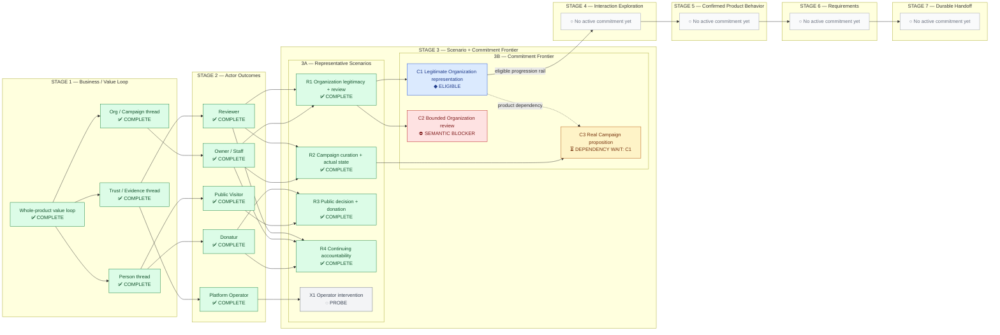

# Kencleng Pilot #3 — Control Tower

> **CONTROL TOWER / PROGRESS VIEW — NOT PRODUCT AUTHORITY**  
> This dashboard visualizes current progress, lineage, dependency, and readiness.  
> Owning Product / working artifacts remain authoritative for meaning and decisions.  
> If this dashboard conflicts with an owning artifact, the owning artifact wins.
>
> **Status:** Experimental living dashboard for Pilot #3  
> **Working baseline:** `pilot/3-clean-delivery-baseline`

## 1. Visual grammar

- **Stage area / station** — maturity area from Stage 1 through Stage 7.
- **Node / train** — a tracked output or work item currently relevant in that stage.
- **Commitment** — a specific node type that emerges in Stage 3B and can progress through Stage 4–7.
- **Rail** — derivation, progression, or dependency relationship.
- **Status** — current progress/readiness signal for a node.

Not every node is a Commitment. Stage 1 contains value-loop outputs, Stage 2 actor outcomes, Stage 3A representative scenarios, and Stage 3B delivery commitments.

### Status legend

| Signal | Meaning |
| --- | --- |
| ✅ COMPLETE | Stage/output sufficiently complete for progression |
| ▶ ACTIVE | Currently being worked through |
| ◆ ELIGIBLE | Commitment may proceed to Stage 4–7 |
| ⛔ BLOCKED | Material semantic/product blocker remains |
| ⏳ DEPENDENCY WAIT | Product claim depends on another real commitment/capability |
| ○ NOT STARTED | No active work in this stage yet |
| ◌ PROBE | Cross-cutting / exceptional probe, not a core delivery commitment |

### Rail legend

```text
────────▶  derivation / normal progression
- - - - ▶  material product dependency
·······▶  feedback / reopen when materially new evidence appears
```

## 2. Current control tower



## 3. Current commitment frontier

| Commitment | Current station | Status | Current reason |
| --- | --- | --- | --- |
| **C1 — Legitimate Organization representation** | Stage 3B | ◆ ELIGIBLE | Meaningful, semantically ready enough, dependency-closed enough, truthful, and bounded |
| **C2 — Bounded Organization review** | Stage 3B | ⛔ BLOCKED | Positive meaning / legitimate Organization-review outcomes remain unresolved |
| **C3 — Real Campaign proposition** | Stage 3B | ⏳ DEPENDENCY WAIT | Requires C1 to become real; later C3-specific authority semantics should be resolved when material |

**Progression rule:** an ELIGIBLE commitment may enter Stage 4 directly. Do not resolve unrelated blocked future commitments first.

If several independent commitments become ELIGIBLE at the same time, compare only that eligible frontier. Do not force a full-product sequence.

## 4. Owning artifacts

| Dashboard area | Owning artifact |
| --- | --- |
| Product direction | [Product Intent](./product-intent.md) |
| Stage 1 | [Pilot #3 — Business / Value Loop](./pilot-3-business-value-loop.md) |
| Stage 2 | [Pilot #3 — Actor Outcomes & Responsibilities](./pilot-3-actor-outcomes.md) |
| Stage 3 method | [Pilot #3 — Stage 3 Working Model](./pilot-3-stage-3-working-model.md) |
| Stage 3A | [Pilot #3 — Representative Scenarios](./pilot-3-stage-3a-representative-scenarios.md) |
| Stage 3B | [Pilot #3 — Commitment Sequencing](./pilot-3-stage-3b-commitment-sequencing.md) |

## 5. Dashboard update discipline

Update this dashboard when a meaningful progress state changes, for example:

- a stage/output becomes COMPLETE;
- a commitment becomes ELIGIBLE;
- a commitment becomes BLOCKED or unblocked;
- a dependency becomes real / satisfied;
- a commitment enters Stage 4, 5, 6, or 7;
- materially new evidence reopens an earlier working decision.

Do **not** use this dashboard to create new Product Truth.

The correct flow is:

```text
owning discussion / artifact changes
→ decision becomes durable there
→ Control Tower is updated to reflect it
```

The dashboard is allowed to be compact and operational. Detailed decision reasoning belongs in the linked owning artifact.
