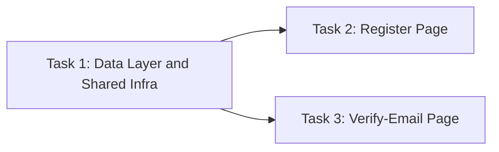

# Manifest: account/01-register-email-verification (frontend) — Task Decomposition

> Snapshot at generation time (2026-08-26) — this file does not track
> progress/status; that belongs to the PR/ticket domain, not this
> workspace (`2-1-techplan-synthesis-prompt.md` decomposition step).
>
> Originating contract techplan: `../techplan.md` ("Tech Plan: Register
> & Email Verification (Frontend)", Status: Draft).

## Step 0 gate — why this was decomposed at all

The parent techplan's §4 (Rules & Validation) has **18 rules
(R1–R18)** — clears the Complex-tier threshold in
`best-practices/model-routing.md` (`≥15 rules`) on rule count alone.
Per that same table, the Decomposition row is gated: *"N/A — doesn't
clear Step 0 gate"* at Simple/Medium tier, only licensed at Complex.
Qualitatively: the plan bundles two independent page-level modules
(`/register`, `/verify-email`) sitting on one shared prerequisite data
layer — exactly the kind of bundling `AGENTS.md` §7's "one vertical
slice per session" norm argues against keeping as a single execution
unit.

## Splitting axis

**Hybrid**: Dependency/sequence chain (primary) + Component/module
boundary (secondary).

- **Dependency/sequence chain** governs Task 1 → {Task 2, Task 3}: the
  data layer (API wrapper functions, mutation hooks, MSW handlers, the
  shared `ResendVerificationControl`) is a hard prerequisite for both
  page tasks — neither page can be meaningfully built or tested without
  it existing first.
- **Component/module boundary** governs Task 2 vs Task 3: `/register`
  and `/verify-email` are independent routes/components that don't
  import from each other, share no page-level state, and were
  independently decided in the parent techplan's Decision Log (D1 for
  Task 3's shell placement, D3 for Task 2's Google button) — nothing
  requires them to be sequenced relative to each other.

This is not the "default to dependency/sequence chain when ambiguous"
fallback — the choice was concrete: Task 1's prerequisite relationship
to the other two is a genuine hard dependency (not just organizational
tidiness), and Task 2/Task 3's independence from each other is equally
concrete (verified against the parent techplan's own Files
Changed/NOT Changed table — zero file overlap between what Task 2 and
Task 3 touch).

## Task list

| Task file | Title | Depends on |
|---|---|---|
| `task-01-data-layer-and-shared-infra.md` | Data Layer & Shared Infrastructure | none |
| `task-02-register-page.md` | Register Page | Task 1 |
| `task-03-verify-email-page.md` | Verify-Email Page | Task 1 |

## Dependency graph

Task 2 and Task 3 have **no hard dependency on each other** — both can
be executed in parallel (separate sessions) once Task 1 is merged.

## Rule coverage map (R1–R18 across all three tasks — the count-check for the decomposed whole)

| Rule | Owning task(s) |
|---|---|
| R1, R2, R3, R4, R5, R7, R17, R18 | Task 2 (register-specific) |
| R6, R10 | Owned at the contract-shape level by Task 1; re-verified at each consuming site — Task 2 (register), Task 3 (verify-email), and within Task 1 itself (resend control) |
| R8, R9 | Task 1 (`ResendVerificationControl`'s own contract); consumption smoke-tested in Task 2 and Task 3 |
| R11, R12, R13, R14, R15, R16 | Task 3 (verify-email-specific) |

All 18 rules from the parent techplan's §4 are accounted for across
the three task files — no rule was dropped in the split (the
recurring gap `techplan/retro.md` warns about most).

## Open Items distribution (from parent techplan §14)

| Open Item | Relevant task(s) |
|---|---|
| #1 — 404 copy for `/verify-email` | Task 3 |
| #2 — resend affordance on 404's "revoked" sub-case | Task 3 |
| #3 — Google button scope split vs. domain Task #2 | Task 2 |
| #4 — D5 security reasoning sanity-check | Task 3 |
| #5 — fallback banner copy (R6) | Task 1 (contract shape), Task 2 + Task 3 (rendering sites) |
| #6 — `<Suspense>` requirement for `useSearchParams()` | Task 3 |

None of these were silently resolved during decomposition — each is
carried forward verbatim into its owning task file(s), same as they
stand in the parent techplan.

## Model routing (per `best-practices/model-routing.md`)

Tier assessed per task using the same rubric the parent techplan was
assessed with (`model-routing.md`'s tier table: rule count, diagram
presence, auth/PII touch), applied to each task's own redistributed
scope rather than the whole plan — this is what makes decomposition
worth it cost-wise, not just organizationally.

| Task | Rule count (own scope) | Diagram? | Tier | Coding/build model | Rationale | Testing model |
|---|---|---|---|---|---|---|
| Task 1 — Data Layer & Shared Infra | 4 (R6, R8, R9, R10) | No | Medium | **GLM 5.2 (max)** | Low rule count but the work leans on a non-trivial type-level contract design (D4's discriminated union) — `model-routing.md`'s tie-breaker picks GLM for "multi-step reasoning" over DeepSeek's "rule-table-heavy" framing | DeepSeek V4 Flash |
| Task 2 — Register Page | 8 (R1–R5, R7, R17, R18) | No | Medium | **DeepSeek V4 Pro** | Rule-table-heavy, precision work, no diagram/state-transition — `model-routing.md`'s tie-breaker explicitly picks DeepSeek V4 Pro for this shape over GLM | DeepSeek V4 Flash |
| Task 3 — Verify-Email Page | 6 (R11, R12, R13, R14, R15, R16) | **Yes** (state-transition flowchart) | Medium | **GLM 5.2 (max)** | Owns the plan's only diagram/state-transition (4-way outcome branching) — `model-routing.md`'s tie-breaker explicitly picks GLM when the work leans on diagrams/state-transitions | DeepSeek V4 Flash |

All three tasks land at Medium once decomposed (each below the
≥15-rule Complex threshold individually), even though the *parent*
techplan was Complex as a whole — this is the expected effect of a
Complex-tier decomposition per `model-routing.md`'s own design intent
(splitting a Complex bundle into individually cheaper-to-execute
Medium units). Testing stays DeepSeek V4 Flash across all three per
the Testing row's Medium-tier default (Pro is reserved for ≥15-rule
count-checks, which no single task reaches).

**Caveat carried over from `model-routing.md`**: tier thresholds and
the specific model picks are the source document's own "starting
guesses, not calibrated" — this table should be revisited once real
execution results come back for this ticket, same as the source
document asks for generally.
