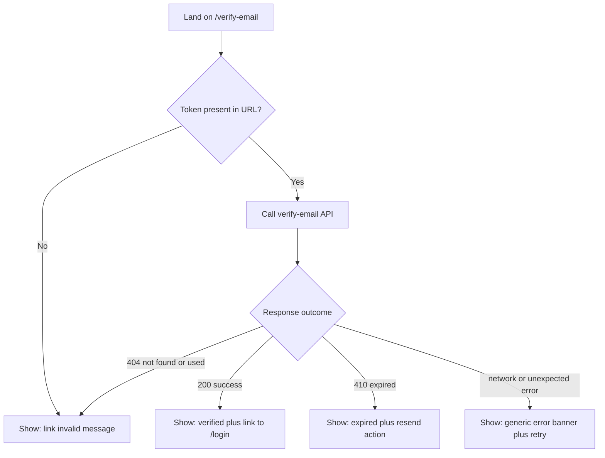

# Task 3: Verify-Email Page

> Originating contract techplan: `../techplan.md` ("Tech Plan: Register &
> Email Verification (Frontend)", account/01-register-email-verification,
> Status: Draft). Cross-check high-level decisions there whenever this
> task file is ambiguous.
>
> Splitting axis: Dependency/sequence chain (primary) + Component/module
> boundary (secondary). **Depends on Task 1** (needs `useVerifyEmail()`
> and `ResendVerificationControl` to already exist). **Does not depend
> on Task 2** — the two page tasks are independent of each other and can
> run in parallel once Task 1 is merged. See `../manifest.md`.

## Scope

Build the new `/verify-email` route from scratch: reads the `token`
from the URL, calls `verifyEmail` exactly once, and renders one of four
outcome views (verified / expired-with-resend / invalid-or-used /
generic-error).

**Out of scope for this task**: `/register` (Task 2), any change to
`lib/api/account.ts`/hooks/`mocks/handlers.ts` (Task 1 owns those —
import from them, don't redefine), the Auth Shell (`AuthShellClient`)
— deliberately **not used** by this route (see Decision D1).

## Background (condensed from techplan §1)

`page-map.md` maps this feature's second surface as "Email verification
link (from email, not a full page)" — no route exists anywhere in
`app/` for it today; this is a genuine void, not an unfinished stub
(unlike `/register`, which at least has a placeholder).
`kencleng-agentic-workflow.md` §14 names this exact scenario ("a
backend task with no dedicated page ... still needs an explicit
frontend surface, however small") as expected, not a spec gap.

## What this task builds (from techplan §8/§9/§10)

- **File**: `app/verify-email/page.tsx` (new) — new **top-level**
  route (Decision D1 — not nested under `app/(auth)/`), rendering
  `VerifyEmailStatus`.
- **File**: `components/features/account/verify-email-status.tsx`
  (new) — Client Component. Reads `token` via `useSearchParams()`
  (flag: Open Item #6, `<Suspense>` requirement unverified on this
  Next.js version — see below), fires `useVerifyEmail()` once (R12),
  renders the outcome views, manages focus (R16).
- No `loading.tsx` route-segment file — see Architecture note below.

**Imports from Task 1 (must already exist before this task starts):**
```typescript
import { useVerifyEmail } from "@/lib/hooks/use-verify-email";
// useVerifyEmail() -> useMutation wrapping verifyEmail(): Promise<{message?: string}>
// throws on !ok (404/410/429/network) — thrown error carries the Problem body

import { ResendVerificationControl } from "@/components/features/account/resend-verification-control";
```

## Decision-flow diagram (from techplan Summary — this task's full scope)



This diagram was syntax- and semantics-validated against §4's rules in
the parent techplan (`guardrails.md` §9) — every edge uses a
double-dash arrow, every branch matches R11/R13/R14/R15/R6 exactly
(see below), no inverted or overlapping conditions.

## Architecture note: no `loading.tsx`

Per `app-router-routing-conventions.md`'s "don't add reflexively": this
page's loading state is client-driven (`useVerifyEmail()`'s
`isPending`), not a route-level Suspense boundary. `VerifyEmailStatus`
renders its own inline skeleton while pending — matching how
`/donation/[id]/status` (same Status/Tracking pattern) already works.

## Rules & Validation owned by this task

(Numbering matches techplan §4 — not renumbered per task.)

- **R11** (missing token): Given `/verify-email` loads with no `token`
  in the URL (or an empty one), When rendered, Then it is treated
  identically to the `404` outcome (R15) — no separate "missing token"
  message that would distinguish the two cases.
- **R12** (single-fire guard): Given `/verify-email` has a token, When
  the component mounts/re-renders, Then `verifyEmail` fires **exactly
  once** for that token — a second automatic call would itself `404`
  even against a link that was genuinely still valid (guard with a
  ref/idempotency check; `useMutation` itself has no built-in dedupe —
  this is `VerifyEmailStatus`'s own responsibility, not Task 1's hook).
- **R13** (verify 200): Given a `200` response, When received, Then
  show the verbatim message (*"Email berhasil diverifikasi."*, per
  `schema.d.ts`) plus a CTA linking to `/login`.
- **R14** (verify 410): Given a `410` response, When received, Then
  show the verbatim `detail` (*"Link verifikasi sudah kedaluwarsa.
  Silakan minta kirim ulang."*) plus `ResendVerificationControl` from
  Task 1 (Decision D2).
- **R15** (verify 404): Given a `404` response (not found, already
  used, or revoked-by-resend), When received, Then show a generic
  "link invalid or already used" message — **no worked example exists
  in `schema.d.ts` for this case's exact copy** (Active Open Item #1 on
  the parent techplan); whether a resend affordance is also offered
  here is a separate open question (Active Open Item #2).
- **R16** (focus on resolution): Given `/verify-email`'s loading state
  resolves to any outcome (R13/R14/R15/R6), When the transition
  happens, Then focus moves into the result region
  (`accessibility-fundamentals.md`).
- **R6** (universal fallback, verify-email-specific instance): Given
  `useVerifyEmail()` throws for a reason outside the documented
  200/404/410/429 set (network failure, unexpected `5xx`), When it
  occurs, Then a generic frontend-owned banner is shown (exact copy —
  Open Item #5), raw response body never inspected/rendered.
- **R10** (429 handling, verify-email-specific instance): Given a `429`
  on verify-email, When received, Then the response's own
  `Problem.detail` text is shown verbatim (distinct from R6's fallback).

## Decision Log entries relevant to this task

**D1 — Route + shell for the verification-link landing page**

| Option | Why rejected/accepted |
|---|---|
| A. `app/(auth)/verify-email/page.tsx`, inside `AuthShellClient` | Rejected — the shell's desktop variant renders a blurred backdrop of the *Landing* page behind the modal (confirmed from the extracted `login-register.extracted.jsx`), implying the user was mid-browse on `/`. False for someone arriving fresh from an email link. |
| B. `app/verify-email/page.tsx`, top-level, Status/Tracking pattern's minimal shell (**chosen**) | Matches `/donation/[id]/status`'s already-established shape (no auth, token-in-URL, one API call, small outcome set). Path symmetry with `/reset-password?token=...`, the other token-in-email route. |

**D2 — Where "resend verification" surfaces** (this task's half — see
Task 2 for the register-side half)

| Option | Why rejected/accepted |
|---|---|
| B. On `/verify-email`'s expired state (**chosen, this task's scope**) | `schema.d.ts`'s `410` example `detail` text literally says *"Silakan minta kirim ulang"* — the backend contract already assumes this affordance exists at exactly this point. |
| D. A dedicated `/resend-verification` page | Rejected — unnecessary extra route for what's one field + one button, cheaper composed inline via Task 1's shared control. |

**D5 — Distinguishing 410 vs 404 on `/verify-email`** *(flagged as
Active Open Item #4 on the parent techplan — needs a human
sanity-check before treating as fully settled)*

| Option | Why rejected/accepted |
|---|---|
| A. Flatten both into one generic message, per the Status/Tracking pattern's literal wording | Rejected — the enumeration concern that rule exists for (a guessable/sequential resource ID) doesn't transfer to a high-entropy single-use token; flattening would also bury the backend's own designed "please resend" prompt for no matching security benefit. |
| B. Distinguish them, matching what the backend contract already does (**chosen**) | Backend already ships different status codes and different `detail` copy for the two cases — following the contract, not inventing a new leak. |

## Backward Compatibility

Same as the parent techplan §6 — no DB, no API change, no existing
consumers affected (this route is entirely new). Nothing task-3-specific
to add.

## Edge Cases & Risks relevant to this task

| Risk | Likelihood | Severity | Mitigation |
|---|---|---|---|
| `verifyEmail` double-fires (re-render/StrictMode double-invoke), consuming a token that was actually still valid | Medium — React double-invokes effects in dev by default | Medium — user sees a false "invalid/expired" on a link that was genuinely fine | R12: single-fire guard, tested via mock call-count assertion |
| `/verify-email` nested under `(auth)` by habit (all other auth routes are) | Low — D1 already resolves this explicitly | Low — visual-only mismatch (misleading blurred backdrop), not a data/security issue | D1 — build at the top-level path from the start |
| 429 on this page's verify call read as "silently failed" | Medium | Low | R10: show the backend's own rate-limit `detail` text |
| Focus left on the loading skeleton after it's replaced by a result view | Medium — invisible in a visual-only review pass | Medium — screen-reader/keyboard users lose their place | R16 + dedicated a11y test |

## Files Changed / NOT Changed (this task's subset)

| File | Change Type | Description |
|---|---|---|
| `app/verify-email/page.tsx` | Add | New top-level route (D1) |
| `components/features/account/verify-email-status.tsx` | Add | Verify-email outcome view |
| Corresponding `*.test.tsx` for the two files above | Add | Per Testing Checklist below |

| File | Reason untouched (this task) |
|---|---|
| `lib/api/account.ts`, `lib/hooks/use-verify-email.ts`, `mocks/handlers.ts`, `resend-verification-control.tsx` | Task 1's scope — import and consume, don't redefine |
| `app/(auth)/register/page.tsx` | Task 2's scope |
| `app/(auth)/layout.tsx`, `_components/auth-shell-client.tsx` | Unmodified, and deliberately **not used** by this route (D1) |

## Testing Checklist (this task's subset)

- [ ] R11: `/verify-email` with no `token` query param renders the same outcome as a mocked `404`
- [ ] R12: `verifyEmail` fires exactly once even under a forced re-render (test asserts mock call count === 1)
- [ ] R13: a mocked `200` shows the verified message plus a link to `/login`
- [ ] R14: a mocked `410` shows the expired message plus `ResendVerificationControl` (smoke-level: control renders; its own behavior is Task 1's test scope)
- [ ] R15: a mocked `404` shows a generic invalid-link message (exact copy pending Active Open Item #1)
- [ ] R16: focus moves into the result region once `/verify-email`'s loading state resolves to any outcome
- [ ] R6: a simulated network failure / unexpected `5xx` shows the frontend-owned generic banner, never the raw response body
- [ ] R10: a mocked `429` shows the response's `Problem.detail` text

## Testing Examples & Common Mistakes (this task's subset)

| Mistake | Error/Behavior | Fix |
|---|---|---|
| `verifyEmail` fired twice (e.g. an effect re-running under React's dev-mode double-invoke) | A legitimately valid link shows "invalid/expired" because the token was already consumed by the first call | Guard with a ref/idempotency check so the mutation fires exactly once per token (R12) |
| Nesting `/verify-email` under `app/(auth)` | Desktop view shows a blurred Landing-page backdrop behind an unrelated email-link result | Keep `/verify-email` top-level, outside `AuthShellClient` (D1) |
| Hardcoding the `410`/`200` copy into `VerifyEmailStatus` | Copy silently drifts from the backend's actual (and potentially later-changed) response text | Always render the response's own `message`/`detail` field; only the mock fixtures in tests should contain literal example strings |

## Open Items relevant to this task

- **Active Open Item #1** (parent techplan §14): exact copy for
  `/verify-email`'s 404 outcome — `schema.d.ts` has no worked example
  for this case, unlike every other outcome.
- **Active Open Item #2**: whether the 404 outcome's "revoked by a
  newer resend" sub-case should also offer a resend affordance — UX
  judgment call, not resolved here.
- **Active Open Item #4**: D5's security reasoning (410 vs 404
  distinction) needs a human sanity-check before being treated as fully
  settled.
- **Active Open Item #5**: exact copy for the frontend-owned fallback
  banner (R6) — shared with Task 2, no backend string to reuse by design.
- **Active Open Item #6**: whether `useSearchParams()` on this page
  needs an explicit `<Suspense>` boundary given this project's Next.js
  version (16.2.12) — `TBD — verify` against a local build or the
  Next.js App Router docs before implementation.
