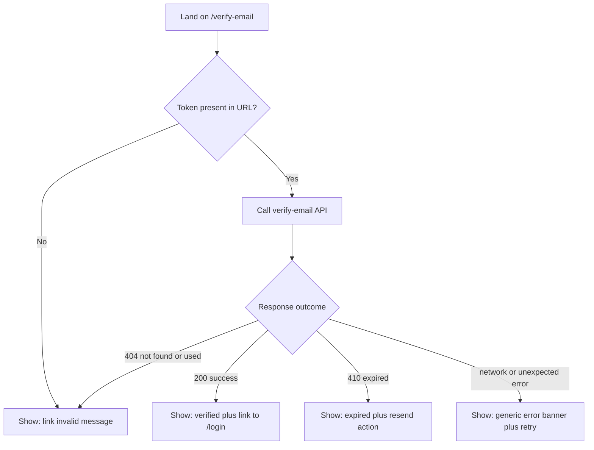

# Tech Plan: Register & Email Verification (Frontend)

> Ticket    : account/01-register-email-verification (frontend surface)
> Author    : Claude (agent-synthesized from 1-explore logs; pending Anhar's review)
> Date      : 2026-08-26
> Status    : Draft
> Refs      : `frontend/AGENTS.md`, `docs/spec/1-account/features/01-register-email-verification.md`, `docs/ui-ux/page-map.md`, `docs/ui-ux/patterns.md`, `docs/ui-ux/design-guidelines.md`, `docs/ui-ux/prototype-reference.md`, `docs/kencleng-agentic-workflow.md` §14, `lib/api/schema.d.ts` (generated, authoritative contract), backend techplan `backend/.local-agents/works/account/01-register-email-verification/2-plan/techplan.md` (already Implemented — API side), `1-explore/logs/{stage1-plan,stage2-gap-analysis,stage3-solutioning}.md`, `best-practices/restapi/anti-enumeration.md`, `best-practices/react/{form-validation-boundary,data-fetching-conventions,api-client-centralization,component-test-mocking-discipline,loading-empty-error-state-conventions,accessibility-fundamentals,server-client-component-boundary,app-router-routing-conventions}.md`

---

## 📋 Summary — start here

**What & why** — The backend for `account/01-register-email-verification`
shipped weeks ago (commit `14834e5`); the frontend surface never got
built — `/register` is still the Phase 0 placeholder stub, and the
email-verification-link landing route (needed for the emailed link to
go anywhere) doesn't exist at all. This plan builds both: the
`/register` form (email/password/name, Google-register entry point,
uniform anti-enumeration success state) and a new `/verify-email`
route (token-in-URL, three outcome states, a shared resend affordance).

**Scope** —
- Build out `/register`'s form, validation, submit/success/error states.
- Add a new `/verify-email` route (not nested in the Auth Shell).
- Add a shared "Kirim ulang" (resend) affordance, used on both surfaces.
- Add `register`/`verifyEmail`/`resendVerification` to `lib/api/account.ts`, one mutation hook each, and matching MSW handlers.
- Out of scope: the Google OAuth callback/session flow (Task #2), `/login`/`/forgot-password`/`/reset-password` (Tasks #3/#4), any backend change.

**Decision flow diagram** — `/verify-email`'s outcome branching (the
one genuinely branching/state-transition flow in this plan; `/register`
is comparatively linear and isn't diagrammed):



**Key decisions** (full rationale in §5):
- D1: `/verify-email` is a new **top-level route**, using the
  Status/Tracking pattern's minimal shell — not nested in `AuthShellClient`.
- D2: The "Kirim ulang" (resend) affordance appears in **two places**
  sharing one hook: `/register`'s success view and `/verify-email`'s
  expired-token view.
- D3: The "Daftar dengan Google" **button and navigation** are built in
  this task; the OAuth **callback** handling stays Task #2's scope.
- D4: `register()` returns a **discriminated union**
  (`{ok:true} | {ok:false, kind:"validation", errors}`) instead of
  throwing on 422 — keeps field-level and request-level failures
  structurally separate.
- D5: `/verify-email` **distinguishes 410 (expired) from 404** in its
  copy, rather than flattening them the way the Status/Tracking pattern
  does for donation lookups — the enumeration risk model differs (see §5).

**Top risks** (High-severity only — see §7 for the full table):
- Frontend copy/behavior differentiating an enumeration-sensitive
  branch (register's 4 backend branches, or resend's match/no-match)
  would defeat the backend's uniform-`202` anti-enumeration design from
  the client side, even though the backend itself leaks nothing.
- Adding a live "is this email already registered" check (e.g.
  on-blur) to the register form would do the same — a plausible-seeming
  UX improvement that directly undermines the feature's core security
  property.

**Open items needing human input** (copied from §14's Active list — a
6th item, the `<Suspense>` boundary question, was resolved during
build and moved to §14's Resolved list, so it no longer appears here):
1. Exact copy for `/verify-email`'s 404 outcome — `schema.d.ts` has a
   worked example for every other state but this one.
2. Whether the 404 outcome's "revoked by a newer resend" sub-case
   should also offer a resend affordance.
3. Confirm the Google button/navigation split (D3) against `tasks.md`
   with whoever owns Task #2.
4. Sanity-check D5's security reasoning (410 vs 404 distinction) before
   treating it as settled.
5. Exact copy for the frontend-owned fallback banner (R6) — no backend
   string exists to reuse on this path, by design.

---
<!-- Audience boundary: above is the human-readable digest for
review/approval. Below is the full execution-grade plan — same
decisions, same scope, expanded to file/line precision, rule IDs, and
full option comparisons. Nothing below contradicts the digest above;
it's the same source of truth at higher resolution. -->
---

## 1. Background

`docs/spec/1-account/features/01-register-email-verification.md`
specifies three endpoints — `POST /auth/register`,
`POST /auth/verify-email`, `POST /auth/verify-email/resend` — all
already implemented and merged on the backend (`14834e5`, confirmed
via `git show --stat` to touch zero `frontend/` files). `page-map.md`
maps this feature to two frontend surfaces: `/register` (a page) and
"the email verification link" (explicitly *not* a full page, but
still needs a route to land on). Neither exists in a working state
today:

- `app/(auth)/register/page.tsx` is a 6-line placeholder, its own
  comment stating it exists only "so the Auth Shell has a route to
  render against" until this task builds the real form.
- No route anywhere in `app/` consumes a verification-link token — the
  second page-map surface is a genuine void, not an unfinished stub.

`kencleng-agentic-workflow.md` §14 names this exact scenario ("a
backend task with no dedicated page ... still needs an explicit
frontend surface, however small") as expected, not a spec gap to route
around.

## 2. Scope

**In scope:**
- `/register` page: form (name, email, password), client-side zod
  validation, submit/loading/error/success states, "Daftar dengan
  Google" entry point.
- New `/verify-email` route: reads `token` from the URL, calls
  `POST /auth/verify-email`, renders success/expired/not-found/error
  outcomes.
- A shared "Kirim ulang" (resend verification) affordance, surfaced on
  both `/register`'s success view and `/verify-email`'s expired view.
- `lib/api/account.ts`: `register`, `verifyEmail`, `resendVerification`.
- One TanStack Query mutation hook per action in `lib/hooks/`.
- MSW handlers for all three endpoints in `mocks/handlers.ts`.
- Component/unit tests (Vitest + React Testing Library + MSW) for every
  rule in §4.

**Out of scope (explicit):**
- The Google OAuth redirect **callback** and any session-establishment
  logic (`GET /auth/google/callback`) — Task #2
  (`02-google-oauth-login-register.md`).
- `/login`, `/forgot-password`, `/reset-password` — Tasks #3/#4, still
  placeholders, untouched here.
- Any backend change — the API contract is already shipped and stable.
- Any client-side replication of a backend business rule (password
  breach-list check, enumeration-branch logic) — per `frontend/
  AGENTS.md` §2, the frontend never re-implements or second-guesses
  what the backend already decided.
- Auth-store/session changes — confirmed unnecessary (register/verify
  never issue a token; see Stage 2 Area 5).

## 3. Requirements

| Condition | Requirement | Source/Note |
|---|---|---|
| User fills the register form | Collect `name`, `email`, `password` — matches `RegisterRequest`'s three required fields exactly | `lib/api/schema.d.ts` (`RegisterRequest`) — `name` is easy to miss since `page-map.md`'s one-line description doesn't name fields |
| Register submitted, any outcome | API always responds `202` with one generic message, regardless of which of the 4 backend branches fired | Feature spec, Acceptance Criteria §`POST /auth/register` |
| Register submitted with a policy-failing password | API responds `422` with per-field messages | Feature spec, Acceptance Criteria; `ValidationProblem` schema |
| User clicks "Daftar dengan Google" | Navigates to the shared OAuth redirect-initiation endpoint with `intent=register` | `schema.d.ts` doc comment on the redirect endpoint; D3 |
| User opens the emailed verification link | Some frontend route must exist to receive `?token=...` and call `POST /auth/verify-email` | `page-map.md` (Donatur section) + `kencleng-agentic-workflow.md` §14 |
| Verification token valid | `200`, account verified | Feature spec |
| Verification token expired | `410`, with a resend path | Feature spec + `schema.d.ts`'s own `detail` example telling the user to resend |
| Verification token not found/used/revoked | `404` | Feature spec |
| Resend requested (either surface) | Always `202` generic, regardless of match | Feature spec, Acceptance Criteria §`POST /auth/verify-email/resend` |
| Any of the 3 actions rate-limited | `429` | Feature spec; `TooManyRequests` schema |
| Any request-level failure | Generic frontend banner, distinct from field-level errors, raw body never rendered | `patterns.md` §B; `loading-empty-error-state-conventions.md` |

## 4. Rules & Validation

- **R1** (register form fields): Given the register page loads, When
  rendered, Then it shows `name`, `email`, `password` fields matching
  `RegisterRequest`'s shape — `zod`: `name` non-empty, `email` valid
  format, `password` ≥8 chars (feature spec's length policy).
- **R2** (no client breach-check): Given a password ≥8 chars that's
  actually breach-listed, When submitted, Then the client schema does
  **not** reject it locally — that check is server-only; the client
  only ever sees it as a `422` round-trip (R5).
- **R3** (submit button state): Given the form is submitting, When
  `isPending`, Then the submit `Button` has `type="submit"` (explicit —
  `Button`'s own default is `"button"`) and is disabled with its
  `loading` prop set.
- **R4** (register 202 → success): Given any `202` response, When
  received, Then the form is replaced by a fixed success view
  displaying the response's own `GenericAcceptedMessage.message`
  verbatim (e.g. *"Kalau email belum terdaftar, cek inbox untuk
  verifikasi. Kalau sudah, cek inbox untuk instruksi lebih lanjut."*,
  per `schema.d.ts`'s worked example on this endpoint) — never a
  client-authored variant, and never conditioned on anything other
  than "was this a 202."
- **R5** (register 422 → field errors): Given a `422` response with
  `ValidationProblem.errors[]`, When received, Then each `{field,
  message}` is mapped via `form.setError(field, {message})` — the
  displayed text is the backend's `message` **verbatim**, never
  re-authored client-side; no banner is shown for this case
  (`form-validation-boundary.md`).
- **R6** (universal fallback): Given a response outside an endpoint's
  documented status set (network failure, unexpected `5xx`), When it
  occurs on any of the three actions, Then one frontend-owned generic
  banner is shown (exact copy — Open Item #5) and the raw response body
  is never inspected or rendered (`loading-empty-error-state-
  conventions.md`).
- **R7** (Google entry point): Given the user clicks "Daftar dengan
  Google", When clicked, Then it performs a plain browser navigation
  (`<a href>` or equivalent) to `/auth/google/redirect?intent=register`
  — **not** an `apiFetch`/XHR call (D3; the endpoint issues a `302`,
  which only a real navigation follows correctly).
- **R8** (resend from register): Given the register success view is
  showing, When the user activates "Kirim ulang", Then
  `resendVerification` is called with the email just submitted (held
  only in local component state, never persisted) (D2).
- **R9** (resend outcome uniform): Given any `202` response from
  resend, When received, Then the same generic confirmation text is
  shown (`GenericAcceptedMessage.message`, e.g. *"Kalau email
  terdaftar, instruksi sudah dikirim."*) regardless of whether the
  email actually matched anything server-side.
- **R10** (429 handling): Given a `429` on any of the three actions,
  When received, Then the response's own `Problem.detail` text is
  shown verbatim (this is a documented, backend-authored user-facing
  string — distinct from R6's fallback, which is for genuinely
  undocumented failures).
- **R11** (missing token): Given `/verify-email` loads with no `token`
  in the URL (or an empty one), When rendered, Then it is treated
  identically to the `404` outcome (R15) — no separate "missing token"
  message that would distinguish the two cases.
- **R12** (single-fire guard): Given `/verify-email` has a token, When
  the component mounts/re-renders, Then `verifyEmail` fires **exactly
  once** for that token — a second automatic call would itself `404`
  even against a link that was genuinely still valid.
- **R13** (verify 200): Given a `200` response, When received, Then
  show the verbatim message (*"Email berhasil diverifikasi."*, per
  `schema.d.ts`) plus a CTA linking to `/login`.
- **R14** (verify 410): Given a `410` response, When received, Then
  show the verbatim `detail` (*"Link verifikasi sudah kedaluwarsa.
  Silakan minta kirim ulang."*) plus the same resend affordance as R8/R9.
- **R15** (verify 404): Given a `404` response (not found, already
  used, or revoked-by-resend), When received, Then show a generic
  "link invalid or already used" message — **no worked example exists
  in `schema.d.ts` for this case's exact copy** (Open Item #1); whether
  a resend affordance is also offered here is a separate open question
  (Open Item #2).
- **R16** (focus on verify-email resolution): Given `/verify-email`'s
  loading state resolves to any outcome (R13/R14/R15/R6), When the
  transition happens, Then focus moves into the result region
  (`accessibility-fundamentals.md`).
- **R17** (focus on register success): Given the register form is
  replaced by the success view (R4), When the transition happens, Then
  focus moves into the success region.
- **R18** (no enumeration-defeating client check): Given the register
  form, When the user types/blurs the email field, Then **no** request
  is made to check whether that email is already registered — the only
  network call this form ever makes is the final submit
  (`restapi/anti-enumeration.md`).

## 5. Decision Log

**D1 — Route + shell for the verification-link landing page**

| Option | Why rejected/accepted |
|---|---|
| A. `app/(auth)/verify-email/page.tsx`, inside `AuthShellClient` | Rejected — the shell's desktop variant renders a blurred backdrop of the *Landing* page behind the modal (confirmed from the extracted `login-register.extracted.jsx`), implying the user was mid-browse on `/`. False for someone arriving fresh from an email link. |
| B. `app/verify-email/page.tsx`, top-level, Status/Tracking pattern's minimal shell (**chosen**) | Matches `/donation/[id]/status`'s already-established shape (no auth, token-in-URL, one API call, small outcome set). Path symmetry with `/reset-password?token=...`, the other token-in-email route. |

**D2 — Where "resend verification" surfaces**

| Option | Why rejected/accepted |
|---|---|
| A. Only on `/register`'s success view | Incomplete — leaves `/verify-email`'s 410 outcome with no way to act on its own "please resend" copy. |
| B. Only on `/verify-email`'s expired state | Incomplete — misses the "email never arrived the first time" case. |
| C. Both A and B, one shared hook (**chosen**) | `schema.d.ts`'s `410` example `detail` text literally says *"Silakan minta kirim ulang"* — the backend contract already assumes this affordance exists at that point. Adding it to the register success view too costs one extra call site on the same hook. |
| D. A dedicated `/resend-verification` page | Rejected — unnecessary extra route for what's one field + one button, cheaper composed inline. |

**D3 — Google button scope split (Task #1 vs Task #2)**

| Option | Why rejected/accepted |
|---|---|
| A. Defer the whole button to Task #2 | Rejected — leaves `/register` incomplete against its own `page-map.md` row for no technical reason. |
| B. Build the button + navigation now; leave the callback to Task #2 (**chosen**) | `schema.d.ts`'s doc comment describes the redirect endpoint as a plain `302`-issuing navigation target, distinguished only by an `intent` query param — no OAuth client logic needed to make the button work today. |

**D4 — `register()`'s error-handling shape**

| Option | Why rejected/accepted |
|---|---|
| A. Throw a custom `ValidationError` subclass on 422, plain `Error` otherwise | Rejected — still routes both field-level and request-level failures through one `throw`/`catch` path; relies on every caller remembering an `instanceof` check. |
| B. Discriminated union return (`{ok:true} \| {ok:false, kind:"validation", errors}`), `throw` reserved for genuine request-level failure (**chosen**) | Encodes `patterns.md`'s "never conflate field-level and request-level errors" at the type level. Matches `form-validation-boundary.md`'s own worked example almost exactly. |
| C. Return the raw `Response`, parse in the hook | Rejected — pushes response-shape knowledge out of `lib/api/`, the layer that should own it once. |

**D5 — Distinguishing 410 vs 404 on `/verify-email`**

| Option | Why rejected/accepted |
|---|---|
| A. Flatten both into one generic message, per the Status/Tracking pattern's literal wording | Rejected — the enumeration concern that rule exists for (a guessable/sequential resource ID) doesn't transfer to a high-entropy single-use token; flattening would also bury the backend's own designed "please resend" prompt for no matching security benefit. |
| B. Distinguish them, matching what the backend contract already does (**chosen**, flagged as Open Item #4 for a human sanity-check) | Backend already ships different status codes and different `detail` copy for the two cases — following the contract, not inventing a new leak. |

## 6. Backward Compatibility

- **Database**: N/A — `frontend/` has no persistence layer of its own
  (`frontend/AGENTS.md` §2, "pure presentation layer"); the backend's
  schema shipped and stabilized in a prior, already-Implemented
  backend techplan.
- **API**: No API changes. This plan consumes an already-shipped,
  stable contract (`lib/api/schema.d.ts`, generated). From the
  frontend's side this is purely additive — new consumers of existing
  endpoints, not a contract change.
- **Existing clients/data**: None affected — confirmed via `grep` that
  zero existing frontend code calls any of these three endpoints today
  (Stage 2, Areas 2 and 4). Nothing to break.
- **Deprecation path**: N/A.
- **Runbook vs Techplan check** (`rules.md` §3): no sub-component here
  has an independent operational lifecycle (no script, no cron, no
  separate rollback) — evaluated and doesn't apply; everything folds
  into this one techplan.

## 7. Edge Cases & Risks

| Risk | Likelihood | Severity | Mitigation |
|---|---|---|---|
| Frontend copy/behavior differentiates an enumeration-sensitive branch (register's 4 branches, or resend match/no-match) | Medium — an easy slip while polishing UX copy later | **High** — defeats the backend's uniform-`202` design entirely, from the client side | R4/R9: exactly one fixed success string per action, sourced from the response's own generic field, never keyed off anything else; code-review checklist item |
| A live "is this email already registered" check gets added later (on-blur/typeahead) | Low today, Medium over time as the form gets polished | **High** — same class of leak as above, arguably worse since it's an explicit new request | R18: explicit prohibition, call out in code review |
| `verifyEmail` double-fires (re-render/StrictMode double-invoke), consuming a token that was actually still valid | Medium — React double-invokes effects in dev by default | Medium — user sees a false "invalid/expired" on a link that was genuinely fine | R12: single-fire guard, tested via mock call-count assertion |
| `register()` copies the existing `getMe`/`getCampaigns` throw-only pattern instead of D4's discriminated union | Medium — the existing pattern is the easiest thing to copy-paste | Medium — degrades UX (422 shows as a generic banner instead of field errors) but doesn't break anything | D4 decision recorded; code review checks the return shape |
| `Button`'s `type="button"` default is left unset on the submit button | Medium — easy to miss, not HTML's own default | Low — caught quickly by any keyboard/Enter-key test, but invisible in a purely visual review | R3 + dedicated test |
| `/verify-email` nested under `(auth)` by habit (all other auth routes are) | Low — D1 already resolves this explicitly | Low — visual-only mismatch (misleading blurred backdrop), not a data/security issue | D1 |
| 429 on resend read as "silently failed," user retries repeatedly, worsening the lockout | Medium | Low | R10: show the backend's own rate-limit `detail` text so the user understands why |
| Focus left on a removed/hidden element after register success or verify-email's result replaces the loading content | Medium — invisible in a visual-only review pass | Medium — screen-reader/keyboard users lose their place | R16/R17 + dedicated a11y test (`accessibility-fundamentals.md`) |
| A new MSW handler is missed for one of the 3 endpoints | Low | Low — `onUnhandledRequest: "error"` (already configured in `vitest.setup.ts`) fails the test loudly rather than silently passing | Add handlers alongside each new call site; existing strict MSW config already catches this class of gap |
| Google button implemented as a client-side fetch instead of a real navigation | Low | Medium — breaks the entire Google-register entry point (a `302` can't be "fetched" and followed the same way) | R7: explicit plain navigation, not `apiFetch` |

## 8. Interface Contract

Per `guardrails.md` §4, read `frontend/AGENTS.md` first: this repo has
no DB layer in `frontend/` at all (§2, "pure presentation layer" — the
backend is the sole source of truth), so the template's "DB Schema
changes" slot doesn't apply here; "API changes" is reinterpreted as
*consuming* an already-fixed contract plus the new frontend-side
wrapper functions that are this task's actual delta; "business logic
flow" is explicitly presentation-only, per the same §2 boundary.

**DB Schema changes:** N/A — no persistence layer in `frontend/`.

**API contract consumed** (already shipped, from `lib/api/schema.d.ts` — not authored by this task):
```typescript
// POST /auth/register
type RegisterRequest = { name: string; email: string; password: string };
// 202 -> GenericAcceptedMessage { message?: string }
// 422 -> ValidationProblem { ...Problem, errors?: { field: string; message: string }[] }
// 429 -> Problem

// POST /auth/verify-email
type VerifyEmailRequest = { token: string };
// 200 -> { message?: string }
// 404 -> Problem   (not found / already used / revoked-by-resend)
// 410 -> Problem   (expired)
// 429 -> Problem

// POST /auth/verify-email/resend
type ResendVerificationRequest = { email: string };
// 202 -> GenericAcceptedMessage
// 429 -> Problem
```

**New frontend-side additions (this task):**
```typescript
// lib/api/account.ts
type ValidationErrorItem = { field: string; message: string };
type RegisterResult =
  | { ok: true }
  | { ok: false; kind: "validation"; errors: ValidationErrorItem[] };

async function register(input: RegisterRequest): Promise<RegisterResult>;
async function verifyEmail(input: VerifyEmailRequest): Promise<{ message?: string }>; // throws on !ok (404/410/429/network), caller reads status via a thrown typed error carrying the Problem body
async function resendVerification(input: ResendVerificationRequest): Promise<{ message?: string }>; // throws on !ok
```

**Business logic flow (concise, presentation-layer only — no business
rule is decided here, all of it is "what to render given what the
backend already decided"):**
```
RegisterForm.onSubmit(values)
  -> register(values)
  -> ok:true                         => render success view (R4), verbatim message
  -> ok:false, kind:"validation"     => form.setError per field (R5), verbatim messages
  -> thrown (network/5xx/429)        => 429: show detail verbatim (R10)
                                         other: generic banner (R6)

VerifyEmailPage.onMount(token)
  -> !token                          => render "invalid" view (R11, same as 404)
  -> verifyEmail({token})  [fires exactly once, R12]
  -> 200                             => render verified view + /login link (R13)
  -> 410                             => render expired view + resend control (R14)
  -> 404                             => render "invalid" view (R15, copy TBD — Open Item #1)
  -> thrown (network/other)          => generic banner (R6)

ResendControl.onClick(email)
  -> resendVerification({email})
  -> any 202                         => render same generic confirmation (R9), verbatim
  -> thrown (429/network)            => R10 / R6 as above
```

Every string actually rendered above (except the R6/R15 fallback
copy, flagged as Open Items) comes from the live API response at
runtime, not a hardcoded frontend string — the literal examples quoted
in §4/§8 are what `schema.d.ts` documents the backend as returning
and what the MSW mock fixtures should return in tests, not copy to
bake into components.

## 9. Architecture / Plan

- `/register`: `app/(auth)/register/page.tsx` (thin, replaces the
  placeholder) renders `RegisterForm` — a Client Component leaf
  (`'use client'`, per `server-client-component-boundary.md`'s
  "leaf, not hoisted" principle — nothing else on this page needs to
  be a Server Component, but keeping the split named/explicit matches
  how `AuthShellClient` already draws this boundary at the layout
  level).
- `/verify-email`: new top-level route (D1), **not** under `(auth)`.
  `app/verify-email/page.tsx` renders a client leaf component
  (`VerifyEmailStatus`) that reads `token` via `useSearchParams()`,
  fires `useVerifyEmail()` on mount (guarded per R12), and renders one
  of the outcome views. No `loading.tsx` route-segment file is added —
  per `app-router-routing-conventions.md`'s "don't add reflexively,"
  this page's loading state is client-driven (`useMutation`'s
  `isPending`), not a route-level Suspense boundary; a skeleton is
  rendered inline by `VerifyEmailStatus` itself, matching how
  `/donation/[id]/status` (same Status/Tracking pattern) already works.
- Resend affordance: one shared component (`ResendVerificationControl`
  or similar), consuming `useResendVerification()`, mounted from both
  `RegisterForm`'s success view and `VerifyEmailStatus`'s expired view
  (D2) — avoids duplicating the hook-wiring in two places.
- No TanStack Query cache invalidation is needed for any of the three
  new mutations — none of them affect a query that's cached anywhere
  yet (the user isn't authenticated at any point in this flow, so
  there's no `account.me`-shaped cache entry to update), per
  `data-fetching-conventions.md`'s "only invalidate what's actually
  affected" principle applied in the negative — explicitly confirmed,
  not silently skipped.
- See the Summary's Mermaid diagram for `/verify-email`'s full outcome
  branching at a glance; `/register`'s flow is linear enough (one
  submit → one of three outcome classes) that it's fully captured by
  the pseudocode in §8 without a diagram.

## 10. Implementation Details

**File**: `lib/api/account.ts`
- Change: add `register`, `verifyEmail`, `resendVerification` (signatures in §8). `register` returns the `RegisterResult` discriminated union (D4); the other two keep the existing `getMe`-style throw-on-`!ok` contract, since neither has a field-level-error case to represent.

**File**: `lib/hooks/use-register.ts` (new)
- `useRegister()` — thin `useMutation({ mutationFn: register })` wrapper, no query-key factory needed (no cache to key).

**File**: `lib/hooks/use-verify-email.ts` (new)
- `useVerifyEmail()` — same shape; caller (R12) is responsible for the single-fire guard, not the hook itself.

**File**: `lib/hooks/use-resend-verification.ts` (new)
- `useResendVerification()` — same shape.

**File**: `mocks/handlers.ts`
- Change: add three `http.post(...)` handlers for `/auth/register`, `/auth/verify-email`, `/auth/verify-email/resend`, default-happy-path responses per §8's contract; individual tests override via `server.use(...)` for the 422/404/410/429/network-error cases, matching the existing `mockUser`/roles override convention already used for `GET /account/me`.

**File**: `app/(auth)/register/page.tsx`
- Change: replace the placeholder with a thin wrapper rendering `RegisterForm`.

**File**: `components/features/account/register-form.tsx` (new)
- New Client Component: form fields (R1), zod schema (colocated or in a sibling `register-schema.ts`), submit handling (R3–R6), success view (R4, R17), Google entry point (R7).

**File**: `app/verify-email/page.tsx` (new)
- New top-level route (D1) rendering `VerifyEmailStatus`.

**File**: `components/features/account/verify-email-status.tsx` (new)
- New Client Component: reads `token` via `useSearchParams()` (Open Item #6 — verify `<Suspense>` requirement), fires `useVerifyEmail()` once (R12), renders R11/R13/R14/R15/R6 outcomes, focus management (R16).

**File**: `components/features/account/resend-verification-control.tsx` (new)
- New Client Component: email input (pre-filled where available) + button, wraps `useResendVerification()` (R8, R9), consumed by both `RegisterForm` and `VerifyEmailStatus`.

## 11. Files Changed / Files NOT Changed

| File | Change Type | Description |
|---|---|---|
| `app/(auth)/register/page.tsx` | Modify | Replace placeholder with real page composition |
| `lib/api/account.ts` | Modify | Add `register`, `verifyEmail`, `resendVerification` |
| `mocks/handlers.ts` | Modify | Add 3 new `/auth/*` MSW handlers |
| `lib/hooks/use-register.ts` | Add | New mutation hook |
| `lib/hooks/use-verify-email.ts` | Add | New mutation hook |
| `lib/hooks/use-resend-verification.ts` | Add | New mutation hook |
| `app/verify-email/page.tsx` | Add | New top-level route (D1) |
| `components/features/account/register-form.tsx` | Add | Register form client component |
| `components/features/account/register-schema.ts` | Add | zod schema for R1/R2 |
| `components/features/account/verify-email-status.tsx` | Add | Verify-email outcome view |
| `components/features/account/resend-verification-control.tsx` | Add | Shared resend affordance |
| Corresponding `*.test.tsx` for each new component/hook above | Add | Per §12 |

| File | Reason untouched |
|---|---|
| `app/(auth)/login/page.tsx`, `forgot-password/page.tsx`, `reset-password/page.tsx` | Out of scope — Tasks #3/#4 |
| `lib/stores/auth-store.ts` | Confirmed no interaction needed — register/verify never issue a token (Stage 2 Area 5) |
| `components/ui/banner.tsx`, `input.tsx`, `button.tsx`, `label.tsx`, `spinner.tsx` | Already support everything this task needs; reused as-is, no changes |
| `lib/api/client.ts` (`apiFetch`) | Already endpoint-agnostic, handles unauthenticated calls correctly; no change needed |
| `app/(auth)/layout.tsx`, `_components/auth-shell-client.tsx` | Unmodified — `/register` continues using the existing shell as-is; `/verify-email` deliberately does not use it (D1) |
| Anything under `backend/` | Directory-boundary rule, root `AGENTS.md` §7 — out of scope for a `frontend/`-scoped session entirely |

## 12. Testing Checklist

- [ ] R1: register form validates `name`/`email`/`password` required, email format, password ≥8 chars (zod) before submit
- [ ] R2: password field has no client-side breach-list check — only length is validated locally
- [ ] R3: submit button uses `type="submit"`, disables and shows a loading spinner while pending
- [ ] R4: a mocked `202` replaces the form with a success view showing the exact `GenericAcceptedMessage` text, unconditional on which internal branch the mock represents
- [ ] R5: a mocked `422` maps each error to the correct field via `setError`, verbatim backend message text, no banner shown for this case
- [ ] R6: a simulated network failure / unexpected `5xx` on register, verify-email, and resend all show one frontend-owned generic banner, never the raw response body
- [ ] R7: "Daftar dengan Google" renders as a real link/navigation to `/auth/google/redirect?intent=register`, not an `apiFetch` call
- [ ] R8: register's success view renders a "Kirim ulang" control wired to `resendVerification` with the submitted email
- [ ] R9: resend always renders the same generic confirmation text regardless of mocked match/no-match server response
- [ ] R10: a mocked `429` on each of the three actions shows the response's `Problem.detail` text
- [ ] R11: `/verify-email` with no `token` query param renders the same outcome as a mocked `404`
- [ ] R12: `verifyEmail` fires exactly once even under a forced re-render (test asserts mock call count === 1)
- [ ] R13: a mocked `200` shows the verified message plus a link to `/login`
- [ ] R14: a mocked `410` shows the expired message plus the same resend control as R8
- [ ] R15: a mocked `404` shows a generic invalid-link message (exact copy pending Open Item #1)
- [ ] R16: focus moves into the result region once `/verify-email`'s loading state resolves to any outcome
- [ ] R17: focus moves into the success view once register's form is replaced
- [ ] R18: no request fires on email blur/change beyond the explicit submit (asserts no extra network call is made)

**Count-check**: 18 rules in §4 (R1–R18), 18 checklist items above — matched.

## 13. Testing Examples & Common Mistakes

| Mistake | Error/Behavior | Fix |
|---|---|---|
| Copying `getMe`/`getCampaigns`'s throw-only pattern for `register()` | 422 field errors collapse into one generic banner instead of per-field messages | Use the discriminated-union return (D4) so validation is structurally separate from thrown errors |
| Submit button omits `type="submit"` | Enter key / implicit form submit does nothing; only visible via an actual keyboard test, invisible in a visual review | Always pass `type="submit"` explicitly — `Button` defaults to `type="button"` |
| Adding a live email-availability check on blur | Defeats the backend's uniform-`202` anti-enumeration design from the client side | Never add such a check (R18) — the only network call this form makes is the final submit |
| `verifyEmail` fired twice (e.g. an effect re-running under React's dev-mode double-invoke) | A legitimately valid link shows "invalid/expired" because the token was already consumed by the first call | Guard with a ref/idempotency check so the mutation fires exactly once per token (R12) |
| Nesting `/verify-email` under `app/(auth)` | Desktop view shows a blurred Landing-page backdrop behind an unrelated email-link result | Keep `/verify-email` top-level, outside `AuthShellClient` (D1) |
| Hardcoding the `410`/`202`/`200` copy into component source | Copy silently drifts from the backend's actual (and potentially later-changed) response text | Always render the response's own `message`/`detail` field; only the mock fixtures in tests should contain literal example strings |

## 14. Open Items

### Active — need external input or verification

1. **404 copy for `/verify-email`** — `schema.d.ts` provides a worked
   `@example` for every other outcome (200, 410, register's 202, 429)
   but not this one. Needs either a confirmed backend `detail` string
   to reuse verbatim (preferred, for consistency with every other
   state) or explicit product copy if the backend intentionally leaves
   it unspecified.
2. **Resend affordance on the 404 outcome's "revoked by a newer
   resend" sub-case** — plausibly legitimate (the user's own newer
   resend already superseded this link), but the feature spec doesn't
   call for it either way. UX judgment call, not a pure engineering one.
3. **Google button/navigation scope split (D3)** — needs confirmation
   against `tasks.md` with whoever picks up Task #2, since it's a
   cross-task boundary inferred from a schema doc comment, not an
   explicit ratification.
4. **D5's security reasoning** (distinguishing 410 vs 404 in
   `/verify-email` copy, deviating from the Status/Tracking pattern's
   literal "never distinguish" wording) — the rationale (a
   high-entropy single-use token isn't a guessable sequential ID the
   way a donation ID is) should get a human sanity-check before being
   treated as settled, per `AGENTS.md` §6's "when in doubt, flag it."
5. **Exact copy for the frontend-owned fallback banner (R6)** — this
   is the one path with no backend string to reuse (by design, since
   the body is deliberately never inspected on this path) — genuinely
   new UI copy needing product sign-off, however small.

### Resolved (kept for reference)

1. ~~**`<Suspense>` requirement for `useSearchParams()` on `/verify-email`**~~
   **RESOLVED — during Task 3 build (2026-08-26).** Wrapped
   `VerifyEmailStatus` in `<Suspense>` inside `app/verify-email/page.tsx`;
   `next build` (16.2.12) confirms the route compiles and prerenders as
   static (`○ /verify-email`), no boundary error. Consequence: no
   further action needed here — this pattern (`Suspense` around any
   leaf using `useSearchParams`) should be the default for future
   token-in-URL routes in this app, not re-litigated per route.
