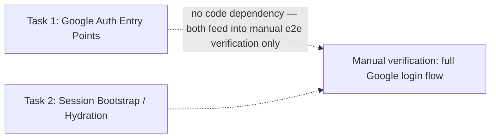

# Manifest: account/02-google-oauth-login-register (frontend) — decomposition

> Snapshot at generation time (2026-08-26) — not a living document, does
> not track progress status. Status tracking belongs to the PR/ticket
> domain, per `workflow/2-3-techplan-decomposition-prompt.md` §4.

## Step 0 — Is it worth decomposing this techplan?

**Answer: Yes.**

Reasoning:
- **Tier**: per `best-practices/model-routing.md`'s tier definitions,
  this techplan is **Complex** — not on rule count alone (13 rules,
  which sits in the Medium 5–15 band), but because it "touches
  auth[...] contract" (a Complex trigger on its own): it's the
  frontend surface of Google OAuth login/register, and it directly
  produces the mechanism that populates the app's session token.
- **Trigger signal genuinely present**: the 13 rules and 8 touched
  files split cleanly into two groups with no import/code dependency
  between them and clearly different review concerns — (a) OAuth
  entry-point UI (a button, a page composition, an error banner —
  React/copy/a11y concerns) vs. (b) session-bootstrap plumbing (a root
  provider, TanStack Query cache invalidation, a generated-type
  cleanup in the centralized API client — state-architecture
  concerns). Holding both simultaneously in one execution pass risks
  exactly the kind of gap-dropping this workspace's `techplan/retro.md`
  already documents (a rule from one concern getting missed while
  focused on the other).
- **Not decomposition for its own sake**: the two resulting tasks are
  not a trivial/arbitrary file-by-file split — they map to genuinely
  separate code boundaries (confirmed below) and are each
  independently testable per the techplan's own rule groupings
  (R1–R7 vs. R8–R13), not artificially divided rule-by-rule.

## Splitting axis

**Component/module boundary.**

Rationale: the two groups have zero import/code dependency on each
other. Task 1's files (`google-auth-button.tsx`,
`google-callback-error.tsx`, `register-form.tsx`,
`app/(auth)/login/page.tsx`) never import anything from Task 2's files
(`auth-bootstrap-provider.tsx`, `app/layout.tsx`, `client.ts`,
`mocks/handlers.ts`'s new refresh handler), and vice versa. Each
group's own unit/component tests are fully mockable independently of
the other (Task 1's tests never need a working
`AuthBootstrapProvider`; Task 2's tests never need the Google button or
`/login`'s UI to exist). A dependency/sequence-chain axis was
considered and rejected as unnecessary here — nothing about Task 2
requires Task 1 to be "done first" in any code sense, only that a full
manual/integration walkthrough of the live OAuth flow needs both to
exist, which is an integration-testing concern, not a build-order
dependency.

## Task files

| # | File | Title | Rules covered | Decision Log entries |
|---|---|---|---|---|
| 1 | `task-01-google-auth-entry-points.md` | Google Auth Entry Points (`GoogleAuthButton`, `/login`, error banner) | R1–R7 | D1, D2, D4, D5 |
| 2 | `task-02-session-bootstrap-hydration.md` | Session Bootstrap / Token Hydration (`AuthBootstrapProvider`) | R8–R13 | D3 |

## Dependency graph

**No hard dependency** — parallel axis (component/module boundary).
Either task can be built, reviewed, and merged first; recommended order
is arbitrary. A full manual end-to-end walkthrough of the live Google
login flow (button click → Google → callback → session actually
established) requires both tasks to be done, but that's an
integration-verification step, not a build-order constraint on either
task's own work or tests.

## Back-reference to originating contract techplan

`../techplan.md` — "Tech Plan: Google OAuth Login/Register (Frontend)",
account/02-google-oauth-login-register, Status: Draft. The contract
sections (Summary, §1–7) remain there as the single source of truth for
human review; this decomposition redistributes only the derived
sections (§8–13) relevant to each task's scope, in full detail, per
`workflow/2-3-techplan-decomposition-prompt.md` §3 ("not compression").

## Execution models

Per `best-practices/model-routing.md`'s routing table, Complex-tier,
**Coding/build, decomposed**: "GLM 5.2 (max) / DeepSeek V4 Pro per
sub-task," chosen per the doc's "When two options are listed" guidance.

| Task | Model | Rationale |
|---|---|---|
| Task 1 — Google Auth Entry Points | **DeepSeek V4 Pro** | Rule-table-heavy, precision work (typed prop, exact copy-mapping per error code, focus-management wiring) with no diagram of its own — matches the routing doc's "DeepSeek V4 Pro when it's rule-table-heavy/precision work without a diagram." Mostly mechanical component composition against already-established in-repo patterns (`RegisterForm`, `VerifyEmailStatus`). |
| Task 2 — Session Bootstrap / Hydration | **GLM 5.2 (max)** | Genuine multi-step reasoning and a state-transition shape (mount → check token → refresh → success/failure branching → cache invalidation ordering → provider-tree placement) — matches the routing doc's "GLM when the work leans on [...] state-transitions, or multi-step reasoning." |

Model-routing caveat carried forward from the source doc: tier
thresholds and model choices there are documented as starting guesses,
not calibrated — re-validate against how these two tasks actually go
before treating this row as settled for future Complex-tier frontend
decompositions.
