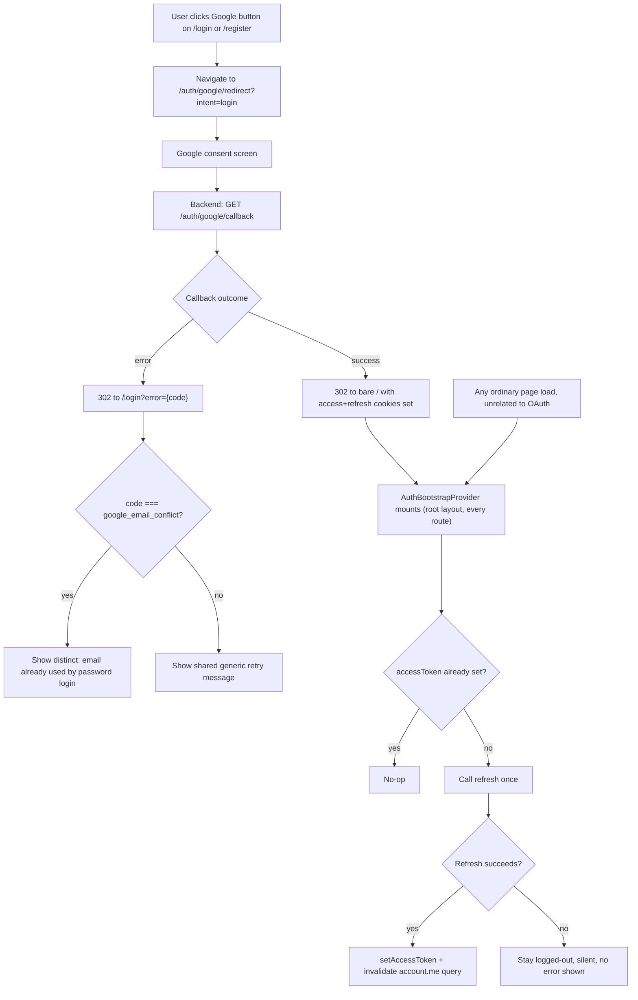

# Tech Plan: Google OAuth Login/Register (Frontend)

> Ticket    : account/02-google-oauth-login-register (frontend surface)
> Author    : Claude (agent-synthesized from 1-explore logs; pending Anhar's review)
> Date      : 2026-08-26
> Status    : Draft
> Refs      : `frontend/AGENTS.md`, `frontend/.agents/docs/README.md`, `docs/spec/1-account/features/02-google-oauth-login-register.md`, `docs/spec/1-account/tasks.md`, `docs/ui-ux/page-map.md`, `docs/ui-ux/patterns.md`, `docs/ui-ux/prototype-reference.md`, `lib/api/schema.d.ts` (generated, authoritative wire contract), backend `internal/domain/account/google_oauth.go` + `login.go` + `internal/platform/auth/token.go` + `internal/transport/http/{auth_google,auth_login,cookie}.go` (already-merged/in-tree, read directly — see §1), `1-explore/logs/{stage1-plan,stage2-gap-analysis,stage3-solutioning}.md`, `best-practices/pwa/{token-storage-and-refresh,state-management-boundaries}.md`, `best-practices/restapi/csrf-and-cookie-security.md`, `best-practices/react/api-client-centralization.md`

---

## 📋 Summary — start here

**What & why** — Backend task #2 (`GET /auth/google/redirect`,
`GET /auth/google/callback`) is already merged. The frontend has a
partially-built, currently-broken start: `/register`'s "Daftar dengan
Google" button already exists but sends an invalid `intent` value that
the merged backend rejects with `400`, and `/login` is still the raw
Phase 0 placeholder with no Google entry point at all. Deeper than the
missing UI, there is no mechanism anywhere in the frontend that bridges
the OAuth callback's HttpOnly-cookie token delivery into the SPA's
in-memory, Bearer-header-based session model that every other API call
depends on — without it, a "successful" Google login would leave the
app silently behaving as logged-out. This plan fixes the broken button,
builds `/login`'s Google entry point and error handling, and builds
that missing bridge.

**Scope** —
- Fix the `intent=register` → `intent=login` bug (already-merged
  backend only accepts `login`/`link`/`reauth`).
- Extract a shared, typed `GoogleAuthButton` used by both `/register`
  and a new `/login` entry point.
- Build `/login`'s Google button + `?error={code}` banner handling; an
  explicit "coming soon" note stands in for the credential form, which
  is a different task's scope (backend task #3).
- Add a root-level silent-hydration mechanism (`AuthBootstrapProvider`)
  that bridges the OAuth cookie into `useAuthStore` via the existing
  `/auth/refresh` endpoint.
- Out of scope: `/login`'s credential form (task #3), `link`/`reauth`
  intents and the `/account/security` surface (tasks #5/#6), any
  backend change.

**Decision flow diagram** — the callback-outcome branching genuinely
has multiple conditions (5 error codes collapsing into 2 UI treatments)
plus a separate, order-dependent hydration flow:



**Key decisions** (full rationale in §5):
- D1: Fix the Google button's `intent` value to `login` (never
  `register`) — the backend's `login` intent already creates a new
  `User` when no identity/email match exists.
- D2: `/login` gets only what task #2 owns today — Google button +
  error banner + an explicit placeholder note — not a stub credential
  form.
- D3: Token hydration is an **unconditional silent-refresh-on-app-boot**
  mechanism, not something tied to detecting "just came from OAuth" —
  the success redirect carries no query signal to detect that by
  anyway.
- D4: `google_email_conflict` gets distinguishable error copy (the
  no-auto-merge case is the one actionable, security-significant
  branch); the other four codes share one generic fallback.
- D5: Extract one shared, typed `GoogleAuthButton` component instead of
  duplicating the anchor markup a second time.

**Top risks** (High-severity only — see §7 for the full table):
- If the hydration bridge (D3) is missed or broken, "Login/Register
  dengan Google" appears to succeed (redirect happens, cookies are
  set) while the SPA silently treats the user as logged out on the
  very next API call — no visible error, just wrong behavior.
- Skipping the shared component (D5) and hand-copying the anchor a
  second time for `/login` risks reintroducing the exact class of bug
  (`intent=register`) already found live in `/register`'s existing code.

**Open items needing human input** (copied from §14's Active list):
1. Multi-tab session sync (`BroadcastChannel` or equivalent) is not in
   this plan's scope — confirm whether that's acceptable for this task
   or should be added now.
2. `/account/security` (backend's hardcoded `link`/`reauth` redirect
   target) vs. `/dashboard/security` (`page-map.md`'s actual route) —
   a real, already-shipped mismatch, not this task's to fix, but needs
   an owner.
3. `api/openapi.yaml`'s misleading `intent=login`/`register` prose —
   suggested doc fix, not this task's sole call to make.
4. Exact copy for the four collapsed error codes' shared retry message
   and the `google_email_conflict` message — placeholder text only,
   pending product sign-off (same treatment as two prior open items in
   this codebase).

---
<!-- Audience boundary: above is the human-readable digest for
review/approval. Below is the full execution-grade plan — same
decisions, same scope, expanded to file/line precision, rule IDs, and
full option comparisons. Nothing below contradicts the digest above;
it's the same source of truth at higher resolution. -->
---

## 1. Background

`docs/spec/1-account/features/02-google-oauth-login-register.md`
specifies `GET /auth/google/redirect` and `GET /auth/google/callback`
— already implemented and merged on the backend
(`docs/spec/1-account/tasks.md`: task #2 status `merged`,
`efc1111`→`ce61841`). `page-map.md` maps this feature to two frontend
surfaces: `/login`'s "Masuk dengan Google" button and `/register`'s
"Daftar dengan Google" button — no dedicated new page, per spec
Assumption B and confirmed directly against the merged backend (§9).

Neither surface is in a finished state, and one is actively broken:

- `/register` (`app/(auth)/register/page.tsx`, built by task #1) has a
  Google entry point already: a real `<a href="/auth/google/redirect?
  intent=register">` inside `RegisterForm`. Task #1's own techplan
  flagged this exact scope split as **Active Open Item #3**, pending
  confirmation from this task. Confirmed here: `intent=register` is
  not a value the merged backend accepts — `validIntent()`
  (`backend/internal/domain/account/google_oauth.go:117-120`) and the
  transport handler
  (`backend/internal/transport/http/auth_google.go:173-176`) both
  reject anything outside `login`/`link`/`reauth` with `400`. This is
  not yet live on any deployed client — `components/features/account/`
  is still untracked in `git status`, i.e. task #1 hasn't been
  committed yet — but it is broken as currently written.
- `/login` (`app/(auth)/login/page.tsx`) is still the literal Phase 0
  placeholder. Its own comment defers the credential form to "Account
  Task #3" (`03-login-session-management.md`) — a different, separate
  task, currently in progress (backend files present in the working
  tree, uncommitted). This task's job on `/login` is narrower than
  `page-map.md`'s one-line description implies: the Google button and
  its error handling, not the whole page.
- Deeper than either page: the merged backend delivers OAuth-issued
  session tokens as **HttpOnly cookies** on the callback's `302`
  (`writeAuthCookies`, `backend/internal/transport/http/cookie.go:
  110-143`) — a documented, deliberate exception to every other
  issuance path, which delivers the access token in a JSON body
  instead. The frontend's `apiFetch`
  (`lib/api/client.ts`) only ever reads an **in-memory** access token
  from `useAuthStore` and never reads a cookie value directly — nothing
  in the current codebase bridges the two. `auth-store.ts`'s own doc
  comment names this task (alongside task #3) as the one that's
  supposed to populate that store — this isn't optional scope, it's
  already assigned here.

**Confirmed via direct backend read, not assumed**: the OAuth
callback's own access-token minting
(`google_oauth.go`'s `IssueTokens`) uses a legacy JWT shape with no
`purpose` claim, which the newer `VerifyAccessToken`
(`internal/platform/auth/token.go`, built under task #3) rejects by
design. However, `IssueTokens` stores its refresh token in the same
`refresh_tokens` table `POST /auth/refresh`'s handler
(`RefreshHandler`/`Service.Refresh`, `internal/domain/account/
login.go:265`) reads from, and that endpoint's minting closure is
wired in `cmd/server/main.go:122-123` to
`auth.MintAccessToken` — the modern, purpose-claim-bearing minter. So
the OAuth-issued **refresh** token is fully valid input to
`/auth/refresh`, which mints a fresh, purpose-claim-compliant access
token in return. This directly informs D3 (§5): the frontend's
in-memory access token should *always* be obtained via `/auth/refresh`,
never read from the OAuth cookie directly — doing so is what the SPA's
architecture already requires structurally (HttpOnly cookies aren't
JS-readable at all), and it happens to also upgrade the legacy
OAuth-minted token into a verifiable one, as a side effect of the
existing rotate-on-use refresh flow, not a separate fix this task needs
to build.

## 2. Scope

**In scope:**
- Fix `RegisterForm`'s Google button `intent` value (`register` →
  `login`).
- New shared `GoogleAuthButton` component (`intent`/`label` props),
  consumed by both `/register` and `/login`.
- `/login` page: Google button, `?error={code}` banner (mapped copy
  per code), explicit "email/password login coming soon" placeholder
  note — no credential fields.
- New `AuthBootstrapProvider`: silent-refresh-on-app-boot, populates
  `useAuthStore`, invalidates the `account.me` query cache on success.
- `lib/api/client.ts`: export the refresh mechanism for the provider to
  call; replace its hand-written `RefreshResponse` type with the
  generated schema type.
- `mocks/handlers.ts`: add a `POST /auth/refresh` handler.
- Component/unit tests (Vitest + React Testing Library + MSW) for every
  rule in §4.

**Out of scope (explicit):**
- `/login`'s credential form (`POST /auth/login`) — backend task #3,
  a separate, currently in-progress task.
- `link`/`reauth` intents, and anything under `/account/security` /
  `/dashboard/security` — backend tasks #5/#6.
- Multi-tab session sync (`BroadcastChannel` or equivalent) — flagged
  as Open Item #1, not built here.
- Any backend change, including the suggested `api/openapi.yaml` prose
  fix (Open Item #3) and the `/account/security` vs.
  `/dashboard/security` mismatch (Open Item #2).
- Any client-side replication of a backend business rule — per
  `frontend/AGENTS.md` §2, the frontend never re-derives what the
  backend already decided (e.g. which intents are valid, which email
  belongs to which provider).

## 3. Requirements

| Condition | Requirement | Source/Note |
|---|---|---|
| User clicks "Masuk dengan Google" or "Daftar dengan Google" | Navigate (real browser navigation, not `apiFetch`) to `/auth/google/redirect?intent=login` | `schema.d.ts`'s generated `intent: "login" \| "link" \| "reauth"` query type; backend `validIntent()` |
| Callback succeeds, `login` intent | Backend sets access+refresh HttpOnly cookies, `302`s to bare frontend root with no query param | `google_oauth.go`'s `successResult` (confirmed via direct read, not spec — spec's Assumption B left this open, the merged code already committed to it) |
| Callback fails, `login` intent | Backend `302`s to `/login?error={code}`, `code` ∈ `{state_mismatch, nonce_mismatch, google_token_invalid, google_unavailable, google_email_conflict}` | `google_oauth.go`'s `failResult` + error-code constants |
| `/login` loads with `?error={code}` | Show a mapped error banner as `AuthShellClient`'s first child | `auth-shell-client.tsx`'s own documented convention |
| `/login` loads with no error param | Show no banner | Derived — nothing in the spec or backend implies an unconditional banner |
| App loads on any route, no in-memory access token | Attempt a one-time silent refresh via the refresh cookie | `auth-store.ts`'s doc comment (this task owns store population); `pwa/token-storage-and-refresh.md` |
| Silent refresh succeeds | Populate `useAuthStore`, refresh the `account.me` query | `pwa/state-management-boundaries.md` — session-identity-changing events must invalidate stale cached state |
| Silent refresh fails (genuine guest) | No error shown, `accessToken` stays `null` | Derived — a guest browsing `/` must never see a spurious session-expired message |

## 4. Rules & Validation

- **R1** (correct intent value): Given the "Masuk dengan Google" or
  "Daftar dengan Google" button, When clicked, Then it navigates to
  `/auth/google/redirect?intent=login` — never `intent=register`, on
  either page. The `login` intent already covers net-new-account
  creation server-side (`google_oauth.go`'s `callbackLogin`, middle
  branch), so no distinct frontend "register intent" is needed.
- **R2** (shared, typed component): Given both pages need this button,
  When implemented, Then both consume one `GoogleAuthButton` component
  (`components/features/account/`), not independently duplicated
  markup. `intent` is typed against the same literal union
  `schema.d.ts` generates for the redirect endpoint's query param
  (`"login" | "link" | "reauth"`) — a value outside that set is a
  TypeScript compile error, not a runtime `400` (this is exactly the
  class of bug R1 fixes; typing it out prevents recurrence).
- **R3** (real navigation only): Given the button renders, Then it's a
  real `<a href>` (or equivalent), never `apiFetch`/XHR — the endpoint
  issues a `302`, which only a real navigation follows correctly (task
  #1's R7 precedent, carried forward here as the shared component's own
  contract).
- **R4** (`/login` scope boundary): Given `/login` loads, When
  rendered, Then it shows: a heading, an explicit "email/password
  login coming soon" placeholder note (task #3's scope, not built
  here), the `GoogleAuthButton`, and the error-banner slot (R5) — no
  credential input fields.
- **R5** (error banner presence): Given `/login` loads with
  `?error={code}` present, Then render an error banner; given the
  param is absent, Then render nothing.
- **R6** (error code → copy mapping): Given `code === "google_email_
  conflict"`, Then show distinguishable copy indicating the email is
  already registered via password login (pointing at the existing
  login path, not encouraging a retry of the same failing action).
  Given `code` is one of `state_mismatch`/`nonce_mismatch`/
  `google_token_invalid`/`google_unavailable`, Then show one shared
  generic retry message. Given `code` is anything else/unrecognized,
  Then show the same generic fallback. The raw `code` value is never
  rendered to the user (`patterns.md` §B).
- **R7** (banner placement + focus): Given the error banner renders,
  Then it is `AuthShellClient`'s documented first child
  (`<Banner variant="error">`), and focus moves into it (or its
  containing heading) on render — matching the focus-management
  convention already established by `RegisterForm`/`VerifyEmailStatus`
  (`accessibility-fundamentals.md`).
- **R8** (bootstrap hydration trigger): Given the app loads on any
  route and `useAuthStore.accessToken` is `null`, When the root
  `AuthBootstrapProvider` mounts, Then it calls the refresh mechanism
  exactly once.
- **R9** (hydration success): Given the refresh call succeeds, Then
  `useAuthStore.setAccessToken` is called with the returned token, and
  the `accountKeys.me()` query (`lib/hooks/use-account-me.ts`) is
  invalidated/refetched — so a component that queried it before
  hydration completed doesn't keep rendering stale logged-out state
  (`pwa/state-management-boundaries.md`).
- **R10** (hydration failure is silent): Given the refresh call fails
  (genuinely logged-out guest, no valid refresh cookie present), Then
  `accessToken` stays `null` and no error/toast is shown — this must be
  indistinguishable from an ordinary guest page load.
- **R11** (at most one attempt): Given the bootstrap provider's
  hydration attempt, Then it runs at most once per app load — no retry
  loop, no re-trigger on client-side route change within the same
  load (`react/api-client-centralization.md`'s "one retry, not a
  loop" principle applied to boot-time hydration).
- **R12** (generated type, not hand-written): Given `client.ts`'s
  refresh-response parsing, When touched by this task, Then it uses
  `components["schemas"]["RefreshResponse"]` (already generated in
  `schema.d.ts`, includes `access_token_expires_at`), not the existing
  hand-written local type (`frontend/AGENTS.md` §3).
- **R13** (provider placement): Given `AuthBootstrapProvider` needs
  `useQueryClient()` (R9), Then it is mounted as a child of
  `QueryProvider` (which is itself inside `MockingProvider`, so MSW is
  ready first in mock-dev mode) in `app/layout.tsx`'s provider stack.

## 5. Decision Log

**D1 — Fix the `intent=register` bug**

| Option | Why rejected/accepted |
|---|---|
| A. `intent=login` (**chosen**) | Confirmed from the merged backend: `login` intent's three branches already include "no existing identity, email free → create `User`" — exactly what "register via Google" needs. No missing backend capability, only a wrong query value. |
| B. Add a fourth `register` value to the backend's enum | Rejected — out of this frontend task's authority; backend task #2 is merged, changing its accepted-value contract needs its own cross-track review, and A makes it unnecessary. |

**D2 — `/login` page scope**

| Option | Why rejected/accepted |
|---|---|
| A. Build only what this task owns: Google button, error banner, explicit "coming soon" note (**chosen**) | Mirrors task #1's own precedent (build what your endpoint owns now, leave what belongs to another task's endpoint for that task). Keeps root `AGENTS.md`'s honesty principle intact — the page visibly says what's missing rather than looking finished or looking unchanged. |
| B. Build the entire page including a stub credential form | Rejected — would write UI against `POST /auth/login`, an endpoint this task has no contract for; risks duplicating/conflicting with task #3's actual build. |
| C. Leave `/login` as the Phase 0 placeholder entirely | Rejected — same reasoning as task #1's own rejected "defer the whole button" option: leaves `/login` incomplete against its `page-map.md` row for no technical reason, since the Google button is fully buildable today. |

**D3 — Token hydration mechanism**

| Option | Why rejected/accepted |
|---|---|
| A. Route-specific "just came from OAuth" detection | Rejected — the success redirect carries no query signal to detect this by (confirmed via direct backend read: `successResult` returns the bare frontend URL, nothing appended). Any such mechanism collapses into "always try" anyway. |
| B. Unconditional silent-refresh-on-app-boot, root-level provider (**chosen**) | Not OAuth-specific scope creep: the access token is deliberately in-memory-only, so *any* page refresh already loses it — this task is simply the first to need the general bootstrap mechanism, which task #3's own login flow needs too (`auth-store.ts`'s "Tasks #2 and #3 share one store shape" comment). Matches `pwa/token-storage-and-refresh.md`'s documented pattern near-verbatim. |
| C. Rely on `apiFetch`'s existing reactive 401→refresh→retry path, no new code | Rejected — only fires after something has already attempted an authenticated call and gotten a `401`, producing a visible flash of logged-out UI on first render instead of hydrating before paint. |

**D4 — Error banner copy per code**

| Option | Why rejected/accepted |
|---|---|
| A. One generic message for every code | Rejected — `google_email_conflict` (the no-auto-merge case) is the one branch where a fully generic message actively misleads a legitimate user into retrying the exact same failing action; spec 02 treats it as the top-severity anti-takeover threat in the whole feature. |
| B. Distinguish `google_email_conflict`; collapse the other four into one shared fallback (**chosen**) | Matches this codebase's own precedent (`/verify-email`'s 410-vs-404 distinction, task #1 D5) — keep backend-distinguished, actionable outcomes distinguishable; the other four codes are genuinely non-actionable-differently for the user. None of the five are enumeration-sensitive (not a guessable resource ID), so nothing is leaked by differentiating. |

**D5 — Shared component vs. duplicated markup**

| Option | Why rejected/accepted |
|---|---|
| A. Duplicate the anchor markup a second time for `/login` | Rejected — directly reproduces the class of bug found live in `/register`'s existing code (an independently hand-copied `intent` value). |
| B. Extract a shared, typed `GoogleAuthButton` (**chosen**) | Cheap (one anchor's `href`/label differ, no real behavior divergence to abstract prematurely); makes `intent` a typed prop against the schema's own literal union, turning the exact bug class in D1 into a compile-time error for any future caller. |

## 6. Backward Compatibility

- **Database**: N/A — no persistence layer in `frontend/`
  (`frontend/AGENTS.md` §2). No migration involved on the frontend
  side; the backend's schema for this feature already shipped in a
  prior, already-Implemented backend techplan.
- **API**: No API changes. This plan consumes an already-shipped,
  stable contract (`GET /auth/google/redirect`,
  `GET /auth/google/callback`, `POST /auth/refresh` — all merged/
  present in the backend working tree). Purely additive from the
  frontend's side.
- **Existing clients/data**: The one existing consumer of this surface
  (`RegisterForm`'s Google button) is **not yet committed to git**
  (`components/features/account/` is untracked) — fixing its `intent`
  value is not a hotfix to shipped code, it's a fix before first
  commit. No deployed client is affected either way.
- **Deprecation path**: N/A.
- **Runbook vs. Techplan check** (`rules.md` §3): no sub-component here
  has an independent operational lifecycle (no script, no cron, no
  separate rollback) — evaluated and doesn't apply.

## 7. Edge Cases & Risks

| Risk | Likelihood | Severity | Mitigation |
|---|---|---|---|
| Hydration bridge (D3) missing/broken — user appears logged in (redirect succeeded, cookies set) but the SPA silently sends unauthenticated requests | Medium — the failure is invisible without deliberately checking `Authorization` headers | **High** — the entire feature appears broken from the user's perspective with no error surfaced | R8/R9/R11, dedicated test asserting `setAccessToken` is called and `account.me` is invalidated after a successful mocked refresh |
| `/login`'s Google button hand-copied instead of using `GoogleAuthButton` (D5), reintroducing an invalid `intent` value | Low once R2's typed prop exists, but only if a future change bypasses the shared component | **High** — breaks the entry point exactly like the bug found in `/register` today | R1/R2: typed `intent` prop makes an invalid value a compile-time error |
| Hydration silent-failure path (R10) accidentally surfaces an error/toast to a genuinely logged-out guest browsing `/` | Medium — easy to wire the failure branch the same way as a "real" error by habit | Medium — confusing, unwarranted "session expired"-style message on an ordinary first visit | R10 + dedicated test: mocked refresh failure renders no banner/toast anywhere |
| Multi-tab desync: a user completes Google login in one tab; other open tabs never learn about it (no `BroadcastChannel`/equivalent) | Medium — plausible whenever a user has the app open in two tabs during login | Medium — a second tab keeps behaving as logged-out until its own reload/hydration | **Not mitigated in this plan** — flagged as Open Item #1, scope decision needed |
| `AuthBootstrapProvider` mounted outside `QueryProvider`'s subtree | Low — straightforward to get right once specified | Medium — `useQueryClient()` throws/is unavailable, R9's cache invalidation silently fails to compile or run | R13: explicit placement instruction, verified in code review |
| Error banner (R6) accidentally renders the raw `code` string instead of mapped copy for an unrecognized/future code | Low | Low — a cryptic string briefly shown to the user, not a security issue since the code vocabulary carries no sensitive detail | R6: explicit fallback-to-generic rule, dedicated test for an unmapped code |
| Focus left on a removed/hidden element when the error banner replaces the loading state | Medium — invisible in a visual-only review pass | Medium — screen-reader/keyboard users lose their place | R7 + dedicated a11y test (`accessibility-fundamentals.md`) |
| `google_email_conflict` copy read as blaming the user or as an invitation to just retry | Low once R6/D4's distinct copy exists | Low — UX polish issue, not a security one | R6, copy exact-text pending Open Item #4 |

## 8. Interface Contract

Per `frontend/AGENTS.md` §2 ("pure presentation layer," no DB layer of
its own) and matching the shape already established for this same
repo's `account/01-register-email-verification` techplan: "API
changes" is reinterpreted as *consuming* an already-fixed contract
plus the new frontend-side additions this task adds.

**DB Schema changes:** N/A — no persistence layer in `frontend/`.

**API contract consumed** (already shipped/merged, from
`lib/api/schema.d.ts` — not authored by this task):
```typescript
// GET /auth/google/redirect?intent={login|link|reauth}
// Not a JSON endpoint — plain browser navigation, 302 to Google's consent screen.
// This task only ever sends intent="login" (R1).

// GET /auth/google/callback?code=...&state=...
// Not a JSON endpoint — browser lands via 302 at either:
//   - success (login intent): bare FRONTEND_URL, no query param
//   - failure: FRONTEND_URL + "/login?error={code}"
//     code: "state_mismatch" | "nonce_mismatch" | "google_token_invalid"
//         | "google_unavailable" | "google_email_conflict"
//     (also "google_link_conflict" for link intent — out of scope here)

// POST /auth/refresh (already registered/implemented — cmd/server/main.go:162)
// 200 -> RefreshResponse { access_token: string; access_token_expires_at?: string }
// Reads the refresh token from its own HttpOnly cookie, not the request body.
```

**New frontend-side additions (this task):**
```typescript
// lib/api/client.ts
export { tryRefreshOnce }; // was module-private; now exported for AuthBootstrapProvider (R12: uses generated RefreshResponse type, not a hand-written one)

// components/features/account/google-auth-button.tsx
type GoogleAuthButtonProps = {
  intent: "login" | "link" | "reauth"; // R2 — typed against schema.d.ts's own literal union; this task only ever passes "login"
  label: string; // e.g. "Masuk dengan Google" / "Daftar dengan Google"
};
function GoogleAuthButton(props: GoogleAuthButtonProps): JSX.Element; // real <a href>, R3

// components/features/account/google-callback-error.tsx
function GoogleCallbackError(): JSX.Element | null; // reads ?error={code} via useSearchParams (R5/R6/R7)

// components/providers/auth-bootstrap-provider.tsx
function AuthBootstrapProvider({ children }: { children: React.ReactNode }): JSX.Element; // R8-R11, R13
```

**Business logic flow (concise, presentation-layer only — every branch
is "what to render/do given what the backend already decided," never a
re-derivation of a business rule):**
```
GoogleAuthButton (mounted on both /login and /register)
  -> real navigation to /auth/google/redirect?intent=login  (R1, R3)

GoogleCallbackError (mounted on /login, inside <Suspense>)
  -> read `error` search param
  -> absent                    => render nothing (R5)
  -> "google_email_conflict"   => distinct copy (R6)
  -> any other known/unknown   => shared generic fallback (R6)
  -> on render                 => focus moves into the banner (R7)

AuthBootstrapProvider (mounted once, root layout, inside QueryProvider)
  -> on mount, if useAuthStore.accessToken === null:
       -> call tryRefreshOnce() exactly once (R8, R11)
       -> success => setAccessToken(token) + invalidateQueries(accountKeys.me())  (R9)
       -> failure => no-op, no UI signal (R10)
```

## 9. Architecture / Plan

- `GoogleAuthButton` (new) replaces `RegisterForm`'s inline anchor
  (fixing R1's bug as part of the same change) and is the single
  entry point used by the new `/login` content.
- `/login` (`app/(auth)/login/page.tsx`, modified) composes: heading,
  a static "coming soon" note, `<Suspense>`-wrapped `GoogleCallbackError`
  (same `useSearchParams()`-requires-`Suspense` pattern already
  established by `VerifyEmailStatus`/`app/verify-email/page.tsx`), and
  `GoogleAuthButton`. Continues to render inside the existing
  `AuthShellClient` — unmodified, reused as-is (D2 keeps this task
  inside the shell, unlike `/verify-email`'s deliberate top-level
  placement, since `/login` is a normal in-app auth destination, not a
  cold email-link landing).
- `AuthBootstrapProvider` (new) is a `"use client"` component, same
  shape/convention as the existing `QueryProvider`
  (`components/providers/query-provider.tsx`): one focused
  responsibility, mounted in `app/layout.tsx`'s provider stack as:
  `<MockingProvider><QueryProvider><AuthBootstrapProvider>{children}
  </AuthBootstrapProvider></QueryProvider></MockingProvider>` (R13) —
  inside `QueryProvider` so `useQueryClient()` (R9) is available, and
  inside `MockingProvider` so its effect never fires before the MSW
  worker is ready in mock-dev mode (`MockingProvider` already gates
  all children behind `ready`, confirmed by direct read of
  `mocking-provider.tsx`).
- No new TanStack Query mutation/query hook is needed for the
  hydration call itself — it's a one-shot imperative action on mount
  (`useEffect` + the exported `tryRefreshOnce`), not something that
  benefits from query-cache semantics; `accountKeys.me()` (existing)
  is what gets invalidated as a side effect (R9), not a new query key.
- Success has no dedicated landing page to build (per Area 6's direct
  backend read): the callback's `302` on success targets the bare
  frontend root — `AuthBootstrapProvider`'s root placement means
  hydration runs regardless of which page the user lands on, so no
  route-specific "callback success" surface is needed.

## 10. Implementation Details

**File**: `components/features/account/google-auth-button.tsx` (new)
- New Client Component: `intent`/`label` props (R2), real `<a href={
  "/auth/google/redirect?intent=" + intent}>` (R1, R3), styling reused
  from `RegisterForm`'s existing anchor markup.

**File**: `components/features/account/register-form.tsx`
- Change: replace the inline `<a href="/auth/google/redirect?
  intent=register">` with `<GoogleAuthButton intent="login" label=
  "Daftar dengan Google" />` (D1, D5).

**File**: `components/features/account/google-callback-error.tsx` (new)
- New Client Component: reads `error` via `useSearchParams()`, maps
  per R6, renders `<Banner variant="error">` as the first child inside
  `AuthShellClient`'s panel (R7), focus management on render.

**File**: `app/(auth)/login/page.tsx`
- Change: replace the Phase 0 placeholder with heading + "coming soon"
  note + `<Suspense>`-wrapped `GoogleCallbackError` + `GoogleAuthButton
  intent="login" label="Masuk dengan Google"` (R4).

**File**: `components/providers/auth-bootstrap-provider.tsx` (new)
- New Client Component: `useEffect` on mount, guarded by
  `useAuthStore.getState().accessToken === null`, calls the exported
  refresh function once (R8, R11); on success calls `setAccessToken`
  and `queryClient.invalidateQueries({ queryKey: accountKeys.me() })`
  (R9); on failure, no-ops (R10).

**File**: `app/layout.tsx`
- Change: wrap `children` with `AuthBootstrapProvider` inside
  `QueryProvider` (R13).

**File**: `lib/api/client.ts`
- Change: export `tryRefreshOnce` (was module-private); replace the
  hand-written `type RefreshResponse = { access_token: string }` with
  `components["schemas"]["RefreshResponse"]` from `schema.d.ts` (R12).

**File**: `mocks/handlers.ts`
- Change: add `http.post("/auth/refresh", ...)` — default happy-path
  `200` + `access_token`; individual tests override via `server.use(...)`
  for the failure case, matching the existing override convention.

## 11. Files Changed / Files NOT Changed

| File | Change Type | Description |
|---|---|---|
| `components/features/account/google-auth-button.tsx` | Add | Shared, typed Google entry-point component (R1-R3) |
| `components/features/account/register-form.tsx` | Modify | Replace inline anchor with `GoogleAuthButton` (D1, D5) |
| `components/features/account/google-callback-error.tsx` | Add | `?error={code}` banner (R5-R7) |
| `app/(auth)/login/page.tsx` | Modify | Replace Phase 0 placeholder (R4) |
| `components/providers/auth-bootstrap-provider.tsx` | Add | Silent-refresh-on-boot hydration (R8-R11, R13) |
| `app/layout.tsx` | Modify | Mount `AuthBootstrapProvider` (R13) |
| `lib/api/client.ts` | Modify | Export refresh function; generated `RefreshResponse` type (R12) |
| `mocks/handlers.ts` | Modify | Add `POST /auth/refresh` handler |
| Corresponding `*.test.tsx` for each new/modified file above | Add | Per §12 |

| File | Reason untouched |
|---|---|
| `app/(auth)/layout.tsx`, `_components/auth-shell-client.tsx` | Unmodified — `/login` continues using the existing shell as-is (D2) |
| `lib/api/account.ts` | No new typed request/response function needed — the two Google endpoints aren't JSON endpoints, and `/auth/refresh` is already wrapped in `client.ts`, not `account.ts` |
| `lib/hooks/` (no new hook file) | Hydration is a one-shot imperative effect, not a query/mutation hook (§9) |
| `app/(auth)/forgot-password/page.tsx`, `reset-password/page.tsx` | Out of scope — task #4 |
| Anything under `backend/` | Directory-boundary rule, root `AGENTS.md` §7 — out of scope for a `frontend/`-scoped session; findings referenced here are read-only cross-checks |

## 12. Testing Checklist

- [ ] R1: both Google buttons render with `href` containing exactly `intent=login`, never `intent=register`
- [ ] R2: `GoogleAuthButton`'s `intent` prop is typed against the schema's `"login" | "link" | "reauth"` union (type-level check / compile test, not just runtime)
- [ ] R3: the button renders as a real `<a>` element, not wired to any `apiFetch`/mutation call
- [ ] R4: `/login` renders a heading, the "coming soon" note, and the Google button — no credential input fields present
- [ ] R5: `/login` with no `error` param renders no banner; with `error` present, renders one
- [ ] R6: `error=google_email_conflict` shows the distinct message; each of the other four documented codes and one unmapped/unknown code all show the same shared generic fallback; the raw code string is never present in rendered output
- [ ] R7: the error banner is the first child inside `AuthShellClient`'s panel, and focus moves into it on render
- [ ] R8: with a mocked `POST /auth/refresh` and `accessToken` initially `null`, `AuthBootstrapProvider` calls it exactly once on mount
- [ ] R9: a mocked refresh success calls `setAccessToken` with the response's `access_token` and triggers an `account.me` query invalidation/refetch
- [ ] R10: a mocked refresh failure (e.g. `401`) leaves `accessToken` as `null` and renders no error/toast anywhere
- [ ] R11: re-rendering/remounting within the same app load does not trigger a second refresh call (mock call-count assertion)
- [ ] R12: `client.ts`'s refresh-response parsing type-checks against `components["schemas"]["RefreshResponse"]`, not a local duplicate type
- [ ] R13: `AuthBootstrapProvider` is a descendant of `QueryProvider` in `app/layout.tsx` (structural/render test — `useQueryClient()` resolves without throwing)

**Count-check**: 13 rules in §4 (R1–R13), 13 checklist items above — matched.

## 13. Testing Examples & Common Mistakes

| Mistake | Error/Behavior | Fix |
|---|---|---|
| Hand-copying the Google anchor into `/login` instead of using `GoogleAuthButton` | Reintroduces the exact `intent=register`-style bug class, undetected until a live `400` | Always route through the shared, typed component (R2/D5) |
| `AuthBootstrapProvider` mounted outside `QueryProvider`'s subtree | `useQueryClient()` throws or the invalidation silently no-ops | Mount order per R13/§9 — inside `QueryProvider`, inside `MockingProvider` |
| Treating a failed silent refresh as an error to surface to the user | A guest browsing `/` for the first time sees a spurious "session expired"/error toast | R10 — failure is always silent; only a genuinely triggered action (e.g. a stale-session 401 on an authenticated page) should ever show session-related messaging |
| Rendering the raw `error` query-param value directly in the banner | A cryptic backend-internal string (e.g. `state_mismatch`) shown verbatim to the user | R6 — always map through the known-code table, fallback to the shared generic string for anything unmapped |
| Calling refresh on every render/mount instead of once per app load | Redundant network calls, possible refresh-token rotation races if fired concurrently | R11 — guard with a ref/module-level flag, same "no retry loop" discipline as `apiFetch`'s own 401 handling |
| Building `/login`'s email/password form "while I'm in here" | Duplicates/conflicts with task #3's actual build of the same page | D2/R4 — this task's `/login` scope stops at the Google button + error banner + placeholder note |

## 14. Open Items

### Active — need external input or verification

1. **Multi-tab session sync** — `pwa/token-storage-and-refresh.md`'s
   checklist calls for `BroadcastChannel` (or equivalent) so a login
   completed in one tab is reflected in other open tabs. Not in this
   plan's scope (not raised anywhere in the Stage 2/3 raw docs, and
   this is the first feature to establish a real session at all in
   this codebase). Needs a scope call: build it now as part of this
   task, or explicitly defer to whenever `logout` (task #3) exists and
   tab-sync becomes unavoidable either way.
2. **`/account/security` vs. `/dashboard/security`** — the backend's
   hardcoded `link`/`reauth` redirect constant
   (`frontendSecurityPath = "/account/security"`, already merged)
   doesn't match `page-map.md`'s actual route
   (`/dashboard/security`). Out of scope for this task (link/reauth
   are tasks #5/#6), but needs an owner before those tasks start —
   either the backend constant or the page-map route has to change.
3. **`api/openapi.yaml`'s misleading `intent=login`/`register` prose**
   — likely origin of the D1 bug (a formal `enum:` list two lines away
   from prose casually mentioning "register" as if it were a valid
   value). Suggested one-line doc fix, but this is a shared cross-track
   document this task doesn't have sole authority to edit unilaterally.
4. **Exact copy for R6's error messages** — both the
   `google_email_conflict`-specific message and the shared four-code
   generic fallback are placeholder Indonesian text pending product
   sign-off, same treatment as two prior open items already recorded
   in this codebase's `RegisterForm`/`VerifyEmailStatus` work.

### Resolved (kept for reference)

1. ~~**Whether the OAuth-issued access token is even usable against
   task #3's `VerifyAccessToken`**~~ **RESOLVED — during this
   synthesis (2026-08-26), via direct backend code read.** Confirmed
   `IssueTokens` (Google OAuth callback) mints a legacy access token
   with no `purpose` claim, but its refresh token is stored in the same
   table `POST /auth/refresh` reads from, and that endpoint's minting
   closure (`cmd/server/main.go:122-123`) is wired to the modern
   `auth.MintAccessToken`. Consequence: D3's hydrate-via-refresh design
   already sidesteps this — the frontend's in-memory access token is
   always obtained via `/auth/refresh`, never read from the OAuth
   cookie directly, so it's always the modern, verifiable shape. No
   further mitigation needed in this plan.
2. ~~**Whether `/login`'s exact callback destinations were still an
   open frontend decision (spec 02 Assumption B)**~~ **RESOLVED —
   during Stage 2/this synthesis, via direct backend code read.**
   `google_oauth.go`'s `successResult`/`failResult` already hardcode
   the targets (bare root on success, `/login?error=...` on login
   failure) — not an open choice for this task to make, only to build
   against.
