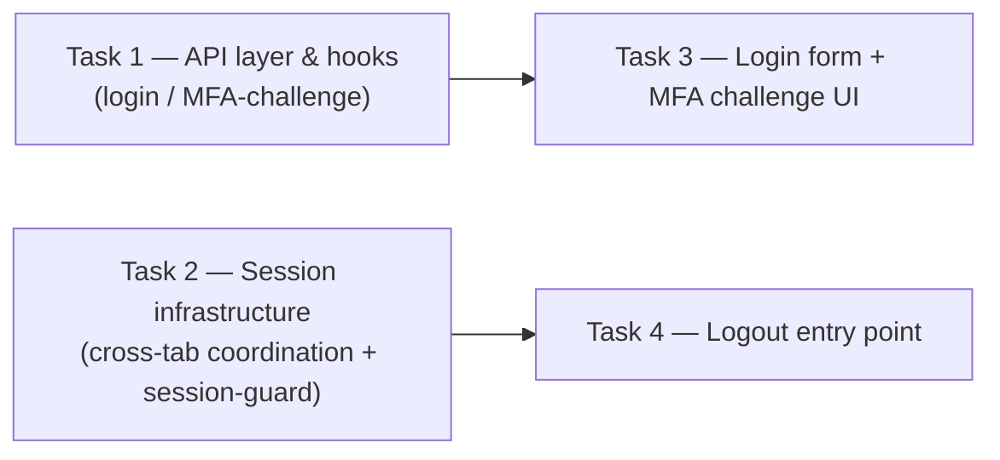

# Task Manifest — account/03-login-session-management (frontend)

> Snapshot at generation time (2026-08-26) — not a living document, does
> not track progress status (done/in-progress/blocked). Status tracking
> belongs to the PR/ticket domain, not this workspace, per
> `2-3-techplan-decomposition-prompt.md`.
> Source techplan (contract, unchanged, single source of truth for
> §1-7/Summary/§14): [`../techplan.md`](../techplan.md) — "Tech Plan:
> Login & Session Management (Frontend)".

## Step 0 — Decomposition justification

**Answer: yes, decompose.** The source techplan is Complex tier per
`best-practices/model-routing.md` (19 rules in §4, well over the ≥15
threshold, touches the `auth` domain contract directly). The
"multiple chunks reviewable/executed separately" trigger from
`2-3-techplan-decomposition-prompt.md`'s "When To Use This" genuinely
applies: the plan mixes two qualitatively different engineering
concerns the techplan's own §7 already treats as separate risk
surfaces — steady, precedent-following form/UI work (login form) versus
novel, correctness-critical browser-concurrency work (Web Locks +
`BroadcastChannel`, zero precedent anywhere in this codebase). The
resulting split is 4 substantial, non-trivial task boundaries, not a
"decomposition for its own sake" outcome.

**Process caveat, not a blocker**: the source techplan's Status is
`Draft` with 3 Active Open Items, whereas the decomposition prompt's own
"Input" section describes running this "after the techplan contract has
been locked." None of the 3 open items (login-success redirect target,
copy sign-off, a `page-map.md` doc suggestion) affect task boundaries,
file ownership, or the dependency graph below — decomposing now does not
risk having to redo the split once those resolve.

## Splitting axis

**Combined dependency/sequence chain + component boundary.** Two
foundation pieces — the login/MFA API layer, and cross-tab/session
infrastructure — have zero dependency on each other and are genuinely
different code modules; each feeds exactly one downstream UI consumer.
This produces a clean 2×2 graph rather than an arbitrary cut, matching
the source prompt's allowance to combine axes "if the techplan is
complex enough," defaulting toward dependency-chain per its own
tie-breaker rule.

## Tasks

| # | File | Title | Rules covered | Depends on |
|---|---|---|---|---|
| 1 | [`task-01-api-layer-login-mfa.md`](task-01-api-layer-login-mfa.md) | API layer & hooks for login / MFA-challenge | R3 (hook-layer), R4 (hook-layer), R7, R19 (partial: login + login/mfa mocks) | none |
| 2 | [`task-02-session-infrastructure.md`](task-02-session-infrastructure.md) | Session infrastructure: cross-tab refresh coordination + session-guard redirect | R11, R12, R13, R14, R15, R16 | none |
| 3 | [`task-03-login-mfa-ui.md`](task-03-login-mfa-ui.md) | Login form + MFA challenge UI | R1, R2, R5, R6, R8, R9, R10, R3/R4/R7 (component-layer) | Task 1 |
| 4 | [`task-04-logout.md`](task-04-logout.md) | Logout entry point | R17, R18, R19 (partial: logout mock) | Task 2 |

**Rule coverage check**: R1-R19 (19 rules total) each appear in exactly
one task's "owned" list, except R3/R4/R7 which are deliberately owned at
two layers (hook-layer in Task 1, component-layer in Task 3) — noted
explicitly in both task files rather than silently duplicated, since the
two layers have genuinely distinct testable behavior. R19 is split by
endpoint across Task 1 (login/login-mfa mocks) and Task 4 (logout mock).

## Dependency graph

- **Task 1** and **Task 2** have **no hard dependency on each other** —
  parallel-eligible, can be executed by two different agents/sessions
  simultaneously.
- **Task 3** hard-depends on **Task 1** (imports `useLogin`/
  `useLoginMfa`).
- **Task 4** hard-depends on **Task 2** (imports
  `postAuthChannelMessage`); its redirect-after-logout behavior is
  provided end-to-end by Task 2's `SessionGuardProvider`, not built
  redundantly inside Task 4.
- **Same-file sequencing note (not a logical dependency, a merge-conflict
  avoidance note)**: Task 1 and Task 4 both modify `lib/api/account.ts`
  and `mocks/handlers.ts` (Task 1 adds `login`/`loginMfa` + their two
  mocks; Task 4 adds `logout` + its one mock — no overlapping lines).
  Apply Task 1 before Task 4 if both are being merged into the same
  branch to avoid an avoidable conflict, even though Task 4 does not
  need Task 1's code to compile or function.

## Model routing (per `best-practices/model-routing.md`)

Source techplan tier: **Complex** (§4 rules ≥ 15, touches auth contract).
Complex-tier "Coding/build," decomposed: *"GLM 5.2 (max) / DeepSeek V4
Pro per sub-task"* — assigned per-task below using the table's own
tie-breaker ("GLM when the work leans on diagrams, state-transitions, or
multi-step reasoning. DeepSeek V4 Pro when it's rule-table-heavy/
precision work without a diagram").

| Task | Recommended model | Why |
|---|---|---|
| 1 — API layer & hooks | **DeepSeek V4 Pro** | Pattern-following (mirrors `useRegister`/`register()`'s already-merged shape), rule-table-heavy, no branching/diagram of its own. |
| 2 — Session infrastructure | **GLM 5.2 (max)** | Highest-novelty, highest-correctness-risk task in the plan — a multi-step, state-transition-heavy coordination mechanism (Web Locks + `BroadcastChannel`) with zero precedent anywhere in this codebase; source techplan §7's #1 High-severity risk. |
| 3 — Login form + MFA challenge UI | **GLM 5.2 (max)** | Genuine multi-branch state (password step ↔ MFA step, 4 distinct outcomes per step); source techplan §7 flags this as High-severity specifically for having zero existing visual/code precedent — the highest first-time-implementation risk in the whole plan. |
| 4 — Logout entry point | **DeepSeek V4 Pro** | Smallest, most mechanical slice — an idempotent mutation, an unconditional cleanup sequence, and one gated button, no branching logic of its own. |

Per `model-routing.md`'s own caveats section: these are starting
recommendations, not calibrated against real execution runs yet — adjust
if a task's actual difficulty diverges from this estimate once build
starts.

## Review note

Every task file produced here remains subject to the review checklist in
`workflow/4-code-review/checklist.md`, same as any other derived-section
content, per `2-3-techplan-decomposition-prompt.md`'s own
cross-reference.
