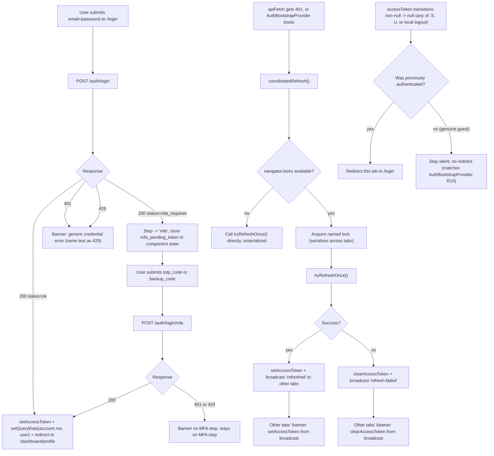

# Tech Plan: Login & Session Management (Frontend)

> Ticket    : account/03-login-session-management (frontend surface)
> Author    : Claude (agent-synthesized from 1-explore logs; pending Anhar's review)
> Date      : 2026-08-26
> Status    : Draft
> Refs      : `frontend/AGENTS.md`, `frontend/.agents/docs/README.md`, `docs/spec/1-account/features/03-login-session-management.md`, `docs/spec/1-account/tasks.md`, `docs/ui-ux/page-map.md`, `docs/ui-ux/patterns.md`, `docs/ui-ux/prototype-reference.md`, `docs/ui-ux/design-guidelines.md`, `docs/ui-ux/design-reference-usage.md`, `lib/api/schema.d.ts` (generated, authoritative wire contract), backend `internal/domain/account/{login.go,entity.go,mfa_verifier.go}` + `internal/transport/http/{auth_login.go,cookie.go,errors.go}` (already-built/in-tree, read directly — see §1), `1-explore/logs/{stage1-plan,stage2-gap-analysis,stage3-solutioning}.md`, prior techplan `account/02-google-oauth-login-register` (this plan resolves its Open Item #1), `best-practices/pwa/{token-storage-and-refresh,state-management-boundaries}.md`, `best-practices/react/{api-client-centralization,form-validation-boundary,data-fetching-conventions,component-test-mocking-discipline}.md`, `best-practices/restapi/csrf-and-cookie-security.md`

---

## 📋 Summary — start here

**What & why** — Backend task #3 (`POST /auth/login`, `POST /auth/login/mfa`, `POST /auth/refresh`, `POST /auth/logout`) has already gone through build, code review, a patch round, and testing in the working tree, despite `tasks.md`'s tracker text still reading "build not started." `/login` currently has only the Google-OAuth entry point (task #2); its own code comment names this task as the one that adds the credential form. Deeper than the missing form: the backend's own spec (Assumption D) explicitly flags that without cross-tab coordination, two browser tabs open at once will trigger the backend's refresh-token reuse-detection and force-revoke the whole session — a real bug, not a hypothetical, and explicitly deferred to this exact task. There is also currently no way to log out anywhere in the app, and no redirect when a session dies while a user is already inside the dashboard. This plan builds the login form (including the MFA challenge step, which has zero existing UI or visual precedent anywhere), fixes the cross-tab session race, and adds logout.

**Scope** —
- Extend `/login` with the email/password credential form + MFA challenge step, inside the existing `LoginForm` composition (matching `RegisterForm`'s shape).
- Cross-tab refresh coordination (Web Locks API + `BroadcastChannel`) so concurrent tabs never trigger reuse-detection revocation — resolves task #02's carried-forward Open Item #1.
- Logout: a Dashboard Shell entry point, cross-tab logout fan-out, full query-cache reset.
- A redirect out of the dashboard when a session is lost (locally, or via another tab's logout).
- `lib/api/account.ts` + hooks + mock handlers for all four endpoints.
- Out of scope: `/forgot-password`, `/reset-password` (task #4); MFA *enrollment* (`/dashboard/security`, tasks #5/#6 — this task only builds the login-time MFA *challenge*); any backend change.

**Decision flow diagram** — the login flow has genuine branching (password step vs. MFA-required vs. lockout vs. generic failure) plus a cross-tab coordination state machine where order matters:



**Key decisions** (full rationale in §5):
- D1: `LoginForm` owns its own step state (`'password' | 'mfa'`) and its own `GoogleAuthButton` (shown only during the password step) — mirrors `RegisterForm`'s composition exactly.
- D2: `mfa_pending_token` lives in component-local `useState`, not the Zustand store or `sessionStorage` — lost on refresh by design, matching the token's own short-TTL exposure-bounding rationale.
- D3: Cross-tab refresh coordination uses the **Web Locks API for mutual exclusion + `BroadcastChannel` for fan-out**, not a hand-rolled `BroadcastChannel`-only election — approved by Anhar 2026-08-26 as a deviation from spec 03's literal wording, since it satisfies the same stated goal without the race window a hand-rolled protocol would have.
- D4: A single Zustand-store subscription (`SessionGuardProvider`) is the one place that redirects to `/login` on any authenticated→unauthenticated transition, regardless of trigger (local refresh failure, this tab's own logout, or another tab's logout broadcast) — not three separate redirect call sites.
- D5: Logout unconditionally clears local state (store + full query cache) regardless of the network call's outcome, per spec 03's own idempotent/always-succeeds-from-the-client's-perspective design.
- D6: The password field gets a show/hide toggle as a small local composition (not a change to the shared `Input` primitive) — Tier 1 visual precedent, single current consumer.
- D7: On successful login, the response's `user` object is written directly into the `account.me` query cache (`setQueryData`), not just invalidated — confirmed byte-for-byte structurally identical to what `GET /account/me` returns, so no extra round-trip is needed.

**Top risks** (High-severity only — see §7 for the full table):
- Without D3, two tabs open near the access-token's 15-minute expiry force-revoke the user's entire session — the exact bug spec 03 Assumption D anticipated and assigned to this task.
- The MFA challenge step (password-step → MFA-step transition, `mfa_pending_token` handling, banner-not-field-error) has **zero existing visual or code precedent anywhere in this codebase** — highest first-time-implementation risk in this plan.
- A missed/broken `SessionGuardProvider` subscription (D4) leaves a user staring at a dashboard page that looks logged-in while every request underneath silently 401s, with no visible signal anything is wrong.

**Open items needing human input** (copied from §14's Active list):
1. Redirect target after a successful login (`/dashboard/profile`, chosen by analogy to the Dashboard Shell's own logo-link target — no explicit requirement exists in any raw doc) — confirm or override.
2. Copy sign-off for the MFA-step field labels/helper text and whether the session-expiry redirect to `/login` carries any explanatory copy — placeholder-quality pending product sign-off, same treatment as other TBD-copy items already recorded elsewhere in this codebase.
3. `page-map.md`'s Cross-Cutting UI Elements table has no row for a logout affordance — suggested doc addition, not this task's to make unilaterally.

---
<!-- Audience boundary: above is the human-readable digest for
review/approval. Below is the full execution-grade plan — same
decisions, same scope, expanded to file/line precision, rule IDs, and
full option comparisons. Nothing below contradicts the digest above;
it's the same source of truth at higher resolution. -->
---

## 1. Background

`docs/spec/1-account/features/03-login-session-management.md` specifies four endpoints: `POST /auth/login`, `POST /auth/login/mfa`, `POST /auth/refresh`, `POST /auth/logout`. `docs/spec/1-account/tasks.md`'s status tracker reads "in progress... build not started," but the actual working tree (`backend/.local-agents/works/account/03-login-session-management/`) already has populated `3-build/`, `4-code-review/`, `4-patch/`, and `5-testing/` directories, and the code itself is present and readable — confirmed directly (not assumed) by reading `internal/domain/account/login.go`, `internal/transport/http/auth_login.go`, `cookie.go`, and `errors.go`. The tracker text is stale, the same pattern already found and noted during task #2's own exploration.

`page-map.md` maps this feature to `/login`'s "Login form" (the "Masuk dengan Google" half was already built by task #2). Neither the credential form nor the MFA challenge step exists yet:

- `/login` (`app/(auth)/login/page.tsx`) currently renders only `GoogleCallbackError` + a static "coming soon" note + `GoogleAuthButton`. Its own code comment names this task as the one that "extends this page (adds the form above/alongside the Google button + divider, matching `RegisterForm`'s own composition), not replaces it."
- No page-map.md route, component, or store models the MFA challenge step (`POST /auth/login/mfa`) at all — not `/dashboard/security` (a different feature: MFA *enrollment*, tasks #5/#6, itself still an unbuilt placeholder). Confirmed directly: `internal/domain/account/mfa_verifier.go`'s `stubMfaVerifier` **fails closed on every code** until task #6 ships real TOTP/backup-code verification — meaning the `mfa_required` branch of `/auth/login`, even once this task builds its UI, cannot actually be driven to a real success outcome against the live backend today (no user can have MFA enrolled, since enrollment doesn't exist). This does not block building the UI — the wire contract is real and already implemented server-side — but it means this task's MFA-step success path is verifiable only via mocks until task #6 lands. Worth stating plainly rather than leaving implicit.
- `lib/api/client.ts`'s `apiFetch`/`tryRefreshOnce` (built by task #2) already handles the single-tab 401→refresh→retry-once path. Spec 03's own Assumption D explicitly defers cross-tab coordination "to when the `account` domain's frontend track starts" — this task. Confirmed via the file list: no `BroadcastChannel` reference exists anywhere in `lib/` or `components/providers/` today. Without it, two tabs both hitting `/auth/refresh` near the access token's 15-minute TTL causes the backend's reuse-detection (INV-account-04, `login.go`) to revoke the entire token family — a real, spec-acknowledged forced-logout bug, not a hypothetical edge case. Task #2's own techplan carried this forward explicitly as its Open Item #1 ("needs a scope call... this task, or explicitly defer to whenever `logout`... exists and tab-sync becomes unavoidable either way") — this task is that scope call, resolved as: build it now (D3).
- No logout entry point exists anywhere in the codebase (`DashboardShellClient`'s header has no button/menu for it), and no mechanism redirects a user whose session dies (locally or via reuse-detection) while they're already inside `/dashboard/*`.

**Confirmed via direct backend read, not assumed:**
- The generic credential-failure string is `"Email atau password salah."` (`internal/transport/http/errors.go:70`, `problemDetailGenericCredential`), used **verbatim identically** for both the `401` (wrong credentials / wrong MFA code) and `429` (lockout) cases — confirming spec 03's "same generic detail text, only the status code differs" rule is not just documented intent but the actual shipped string.
- The refresh cookie (`kencleng_refresh`, `internal/transport/http/cookie.go:10`) is `HttpOnly` + conditionally `Secure` + `SameSite=Strict` — matches `restapi/csrf-and-cookie-security.md`'s minimum-mitigation checklist (first layer: `SameSite`), and `lib/api/client.ts` already attaches the second layer (`X-Requested-With: kencleng-frontend` custom header) on every mutating call — no gap here, confirmed rather than assumed.
- `LoginResult.User` (`internal/domain/account/entity.go`'s `LoginUserView`) has the exact same fields as `components["schemas"]["User"]` (`id`, `name`, `email`, `email_verified`, `roles`, `auth_providers`, `mfa_enabled`, `created_at`) — i.e. `LoginResponse.user` is structurally identical to what `GET /account/me` already returns. This directly informs D7 (§5): the login success handler can write this object straight into the `account.me` query cache instead of merely invalidating and re-fetching.

## 2. Scope

**In scope:**
- `LoginForm` component (`components/features/account/login-form.tsx` + `login-schema.ts`): email/password fields, password show/hide toggle, "Lupa password?" link, submit → password-step handling, MFA-step handling, embedded `GoogleAuthButton` (password step only), banner-first error display for both steps.
- `/login/page.tsx`: render `LoginForm` in place of the current placeholder note + static Google button; existing `GoogleCallbackError` stays as-is.
- `lib/api/account.ts`: `login`, `loginMfa`, `logout` functions.
- `lib/hooks/`: `use-login.ts`, `use-login-mfa.ts`, `use-logout.ts`.
- `lib/api/auth-channel.ts` (new): typed `BroadcastChannel` wrapper (`kencleng-auth` channel) shared by the refresh-coordination path and the logout fan-out path.
- `lib/api/client.ts`: `coordinatedRefresh()` wrapping the existing `tryRefreshOnce()` with Web Locks serialization + broadcast on outcome; `apiFetch`'s 401 handler and `AuthBootstrapProvider` both switch to calling it instead of `tryRefreshOnce()` directly.
- `components/providers/auth-bootstrap-provider.tsx`: extended to also subscribe to the auth channel (apply another tab's refresh/logout outcome to this tab's store).
- `components/providers/session-guard-provider.tsx` (new): subscribes to `useAuthStore`, redirects to `/login` on an authenticated→unauthenticated transition.
- `app/layout.tsx`: mount `SessionGuardProvider`.
- `app/(dashboard)/_components/dashboard-shell-client.tsx`: a "Keluar" (logout) button, visible only when `useAccountMe()` has data.
- `mocks/handlers.ts`: default handlers for `/auth/login`, `/auth/login/mfa`, `/auth/logout`.
- `app/(auth)/login/page.test.tsx`: rewritten (current negative assertions — "no email/password fields" — are directly contradicted by this task).
- Component/unit tests (Vitest + React Testing Library + MSW) for every rule in §4.

**Out of scope (explicit):**
- `/forgot-password`, `/reset-password` real forms — task #4.
- MFA *enrollment* (QR/backup codes, `/dashboard/security`) — tasks #5/#6. This task consumes `mfa_enabled`/the challenge endpoint only, never enrolls anyone.
- Any backend change, including the suggested `page-map.md` Cross-Cutting UI Elements doc addition (Open Item #3).
- A user-menu/dropdown redesign of the Dashboard Shell header — a single button is sufficient for this task's endpoint list; a richer menu is a natural follow-up once more dashboard actions exist.
- Any client-side replication of a backend business rule (lockout thresholds, TOTP verification, reuse-detection) — per `frontend/AGENTS.md` §2, the frontend only renders what the backend already decided.

## 3. Requirements

| Condition | Requirement | Source/Note |
|---|---|---|
| User submits email+password on `/login` | `POST /auth/login` | `schema.d.ts` `LoginRequest` |
| `200 status=ok` | Populate store + cache, redirect (Open Item #1: target) | `LoginResponse` |
| `200 status=mfa_required` | Transition to MFA step, hold `mfa_pending_token` locally | `LoginMfaRequiredResponse` |
| `401` (wrong credentials) or `429` (lockout) | Identical generic banner text, both cases | `errors.go:70`, spec 03 |
| User submits `totp_code` or `backup_code` on MFA step | `POST /auth/login/mfa` — exactly one of the two must be present | `LoginMfaRequest` |
| MFA `200` | Same success handling as password-step success | `LoginResponse` |
| MFA `401`/`429` | Same generic banner, stays on MFA step | spec 03 |
| App boots or `apiFetch` gets `401` | `coordinatedRefresh()`, not raw `tryRefreshOnce()` | D3, resolves task #02 Open Item #1 |
| A tab's coordinated refresh completes (success or failure) | Broadcast the outcome to sibling tabs | spec 03 Assumption D |
| `accessToken` transitions non-null → null | Redirect this tab to `/login`, unless it was already null (never-authenticated guest) | D4, extends `AuthBootstrapProvider`'s existing R10 discipline |
| Authenticated user clicks "Keluar" | `POST /auth/logout`, then unconditionally clear local state + broadcast logout to sibling tabs | spec 03 (idempotent, always `204`) |
| `LoginResponse.user` received | Write directly into `account.me`'s query cache | Confirmed structurally identical to `User` (§1) |

## 4. Rules & Validation

- **R1** (login form fields): Given `/login` loads, When rendered, Then it shows email + password fields (password schema: non-empty, min 8 chars — matches the backend's length-only policy already documented for registration, `RegisterForm`'s own precedent), a "Lupa password?" link to `/forgot-password`, a submit button, and — only in the password step (R9) — a divider + `GoogleAuthButton intent="login" label="Masuk dengan Google"`.
- **R2** (password show/hide): Given the password field, When the toggle is clicked, Then the field's `type` switches between `password`/`text`, and the toggle's accessible label switches between "Tampilkan password"/"Sembunyikan password" — composed locally (D6), not a change to the shared `Input` primitive.
- **R3** (password-step submit → success): Given valid credentials with no MFA enrolled, When `POST /auth/login` returns `200 status=ok`, Then `useAuthStore.setAccessToken(access_token)`, `queryClient.setQueryData(accountKeys.me(), user)` (D7), and redirect to `/dashboard/profile` (Open Item #1).
- **R4** (password-step submit → MFA required): Given valid credentials with MFA enrolled, When `POST /auth/login` returns `200 status=mfa_required`, Then the component's `step` state becomes `'mfa'`, `mfa_pending_token` is stored in local `useState` (D2) — no store/cache mutation, no cookie set yet (matches spec 03: "no refresh cookie is set yet").
- **R5** (password-step submit → failure): Given wrong credentials or a locked-out identifier, When `POST /auth/login` returns `401` or `429`, Then render `<Banner variant="error">{error.detail}</Banner>` as the form's first child (never attached to the email/password input's own `error` prop — the confirmed, not-fixed Known Issue #1 from the Tier 1 prototype must not be reproduced), falling back to a generic frontend-owned message only if `.detail` is absent (network/5xx).
- **R6** (MFA step fields): Given `step === 'mfa'`, When rendered, Then show one field pair — `totp_code` (primary) and a "Gunakan kode cadangan" toggle revealing `backup_code` instead — with client-side validation requiring exactly one of the two to be non-empty (the generated `LoginMfaRequest` type only documents this as a comment, R6 is where the frontend actually enforces it as UX). No Google button in this step (R9).
- **R7** (MFA-step submit → success): Given a valid `mfa_pending_token` and correct code, When `POST /auth/login/mfa` returns `200`, Then identical handling to R3 (same success path for both branches).
- **R8** (MFA-step submit → failure): Given an invalid code or MFA-stage lockout, When `POST /auth/login/mfa` returns `401` or `429`, Then the same banner-first treatment as R5, and the user **stays on the MFA step** (not bounced back to re-enter the password) — the `mfa_pending_token` is still valid (5-minute TTL) unless it has expired, in which case R8 still shows the generic failure banner (spec 03: an expired/malformed token also returns `401`) and the user must restart from the password step since there is no token left to retry with.
- **R9** (Google button gating): Given `step === 'mfa'`, Then `GoogleAuthButton` and its divider are not rendered — only relevant during the password step.
- **R10** (`mfa_pending_token` lifetime): Given a page refresh/navigation away mid-MFA-step, When the component remounts, Then it starts back at `step === 'password'` with no memory of the prior attempt (component-local state, not persisted — D2's accepted trade-off).
- **R11** (coordinated refresh — mutual exclusion): Given any caller needs a refresh (`apiFetch`'s 401 handler, or `AuthBootstrapProvider`'s boot-time hydration), When `navigator.locks` is available, Then the actual `tryRefreshOnce()` call is wrapped in `navigator.locks.request('kencleng-refresh-token', ...)`, serializing concurrent attempts across tabs in the same origin instead of letting them race.
- **R12** (coordinated refresh — fallback): Given `navigator.locks` is unavailable (unsupported browser, or a non-browser test environment), Then `coordinatedRefresh()` falls back to calling `tryRefreshOnce()` directly, unserialized — an explicit, accepted degradation, not a silent gap.
- **R13** (broadcast on outcome): Given a coordinated refresh completes inside the lock, When it succeeds, Then broadcast `{ type: 'refreshed', accessToken, accessTokenExpiresAt }` on the `kencleng-auth` channel; when it fails, broadcast `{ type: 'refresh-failed' }`.
- **R14** (broadcast reception): Given any tab's `AuthBootstrapProvider`-mounted listener receives a `'refreshed'` message, Then it calls `setAccessToken` with the broadcast token; given it receives `'refresh-failed'` or `'logged-out'`, Then it calls `clearAccessToken`.
- **R15** (session-guard redirect): Given `useAuthStore`'s `accessToken` transitions from non-null to null (via any path — R13/R14's failure branch, or R16's logout), When `SessionGuardProvider`'s subscription observes it, Then it redirects the current tab to `/login`.
- **R16** (silent guest, no redirect): Given `accessToken` was already `null` (a page load that never had a session, or a refresh that fails on first boot — `AuthBootstrapProvider`'s existing R10 case), When the same transition-check runs, Then no redirect fires — this must stay indistinguishable from an ordinary guest page load, exactly as already required of `AuthBootstrapProvider`.
- **R17** (logout action): Given an authenticated user (`useAccountMe()` has data) clicks "Keluar" in `DashboardShellClient`, When `POST /auth/logout` settles (success or failure — logout is idempotent/always-`204` per spec 03), Then unconditionally: `clearAccessToken()`, `queryClient.clear()` (full cache reset — `pwa/state-management-boundaries.md`'s "no store forgotten" checklist item, not just `account.me`), and broadcast `{ type: 'logged-out' }` on the auth channel. `SessionGuardProvider` (R15) handles the actual redirect — the logout handler itself does not separately navigate.
- **R18** (logout button visibility): Given `useAccountMe()`'s data is not yet loaded, is loading, or errored, Then the "Keluar" button does not render — gated on the same primitive as nav-item role-filtering (`useHasRole`'s own "safe default: hide" discipline), not a role array (logout applies to any authenticated user, not a role subset).
- **R19** (mocks): `mocks/handlers.ts` gains default handlers for `POST /auth/login` (200 `status=ok`), `POST /auth/login/mfa` (200), and `POST /auth/logout` (204) — individual tests override via `server.use(...)` for every other branch (401/429/mfa_required), matching the existing `/auth/refresh` convention.

## 5. Decision Log

**D1 — `/login` composition**

| Option | Why rejected/accepted |
|---|---|
| A. One `LoginForm` component owning its own step state + embedded `GoogleAuthButton` (**chosen**) | Mirrors `RegisterForm`'s already-merged shape exactly; `/login`'s own code comment explicitly names this composition. |
| B. Page-level composition, narrower `CredentialLoginForm` + page keeps the existing static Google button markup | Rejected — duplicates Google-button JSX in spirit across two places for no benefit. |
| C. Two separate components for password/MFA steps, step state lifted to the page | Rejected — `RegisterForm` already establishes the precedent of a form component owning its own internal multi-state UI (idle → success view); this is the same shape one level more complex, not a different one. |

**D2 — `mfa_pending_token` storage**

| Option | Why rejected/accepted |
|---|---|
| A. Component-local `useState` (**chosen**) | Reuses `RegisterForm`'s own precedent for transient view state; a refresh mid-MFA-step is an acceptable cost against reintroducing a version of the exposure risk the token's short TTL exists to bound. |
| B. `useAuthStore` (Zustand) | Rejected — the store's own doc comment is explicit that it's deliberately unpersisted and access-token-only; folding in an unrelated, much-shorter-lived value conflates two different lifetimes for no consumer that needs it outside `LoginForm`. |
| C. `sessionStorage` | Rejected — survives refresh, but reintroduces a version of the exact "somewhere it shouldn't be" exposure risk (proxy log, browser history, device inspection) the backend's 5-minute TTL was deliberately chosen to bound. |

**D3 — Cross-tab refresh coordination**

| Option | Why rejected/accepted |
|---|---|
| A. Literal `BroadcastChannel`-only election (claim message + wait + tie-break) | Rejected as the sole mechanism — `BroadcastChannel` delivery is asynchronous, so a hand-rolled election over it alone cannot fully close the exact concurrency race it's meant to prevent without significant added protocol complexity. |
| B. Web Locks API for mutual exclusion + `BroadcastChannel` for fan-out (**chosen, approved by Anhar 2026-08-26**) | Web Locks is a browser-native, purpose-built primitive for exactly this cross-tab-mutex problem — race-free by construction, unlike a hand-rolled protocol. `BroadcastChannel` still does the fan-out spec 03's wording emphasizes. Satisfies spec 03 Assumption D's stated *goal* through a different named *mechanism* — recorded as a deliberate, human-approved deviation from the spec doc's literal text, not a silent substitution. |
| C. Defer entirely (ship without it) | Rejected — spec 03 Assumption D explicitly assigns this to "when the account domain's frontend track starts" (this task); shipping without it means shipping the exact bug the backend spec already anticipated. |

**D4 — Session-expiry redirect: one subscription vs. per-call-site redirects**

| Option | Why rejected/accepted |
|---|---|
| A. `SessionGuardProvider` subscribes once to `useAuthStore`, redirects on any non-null→null transition (**chosen**) | Every path that can end a session (local refresh failure, this tab's logout, another tab's broadcast logout) already funnels through the same two store actions (`setAccessToken`/`clearAccessToken`) — one subscriber covers all three by construction, and the "was this a genuine guest" distinction (R16) falls out of the transition check itself rather than needing a separate flag threaded through three call sites. |
| B. Each trigger (refresh failure, logout handler, broadcast listener) calls `router.push('/login')` itself | Rejected — duplicates the same guard logic three times, and two of those three call sites (`client.ts`, the broadcast listener) aren't React components and would need `next/navigation`'s router threaded into non-component code awkwardly. |

**D5 — Logout: unconditional local clear vs. wait for server confirmation**

| Option | Why rejected/accepted |
|---|---|
| A. Clear local state unconditionally in `onSettled` (success or failure) (**chosen**) | Matches spec 03's own definition: `POST /auth/logout` is idempotent and always `204` from a well-formed client — "did logout succeed server-side" isn't something the client needs to gate on, consistent with `frontend/AGENTS.md` §2 (no business-logic re-derivation). |
| B. Only clear local state in `onSuccess`, show an error and stay logged-in-looking on failure | Rejected — a failed `POST /auth/logout` call (e.g. a network blip) would leave the user stuck unable to log out, which is a worse outcome than a cookie that simply expires on its own TTL later. |

**D6 — Password show/hide toggle: shared primitive vs. local composition**

| Option | Why rejected/accepted |
|---|---|
| A. Extend `components/ui/input.tsx` with a trailing-slot/adornment prop | Rejected for this task — `Input` is a shared primitive already consumed by `RegisterForm` and others; widening its contract for a single current consumer (this one password field) is premature abstraction, and any regression there has a wide blast radius. |
| B. A small, local composition inside `components/features/account/` reusing `Input`'s visual tokens directly, plus the existing `Button variant="ghost"` for the toggle (**chosen**) | Zero risk to the shared primitive; matches `MaskedField`'s own established spec ("Ghost button variant, Eye/EyeOff Lucide icon only") for the same visual pattern elsewhere in this codebase — reusing an existing convention, not inventing a new one. |

**D7 — Login success: cache invalidate vs. direct write**

| Option | Why rejected/accepted |
|---|---|
| A. `queryClient.invalidateQueries({ queryKey: accountKeys.me() })`, matching `AuthBootstrapProvider`'s existing pattern | Rejected as the *only* step — correct but wasteful here: an extra round-trip to `GET /account/me` for data the login response already delivered in full. |
| B. `queryClient.setQueryData(accountKeys.me(), user)` (**chosen**) | Confirmed (§1) that `LoginResponse.user` is structurally identical to what `GET /account/me` returns — a direct, explicit cache write is exactly `data-fetching-conventions.md`'s "explicit optimistic/direct cache update" checklist item, and avoids the redundant fetch `AuthBootstrapProvider` can't avoid (it never has the user object in hand at that point, this handler does). |

## 6. Backward Compatibility

- **Database**: N/A — no persistence layer in `frontend/` (`frontend/AGENTS.md` §2). The backend's schema for this feature (migrations 000006-000009, `login_attempts`/`mfa_totp_secrets`/`mfa_backup_codes`/`user_roles`) already shipped in the backend track, out of this plan's scope entirely.
- **API**: No API changes — this plan consumes an already-built, already-tested backend contract (confirmed via direct code read, §1). Purely additive from the frontend's side.
- **Existing clients/data**: `/login`'s current content (Google button + "coming soon" placeholder) and its test file are both being replaced, not extended incrementally — `login/page.test.tsx`'s current negative assertions ("no email/password fields") are a **currently-passing test this task directly contradicts**. This is expected and intentional per the page's own code comment naming this task as the one to do exactly that, but it means the diff will show a currently-green test being rewritten, not just added to — worth calling out explicitly in the PR so it doesn't read as an accidental regression.
- **Deprecation path**: N/A.
- **Runbook vs. Techplan check** (`rules.md` §3): no sub-component here has an independent operational lifecycle (no script, no cron, no separate rollback) — evaluated and doesn't apply.

## 7. Edge Cases & Risks

| Risk | Likelihood | Severity | Mitigation |
|---|---|---|---|
| No cross-tab coordination (if D3 were skipped): two tabs both refresh near token expiry, backend revokes the whole session | Medium — plausible for any donor with two tabs open past 15 minutes | **High** — user is force-logged-out with no warning, across every open tab, not just the "losing" one | R11-R14, dedicated test asserting the lock-wrapping path is exercised and the fallback (R12) degrades gracefully |
| MFA challenge step has zero prior UI/visual precedent anywhere in this codebase or `design-reference/` | Medium — first-of-its-kind implementation risk, not a coding mistake but a "nothing to check against" risk | **High** — the step this task is most likely to get subtly wrong (banner placement, token lifetime handling, step-transition focus management) has no existing pattern to catch drift against | R4-R10 written explicitly rather than left to inference; dedicated tests for every branch in R3-R10 |
| `SessionGuardProvider`'s subscription missing/broken | Low once written, but high-impact if it regresses later | **High** — a user sees a dashboard page that looks logged-in while every request underneath silently 401s, with no visible signal (this is exactly the failure mode task #2's own techplan flagged for its hydration bridge, same shape here) | R15/R16, dedicated test: mocked transition from a populated store to `null` triggers a `router.push('/login')` call; a store that starts at `null` triggers none |
| `navigator.locks`/`BroadcastChannel` constructed at module scope, crashing SSR (both are browser-only globals, absent during Next.js server rendering) | Medium — easy to get wrong by importing/constructing eagerly instead of lazily | Medium — a build/render-time crash, not a runtime data bug, so it would be caught before shipping, but still a real risk during implementation | R11/R13: `auth-channel.ts` and `coordinatedRefresh()` guard every access behind `typeof window !== 'undefined'` / feature-detection, never construct at module top-level |
| Vitest/jsdom cannot truly simulate two separate browser tabs in one test process — confirmed directly (§14 Resolved #6): jsdom 30.0.1 implements neither `BroadcastChannel` nor `navigator.locks` | High — this is an inherent, confirmed test-environment limitation, not a code defect | Low — doesn't affect production correctness, only test coverage depth | Test the coordination *logic* by attaching fake `locks`/`BroadcastChannel` implementations in test setup, or mocking `lib/api/auth-channel.ts` directly — not by relying on jsdom providing either API natively |
| Logout button styled/placed inconsistently with nav items (different visibility condition than `nav-items.ts`'s role-array shape) | Low | Low — cosmetic/consistency issue, not a functional one | R18, explicit note that this is `useAccountMe()`-gated, not role-array-gated, by design (D-adjacent to D4's original Stage 3 reasoning) |
| `mfa_pending_token` expires (5 min) while the user is mid-entry on the MFA step | Medium — plausible for a slow/interrupted user | Low — the failure is already spec'd (`401`, generic banner) and the user simply restarts from the password step | R8's explicit "stays on MFA step unless the token itself is what's invalid" handling |
| A future dashboard page adds its own ad hoc redirect-on-401 logic, duplicating `SessionGuardProvider` | Low today (no such page exists yet) | Medium — two competing redirect mechanisms could race or double-navigate | Noted in Implementation Details (§10) as the one, sole place this redirect should ever live — flagged for future reviewers, not actively preventable by this plan alone |

## 8. Interface Contract

Per `frontend/AGENTS.md` §2 ("pure presentation layer," no DB layer of its own) and matching the shape already established by this same repo's `account/01` and `account/02` techplans: section 8 is reinterpreted as *consuming* an already-shipped contract plus the new frontend-side additions this task adds.

**DB Schema changes:** N/A — no persistence layer in `frontend/`.

**API contract consumed** (already built/tested, from `lib/api/schema.d.ts` — cross-checked directly against `internal/transport/http/auth_login.go` and `internal/domain/account/login.go`, not just the generated types):
```typescript
// POST /auth/login
// body: LoginRequest { email: string; password: string }
// 200 -> LoginResponse { status: "ok"; access_token: string; access_token_expires_at?: string; user: User }
//     -> LoginMfaRequiredResponse { status: "mfa_required"; mfa_pending_token: string }
//     (refresh token set as HttpOnly+Secure+SameSite=Strict cookie "kencleng_refresh" ONLY on the "ok" branch)
// 401 -> Problem { type, title, status: 401, detail: "Email atau password salah." }  (wrong credentials)
// 429 -> TooManyRequests  (same detail string as above — lockout)

// POST /auth/login/mfa
// body: LoginMfaRequest { mfa_pending_token: string; totp_code?: string; backup_code?: string }
// 200 -> LoginResponse (identical shape/handling to /auth/login's "ok" branch)
// 401 -> Problem (invalid code, or expired/malformed mfa_pending_token)
// 429 -> TooManyRequests (MFA-stage lockout, same generic detail)

// POST /auth/refresh (already wrapped by lib/api/client.ts's tryRefreshOnce)
// no body — reads the kencleng_refresh cookie
// 200 -> RefreshResponse { access_token: string; access_token_expires_at?: string }
// 401 -> Problem (missing/expired/revoked/reuse-detected)

// POST /auth/logout
// no body
// 204, always (idempotent — no cookie present is not an error)
```

**New frontend-side additions (this task):**
```typescript
// lib/api/account.ts
export function login(input: LoginRequest): Promise<LoginResult>; // LoginResult = discriminated union, mirrors RegisterResult's shape
export function loginMfa(input: LoginMfaRequest): Promise<LoginResult>;
export function logout(): Promise<void>; // always resolves; network failure normalized via postAccountAction's existing ApiError(0) path, caller (useLogout) treats any settle the same way

// lib/api/auth-channel.ts (new)
type AuthChannelMessage =
  | { type: "refreshed"; accessToken: string; accessTokenExpiresAt?: string }
  | { type: "refresh-failed" }
  | { type: "logged-out" };
export function postAuthChannelMessage(msg: AuthChannelMessage): void; // no-ops if BroadcastChannel unavailable
export function subscribeAuthChannel(handler: (msg: AuthChannelMessage) => void): () => void;

// lib/api/client.ts
export function coordinatedRefresh(): Promise<boolean>; // wraps tryRefreshOnce with navigator.locks (R11/R12) + broadcast (R13)

// lib/hooks/use-login.ts, use-login-mfa.ts, use-logout.ts
export function useLogin(): UseMutationResult<LoginResult, ApiError, LoginRequest>;
export function useLoginMfa(): UseMutationResult<LoginResult, ApiError, LoginMfaRequest>;
export function useLogout(): UseMutationResult<void, never, void>; // never rejects — always settles successfully from the caller's perspective (D5)

// components/features/account/login-form.tsx
function LoginForm(): JSX.Element; // R1-R10

// components/providers/session-guard-provider.tsx (new)
function SessionGuardProvider({ children }: { children: React.ReactNode }): JSX.Element; // R15/R16
```

**Business logic flow (concise, presentation-layer only — every branch is "what to render/do given what the backend already decided," never a re-derivation of a business rule):**
```
LoginForm (mounted on /login, step state 'password' | 'mfa')
  password step:
    submit -> POST /auth/login
      -> 200 status=ok        => success handler (below)
      -> 200 status=mfa_required => step='mfa', store mfa_pending_token locally (R4)
      -> 401 | 429             => banner, error.detail verbatim (R5)
  mfa step:
    submit -> POST /auth/login/mfa { mfa_pending_token, totp_code | backup_code }
      -> 200                   => success handler (below)
      -> 401 | 429             => banner, stay on mfa step (R8)

success handler (shared by both steps, R3/R7):
  setAccessToken(access_token)
  setQueryData(accountKeys.me(), user)   (D7)
  router.push('/dashboard/profile')       (Open Item #1)

coordinatedRefresh() (called by apiFetch's 401 handler and AuthBootstrapProvider's boot effect):
  navigator.locks available?
    yes -> locks.request('kencleng-refresh-token', async () => {
             ok = await tryRefreshOnce()
             ok ? postAuthChannelMessage({type:'refreshed', ...}) : postAuthChannelMessage({type:'refresh-failed'})
             return ok
           })
    no  -> tryRefreshOnce() directly (R12, accepted degradation)

AuthBootstrapProvider (extended):
  on mount: existing hydration logic, now calling coordinatedRefresh() (was tryRefreshOnce())
  subscribeAuthChannel(msg => {
    'refreshed'      => setAccessToken(msg.accessToken)
    'refresh-failed' => clearAccessToken()
    'logged-out'     => clearAccessToken()
  })

useLogout (DashboardShellClient's "Keluar" button):
  onSettled (success or failure, always):
    clearAccessToken()
    queryClient.clear()
    postAuthChannelMessage({type:'logged-out'})
    (no direct navigation — SessionGuardProvider handles it, R15)

SessionGuardProvider (mounted root, alongside AuthBootstrapProvider):
  subscribe to useAuthStore
  prevToken = current accessToken at mount
  on each change:
    if prevToken !== null && newToken === null: router.push('/login')   (R15)
    else: no-op                                                          (R16)
    prevToken = newToken
```

## 9. Architecture / Plan

- `LoginForm` (new) is the single new feature component for this page, following `RegisterForm`'s exact shape: `react-hook-form` + `zodResolver`, a `Banner variant="error"` as first child on request-level failure, per-field errors via `Input`'s own `error` prop for the two genuinely field-level cases (empty-required, min-length — client-side UX validation only, per `form-validation-boundary.md`), never for the backend's generic credential failure (R5/R8).
- The MFA step is a second render branch inside the same component (`step === 'mfa'`), not a route change — no new page-map.md entry, consistent with Stage 2/3's finding that this is a sub-state of the existing `/login` Form pattern, not a separate flow.
- Cross-tab coordination sits entirely inside `lib/api/client.ts` + the new `lib/api/auth-channel.ts` — every caller (401-retry path, boot hydration) goes through `coordinatedRefresh()`, never `tryRefreshOnce()` directly anymore, consistent with `client.ts` already being "the one place... allowed to call `fetch` directly" and now also the one place cross-tab coordination logic lives, rather than being duplicated per-caller.
- `AuthBootstrapProvider` gains a second `useEffect` (the channel subscription) alongside its existing mount-time hydration effect — same file, same "root session-lifecycle" responsibility, not a new provider, since both concerns are about keeping the store correctly populated.
- `SessionGuardProvider` (new) is a separate, small provider — a different concern (routing, needs `useRouter`) from `AuthBootstrapProvider`'s (keeping the store populated), mounted as a sibling in `app/layout.tsx`'s provider stack: `<MockingProvider><QueryProvider><AuthBootstrapProvider><SessionGuardProvider>{children}</SessionGuardProvider></AuthBootstrapProvider></QueryProvider></MockingProvider>` — inside `AuthBootstrapProvider` so its own boot-time hydration (which may itself set `accessToken` to `null` on a failed silent refresh, R16) doesn't get misread by `SessionGuardProvider` as an authenticated→unauthenticated transition on first mount; `SessionGuardProvider` establishes its `prevToken` baseline strictly after `AuthBootstrapProvider`'s own first effect has had a chance to run.
- `DashboardShellClient`'s header gains a "Keluar" button (`Button variant="outline" size="sm"`) next to `NotificationBadge`, gated on `useAccountMe()`'s `data` being truthy — a new, small, self-contained addition to an existing component, not a structural Shell change.
- No new TanStack Query *query* hook is needed for login/MFA/logout — all three are one-shot mutations (`useMutation`), consistent with `useRegister`'s existing precedent.

## 10. Implementation Details

**File**: `components/features/account/login-form.tsx` (new)
- New Client Component. `step` state (`'password' | 'mfa'`), `mfaPendingToken` state, `useLogin`/`useLoginMfa` mutations, `zodResolver`-backed forms per step (R1-R10). Embeds a local password-show/hide composition (D6) and, password-step-only, `GoogleAuthButton` (R9).

**File**: `components/features/account/login-schema.ts` (new)
- `loginSchema` (email + password, min 8) and `loginMfaSchema` (`totp_code`/`backup_code`, refined so exactly one is non-empty — R6) — comments pointing at spec 03 as the authoritative source, matching `register-schema.ts`'s own convention.

**File**: `app/(auth)/login/page.tsx`
- Change: replace the static "coming soon" note + `GoogleAuthButton` with `<LoginForm />`; `GoogleCallbackError` stays exactly as-is.

**File**: `app/(auth)/login/page.test.tsx`
- Change: replace the current negative assertions with coverage of R1-R10 (see §12) — this file is rewritten, not incrementally extended.

**File**: `lib/api/account.ts`
- Change: add `login`, `loginMfa`, `logout` (R19, §8), reusing the existing `postAccountAction` helper.

**File**: `lib/api/auth-channel.ts` (new)
- New module: lazy `BroadcastChannel` singleton (feature-detected, never constructed at module top-level — mitigates the SSR-crash risk in §7), typed message contract (§8), `postAuthChannelMessage`/`subscribeAuthChannel`.

**File**: `lib/api/client.ts`
- Change: add `coordinatedRefresh()` (R11-R13) wrapping the existing `tryRefreshOnce`; `apiFetch`'s 401 handler and the exported hydration entry point both call it instead.

**File**: `lib/hooks/use-login.ts`, `use-login-mfa.ts` (new)
- `useMutation` wrapping `login`/`loginMfa`; `onSuccess` performs the shared success handler (D7, §8) when the result is the `"ok"` branch — the `mfa_required` branch is handled entirely by `LoginForm`'s own state, not the hook.

**File**: `lib/hooks/use-logout.ts` (new)
- `useMutation` wrapping `logout`; `onSettled` performs R17's unconditional cleanup (D5).

**File**: `components/providers/auth-bootstrap-provider.tsx`
- Change: boot-time hydration calls `coordinatedRefresh()` instead of `tryRefreshOnce()`; add a second effect subscribing to `subscribeAuthChannel` (R14).

**File**: `components/providers/session-guard-provider.tsx` (new)
- New Client Component (R15/R16, D4): subscribes to `useAuthStore`, redirects via `useRouter().push('/login')` on a non-null→null transition, no-ops otherwise.

**File**: `app/layout.tsx`
- Change: mount `SessionGuardProvider` inside `AuthBootstrapProvider` (§9's ordering rationale).

**File**: `app/(dashboard)/_components/dashboard-shell-client.tsx`
- Change: add the "Keluar" button (R17/R18), calling `useLogout()`.

**File**: `mocks/handlers.ts`
- Change: add default handlers for `/auth/login`, `/auth/login/mfa`, `/auth/logout` (R19).

## 11. Files Changed / Files NOT Changed

| File | Change Type | Description |
|---|---|---|
| `components/features/account/login-form.tsx` | Add | Password + MFA step form (R1-R10) |
| `components/features/account/login-schema.ts` | Add | `zod` schemas for both steps |
| `app/(auth)/login/page.tsx` | Modify | Render `LoginForm` in place of the placeholder |
| `app/(auth)/login/page.test.tsx` | Modify (rewrite) | Replace negative assertions with R1-R10 coverage |
| `lib/api/account.ts` | Modify | Add `login`, `loginMfa`, `logout` |
| `lib/api/auth-channel.ts` | Add | `BroadcastChannel` wrapper + message contract |
| `lib/api/client.ts` | Modify | Add `coordinatedRefresh()` (R11-R13); switch callers to it |
| `lib/hooks/use-login.ts` | Add | Login mutation + success handler (D7) |
| `lib/hooks/use-login-mfa.ts` | Add | MFA-step mutation |
| `lib/hooks/use-logout.ts` | Add | Logout mutation, unconditional cleanup (D5) |
| `components/providers/auth-bootstrap-provider.tsx` | Modify | Use `coordinatedRefresh`; add channel-listener effect |
| `components/providers/session-guard-provider.tsx` | Add | Redirect-on-session-loss subscription (D4) |
| `app/layout.tsx` | Modify | Mount `SessionGuardProvider` |
| `app/(dashboard)/_components/dashboard-shell-client.tsx` | Modify | Add "Keluar" button |
| `mocks/handlers.ts` | Modify | Add three default handlers |
| Corresponding `*.test.tsx` for each new/modified file above | Add | Per §12 |

| File | Reason untouched |
|---|---|
| `app/(auth)/layout.tsx`, `_components/auth-shell-client.tsx` | Unmodified — `/login` continues using the existing shell/banner-first convention as-is |
| `components/ui/input.tsx` | D6 — password show/hide is a local composition, not a shared-primitive change |
| `lib/stores/auth-store.ts` | Shape already correct for this task's needs (§Stage 2 Area 2) — no change needed, only new callers |
| `app/(auth)/forgot-password/page.tsx`, `reset-password/page.tsx` | Out of scope — task #4 |
| `app/(dashboard)/dashboard/security/page.tsx` | Out of scope — MFA *enrollment* is tasks #5/#6, not this task |
| `lib/api/schema.d.ts` | Generated, already complete and correct for this task's needs — not hand-edited |
| Anything under `backend/` | Directory-boundary rule, root `AGENTS.md` §7 — out of scope for a `frontend/`-scoped session; findings referenced here are read-only cross-checks |

## 12. Testing Checklist

- [ ] R1: `/login` renders email + password fields, "Lupa password?" link, submit button, divider + Google button (password step only)
- [ ] R2: password field toggles `type="password"`/`type="text"` on click; accessible label switches correctly
- [ ] R3: a mocked `200 status=ok` response calls `setAccessToken`, writes `user` into the `account.me` cache via `setQueryData`, and navigates to `/dashboard/profile`
- [ ] R4: a mocked `200 status=mfa_required` response transitions to the MFA step and does not call `setAccessToken` or set any cookie-dependent state
- [ ] R5: a mocked `401` and a mocked `429` both render the identical banner text from `error.detail`, as the form's first child, never attached to the email/password input's own `error` prop
- [ ] R6: the MFA-step schema rejects submission with both `totp_code` and `backup_code` empty, and with both filled simultaneously (exactly one required)
- [ ] R7: a mocked MFA-step `200` performs the same success handling as R3
- [ ] R8: a mocked MFA-step `401`/`429` renders the banner and leaves `step` at `'mfa'`, not reverted to `'password'`
- [ ] R9: `GoogleAuthButton` is absent from the DOM while `step === 'mfa'`
- [ ] R10: remounting `LoginForm` (simulating a refresh) always starts at `step === 'password'`, regardless of prior state
- [ ] R11: with `navigator.locks` mocked as available, `coordinatedRefresh()` calls `navigator.locks.request` with the named lock before calling the underlying refresh
- [ ] R12: with `navigator.locks` mocked as absent, `coordinatedRefresh()` still calls the underlying refresh directly (no throw, no hang)
- [ ] R13: a successful coordinated refresh triggers a `postAuthChannelMessage({type:'refreshed', ...})` call (mocked channel); a failed one triggers `{type:'refresh-failed'}`
- [ ] R14: a mocked incoming `'refreshed'` message calls `setAccessToken`; a mocked `'refresh-failed'` or `'logged-out'` message calls `clearAccessToken`
- [ ] R15: a store transition from a non-null token to `null` triggers exactly one `router.push('/login')` call
- [ ] R16: a store that starts at `null` and stays `null` (or a boot-time hydration failure, matching `AuthBootstrapProvider`'s existing R10 case) triggers zero `router.push` calls
- [ ] R17: clicking "Keluar" — on both a mocked logout success and a mocked logout failure — results in `clearAccessToken`, `queryClient.clear()`, and a `'logged-out'` broadcast, in both cases identically
- [ ] R18: the "Keluar" button is absent while `useAccountMe()` is loading/errored/has no data, present once it resolves with data
- [ ] R19: `mocks/handlers.ts`'s three new default handlers resolve with the documented default shapes; existing tests can override each via `server.use(...)`

**Count-check**: 19 rules in §4 (R1-R19), 19 checklist items above — matched.

## 13. Testing Examples & Common Mistakes

| Mistake | Error/Behavior | Fix |
|---|---|---|
| Attaching the generic credential error to the email input's own `error` prop | Reproduces the confirmed, not-fixed Known Issue #1 from the Tier 1 prototype — leaks which field was "more wrong" | R5/R8 — always the banner, never the input's `error` prop, for this specific failure class |
| Calling `tryRefreshOnce()` directly anywhere new instead of `coordinatedRefresh()` | Silently reintroduces the cross-tab race this entire plan exists to close | R11 — grep for `tryRefreshOnce(` call sites outside `client.ts` itself during review; only `coordinatedRefresh` should be called externally |
| Constructing `new BroadcastChannel(...)` or referencing `navigator.locks` at module top-level in `auth-channel.ts`/`client.ts` | Crashes/throws during Next.js server-side rendering (both are browser-only globals) | Feature-detect and construct lazily, guarded behind `typeof window !== 'undefined'` |
| `SessionGuardProvider` mounted outside/before `AuthBootstrapProvider` | Misreads the boot-time hydration's own possible `null` result as a "session lost" transition, spuriously redirecting a fresh guest page load | §9's explicit mount ordering — `SessionGuardProvider` inside `AuthBootstrapProvider` |
| Treating a failed `POST /auth/logout` call as "logout didn't happen," leaving the user stuck | The whole point of D5 — logout must clear local state regardless of the network outcome | R17 — `onSettled`, not `onSuccess` |
| Writing a true multi-tab integration test in Vitest, assuming jsdom provides real `BroadcastChannel`/`navigator.locks` behavior | Confirmed directly (§14 Resolved #6): jsdom 30.0.1 has neither API — such a test would fail to even construct the objects, not silently pass with false confidence | Test the coordination *logic* (lock requested, messages sent/received) against fake implementations attached in test setup, or by mocking `lib/api/auth-channel.ts` directly |
| Redirecting directly from `useLogout`'s `onSettled` (e.g. `router.push('/login')` inline) in addition to `SessionGuardProvider`'s subscription | Double-navigation / race between two redirect triggers for the same event | R17 explicitly excludes navigation from the logout handler — `SessionGuardProvider` is the sole redirect path (D4) |

## 14. Open Items

### Active — need external input or verification

1. **Redirect target after successful login** — this plan recommends `/dashboard/profile` (the same route `DashboardShellClient`'s own logo link already treats as "home" for a logged-in user), since no raw doc (spec 03, `page-map.md`, `patterns.md`) states an explicit target. Needs confirmation or an override before implementation locks this in.
2. **Copy sign-off** — the MFA-step field labels/helper text ("Gunakan kode cadangan," etc.) and whether the session-expiry redirect to `/login` carries any explanatory copy are both placeholder-quality pending product sign-off, same treatment as other TBD-copy items already recorded elsewhere in this codebase (`RegisterForm`'s `GENERIC_ERROR_MESSAGE`, `GoogleCallbackError`'s messages).
3. **`page-map.md` Cross-Cutting UI Elements table has no logout row** — suggested doc addition once this ships; not this task's to make unilaterally (same treatment as task #02's own suggested `openapi.yaml` prose fix).

### Resolved (kept for reference)

1. ~~**Web Locks vs. literal `BroadcastChannel`-only design (D3)**~~ **RESOLVED — approved by Anhar, 2026-08-26**, during the 1-explore Stage 3 solutioning pass (`1-explore/logs/stage3-solutioning.md`, D3). Carried into this plan as the chosen design, explicitly flagged as a deviation from spec 03's literal wording (see D3 above).
2. ~~**`mfa_pending_token` storage: component state vs. `sessionStorage` (D2)**~~ **RESOLVED — proceeding with the Stage 3 recommendation, no objection raised** (component-local `useState`, lost on refresh).
3. ~~**Whether backend task #3 is actually further along than `tasks.md`'s tracker text**~~ **RESOLVED — confirmed during this synthesis via direct code read.** `login.go`, `auth_login.go`, `cookie.go`, `errors.go`, and `mfa_verifier.go` are all present, readable, and internally consistent with the OpenAPI contract — the backend implementation is real and already tested, only the tracker text is stale.
4. ~~**Whether `LoginMfaRequiredResponse`'s `# INFERRED` marker in `schema.d.ts` indicates unsettled backend behavior**~~ **RESOLVED — confirmed during this synthesis via direct code read.** `auth_login.go`'s `loginMfaRequiredResponse` struct matches the generated schema exactly; the marker is a leftover annotation from when the shape was first proposed, not a sign of drift.
5. ~~**Task #02's carried-forward Open Item #1 (multi-tab session sync)**~~ **RESOLVED by this plan.** D3 above is the scope call task #02's own techplan deferred — built now, as anticipated.
6. ~~**Vitest/jsdom's actual support for `navigator.locks`/`BroadcastChannel`**~~ **RESOLVED — verified directly, 2026-08-26**: instantiated `jsdom` 30.0.1 (this project's actual pinned version, per `package.json`) directly and inspected `window.BroadcastChannel` and `window.navigator.locks` — both are `undefined`. Neither API is implemented by this project's test environment. Consequence for R11-R14's tests: R12 (the `navigator.locks`-unavailable fallback) is exercised by jsdom's *real*, unmodified behavior, not a mock — genuinely representative. R11/R13/R14 (the lock-available path and both broadcast directions) cannot be exercised against real browser globals in this suite at all; they must be tested by attaching a fake `locks.request`/`BroadcastChannel` implementation onto the jsdom `window`/`navigator` in test setup (or by mocking `lib/api/auth-channel.ts`'s exported functions directly), not by relying on the environment providing them. This is now folded into §12/§13's guidance rather than left as an open question.
