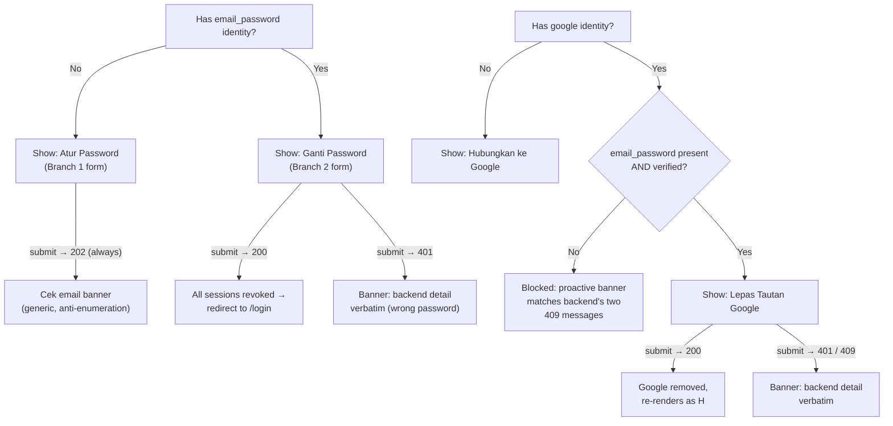

# Tech Plan: Account Linking (Frontend)

> Ticket    : account/05-account-linking (frontend surface)
> Author    : Claude (agent-synthesized from 1-explore logs + direct backend cross-check; pending Anhar's review)
> Date      : 2026-08-27
> Updated   : 2026-08-27 — Open Items #1-4 resolved (Anhar confirmed all four recommendations); §5/§14 updated, Summary regenerated.
> Status    : Approved by Anhar
> Refs      : `frontend/AGENTS.md`, `frontend/.agents/docs/{README.md,phase0-shared-infra.md}`, `docs/spec/1-account/features/05-account-linking.md`, `docs/spec/1-account/tasks.md`, `docs/ui-ux/{page-map.md,patterns.md,prototype-reference.md,design-guidelines.md}`, `api/openapi.yaml` (source of truth, cross-checked directly), `lib/api/schema.d.ts` (generated — already complete, confirmed not stale), backend `internal/domain/account/{security.go,security_test.go,repository_db.go,entity.go}` + `internal/transport/http/account_security.go` (already-built/in-tree, read directly — see §1), `1-explore/logs/{stage1-plan,stage2-area1..6,stage3-solutioning}.md`, prior techplan `account/04-forgot-reset-password` (frontend — precedent for this techplan's structure and for the "verbatim vs frontend-owned copy" decision method), `best-practices/react/{api-client-centralization,data-fetching-conventions,form-validation-boundary,loading-empty-error-state-conventions}.md`, `best-practices/pwa/token-storage-and-refresh.md`, `best-practices/restapi/anti-enumeration.md`

---

## 📋 Summary — start here

**What & why** — `docs/spec/1-account/features/05-account-linking.md` specifies `POST /account/security/set-password` and `POST /account/security/google/unlink`. **Both are already implemented and tested on the backend** (`internal/domain/account/security.go` + `account_security.go` + full unit-test coverage) — confirmed by direct code read during this synthesis, not assumed from the spec alone. Neither has a real frontend surface: `app/(dashboard)/dashboard/security/page.tsx` is a 12-line placeholder self-labeled "Account Task #5's scope," and the Dashboard Shell's "Keamanan" nav item already points at it. This plan builds the page's login-methods section: a branch-aware set-password form and a guarded Google-unlink action, both driven by data the app already fetches (`useAccountMe()`).

**Scope** —
- `LoginMethodsSection` (`/dashboard/security`'s sole content this task adds): renders `SetPasswordForm` (mode picked from `auth_providers`) and `GoogleIdentityControl` (link/unlink/blocked, picked from `auth_providers` + `email_verified`).
- `lib/api/account.ts`: `setPassword()`, `unlinkGoogle()` + two new hooks — purely additive, no `lib/api/client.ts` change needed (see D4).
- `mocks/handlers.ts`: default handlers for both endpoints + a Google-only user fixture.
- A small additive fix to the existing `VerifyEmailStatus` component so step 2 of the spec's 3-step flow behaves correctly for an already-authenticated caller (a gap it wasn't originally built for).
- Out of scope: any backend change; the MFA section of `/dashboard/security` (Account Task #6, independently scheduled, not started); any other Account-domain page.

**Decision flow diagram**:



**Key decisions** (full rationale in §5):
- D1: `/dashboard/security` composes independent section components (`LoginMethodsSection` now, `MfaSection` added later by Task #6 as a sibling line) — no throwaway MFA placeholder built now.
- D2: This task also wires up `<GoogleAuthButton intent="link" />` — `page-map.md`'s "link... Google identity" action has no other owner.
- D3: Branch selection (`auth_providers.includes("email_password")`) is used **regardless of `email_verified`** — confirmed by direct backend read that the server's own branch check (`repository_db.go:731-733`, `security.go:75-86`) is verified-agnostic too. What was an open ambiguity in 1-explore Stage 3 is now a confirmed fact, not a guess.
- D4: **Revised from 1-explore Stage 3** — no `lib/api/client.ts` change. Direct backend read confirms every 401/409/200/202 string this task touches is already final, intentional Bahasa Indonesia (`account_security.go`) — shown verbatim via the existing `ApiError.detail`/result `.message`, matching `LoginForm`'s already-justified precedent for the shared generic-credential string. Only the `422` branch (confirmed English placeholder: "must be at least 8 characters") gets frontend-owned override.
- D5: Branch 2 success clears the access token (mirrors `useLogout`) so the existing `SessionGuardProvider` redirects to `/login` — no new redirect call site.
- D6: `VerifyEmailStatus` gets two small additive fixes (cache invalidation + a conditional CTA) so it behaves correctly for this feature's already-authenticated caller, without duplicating a second verify-email page.

**Top risks** (High-severity only — see §7 for the full table):
- No High-severity risk identified. The highest-impact item found during synthesis (branch-selection semantics) was fully resolved via direct backend code read, not left as a live risk.

**Open items needing human input** — none open. All four items raised during drafting were confirmed by Anhar in this revision (page-composition approach, Google-link scope inclusion, placeholder copy accepted as-drafted, shared credential string accepted as-is) — see §14 Resolved #7-10.

---
<!-- Audience boundary: above is the human-readable digest for
review/approval. Below is the full execution-grade plan — same
decisions, same scope, expanded to file/line precision, rule IDs, and
full option comparisons. Nothing below contradicts the digest above;
it's the same source of truth at higher resolution. -->
---

## 1. Background

`docs/spec/1-account/features/05-account-linking.md` specifies `POST /account/security/set-password` (two server-side branches) and `POST /account/security/google/unlink` (INV-account-02/12 guarded, re-auth required). **Both are already implemented, unit-tested, and stable on the backend** — confirmed directly during this synthesis by reading `backend/internal/domain/account/security.go` (240+ lines, `SetPassword`/`setPasswordBranch1`/`setPasswordBranch2`/`UnlinkGoogle`), `backend/internal/domain/account/security_test.go` (18 passing test functions covering every branch/guard/race case named in the spec's threat breakdown), and `backend/internal/transport/http/account_security.go` (the two HTTP handlers). This is a materially stronger starting point than a spec-only read would suggest.

`page-map.md`'s Donatur table lists `/dashboard/security` as one multi-section Form page also covering Account Task #6 (MFA, independently scheduled, not started — no MFA frontend code exists anywhere in the tree). `app/(dashboard)/dashboard/security/page.tsx` is a 12-line placeholder stub ("real form is Account Task #5's scope"); the Dashboard Shell's nav (`app/(dashboard)/_components/nav-items.ts`) already has a "Keamanan" entry pointing at it. `lib/api/schema.d.ts` already has complete generated types for both endpoints (contrary to the feature spec's own "References" section, which claims `openapi.yaml` still needs a schema update for them — confirmed false; both paths are already fully defined at `api/openapi.yaml:381,439`, and the generated file matches).

**Three findings from the direct backend read, material to this plan's design (not visible from the frontend-only 1-explore logs):**

1. **Branch selection is verified-agnostic, confirmed both server-side and in the read model.** `security.go:75-86`'s `hasEmailPassword` check and `repository_db.go:711-738`'s `GetLoginUserView` (which backs the `User.auth_providers` field returned by `/account/me`) both treat "has an `email_password` identity" as true regardless of `verified_at`. This resolves 1-explore Stage 3's flagged ambiguity (whether a mid-flow, unverified identity already counts for branch selection) — it does, on both sides, consistently. A user who submitted Branch 1 but hasn't verified yet, and who calls `set-password` again, is routed into Branch 2 (immediate password change on the unverified identity, no verification check) — a real, confirmed backend behavior, not a hypothetical.
2. **Every response string this task's UI needs, except `422`, is already final, intentional Bahasa Indonesia.** `account_security.go` hardcodes: Branch 1's `202` message ("Kalau email tersedia, cek inbox untuk verifikasi."), Branch 2's `200` message ("Password berhasil diganti. Semua sesi lain telah keluar otomatis."), unlink's `200` message ("Akun Google berhasil dilepas."), and both `409` `detail` strings verbatim from the spec's own acceptance criteria. The `401` case (both endpoints) reuses `errors.go`'s shared `problemDetailGenericCredential = "Email atau password salah."` — the same string login's own wrong-password case shows, and the same string `LoginForm` already renders verbatim as a justified exception to the codebase's general "never show raw backend text" rule. This is the opposite finding from `account/04`'s techplan (which found English placeholder text requiring frontend-owned override for nearly everything) — here, only `422`'s two messages ("must be at least 8 characters", "password is not allowed") are confirmed English placeholders needing override.
3. **`GET /account/me` (Account Task #7) has not been implemented on the backend yet** — confirmed by an exhaustive grep across `backend/` for any `/account/me` route or handler; none exists. This is not a new risk this task introduces: `useAccountMe()` (already built, already used by `LogoutButton`/`NotificationBadge`/`useHasRole` in the existing Dashboard Shell) already depends on this same not-yet-shipped endpoint, per the already-documented Mock-First Development Workflow (`scaffold-frontend.md`) — every Account-domain page is built and verified against MSW mocks regardless of backend task order. `LoginMethodsSection` inherits this exact same, already-accepted dependency; it does not create a new one.

## 2. Scope

**In scope:**
- `LoginMethodsSection` (`components/features/account/login-methods-section.tsx`): reads `useAccountMe()`, renders `SetPasswordForm` (mode from `auth_providers`) + a pending-verification banner when applicable + `GoogleIdentityControl`.
- `SetPasswordForm` (`components/features/account/set-password-form.tsx` + `set-password-schema.ts`): both branches, `202`/`200`/`401`/`422` handling per §4.
- `GoogleIdentityControl` (`components/features/account/google-identity-control.tsx`): three-way render (link trigger / proactive-blocked notice / unlink form) driven entirely by already-fetched data.
- `UnlinkGoogleForm` (`components/features/account/unlink-google-form.tsx` + `unlink-google-schema.ts`): re-auth password field, destructive submit, `200`/`401`/`409` handling.
- `lib/api/account.ts`: `setPassword()`, `unlinkGoogle()` + their request/result types.
- `lib/hooks/use-set-password.ts`, `use-unlink-google.ts`.
- `app/(dashboard)/dashboard/security/page.tsx`: replace the placeholder, render `<LoginMethodsSection />`.
- `components/features/account/verify-email-status.tsx`: two small additive changes (D6).
- `mocks/handlers.ts`: default handlers for both endpoints + a `mockGoogleOnlyUser` fixture.
- Component/unit tests for every rule in §4.

**Out of scope (explicit):**
- Any backend change — both endpoints are already shipped and stable; this plan only consumes them.
- The MFA section of `/dashboard/security` (Account Task #6) — independently scheduled, not started, no dependency either direction (`tasks.md` Group B vs. Serial S1).
- Any other Account-domain page.
- A `client.ts`/`ApiError` change — considered in 1-explore Stage 3, dropped once the backend's own strings were confirmed sufficient without needing a `.type` discriminant (D4).
- Retrofitting `RegisterForm`/`ForgotPasswordForm`/`ResetPasswordForm` — out of this task's scope.
- Any client-side replication of the backend's password-breach-list policy — per `frontend/AGENTS.md` §2, server-only.

## 3. Requirements

| Condition | Requirement | Source/Note |
|---|---|---|
| `LoginMethodsSection` mounts | Reads `useAccountMe()`; renders a loading skeleton until resolved | `loading-empty-error-state-conventions.md` — skeleton, not bare spinner |
| `auth_providers` lacks `email_password` | `SetPasswordForm mode="add"` (Branch 1 fields: `email`+`password`) | `security.go:75-86` — confirmed verified-agnostic (finding #1) |
| `auth_providers` has `email_password` | `SetPasswordForm mode="change"` (Branch 2 fields: `current_password`+`password`) | Same |
| `auth_providers` has `email_password` AND `email_verified === false` | Informational banner shown **alongside** (not instead of) the Branch 2 form | Confirmed Branch 2 works regardless of verification (finding #1) — form must not be hidden |
| Branch 1 submit → `202` (always, any internal case) | Fixed generic success view, backend's own message verbatim | `account_security.go:140-145`; `restapi/anti-enumeration.md` |
| Branch 1/2 submit → `422` | Field-level error on `password`, frontend-owned copy | `account_security.go:108,119` — confirmed English placeholder (finding #2) |
| Branch 2 submit → `200` | Clear session, redirect via existing `SessionGuardProvider` | `account_security.go:132-138`; INV-account-05 (all refresh tokens revoked, confirmed `security.go:220`) |
| Branch 2 submit → `401` | Banner, backend `.detail` verbatim | `account_security.go:125-127` — confirmed correct Indonesian (finding #2) |
| `auth_providers` lacks `google` | `<GoogleAuthButton intent="link" />` | Task #2's already-shipped endpoint; `page-map.md`'s "link" action has no other owner |
| `auth_providers` has `google`, but not (`email_password` present AND verified) | Proactive blocked-notice, copy matching whichever backend 409 case would fire | `security.go:285-304`'s exact guard conditions, mirrored client-side to avoid a round trip |
| `auth_providers` has `google` AND `email_password` present AND verified | `UnlinkGoogleForm` rendered | `security.go:302` (`verifiedEmailPassword != nil`) |
| Unlink submit → `200` | Invalidate `accountKeys.me()`, section re-renders without the unlink action | `account_security.go:199-203` |
| Unlink submit → `401`/`409` | Banner, backend `.detail` verbatim (both confirmed correct Indonesian) | `account_security.go:181-195` (finding #2) |
| `/verify-email` success, caller authenticated | Invalidate `accountKeys.me()`; CTA links to `/dashboard/security` instead of `/login` | Gap found in 1-explore Stage 2 Area 2 — `VerifyEmailStatus` was built for a logged-out persona |

## 4. Rules & Validation

**`LoginMethodsSection`**

- **R1** (mode selection): Given `user.auth_providers` does not include `"email_password"`, When `LoginMethodsSection` renders, Then `SetPasswordForm` renders with `mode="add"`. Given it does include `"email_password"`, Then `mode="change"` — **regardless of `email_verified`** (confirmed backend-agnostic to verification, finding #1).
- **R2** (pending-verification banner): Given `auth_providers` includes `"email_password"` AND `email_verified === false`, When rendered, Then an informational banner ("Menunggu verifikasi email kamu — cek inbox untuk menyelesaikan.") renders **above** the Branch 2 form, which stays fully interactive (not hidden — R1 already establishes the form works regardless).
- **R3** (loading state): Given `useAccountMe()` has not yet resolved, When `LoginMethodsSection` renders, Then a skeleton matching the section's card shape renders — not a bare spinner (`loading-empty-error-state-conventions.md`).

**`SetPasswordForm` / `setPassword()`**

- **R4** (`mode="add"` idle): Given `mode="add"`, When rendered, Then an `email` field + `password` field + submit button render.
- **R5** (`mode="add"` client validation): Given the fields, When submitted with an invalid email or a password under 8 characters, Then client-side `zod` blocks submission (`add-password-schema`, reusing `register-schema.ts`'s length rule) — UX only, per `form-validation-boundary.md`.
- **R6** (`mode="add"` submit → `202`): Given any submission (email available or already claimed — indistinguishable by design), When `POST /account/security/set-password` returns `202`, Then swap to an inline success view: focus-moved heading + `<Banner variant="success">` showing the response's `message`, falling back to the backend's own confirmed text ("Kalau email tersedia, cek inbox untuk verifikasi.") if absent — **never differentiated by internal case** (`restapi/anti-enumeration.md` checklist: identical response/copy regardless of account/resource existence).
- **R7** (`mode="add"`/`mode="change"` submit → `422`): Given the new password fails length policy or is breach-listed (backend confirms field `"password"` in both branches — `account_security.go:108,119`), When `POST` returns `422`, Then `setError("password", { message: WEAK_PASSWORD_MESSAGE })` — reusing `reset-password-form.tsx`'s existing constant — never the backend's literal English text, no banner shown.
- **R8** (`mode="change"` idle): Given `mode="change"`, When rendered, Then a `current_password` field + `password` field + submit button render.
- **R9** (`mode="change"` client validation): Given the fields, When submitted with an empty `current_password` or a new `password` under 8 characters, Then client-side `zod` blocks submission (`change-password-schema`) before any request fires.
- **R10** (`mode="change"` submit → `200`): Given the correct `current_password` and a policy-passing new password, When `POST` returns `200`, Then `useSetPassword`'s `onSuccess` clears the access token (mirrors `useLogout`), clears the query cache, and broadcasts `logged-out` on the auth channel — `SessionGuardProvider`'s existing subscription redirects to `/login`. The component renders nothing further (no farewell message — matches `useLogout`'s existing no-message convention); INV-account-05 already revokes every refresh token for the user (confirmed `security.go:220`, no carve-out for the acting session).
- **R11** (`mode="change"` submit → `401`): Given an incorrect `current_password`, When `POST` returns `401`, Then a banner shows `error.detail` verbatim ("Email atau password salah." — confirmed shared generic-credential string, same as `LoginForm`'s already-justified exception), form stays interactive, no state change.
- **R12** (network/5xx/other, both modes): Then the existing app-wide `GENERIC_ERROR_MESSAGE` banner renders, form stays interactive.

**`GoogleIdentityControl` / `UnlinkGoogleForm` / `unlinkGoogle()`**

- **R13** (no Google linked): Given `auth_providers` does not include `"google"`, When rendered, Then `<GoogleAuthButton intent="link" label="Hubungkan ke Google" />` renders (Task #2's already-shipped `intent=link` flow — D2).
- **R14** (blocked — only identity): Given `auth_providers` includes `"google"` but not `"email_password"` at all, When rendered, Then a proactive `<Banner variant="info">` shows the exact backend-owned copy for this case ("Google adalah satu-satunya metode login Anda. Atur email dan password dulu sebelum melepas tautan." — copied verbatim from `account_security.go:184`, with a code comment citing the source), no unlink form rendered.
- **R15** (blocked — remaining unverified): Given `auth_providers` includes both `"google"` and `"email_password"`, but `email_verified === false`, When rendered, Then a proactive `<Banner variant="info">` shows the distinct backend-owned copy ("Kamu sudah atur email dan password, tapi belum diverifikasi. Verifikasi email kamu dulu sebelum bisa melepas tautan Google." — verbatim from `account_security.go:189`), no unlink form rendered.
- **R16** (unlinkable): Given `auth_providers` includes `"google"` and `"email_password"` AND `email_verified === true`, When rendered, Then `<UnlinkGoogleForm />` renders: a `password` field (required, non-empty) + `Button variant="destructive"` ("Lepas Tautan Google").
- **R17** (unlink submit → `200`): When `POST /account/security/google/unlink` returns `200`, Then `useUnlinkGoogle`'s `onSuccess` invalidates `accountKeys.me()` — the section re-renders into R13's state without the unlink action, no local success view needed in the component itself.
- **R18** (unlink submit → `401`/`409`): Given a wrong password (`401`) or a race where the proactive block (R14/R15) was stale (`409`), When `POST` returns either, Then a banner shows `error.detail` verbatim — no `.type` parsing needed; the backend's own `detail` text for both `409` sub-cases already matches R14/R15's constants exactly (confirmed `account_security.go:181-189`), form stays interactive, no state change.

**Shared/infra**

- **R19** (`VerifyEmailStatus` additive fix — D6): On `verifyEmail`'s success, invalidate `accountKeys.me()` regardless of auth state (harmless no-op if logged out). The terminal CTA link is `/dashboard/security` ("Kembali ke Keamanan") when `useAuthStore`'s `accessToken` is present, else unchanged (`/login`, "Masuk sekarang").
- **R20** (mocks): `mocks/handlers.ts` gains default happy-path handlers — `POST /account/security/set-password` → `202` (Branch 1 shape), `POST /account/security/google/unlink` → `200`. A `mockGoogleOnlyUser` fixture (`auth_providers: ["google"]`) is added for Branch 1/blocked-unlink test scenarios; existing `mockUser` (`auth_providers: ["email_password"]`) already covers Branch 2/no-Google scenarios. Individual tests override via `server.use(...)`, matching the existing convention.

## 5. Decision Log

**D1 — `/dashboard/security`'s composition, given it's split across two independently-scheduled tasks**

| Option | Why rejected/accepted |
|---|---|
| A. Independent section components as sibling JSX in the page file — this task renders only `LoginMethodsSection`; Task #6 later adds `<MfaSection />` as a one-line sibling (**chosen, confirmed by Anhar 2026-08-27**) | No throwaway placeholder work either task must later delete; whichever task runs second only ever adds a line, never edits the other's internals. Matches `nav-items.ts`'s existing "data, not structure" extensibility philosophy in this same Shell. No conflicting Phase 0 decision found for this specific page (unlike `account/04`'s `/reset-password` shell placement, `phase0-shared-infra.md` explicitly defers this page's real content to Task #5's own session with no fixed internal structure prescribed) — this recommendation stands unrevised from 1-explore Stage 3. |
| B. A single monolithic form component covering both concerns, built once either task starts | Rejected — would force whichever task runs first to either guess at the other's field shape or leave large, awkward placeholder gaps; violates the "build shared infra only when that task concretely needs it" incremental-growth principle already established for this Shell. |

**D2 — Whether this task also wires up `GoogleAuthButton intent="link"`**

| Option | Why rejected/accepted |
|---|---|
| A. Include it (**chosen, confirmed by Anhar 2026-08-27**) | `page-map.md`'s `/dashboard/security` row lists "link/unlink Google identity" as one action; the "link" backend (`intent=link` on `/auth/google/redirect`) already shipped under Task #2, and `GoogleAuthButton`'s own doc comment explicitly anticipates this exact task ("link"/"reauth" belong to a different, session-authenticated flow — account linking). No other task claims this UI trigger; leaving it out would mean `page-map.md`'s stated action is never implemented by anyone. |
| B. Leave it to a separate, unscheduled task | Rejected — no such task exists in `docs/spec/1-account/tasks.md`; deferring indefinitely leaves a documented page-map action permanently unbuilt. |

**D3 — Branch-selection UI heuristic (RESOLVED via direct backend read, was an open ambiguity in 1-explore Stage 3)**

| Option | Why rejected/accepted |
|---|---|
| A. Gate `mode="change"` on `auth_providers.includes("email_password") && email_verified` (1-explore Stage 3's original, cautious design) | Rejected once confirmed directly against `security.go:75-86` and `repository_db.go:731-738`: the backend's own branch check is verified-agnostic — Branch 2 fires and succeeds against an unverified identity too. Gating the frontend's form choice on `email_verified` would show the wrong form (Branch 1's "Atur Password") to a user the backend would actually route into Branch 2, producing a confusing mismatch between what the UI offers and what the server does with it. |
| B. Gate purely on `auth_providers.includes("email_password")`, independent of `email_verified` (**chosen**) | Matches the real backend contract exactly, on both sides (branch check + read model). `email_verified` is still used, but only for R2's informational banner and R15/R16's unlink gate — never for R1's form-mode selection. |

**D4 — Error-copy source: `client.ts` `.type` addition vs. verbatim `.detail`/`.message` (REVISED from 1-explore Stage 3)**

| Option | Why rejected/accepted |
|---|---|
| A. Add `ApiError.type` + a new `readProblem()` helper to `lib/api/client.ts`, branch `UnlinkGoogleForm`'s copy on `.type` (1-explore Stage 3's original plan) | Rejected once confirmed directly against `account_security.go`: every `.detail` string this task touches (`401` shared generic-credential, both `409` cases) is already final, correct, intentionally distinct Bahasa Indonesia — the same justification that already lets `LoginForm` show `error.detail` verbatim as a deliberate, evidence-based exception to the codebase's general rule. Adding a `.type` discriminant would let the frontend re-derive a distinction the backend's `.detail` text already carries, for no functional gain — a shared-infra change with no corresponding requirement, once actually checked. |
| B. Verbatim `error.detail`/`result.message` throughout, except `422` (**chosen**) | No `client.ts` change needed at all. `422`'s two messages ("must be at least 8 characters", "password is not allowed") are confirmed English placeholders (`account_security.go:108,119`) and get frontend-owned override (`WEAK_PASSWORD_MESSAGE`, reused from `reset-password-form.tsx`) — matching `account/04`'s own D6 pattern for the one branch that actually needs it here. |

**D5 — Branch 2 post-success session handling**

| Option | Why rejected/accepted |
|---|---|
| A. Clear the access token in `useSetPassword`'s `onSuccess` for `branch: "changed"`, mirroring `useLogout`'s exact cleanup (**chosen**) | `SessionGuardProvider` already redirects to `/login` on any real→null `accessToken` transition "regardless of what caused it" — reusing this existing single subscription point is simpler than a new redirect call site, and closes the "hijacked session's access token still works for ~15 more minutes" window as tightly as the existing infrastructure allows. Confirmed INV-account-05 revokes every refresh token with no exception for the acting session (`security.go:220`), so this is consistent with what actually happened server-side, not a frontend-only assumption. |
| B. Leave the current tab alone, let the access token expire naturally (~15 min) | Rejected — leaves a stale, still-working session open longer than necessary after the user just proved intent to rotate their credential; no existing precedent in this domain does this for an equivalent action. |

**D6 — `VerifyEmailStatus`'s gap for an authenticated caller**

| Option | Why rejected/accepted |
|---|---|
| A. Two small additive changes to the existing component (cache invalidation + conditional CTA) (**chosen**) | The spec's "reusing `POST /auth/verify-email` unchanged" claim is true at the wire-contract level but not at the component level — `VerifyEmailStatus` was built for a logged-out registrant and never invalidates `accountKeys.me()`, so navigating back to `/dashboard/security` after verifying would show stale data. Both changes are additive and harmless for the existing logged-out caller (invalidating a query that isn't cached is a no-op; the CTA condition only changes when a token is present). |
| B. Build a second, dedicated verify-email page/component for the authenticated case | Rejected — duplicates the entire token-read + status-discriminated outcome logic for a two-line difference (CTA target + one invalidate call); violates the spirit of "reusing the endpoint unchanged." |

## 6. Backward Compatibility

- **Database**: N/A — no persistence layer in `frontend/` (`frontend/AGENTS.md` §2). The backend's `security.go`/migrations for this feature are already shipped, out of this plan's scope.
- **API**: No API changes from this plan — both endpoints are already built, tested, and stable server-side (confirmed via direct code read, §1). This plan only adds the `lib/api/account.ts` wrapper functions/types on top of the already-generated, already-complete `schema.d.ts` — no regeneration needed (unlike `account/04`, where a stale generated file was found; here it was already current).
- **Existing clients/data**: `/dashboard/security`'s current placeholder is being replaced, not incrementally extended — it's a self-labeled Phase 0 stub with no existing test asserting its placeholder content, so there is no currently-passing test this plan contradicts. `VerifyEmailStatus`'s existing test file gains new cases (R19) without removing or contradicting its existing logged-out-caller coverage — both call sites (`/verify-email` reached from registration, and reached mid-linking-flow) share the same component going forward. `GET /account/me` not yet existing server-side (§1 finding #3) is an already-accepted, pre-existing dependency the rest of Dashboard Shell already has — this task adds a new consumer of an existing gap, not a new gap.
- **Deprecation path**: N/A.
- **Runbook vs. Techplan check** (`rules.md` §3): no sub-component here has an independent operational lifecycle (no script, no cron, no separate rollback) — evaluated, doesn't apply.

## 7. Edge Cases & Risks

| Risk | Likelihood | Severity | Mitigation |
|---|---|---|---|
| `LoginMethodsSection`'s form-mode heuristic (R1) drifts from the backend's actual branch check if either side changes independently in the future | Low — both sides read from the same underlying identity-existence fact, confirmed identical today | Medium — a drift would show the wrong form for the account's actual state, though the backend's own response (`200` vs `202`) is still authoritative and would just look confusing, not be exploitable | R1's code comment cites the exact backend lines (`security.go:75-86`, `repository_db.go:731-738`) it must stay consistent with; any future backend change to branch-selection semantics should re-check this comment |
| Proactive-block copy (R14/R15) becomes stale if the backend's `409` message text changes | Low — these are hardcoded, verbatim-copied strings, not live-fetched | Low — cosmetic drift only (still shows *a* correct-shaped message, just possibly outdated wording); the actual submit-time `409` fallback (R18) always shows the live `error.detail`, so the authoritative text is never wrong even if the proactive copy drifts | Code comments cite the exact backend source lines for both constants; a future backend copy change is a one-line frontend update, not a functional break |
| Branch 2 success (R10) clears the current tab's session — a user who didn't realize this would change their password mid-task loses their in-progress session immediately, no confirmation step | Low — the action requires typing the current password first (deliberate friction) | Low — matches the documented spec requirement (INV-account-05) exactly; not a bug, but worth noting the UX has no "are you sure" step beyond the password field itself | Accepted as-is — same friction level as `04-forgot-reset-password`'s reset flow, no existing precedent in this domain adds a confirmation dialog on top of a password field |
| `LoginMethodsSection` depends on `GET /account/me`, not yet backend-built (§1 finding #3) | N/A — already true for the entire Dashboard Shell today | Low — accepted, pre-existing, documented dependency (Mock-First Development Workflow); not something this task's own scope can or should fix | No action — resolves automatically once Account Task #7 ships; MSW mocks already cover this task's own development/test needs |
| The shared generic-credential string ("Email atau password salah.") is reused for a "current password"/"unlink confirmation" field, where it reads slightly oddly (implies a login attempt, not a re-auth confirmation) | Certain — confirmed by direct backend read | Low — a copy-fit nit, not a functional or security issue | Flagged as Open Item #4 for Anhar; not blocking, since the text is still accurate and non-misleading, just slightly generic |

## 8. Interface Contract

Per `frontend/AGENTS.md` §2 ("pure presentation layer," no DB layer of its own) and matching the shape already established by this same repo's `account/01`/`account/04` techplans: section 8 is reinterpreted as *consuming* an already-shipped contract plus the new frontend-side additions this task adds.

**DB Schema changes:** N/A — no persistence layer in `frontend/`.

**API contract consumed** (already built/tested server-side — cross-checked directly against `security.go`, `account_security.go`, not just the generated types):
```typescript
// POST /account/security/set-password
// body: SetPasswordRequest { email?: string; current_password?: string; password: string }
// branch selection is server-side, verified-agnostic (confirmed, finding #1)
// 202 -> { message: "Kalau email tersedia, cek inbox untuk verifikasi." }   (Branch 1, always identical)
// 200 -> { message: "Password berhasil diganti. Semua sesi lain telah keluar otomatis." }  (Branch 2 success)
// 401 -> Problem { detail: "Email atau password salah." }   (Branch 2 wrong current_password — confirmed correct Indonesian)
// 422 -> ValidationProblem { errors: [{ field: "password", message: "must be at least 8 characters" | "password is not allowed" }] }
//        (CONFIRMED English placeholder — frontend overrides with WEAK_PASSWORD_MESSAGE, D4)

// POST /account/security/google/unlink
// body: UnlinkGoogleRequest { password: string }
// 200 -> { message: "Akun Google berhasil dilepas." }
// 401 -> Problem { detail: "Email atau password salah." }   (same shared generic-credential string)
// 409 -> Problem { type: "https://kencleng.dev/errors/only-identity",
//                  detail: "Google adalah satu-satunya metode login Anda. Atur email dan password dulu sebelum melepas tautan." }
//     or Problem { type: "https://kencleng.dev/errors/unverified-remaining-identity",
//                  detail: "Kamu sudah atur email dan password, tapi belum diverifikasi. Verifikasi email kamu dulu sebelum bisa melepas tautan Google." }
//     (both confirmed correct, final Indonesian — shown verbatim via .detail, D4; .type not consumed client-side)
```

**New frontend-side additions (this task):**
```typescript
// lib/api/account.ts
export type SetPasswordRequest = components["schemas"]["SetPasswordRequest"];
export type UnlinkGoogleRequest = components["schemas"]["UnlinkGoogleRequest"];

export type SetPasswordResult =
  | { ok: true; branch: "added"; message?: string }
  | { ok: true; branch: "changed"; message?: string }
  | { ok: false; kind: "validation"; errors: ValidationErrorItem[] };

export function setPassword(input: SetPasswordRequest): Promise<SetPasswordResult>;
export type UnlinkGoogleResult = { ok: true; message?: string };
export function unlinkGoogle(input: UnlinkGoogleRequest): Promise<UnlinkGoogleResult>; // throws ApiError for 401/409

// lib/hooks/use-set-password.ts, use-unlink-google.ts
export function useSetPassword(): UseMutationResult<SetPasswordResult, ApiError, SetPasswordRequest>;
export function useUnlinkGoogle(): UseMutationResult<UnlinkGoogleResult, ApiError, UnlinkGoogleRequest>;

// components/features/account/login-methods-section.tsx
function LoginMethodsSection(): JSX.Element; // R1-R3

// components/features/account/set-password-form.tsx
function SetPasswordForm(props: { mode: "add" | "change" }): JSX.Element; // R4-R12

// components/features/account/google-identity-control.tsx
function GoogleIdentityControl(props: { hasGoogle: boolean; canUnlink: boolean; blockedReason: "only-identity" | "unverified" | null }): JSX.Element; // R13-R16

// components/features/account/unlink-google-form.tsx
function UnlinkGoogleForm(): JSX.Element; // R17-R18
```

**Business logic flow (concise, presentation-layer only — every branch is "what to render given what the backend already decided," never a re-derivation of a business rule):**
```
LoginMethodsSection (mounted on /dashboard/security):
  user = useAccountMe().data
  !user => skeleton (R3)
  hasEmailPassword = user.auth_providers?.includes("email_password") ?? false
  hasGoogle        = user.auth_providers?.includes("google") ?? false
  verified         = user.email_verified ?? false

  render:
    <SetPasswordForm mode={hasEmailPassword ? "change" : "add"} />   (R1)
    {hasEmailPassword && !verified && <PendingVerificationBanner />} (R2)
    <GoogleIdentityControl
      hasGoogle={hasGoogle}
      canUnlink={hasGoogle && hasEmailPassword && verified}
      blockedReason={!hasGoogle ? null : !hasEmailPassword ? "only-identity" : !verified ? "unverified" : null}
    />

SetPasswordForm:
  mode="add":   submit -> POST set-password { email, password }
    -> 202          => inline success banner, backend message verbatim (R6)
    -> 422          => setError("password", WEAK_PASSWORD_MESSAGE) (R7)
    -> other        => banner, GENERIC_ERROR_MESSAGE (R12)
  mode="change": submit -> POST set-password { current_password, password }
    -> 200          => useSetPassword.onSuccess clears session -> SessionGuardProvider redirects (R10)
    -> 401          => banner, error.detail verbatim (R11)
    -> 422          => setError("password", WEAK_PASSWORD_MESSAGE) (R7)
    -> other        => banner, GENERIC_ERROR_MESSAGE (R12)

GoogleIdentityControl:
  !hasGoogle          => <GoogleAuthButton intent="link" /> (R13)
  blockedReason set    => proactive Banner, hardcoded backend-verbatim copy (R14/R15)
  canUnlink            => <UnlinkGoogleForm />
    submit -> POST google/unlink { password }
      -> 200          => useUnlinkGoogle.onSuccess invalidates accountKeys.me() (R17)
      -> 401 / 409    => banner, error.detail verbatim (R18)
      -> other        => banner, GENERIC_ERROR_MESSAGE (R12-equivalent)
```

## 9. Architecture / Plan

- Both new form components follow `LoginForm`'s established shape: `react-hook-form` + `zodResolver`, a `<Banner variant="error">` as the form's first child for request-level failures, never attached to an input's own `error` prop for a request-level failure.
- `SetPasswordForm`'s two-mode branching mirrors `LoginForm`'s own multi-step-in-one-component precedent (password step vs. MFA step) — here, mode is a prop from the parent rather than internal `useState`, since the mode is derived from server state (`auth_providers`) the parent already has, not from a client-side step transition.
- The password show/hide toggle (`Eye`/`EyeOff`, `Ghost` button) is reused across `SetPasswordForm`'s 2-3 password fields and `UnlinkGoogleForm`'s 1 field — per 1-explore Stage 3's Assumption #7, this is extracted as a small shared `PasswordInput` wrapper as part of this task's own scope (fourth total instance across the codebase once this task lands, clearing the "second domain needs it" bar).
- `setPassword()`/`unlinkGoogle()` both go through the existing `postAccountAction` helper in `lib/api/account.ts` (never a raw `fetch`, per `api-client-centralization.md`), consistent with every other function in that file.
- `useSetPassword`'s `onSuccess` for `branch: "added"` invalidates `accountKeys.me()` defensively (data-fetching-conventions.md: every mutation that changes server state should invalidate what it affects) — harmless no-op if `auth_providers` doesn't actually change yet, but correct behavior if it does (finding #1 leaves this genuinely uncertain from the frontend's vantage point, so invalidating is the safe default rather than assuming no change).
- `app/(dashboard)/dashboard/security/page.tsx` renders `<LoginMethodsSection />` directly, with an explicit code comment marking where Task #6 adds `<MfaSection />` as a sibling (D1) — no Suspense boundary needed (no `useSearchParams()` dependency here, unlike the email-link-entry pages).
- `PendingVerificationBanner`, `GoogleIdentityControl`'s proactive-block Banner, and `UnlinkGoogleForm`'s post-submit error Banner are structurally distinct pieces of UI (idle informational vs. failure) even though two of them can show near-identical text — kept as separate render branches per R2/R14/R15/R18, not unified into one shared "identity status" component, since their trigger conditions differ (local state vs. a live response).

## 10. Implementation Details

**File**: `components/features/account/login-methods-section.tsx` (new)
- New Client Component. `useAccountMe()`, derives `hasEmailPassword`/`hasGoogle`/`verified`, composes `SetPasswordForm` + `GoogleIdentityControl` (R1-R3).

**File**: `components/features/account/set-password-schema.ts` (new)
- `addPasswordSchema`: `{ email: z.string().email("Format email tidak valid"), password: z.string().min(8, "Password minimal 8 karakter") }` (reuses `register-schema.ts`'s exact password rule).
- `changePasswordSchema`: `{ current_password: z.string().min(1, "Password saat ini wajib diisi"), password: z.string().min(8, "Password minimal 8 karakter") }`.

**File**: `components/features/account/set-password-form.tsx` (new)
- New Client Component, `mode: "add" | "change"` prop. `useSetPassword` mutation, `zodResolver`-backed form per mode, `PasswordInput` for the password field(s), banner/field-error handling per R6-R7/R10-R12. Copy constants (`// TBD` pending sign-off — Open Item #3): reuses `WEAK_PASSWORD_MESSAGE` from `reset-password-form.tsx` (R7), reuses app-wide `GENERIC_ERROR_MESSAGE` (R12); `202`/`200`/`401` text comes from the response itself (backend-owned, confirmed correct — §1 finding #2), with the backend's own strings as hardcoded fallback constants matching `ForgotPasswordForm`'s established "verbatim backend text as default fallback" pattern.

**File**: `components/features/account/google-identity-control.tsx` (new)
- New Client Component, `{ hasGoogle, canUnlink, blockedReason }` props (computed by the parent section, R1's data already available there). Renders `GoogleAuthButton`/proactive `Banner`/`UnlinkGoogleForm` per R13-R16. `ONLY_IDENTITY_MESSAGE`/`UNVERIFIED_REMAINING_MESSAGE` constants copied verbatim from `account_security.go:184,189` with a code comment citing the source lines (per D4).

**File**: `components/features/account/unlink-google-schema.ts` (new)
- `{ password: z.string().min(1, "Password wajib diisi") }`.

**File**: `components/features/account/unlink-google-form.tsx` (new)
- New Client Component. `useUnlinkGoogle` mutation, single `PasswordInput`, `Button variant="destructive"`, banner handling per R17-R18 (`error.detail` verbatim for both `401`/`409`, no `.type` parsing).

**File**: `components/shared/password-input.tsx` (new — extraction per §9)
- Wraps `Input type={show ? "text" : "password"}` + the `Eye`/`EyeOff` `Ghost` `IconButton` toggle, extracted from `LoginForm`'s existing inline pattern. `LoginForm` itself is **not** retrofitted to use it in this task (out of scope — only new call sites adopt it).

**File**: `app/(dashboard)/dashboard/security/page.tsx`
- Change: replace the placeholder with a heading (`h1` "Keamanan") + `<LoginMethodsSection />` + a code comment marking Task #6's future `<MfaSection />` insertion point (D1).

**File**: `lib/api/account.ts`
- Change: add `SetPasswordRequest`/`UnlinkGoogleRequest` type aliases, `SetPasswordResult`/`UnlinkGoogleResult`, `setPassword()`, `unlinkGoogle()` — all reusing the existing `postAccountAction` + `readProblemDetail` helpers, no new client-layer primitives (D4).

**File**: `lib/hooks/use-set-password.ts`, `use-unlink-google.ts` (new)
- `useSetPassword`: `onSuccess` invalidates `accountKeys.me()` for `branch: "added"`; clears session (`clearAccessToken`, `queryClient.clear()`, `postAuthChannelMessage`) for `branch: "changed"` (D5).
- `useUnlinkGoogle`: `onSuccess` invalidates `accountKeys.me()`.

**File**: `components/features/account/verify-email-status.tsx`
- Change (D6): add `queryClient.invalidateQueries({ queryKey: accountKeys.me() })` in a `useEffect` keyed on `verifyEmail.isSuccess`; read `useAuthStore`'s `accessToken` and condition the terminal CTA link/label (`/dashboard/security` "Kembali ke Keamanan" vs. existing `/login` "Masuk sekarang").

**File**: `mocks/handlers.ts`
- Change: add default handlers for both endpoints (R20) + `mockGoogleOnlyUser` fixture (`auth_providers: ["google"]`, `email_verified: false`).

## 11. Files Changed / Files NOT Changed

| File | Change Type | Description |
|---|---|---|
| `components/features/account/login-methods-section.tsx` | Add | R1-R3 |
| `components/features/account/set-password-schema.ts` | Add | Two zod schemas |
| `components/features/account/set-password-form.tsx` | Add | R4-R12 |
| `components/features/account/google-identity-control.tsx` | Add | R13-R16 |
| `components/features/account/unlink-google-schema.ts` | Add | One-field zod schema |
| `components/features/account/unlink-google-form.tsx` | Add | R17-R18 |
| `components/shared/password-input.tsx` | Add | Extracted show/hide toggle (§9) |
| `app/(dashboard)/dashboard/security/page.tsx` | Modify (rebuild in place) | Replace placeholder |
| `lib/api/account.ts` | Modify | Add `setPassword`, `unlinkGoogle` + types |
| `lib/hooks/use-set-password.ts` | Add | R10, invalidate + session-cutover logic |
| `lib/hooks/use-unlink-google.ts` | Add | R17 invalidate |
| `components/features/account/verify-email-status.tsx` | Modify | R19 (D6) |
| `mocks/handlers.ts` | Modify | Add two default handlers + fixture |
| Corresponding `*.test.tsx`/`*.test.ts` for each new/modified file above | Add/Modify | Per §12 |

| File | Reason untouched |
|---|---|
| `lib/api/client.ts` | Not needed — D4 (verbatim `.detail`/`.message` sufficient, no `.type` discriminant required) |
| `lib/api/schema.d.ts` | Already complete and current — confirmed not stale (§1), unlike `account/04`'s finding |
| `app/(dashboard)/layout.tsx`, `_components/dashboard-shell-client.tsx`, `_components/nav-items.ts` | The "Keamanan" nav item already exists and already points at the right, unchanged path |
| `components/ui/{button,input,label,banner,spinner}.tsx` | Reused as-is — already sufficient (1-explore Stage 2 Area 5 found no primitive gap); `button.tsx` already has a `destructive` variant matching `design-guidelines.md` exactly |
| `components/features/account/login-form.tsx` | Not retrofitted to use the new `PasswordInput` extraction — out of this task's scope (§10) |
| `api/openapi.yaml`, `backend/internal/domain/account/security.go`, `backend/internal/transport/http/account_security.go` | Unmodified by this task — already correctly implement everything this plan builds against; read-only cross-checks per root `AGENTS.md` §7's directory-boundary rule |

## 12. Testing Checklist

Derived 1:1 from §4.

- [ ] R1: `auth_providers` without `email_password` renders `SetPasswordForm mode="add"`; with it (regardless of `email_verified`) renders `mode="change"`
- [ ] R2: `email_password` present + `email_verified=false` shows the pending-verification banner **and** the `mode="change"` form stays interactive (not hidden)
- [ ] R3: `useAccountMe()` unresolved renders a skeleton, not a bare spinner
- [ ] R4: `mode="add"` renders `email` + `password` fields
- [ ] R5: invalid email or under-8-char password is blocked client-side, no request fires
- [ ] R6: a mocked `202` (in both the "created" and "claimed" fixture shapes) renders an identical success view either way, using the backend's message verbatim
- [ ] R7: a mocked `422` (`field: "password"`) attaches `WEAK_PASSWORD_MESSAGE` to the password field, never the backend's literal English text; no banner
- [ ] R8: `mode="change"` renders `current_password` + `password` fields
- [ ] R9: empty `current_password` or under-8-char new password is blocked client-side
- [ ] R10: a mocked `200` triggers `clearAccessToken`/`queryClient.clear`/`postAuthChannelMessage` (asserted via the hook, not re-implemented in the component test) — no local success view rendered
- [ ] R11: a mocked `401` renders `error.detail` verbatim ("Email atau password salah."), form stays interactive
- [ ] R12: a mocked network failure renders `GENERIC_ERROR_MESSAGE` on both modes, form stays interactive
- [ ] R13: `auth_providers` without `google` renders `GoogleAuthButton` with `intent="link"`
- [ ] R14: `google` present, no `email_password` at all → the "only-identity" banner text, no unlink form
- [ ] R15: `google` + `email_password` present but unverified → the "unverified" banner text, no unlink form
- [ ] R16: `google` + verified `email_password` → `UnlinkGoogleForm` renders
- [ ] R17: a mocked `200` triggers `accountKeys.me()` invalidation (asserted via the hook)
- [ ] R18: a mocked `401` and a mocked `409` (both `type` values) each render `error.detail` verbatim, distinctly from each other, form stays interactive
- [ ] R19: `VerifyEmailStatus`'s existing test suite gains cases — authenticated caller sees "Kembali ke Keamanan" → `/dashboard/security`; `accountKeys.me()` invalidation is called on success regardless of auth state
- [ ] R20: `mocks/handlers.ts`'s new default handlers resolve with the documented shapes; `mockGoogleOnlyUser` is usable via `server.use()` overrides

**Count-check**: 20 rules in §4 (R1-R20), 20 checklist items above — matched.

## 13. Testing Examples & Common Mistakes

| Mistake | Error/Behavior | Fix |
|---|---|---|
| Gating `SetPasswordForm`'s mode on `email_verified` as well as `auth_providers` | Shows the wrong form (Branch 1) to a user the backend would actually route into Branch 2 (D3) — a confirmed, not hypothetical, mismatch | R1 — mode is gated on `auth_providers` alone; `email_verified` only drives R2's banner and R14-R16's unlink gate |
| Building `UnlinkGoogleForm`'s `409` handling by branching on `.type` (adding a `client.ts` change to expose it) | Unnecessary complexity — the backend's `.detail` text already fully and correctly distinguishes both cases (D4) | R18 — verbatim `.detail`, no `.type` parsing, no `client.ts` change |
| Inventing new frontend-owned copy for the `200`/`202`/`401`/`409` branches (treating this like `account/04`'s forgot/reset-password task) | Ships a second, slightly-different Indonesian string next to the backend's own already-correct one — inconsistent, unnecessary translation work | Use the response's own `message`/`.detail` verbatim (§1 finding #2) — only `422` needs frontend-owned override |
| Hiding `SetPasswordForm` entirely when `email_verified=false` (treating "pending verification" as a terminal, form-replacing state, like `ResetPasswordForm`'s terminal `404`/`410` branches) | Blocks a working action (Branch 2 change-password genuinely succeeds in this state, per D3) behind a UI-only restriction the backend doesn't actually enforce | R2 — the form stays interactive; the banner is additive, not a replacement |
| Auto-redirecting inside `SetPasswordForm` itself (a `router.push` call) instead of clearing the token and letting `SessionGuardProvider` react | Duplicates the redirect logic that already exists in exactly one place in this app, risking drift if that logic ever changes | R10/D5 — `useSetPassword`'s `onSuccess` only clears state; the actual navigation is `SessionGuardProvider`'s job |
| Treating `useAccountMe()`'s absence of data as an error state instead of a loading state on this page | Would render an error banner on every normal page load before the query resolves | R3 — `!user` (with no `isError`) is loading, not error; `LoginMethodsSection` follows the same convention as `dashboard-shell-client.tsx`'s existing `LogoutButton` (`if (!user) return null`-shaped gating) |

## 14. Open Items

### Active — need external input or verification

None currently open.

### Resolved (kept for reference)

1. ~~**Whether an unverified `email_password` identity already counts for `set-password` branch selection**~~ **RESOLVED — confirmed directly, 2026-08-27.** It does, on both the branch-check side (`security.go:75-86`) and the read-model side (`repository_db.go:731-738`) — verified-agnostic on both. What 1-explore Stage 3 flagged as a genuine spec ambiguity requiring a human/backend decision turned out to be a straightforward, already-consistent fact once the actual backend code was read. Resolved via D3.
2. ~~**Whether `client.ts` needs an `ApiError.type` addition to distinguish unlink's two `409` cases**~~ **RESOLVED — confirmed directly, 2026-08-27, not needed.** Both `409` cases already carry distinct, correct, final `detail` text (`account_security.go:181-189`) — sufficient for display without also parsing `.type`. Resolved via D4, reversing 1-explore Stage 3's recommendation.
3. ~~**Whether the `422` field name is literally `"password"` for both branches**~~ **RESOLVED — confirmed directly, 2026-08-27.** `account_security.go:108,119` — both the boundary check and the service-level mapping use `Field: "password"`. 1-explore Stage 3's Assumption #3 (an educated guess by analogy) is now a confirmed fact.
4. ~~**Whether `GET /account/me` is implemented on the backend yet**~~ **RESOLVED — confirmed directly, 2026-08-27: it is not.** Not a blocker — `useAccountMe()` already has this exact dependency today via the rest of Dashboard Shell, per the already-documented Mock-First Development Workflow. This task inherits an existing, accepted gap rather than creating a new one.
5. ~~**Session cutover UX for Branch 2 (1-explore Stage 3's Assumption #4)**~~ **RESOLVED as D5** — clear the token, let `SessionGuardProvider` redirect, matching `useLogout`'s exact pattern. Confirmed consistent with the backend's actual, no-exception session revocation (`security.go:220`).
6. ~~**Whether `PendingVerificationNotice` needs a resend-verification affordance (1-explore Stage 3's Assumption #6)**~~ **RESOLVED — not added.** Once D3 established the form stays interactive during the pending-verification window (R2), the primary blocking concern a resend affordance would address doesn't apply here the way it did for the registration flow; can be added later as a small, independent enhancement if requested.
7. ~~**Confirm D1's page-composition approach**~~ **RESOLVED — confirmed by Anhar, 2026-08-27.** Independent section components as sibling JSX (`LoginMethodsSection` now; Task #6 adds `<MfaSection />` as a one-line sibling later) is the approach Task #6 should follow when it starts.
8. ~~**Confirm D2's scope inclusion of `GoogleAuthButton intent="link"`**~~ **RESOLVED — confirmed by Anhar, 2026-08-27.** Included in this task's scope, per D2's rationale (no other task in `tasks.md` owns this `page-map.md` action).
9. ~~**Copy sign-off for the genuinely-new frontend-owned strings**~~ **RESOLVED — accepted as-drafted, 2026-08-27.** The pending-verification banner text and the section/action labels (§14 old Active #3) ship as `// TBD` placeholders, same treatment as every other placeholder string already accepted in this codebase — no blocking product-copy pass required before this task proceeds.
10. ~~**Shared generic-credential string reused for a re-auth context**~~ **RESOLVED — accepted as-is, 2026-08-27.** "Email atau password salah." stays as the `401` copy for both `SetPasswordForm`'s Branch 2 and `UnlinkGoogleForm` — still accurate and non-misleading; a context-specific string was judged not worth a backend change for this. Noted as a low-priority backlog item, not acted on further by this task.
