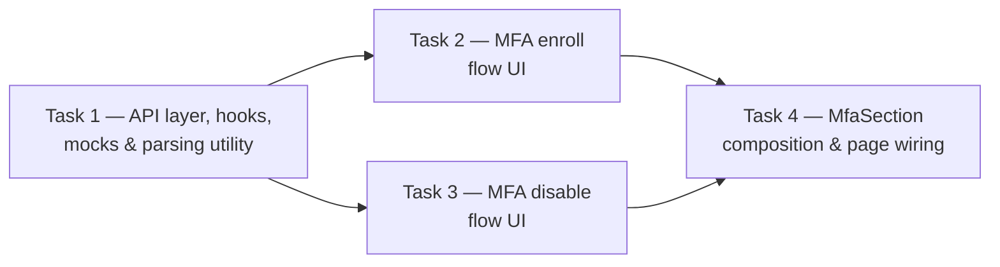

# Task Manifest — account/06-mfa-totp (frontend)

> Snapshot at generation time (2026-08-27) — not a living document, does
> not track progress status (done/in-progress/blocked). Status tracking
> belongs to the PR/ticket domain, not this workspace, per
> `2-3-techplan-decomposition-prompt.md`.
> Source techplan (contract, unchanged, single source of truth for
> §1-7/Summary/§14): [`../techplan.md`](../techplan.md) — "Tech Plan: MFA
> TOTP (Frontend)". Status: **Approved by Anhar** — the decomposition
> prompt's own "Input" precondition ("techplan already locked, not
> draft") is satisfied; no process caveat to flag here.

## Step 0 — Decomposition justification

**Answer: yes, decompose.** The source techplan is Complex tier per
`best-practices/model-routing.md` (24 rules in §4, well over the ≥15
threshold, and it touches the `auth`/MFA domain contract directly — 3
endpoints that generate/verify TOTP secrets and gate a security-sensitive
disable action). The "multiple chunks reviewable/executed separately"
trigger from `2-3-techplan-decomposition-prompt.md`'s "When To Use This"
genuinely applies: the plan spans 3 conceptually distinct layers (a
foundation API/hooks/mocks layer, two independent UI flows that don't
depend on each other, and a composition layer with its own genuinely
subtle cross-cutting correctness requirement — R12's "codes view must
survive a cache refetch" rule). An execution agent holding all 24 rules
plus a 17-file change list in one pass risks exactly the "lose focus"
signal, particularly around R12/R13, which the source techplan's own
§13 (Common Mistakes) already flags as the single easiest thing in this
feature to get wrong. This is 4 substantial, non-trivial task
boundaries — not decomposition for its own sake.

## Splitting axis

**Combined dependency/sequence chain + component boundary.** One
foundation piece (API layer, hooks, mocks, manual-entry parsing utility)
has no dependency on anything else and feeds two independent UI
consumers (the enroll flow and the disable flow), which in turn have no
dependency on each other — a clean hub-and-spoke shape, not an arbitrary
cut. A fourth task (composition + page wiring) depends on both UI
consumers, since it's the layer that ties them together and owns the
one piece of logic (R12/R13) that spans both. This matches the source
prompt's allowance to combine axes "if the techplan is complex enough,"
and mirrors the same combined-axis structure already used for
`account/03-login-session-management`'s own decomposition.

## Tasks

| # | File | Title | Rules covered | Depends on |
|---|---|---|---|---|
| 1 | [`task-01-api-layer-hooks-mocks.md`](task-01-api-layer-hooks-mocks.md) | API layer, hooks, mocks & manual-entry parsing utility | R6 (wrapper-layer), R7 (wrapper-layer), R9 (hook-layer), R10 (wrapper-layer), R11 (wrapper-layer), R15 (hook-layer), R16 (wrapper-layer), R18 (hook-layer), R19 (wrapper-layer), R23, R24 (parsing-layer) | none |
| 2 | [`task-02-mfa-enroll-flow-ui.md`](task-02-mfa-enroll-flow-ui.md) | MFA enroll flow UI (QR + confirm + manual-entry fallback) | R4, R5, R6 (component-layer), R7 (component-layer), R8, R9 (component-layer), R10 (component-layer), R11 (component-layer), R21 (own banners), R24 (component-layer) | Task 1 |
| 3 | [`task-03-mfa-disable-flow-ui.md`](task-03-mfa-disable-flow-ui.md) | MFA disable flow UI (password / Google re-auth) | R14, R15 (component-layer), R16 (component-layer), R17, R18 (component-layer), R19 (component-layer), R20, R21 (own banners) | Task 1 |
| 4 | [`task-04-mfa-section-composition-page-wiring.md`](task-04-mfa-section-composition-page-wiring.md) | `MfaSection` composition & page wiring | R1, R2, R3, R12, R13, R22 | Task 2, Task 3 |

**Rule coverage check**: R1-R24 (24 rules total) each appear in at
least one task's "owned" list. R6, R7, R9, R10, R11, R16, R19, R24 are
deliberately owned at two layers (wrapper-function/hook/parsing-layer in
Task 1, component-layer in Task 2 or Task 3) — noted explicitly in both
task files rather than silently duplicated, since the two layers have
genuinely distinct testable behavior (same convention
`account/03-login-session-management`'s decomposition already
established for its own R3/R4/R7). R15/R18 similarly split
hook-layer (Task 1) from component-layer (Task 3). R21 (banner-focus
a11y) is deliberately owned by both Task 2 and Task 3 — each has its own
independent set of banners, there is no shared component to attach a
single ownership to. No rule is owned by zero tasks.

## Dependency graph

- **Task 1** has **no dependency** — parallel-eligible with nothing
  ahead of it, everything downstream needs it.
- **Task 2** and **Task 3** both hard-depend on **Task 1** (import its
  hooks/utility) but have **no hard dependency on each other** — no
  shared files, no shared state, parallel-eligible once Task 1 is done
  (can be executed by two different agents/sessions simultaneously).
- **Task 4** hard-depends on **both Task 2 and Task 3** (imports
  `MfaEnrollFlow` and `MfaDisableForm`, composes them, and owns the
  cross-cutting state-lifting logic — R12/R13 — that ties the two
  together).
- **No shared-file sequencing conflicts**: unlike
  `account/03-login-session-management`'s Task 1/Task 4 both touching
  `lib/api/account.ts` and `mocks/handlers.ts`, here only Task 1 touches
  either of those two files — Tasks 2, 3, and 4 each add entirely new
  files (plus Task 4's one-line addition to the already-Task-05-owned
  `page.tsx`), so there is no merge-conflict risk to sequence around
  beyond the dependency graph itself.

## Model routing (per `best-practices/model-routing.md`)

Source techplan tier: **Complex** (§4 rules ≥ 15 — 24 total — and
touches the auth/MFA contract). Complex-tier "Coding/build," decomposed:
*"GLM 5.2 (max) / DeepSeek V4 Pro per sub-task"* — assigned per-task
below using the table's own tie-breaker ("GLM when the work leans on
diagrams, state-transitions, or multi-step reasoning. DeepSeek V4 Pro
when it's rule-table-heavy/precision work without a diagram").

| Task | Recommended model | Why |
|---|---|---|
| 1 — API layer, hooks, mocks & parsing utility | **DeepSeek V4 Pro** | Pattern-following — mirrors `resetPassword()`/`setPassword()`/`unlinkGoogle()`'s already-merged wrapper shapes almost exactly; rule-table-heavy precision work, no branching/diagram of its own. |
| 2 — MFA enroll flow UI | **GLM 5.2 (max)** | Owns a genuine 3-state machine (`idle`→`confirming`→`done`) with a subtle non-obvious requirement (must NOT remount on `422`, R10) and is the first QR-rendering component anywhere in this codebase — zero existing visual/code precedent, the highest first-time-implementation risk of the four tasks. |
| 3 — MFA disable flow UI | **DeepSeek V4 Pro** | The `email_password` branch is a near-direct mirror of the already-merged `UnlinkGoogleForm`; the Google-only branch is a linear button→401→retry sequence with no diagram — precedent-following precision work, not novel state-machine design. |
| 4 — `MfaSection` composition & page wiring | **GLM 5.2 (max)** | Owns the single subtlest correctness risk in the whole plan (R12: the backup-codes-once view must survive an `account.me` cache refetch without being swapped away prematurely) — explicitly flagged in the source techplan's §13 Common Mistakes as the easiest thing to get wrong across the entire feature; genuine multi-component state coordination. |

Per `model-routing.md`'s own caveats section (and its explicit "DRAFT —
personal reference, not yet workspace guidance" status): these are
starting recommendations, not calibrated against real execution runs
yet — adjust if a task's actual difficulty diverges from this estimate
once build starts.

## Review note

Every task file produced here remains subject to the review checklist in
`workflow/4-code-review/checklist.md`, same as any other derived-section
content, per `2-3-techplan-decomposition-prompt.md`'s own
cross-reference.
</content>
