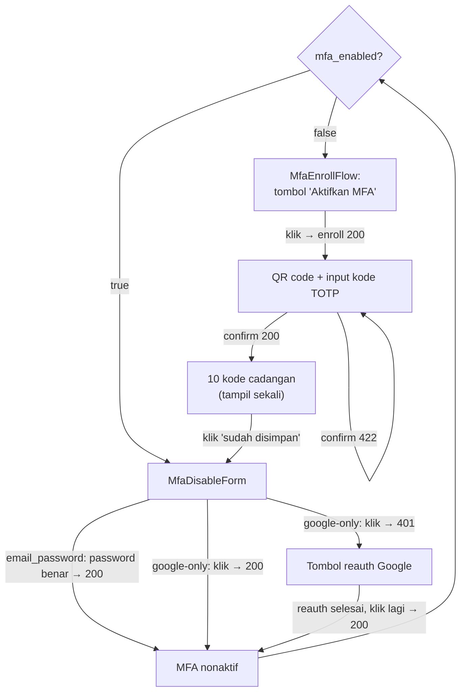

# Tech Plan: MFA TOTP (Frontend)

> Ticket    : account/06-mfa-totp (frontend surface)
> Author    : Claude (agent-synthesized from 1-explore logs; pending Anhar's review)
> Date      : 2026-08-27
> Status    : Approved by Anhar
> Refs      : `frontend/AGENTS.md`, `frontend/.agents/docs/README.md`, `docs/spec/1-account/features/06-mfa-totp.md`, `docs/spec/1-account/features/02-google-oauth-login-register.md`, `docs/ui-ux/{page-map.md,patterns.md,prototype-reference.md,design-guidelines.md}`, `api/openapi.yaml` (cross-checked directly), `lib/api/schema.d.ts` (generated, confirmed not stale), prior techplan `account/05-account-linking` (frontend — precedent for page composition and section-component pattern), this ticket's own `1-explore/logs/{stage1-plan,stage2-area1..5,stage3-solutioning}.md`, `best-practices/react/{form-validation-boundary,data-fetching-conventions,component-test-mocking-discipline,loading-empty-error-state-conventions,api-client-centralization,accessibility-fundamentals}.md`, `best-practices/pwa/token-storage-and-refresh.md`, `best-practices/restapi/csrf-and-cookie-security.md`

---

## 📋 Summary — start here

**What & why** — `docs/spec/1-account/features/06-mfa-totp.md` specifies `POST /account/security/mfa/enroll`, `.../enroll/confirm`, `.../disable`. All 3 are generated in `lib/api/schema.d.ts` but have **no frontend surface at all** yet. `app/(dashboard)/dashboard/security/page.tsx` already exists (built under Task 05) with an explicit comment slot for this task's `<MfaSection />` as a sibling of the already-shipped `<LoginMethodsSection />` — this plan fills that slot.

**Scope** —
- `MfaSection` (new sibling section on `/dashboard/security`): branches on `useAccountMe()`'s `mfa_enabled` into `MfaEnrollFlow` (enroll → QR → confirm → one-time backup codes) or `MfaDisableForm` (password re-auth for `email_password` users, Google re-auth for Google-only users).
- `lib/api/account.ts`: `mfaEnroll()`, `mfaEnrollConfirm()`, `mfaDisable()` + 3 new hooks — purely additive.
- A manual-entry secret fallback (parsed from `otpauth_uri`), shown as selectable text alongside the QR, for users without a camera-capable device or using a screen reader (D11, confirmed by Anhar).
- `mocks/handlers.ts`: default handlers + fixtures for all 3 endpoints.
- New dependency: `qrcode.react` (QR rendering — the backend only returns a raw `otpauth://` URI).
- Out of scope: any backend change; login-time TOTP/backup-code verification UI (spec 03, separately scheduled/tracked); any other page.

**Decision flow diagram**:



**Key decisions**:
- `MfaSection` composes independent `MfaEnrollFlow`/`MfaDisableForm` children, matching Task 05's established one-component-per-action shape (D1).
- `enroll` never auto-fires on mount — only on explicit user click, no resume-in-progress UX (D2).
- QR rendering via `qrcode.react`'s `QRCodeSVG` — SVG output, no jsdom canvas polyfill needed (D3, confirmed by Anhar).
- Backup codes shown once with an explicit "saya sudah menyimpan" acknowledgment gate, held in local state so a cache refetch doesn't prematurely swap the view away (D4/D12).
- `email_password` disable branch mirrors `UnlinkGoogleForm` almost exactly (D5).
- Google-only disable branch uses an optimistic single button relying on the documented `401`, not a query-param-driven redirect flow — avoids depending on an unconfirmed backend contract (D6, confirmed by Anhar).
- `enroll`'s undocumented `409` is still handled defensively even though absent from the generated schema (D7).
- `enrollConfirm`'s `422` is thrown as a plain `ApiError` with one fixed frontend-owned message, not modeled as a discriminated validation result — matches the spec's explicit "no distinguishing needed" language (D8).
- No "regenerate backup codes" UI action is built — only disable→re-enroll exists on the backend; UI copy says so explicitly (D10).
- A manual-entry secret (parsed from `otpauth_uri`) is shown as selectable text alongside the QR, closing an accessibility/no-camera gap (D11, confirmed by Anhar).

**Top risks** — No High-severity risk identified (see §7 — all rows are Low/Medium).

**Open items needing human input**: none open — both prior Active items (manual-entry QR fallback, copy sign-off) were resolved by Anhar; see §14.

---
<!-- Audience boundary: above is the human-readable digest for
review/approval. Below is the full execution-grade plan — same
decisions, same scope, expanded to file/line precision, rule IDs, and
full option comparisons. Nothing below contradicts the digest above;
it's the same source of truth at higher resolution. -->
---

## 1. Background

`docs/spec/1-account/features/06-mfa-totp.md` specifies TOTP-based MFA enrollment and disablement: generate a secret + QR, confirm with a TOTP code to activate (also generating 10 one-time-shown backup codes), and disable via re-authentication (password for `email_password` users, a Google re-auth round trip for Google-only users). Login-time TOTP/backup-code verification is a separate, already-specced feature (`03-login-session-management.md`) and is explicitly out of scope here.

`page-map.md`'s Donatur row lists `/dashboard/security` as the single surface for this feature ("Enable/disable MFA (QR scan + confirm code), view/regenerate backup codes"). That page already exists — built under Task 05 (account-linking) — and its own source comment names this exact task as the next thing to land there: *"Account Task #6 (MFA) adds its own `<MfaSection />` here as a sibling."* `lib/api/schema.d.ts` already has generated types for all 3 endpoints (added ahead of this task, per the mock-first workflow), but `lib/api/account.ts` has zero wrapper functions, no hooks exist, and no mock handlers exist for any of the 3 endpoints. This plan builds the missing frontend layer end to end.

## 2. Scope

**In scope:**
- `MfaSection` + `MfaEnrollFlow` + `MfaDisableForm` + a thin `QrCode` wrapper component, added to `/dashboard/security`.
- `lib/api/account.ts`: `mfaEnroll()`, `mfaEnrollConfirm()`, `mfaDisable()`, plus their generated-schema-derived types.
- `lib/hooks/use-mfa-enroll.ts`, `use-mfa-enroll-confirm.ts`, `use-mfa-disable.ts`.
- `lib/otpauth.ts`: a pure `parseOtpauthSecret(uri)` helper for the manual-entry fallback (D11).
- `mocks/handlers.ts`: default fixtures/handlers for all 3 endpoints.
- New dependency: `qrcode.react`.
- Component + wrapper-function tests for everything above.

**Out of scope (explicit):**
- Any backend change (all 3 endpoints already implemented/tested server-side per the feature spec).
- Login-time TOTP/backup-code verification UI (`POST /auth/login/mfa`'s frontend surface — spec 03, tracked separately; `use-login-mfa.ts` already exists for that feature and is untouched here).
- Any change to `LoginMethodsSection` or its children (untouched — `MfaSection` is added as an independent sibling only).
- A query-param-driven redirect-return flow for Google re-auth (D6 — deliberately not built; see Decision Log).

## 3. Requirements

| Condition | Requirement | Source/Note |
|---|---|---|
| User not enrolled, opens `/dashboard/security` | Show an explicit "Aktifkan MFA" trigger; never auto-call `enroll` on mount | `06-mfa-totp.md` enroll acceptance criteria |
| User enrolled, opens `/dashboard/security` | Show the disable action (branch on `auth_providers`) | `page-map.md` Donatur row |
| `enroll` called again before confirming | Silently overwrite the pending secret (no special UI handling needed — safe by design) | `06-mfa-totp.md`, INV-account-07 |
| `enroll` called while already enabled | `409` — must be handled (even though undocumented in `schema.d.ts`) | `06-mfa-totp.md`; Stage 2 Area 2 finding |
| `enrollConfirm` succeeds | Exactly 10 backup codes shown once, never retrievable again | `06-mfa-totp.md` confirm acceptance criteria |
| `enrollConfirm` fails (`422`) | Pending secret is NOT discarded — QR/form must stay usable for retry | `06-mfa-totp.md` confirm acceptance criteria |
| Disable, `email_password` user | Require current password in the request body | `06-mfa-totp.md` disable acceptance criteria |
| Disable, Google-only user | Require a prior `GET /auth/google/redirect?intent=reauth` round trip; request body omitted | `06-mfa-totp.md` disable acceptance criteria; `02-google-oauth-login-register.md` |
| "View/regenerate backup codes" (`page-map.md` wording) | No regenerate endpoint exists on the backend — UI must not imply a one-click regenerate action; only path is disable → re-enroll | `page-map.md` Donatur row vs. `06-mfa-totp.md` (miscontext found in Stage 2 Area 1) |
| Enroll success renders a QR code | Also show the underlying secret as selectable text, so enrollment doesn't require a camera-capable device or sight | Accessibility gap found via `best-practices/react/accessibility-fundamentals.md` risk lens; confirmed in scope by Anhar (D11) |

## 4. Rules & Validation

- **R1** (loading): Given `useAccountMe()` hasn't resolved, When `MfaSection` renders, Then show a skeleton (same shape convention as `LoginMethodsSection`'s existing loading branch).
- **R2** (branch: not enrolled): Given `user.mfa_enabled === false` and no in-progress "just enrolled" local state, When `MfaSection` renders, Then render `MfaEnrollFlow`.
- **R3** (branch: enrolled): Given `user.mfa_enabled === true` and no in-progress "just enrolled" local state, When `MfaSection` renders, Then render `MfaDisableForm`.
- **R4** (no auto-fire): Given the not-enrolled state, When `MfaEnrollFlow` first mounts, Then `useMfaEnroll` does NOT fire automatically — only on an explicit "Aktifkan MFA" click.
- **R5** (enroll success): Given the user clicks "Aktifkan MFA", When `POST /account/security/mfa/enroll` resolves `200`, Then render `QrCode` (`value={otpauth_uri}`) plus a `totp_code` input and a "Konfirmasi" submit button.
- **R6** (enroll `409`, defensive): Given `enroll` returns `409` (undocumented in `schema.d.ts`, per the feature spec's already-enabled guard), When received, Then `mfaEnroll()` throws `ApiError(409, detail)`; `MfaEnrollFlow` shows a generic error banner (`.detail` if present, else a frontend-owned fallback) — expected unreachable in normal single-tab use since the trigger only renders in the not-enrolled branch (R2).
- **R7** (enroll network/5xx): Given a network failure or unexpected `5xx` on enroll, When received, Then show a generic error banner; "Aktifkan MFA" re-enabled for retry.
- **R8** (confirm submit): Given the QR+code view, When the user submits `totp_code`, Then `useMfaEnrollConfirm` calls `POST /account/security/mfa/enroll/confirm` with `{ totp_code }`.
- **R9** (confirm success): Given confirm resolves `200` with `{ backup_codes }` (exactly 10 strings), When received, Then lift the codes to `MfaSection` (via a callback prop) and invalidate `accountKeys.me()`; the QR/code UI is replaced by the backup-codes-once view.
- **R10** (confirm `422`): Given confirm returns `422`, When received, Then throw `ApiError`; show one fixed frontend-owned message ("Kode tidak valid, coba lagi.") tied to the `totp_code` field via `aria-describedby`/`aria-invalid`; the QR and form remain mounted/interactive — no remount, no re-fetch of `enroll` (pending secret is not discarded, per the spec).
- **R11** (confirm network/5xx): Given a network failure or unexpected `5xx` on confirm, When received, Then show a generic request-level error banner; form stays interactive.
- **R12** (codes persist past refetch): Given confirm succeeded and `accountKeys.me()` has refetched (`mfa_enabled` now `true`), When `MfaSection` re-renders, Then it continues showing the backup-codes-once view — driven by the lifted local state in `MfaSection`, not the `mfa_enabled` branch — until explicitly acknowledged.
- **R13** (codes acknowledged): Given the backup-codes-once view, When the user clicks "Saya sudah menyimpan kode ini", Then the local codes state clears and `MfaSection` renders `MfaDisableForm` (no additional API call — `mfa_enabled` is already `true` by this point).
- **R14** (disable, `email_password` branch shown): Given `user.auth_providers` includes `"email_password"`, When `MfaDisableForm` renders, Then show a password field + destructive "Nonaktifkan MFA" button.
- **R15** (disable, `email_password` success): Given the correct current password, When submitted, Then `useMfaDisable` calls the endpoint with `{ password }`; on `200`, invalidate `accountKeys.me()`.
- **R16** (disable, `email_password` `401`): Given the wrong password, When submitted, Then show `ApiError.detail` verbatim in a banner (generic fallback if absent, per the schema's undifferentiated `401`); form stays interactive.
- **R17** (disable, Google-only branch shown): Given `user.auth_providers` does NOT include `"email_password"`, When `MfaDisableForm` renders, Then show a single "Nonaktifkan MFA" button, no password field.
- **R18** (disable, Google-only success): Given the re-auth marker is already valid (a prior `intent=reauth` round trip succeeded), When the button is clicked, Then `useMfaDisable` calls the endpoint with no body; on `200`, invalidate `accountKeys.me()`.
- **R19** (disable, Google-only `401`): Given the marker is missing/expired, When the button is clicked, Then show an error banner plus a `<GoogleAuthButton intent="reauth" .../>` prompt; the disable button remains available to retry after the user returns from re-authenticating.
- **R20** (no regenerate action): Given the enrolled state (`MfaDisableForm`), When rendered, Then no one-click "regenerate backup codes" action exists; show a short explanatory line instead ("Untuk mendapatkan kode cadangan baru, nonaktifkan MFA lalu aktifkan kembali.").
- **R21** (a11y — banner focus): Given any error/success banner appears in any of these components, When it renders, Then focus moves into it (`bannerRef` + `useEffect`, matching `UnlinkGoogleForm`/`SetPasswordForm`'s existing convention).
- **R22** (a11y — codes are text): Given the backup-codes-once view, When rendered, Then the 10 codes are plain, selectable/copyable text (not an image/canvas snapshot) — usable via screen reader and copy-paste.
- **R23** (mocks): Given no `server.use()` override, When any of the 3 endpoints is called in a test/dev-mode context, Then the default MSW handler returns the documented happy-path fixture.
- **R24** (a11y — manual-entry secret fallback): Given the QR+confirm-code view renders (R5), When `otpauth_uri` is parsed via `parseOtpauthSecret()`, Then render the extracted `secret` as selectable/copyable monospace text alongside the QR (e.g. "Tidak bisa scan? Masukkan kode ini secara manual: ..."); if `secret` is absent/unparseable, hide the manual-entry line without breaking the QR view (defensive fallback — `TBD — verify` the real backend-generated URI always carries a `secret` param before treating its absence as impossible rather than just unhandled).

## 5. Decision Log

| Option considered | Why rejected/accepted |
|---|---|
| **D1 — `MfaSection` composition.** A. One flat component with internal step-state. B. Parent branches on `mfa_enabled`, delegates to `MfaEnrollFlow`/`MfaDisableForm` (**chosen**). | B matches Task 05's established one-component-per-action convention (`SetPasswordForm`, `GoogleIdentityControl`) and the page's own stated "independent section components" philosophy, applied one level down. Each piece stays independently testable. |
| **D2 — When `enroll` fires.** A. Auto-fire on mount. B. Only on explicit user click (**chosen**). | No precedent anywhere in this codebase fires a mutation as a render side effect. `mfa_enabled: false` can't distinguish "never started" from "pending unconfirmed" anyway, so there's no reliable state to auto-resume from — the abandon-and-restart case is already safe by the backend's own overwrite semantics (INV-account-07). |
| **D3 — QR rendering library.** A. `qrcode.react`'s `QRCodeSVG` (**chosen, confirmed by Anhar**). B. `react-qr-code`. C. `qrcode` (canvas/imperative). | A: SVG output needs no jsdom canvas polyfill (this project's pinned test runtime already lacks one), declarative props fit the component style, actively maintained. First new dependency this domain's frontend track has needed. |
| **D4 — Backup codes reveal-once UX.** A. Render codes plainly, no acknowledgment step. B. Add an explicit "Saya sudah menyimpan kode ini" gate before proceeding (**chosen**). | Codes are gone for good once this view unmounts (spec). B gives at least an explicit acknowledgment moment; does not (and is not meant to) literally prevent early navigation — no `beforeunload` interception, that would be over-engineering. |
| **D5 — Disable, `email_password` branch.** Mirrors `UnlinkGoogleForm` (single password field, destructive button, verbatim `401` detail) (**chosen**) vs. inventing a new shape. | No reason to diverge — same re-auth-gated-destructive-action shape already proven in this codebase; `MfaDisableRequest`'s `401` is undifferentiated in the schema, so there's only one message to show, same as `UnlinkGoogleForm`. |
| **D6 — Disable, Google-only branch.** A. Query-param-driven two-click flow (read a redirect-return param to arm the disable button). B. Optimistic single button relying on the documented `401` (**chosen, confirmed by Anhar**). | Neither `06-mfa-totp.md` nor `api/openapi.yaml` specify a redirect target or query-param contract for `intent=reauth` — Task 05's "link" flow never built redirect-param handling either (it re-derives state from `useAccountMe()`, which doesn't work here since the re-auth marker isn't part of `User`). B needs zero unconfirmed backend contract, degrades to one extra click-and-retry round trip after re-auth, and matches `UnlinkGoogleForm`'s "always render the action, let the backend's response drive the copy" philosophy. A remains available later if the backend redirect contract is ever pinned down. |
| **D7 — `enroll`'s undocumented `409`.** A. Ignore it (schema doesn't type it). B. Handle it defensively anyway (**chosen**). | The feature spec explicitly requires it even though `schema.d.ts` only types `200` for this endpoint — a real spec/schema inconsistency (flagged separately, not silently resolved). Handling it costs nothing and closes a real (if rare, single-tab-unreachable) gap. |
| **D8 — `enrollConfirm`'s `422` shape.** A. Discriminated-result shape, matching `register`/`setPassword` (schema types it as `ValidationError`). B. Plain thrown `ApiError`, one fixed message, matching `resetPassword()`'s precedent (**chosen**). | The feature spec is explicit: "treated the same as an invalid code — no distinguishing response needed." `resetPassword()` already established the precedent for "schema says `ValidationError`-shaped, but the spec says there's no useful field-level distinction — treat it as a plain throw." Simpler than replicating register/setPassword's shape for no benefit here. |
| **D9 — Mocks.** Follow the exact existing per-endpoint convention (named fixture constant, comment naming source, one default handler) (**chosen**) vs. inventing a new mocking pattern. | No reason to diverge from `mocks/handlers.ts`'s established, consistent convention across every prior task. |
| **D10 — "Regenerate backup codes" wording.** A. Build a one-click regenerate action to match `page-map.md`'s literal wording. B. No regenerate action; explanatory copy about disable→re-enroll instead (**chosen**). | No regenerate endpoint exists on the backend — building A would require inventing backend behavior that doesn't exist. `page-map.md`'s wording itself looks like a docs-accuracy gap, worth mentioning to Anhar separately, but not a reason to build a fictitious capability. |
| **D11 — Manual-entry secret fallback for QR-only enrollment.** A. Build it now — parse `secret` from `otpauth_uri`, show as selectable text next to the QR (**chosen, confirmed by Anhar**). B. Defer — ship QR-only, revisit only if a real need is demonstrated. | A: closes a real accessibility gap (no camera-capable device, screen-reader users) found via the `best-practices/react/accessibility-fundamentals.md` risk lens — cheap to build alongside the enroll flow (no new endpoint, `otpauth://` URIs conventionally carry `secret=` as a query param) and much cheaper now than retrofitting later. |

## 6. Backward Compatibility

- **Database**: N/A — no persistence layer in `frontend/` (`frontend/AGENTS.md` §2).
- **API**: Purely additive from the frontend's perspective — this task only adds new wrapper functions/hooks/UI for 3 endpoints that are already implemented and stable server-side (per the feature spec). No existing frontend API call, hook, or component is modified except `app/(dashboard)/dashboard/security/page.tsx` (adding one new child element) and `mocks/handlers.ts` (adding 3 new handlers — no existing handler changed).
- **Existing clients/data**: Not affected. `User.mfa_enabled` was already part of the generated schema and already fetched by `useAccountMe()` before this task (just unread by any component until now) — no new field, no migration.
- **Deprecation path**: N/A.

## 7. Edge Cases & Risks

| Risk | Likelihood | Severity | Mitigation |
|---|---|---|---|
| User navigates away before saving backup codes; codes are gone for good (by backend design) | Medium | Medium | D4's explicit acknowledgment gate + explanatory copy; cannot be fully prevented (no `beforeunload` interception — out of scope) |
| QR-only enrollment excludes users without a camera-capable second device, and is not usable by screen-reader users | Low–Medium | Medium | **Mitigated** — D11: manual-entry secret (parsed from `otpauth_uri`) shown as selectable text alongside the QR |
| Two tabs: one completes enrollment, the other's stale "Aktifkan MFA" click hits the `409` guard | Low | Low | R6 — generic error banner, suggests reload; feature spec's own by-design guard |
| Repeated abandoned enroll attempts silently overwrite the pending secret | Medium | Low | By design (INV-account-07) — no mitigation needed, this is the intended behavior |
| Google-only disable's optimistic flow (D6, Option B) costs an extra click-and-retry round trip vs. a smoother query-param flow | Certain (by design) | Low | Accepted trade-off — avoids depending on an unconfirmed backend redirect contract; revisit if that contract is later pinned down |
| `enrollConfirm`'s `422` is shown as one fixed message even if the backend ever starts returning genuinely useful `errors[]` detail | Low | Low | Matches `resetPassword()`'s existing precedent; revisit only if backend behavior changes |
| New third-party dependency (`qrcode.react`) — supply-chain/maintenance surface | Low | Low | Pin exact version; MIT-licensed, actively maintained (confirmed during Stage 3) |

## 8. Interface Contract

Per `frontend/AGENTS.md` §2, the frontend is a pure presentation layer with no persistence layer of its own — `rules.md` §6's minimum coverage is satisfied below without inventing a DB section that doesn't apply (same pattern as the precedent in `techplan/examples.md`'s "Interface Contract for a frontend-only techplan"). The literal `​```graphql​` fence in `template.md` is swapped for `​```typescript​` — this is a REST + generated-TypeScript-types contract, not GraphQL (a deliberate, noted deviation per `guardrails.md` §4).

**DB Schema changes:** N/A — no persistence layer in `frontend/`.

**API contract consumed** (already shipped, generated from `api/openapi.yaml` into `lib/api/schema.d.ts` — not authored by this task):

```typescript
// POST /account/security/mfa/enroll
type MfaEnrollResponse = { otpauth_uri: string };
// 200 only typed in schema.d.ts; 409 required by feature spec but NOT
// typed in schema.d.ts (Stage 2 Area 2 finding — spec/schema inconsistency,
// handled defensively anyway per R6/D7).

// POST /account/security/mfa/enroll/confirm
type MfaEnrollConfirmRequest = { totp_code: string };
type MfaEnrollConfirmResponse = { backup_codes: string[] }; // exactly 10
// 200 | 422 (ValidationError shape, treated as plain throw per D8)

// POST /account/security/mfa/disable
type MfaDisableRequest = { password?: string }; // omitted for Google-only
// 200 { message?: string } | 401 (Unauthorized, undifferentiated)
```

**New frontend-side additions (this task)** — `lib/api/account.ts`:

```typescript
export async function mfaEnroll(): Promise<MfaEnrollResponse>;
export async function mfaEnrollConfirm(
  input: MfaEnrollConfirmRequest
): Promise<MfaEnrollConfirmResponse>; // throws ApiError on 422 (D8)
export async function mfaDisable(
  input: MfaDisableRequest
): Promise<{ message?: string }>;
```

**New frontend-side additions (this task)** — `lib/otpauth.ts` (D11, pure client-only parsing, no new backend contract — still consumes the same `MfaEnrollResponse.otpauth_uri`):

```typescript
export function parseOtpauthSecret(otpauthUri: string): string | null;
```

**Business logic flow (concise, presentation-layer only):** every branch below is "what to render given what the backend already decided," never a re-derivation of a business rule —

```
useAccountMe().mfa_enabled === false  → MfaEnrollFlow (enroll → confirm → codes-once)
useAccountMe().mfa_enabled === true   → MfaDisableForm (password | Google-reauth branch)
enrollConfirm success                 → local "just enrolled" state overrides the branch
                                         above until acknowledged (R12/R13)
```

## 9. Architecture / Plan

1. **API layer** (`lib/api/account.ts`): add `mfaEnroll()`, `mfaEnrollConfirm()`, `mfaDisable()` following the two existing wrapper shapes (`resetPassword()`'s "resolve on success, throw `ApiError` otherwise" shape for all three — see D7/D8 for why `enrollConfirm`'s `422` doesn't get the discriminated-result shape).
2. **Hooks layer** (`lib/hooks/`): `useMfaEnroll` (bare mutation, no cache invalidation), `useMfaEnrollConfirm` (invalidates `accountKeys.me()` on success, returned data carries `backup_codes`), `useMfaDisable` (invalidates `accountKeys.me()` on success). None need `useSetPassword`'s extracted-standalone-function treatment — no divergent-branch logic to unit-test in isolation.
3. **Components** (`components/features/account/`):
   - `qr-code.tsx` — thin wrapper around `qrcode.react`'s `QRCodeSVG`, `value`/`size` props only.
   - `mfa-enroll-flow.tsx` — owns local step state (idle → QR+confirm-code → codes-once-shown, lifted to parent per R12), renders `QrCode` + the manual-entry secret line (D11/R24, via `lib/otpauth.ts`'s `parseOtpauthSecret`) + a `totp_code` form, then the backup-codes-once view with the acknowledgment button.
   - `mfa-disable-form.tsx` — branches on `auth_providers` (R14/R17), renders the password form or the single Google-only button.
   - `mfa-section.tsx` — reads `useAccountMe()`, holds the "just enrolled, codes not yet acknowledged" local state (lifted from `mfa-enroll-flow.tsx`) that overrides the `mfa_enabled` branch per R12, otherwise delegates to `MfaEnrollFlow`/`MfaDisableForm`.
   - `mfa-enroll-confirm-schema.ts`, `mfa-disable-schema.ts` — `zod` schemas, minimal (required-field-only, no invented length/format policy the spec doesn't state — per `form-validation-boundary.md`'s "don't invent client-side rules the backend doesn't authoritatively define").
4. **Utility** (`lib/otpauth.ts`): `parseOtpauthSecret(uri)` — pure function, extracts the `secret` query param from an `otpauth://` URI; returns `null` if absent/unparseable (R24's defensive fallback).
5. **Page wiring**: `app/(dashboard)/dashboard/security/page.tsx` — add `<MfaSection />` below `<LoginMethodsSection />`, replacing the existing placeholder comment.
6. **Mocks**: `mocks/handlers.ts` — add 3 fixtures + 3 default handlers (D9).
7. **Dependency**: add `qrcode.react` to `package.json` (D3).

No migration strategy needed (no persistence layer, no schema change).

## 10. Implementation Details

**File**: `lib/api/account.ts`
- Add `export type MfaEnrollResponse`, `MfaEnrollConfirmRequest`, `MfaEnrollConfirmResponse`, `MfaDisableRequest` (all `components["schemas"][...]` re-exports, not hand-written).
- Add `mfaEnroll()`, `mfaEnrollConfirm(input)`, `mfaDisable(input)` — each a thin `postAccountAction` wrapper, `409`/`422`/`401` handled per R6/R10/R16/R19.

**File**: `lib/hooks/use-mfa-enroll.ts`
- `useMfaEnroll()` — bare `useMutation({ mutationFn: mfaEnroll })`, no `onSuccess`.

**File**: `lib/hooks/use-mfa-enroll-confirm.ts`
- `useMfaEnrollConfirm()` — `useMutation({ mutationFn: mfaEnrollConfirm, onSuccess: () => queryClient.invalidateQueries({ queryKey: accountKeys.me() }) })`.

**File**: `lib/hooks/use-mfa-disable.ts`
- `useMfaDisable()` — same invalidation shape as `useMfaEnrollConfirm`.

**File**: `components/features/account/qr-code.tsx`
- `QrCode({ value }: { value: string })` — renders `<QRCodeSVG value={value} size={200} />` (size: `TBD — verify` final value against `design-guidelines.md` spacing once built; 200px is a placeholder starting point, not confirmed).

**File**: `lib/otpauth.ts`
- `parseOtpauthSecret(otpauthUri: string): string | null` — `new URL(otpauthUri).searchParams.get("secret")`, wrapped so a malformed URI never throws (returns `null` instead), matching `readProblemDetail()`'s existing "best-effort, never throws" convention elsewhere in `lib/api/client.ts`.

**File**: `components/features/account/mfa-enroll-flow.tsx`
- Local step state: `"idle" | "confirming" | "done"`. `"idle"` → "Aktifkan MFA" button (R4). `"confirming"` → `QrCode` + the manual-entry secret line (R24, hidden if `parseOtpauthSecret` returns `null`) + `totp_code` form (R5/R10/R11). `"done"` → calls `onEnrolled(backup_codes)` prop (lifted to `MfaSection`, R9/R12) and unmounts itself (parent takes over rendering the codes-once view).

**File**: `components/features/account/mfa-disable-form.tsx`
- Props: `hasEmailPassword: boolean` (mirrors `GoogleIdentityControl`'s prop-driven-by-parent convention). Renders the password form (R14-R16) or the single button (R17-R19).

**File**: `components/features/account/mfa-section.tsx`
- Reads `useAccountMe()`. Holds `justEnrolledCodes: string[] | null` local state. Renders: skeleton (R1) → codes-once view (if `justEnrolledCodes` set, R12) → `MfaEnrollFlow`/`MfaDisableForm` (R2/R3) based on `mfa_enabled`.

**File**: `app/(dashboard)/dashboard/security/page.tsx`
- Replace the `{/* Account Task #6 (MFA) adds <MfaSection /> here */}` comment with `<MfaSection />`.

**File**: `mocks/handlers.ts`
- Add `mockMfaEnrollResponse`, `mockMfaEnrollConfirmResponse` (exactly 10 codes), `mockMfaDisableOk` (`"MFA berhasil dinonaktifkan."`, verbatim from `schema.d.ts`'s own `@example`) + 3 `http.post(...)` handlers.

**File**: `package.json`
- Add `qrcode.react` dependency.

## 11. Files Changed / Files NOT Changed

| File | Change Type | Description |
|---|---|---|
| `app/(dashboard)/dashboard/security/page.tsx` | Modify | Add `<MfaSection />`, remove placeholder comment |
| `components/features/account/mfa-section.tsx` | Add | New top-level section component |
| `components/features/account/mfa-enroll-flow.tsx` | Add | Enroll → confirm → codes-once flow |
| `components/features/account/mfa-disable-form.tsx` | Add | Password / Google-only disable branches |
| `components/features/account/qr-code.tsx` | Add | Thin `qrcode.react` wrapper |
| `components/features/account/mfa-enroll-confirm-schema.ts` | Add | `zod` schema for `totp_code` |
| `components/features/account/mfa-disable-schema.ts` | Add | `zod` schema for `password` (email_password branch) |
| `lib/api/account.ts` | Modify | Add `mfaEnroll`/`mfaEnrollConfirm`/`mfaDisable` + types |
| `lib/hooks/use-mfa-enroll.ts` | Add | Mutation hook |
| `lib/hooks/use-mfa-enroll-confirm.ts` | Add | Mutation hook + cache invalidation |
| `lib/hooks/use-mfa-disable.ts` | Add | Mutation hook + cache invalidation |
| `lib/otpauth.ts` | Add | `parseOtpauthSecret()` — manual-entry fallback parsing (D11) |
| `mocks/handlers.ts` | Modify | Add 3 fixtures + 3 default handlers |
| `package.json` / lockfile | Modify | Add `qrcode.react` dependency |
| `components/features/account/mfa-section.test.tsx` | Add | Component tests |
| `components/features/account/mfa-enroll-flow.test.tsx` | Add | Component tests |
| `components/features/account/mfa-disable-form.test.tsx` | Add | Component tests |
| `lib/otpauth.test.ts` | Add | Unit tests for `parseOtpauthSecret()` (valid URI, missing `secret`, malformed URI) |
| `lib/api/account.test.ts` | Modify | Add `describe` blocks for the 3 new wrapper functions (same file already houses `register`/`login`/`loginMfa` tests) |

| File | Reason untouched |
|---|---|
| `components/features/account/login-methods-section.tsx` + children | `MfaSection` is added as an independent sibling only, per Task 05's own D1 |
| `lib/api/client.ts` | Existing `postAccountAction`/`apiFetch` reused as-is — no new auth/CSRF handling needed |
| `lib/api/schema.d.ts` | Generated file, not hand-edited — already has all 3 endpoints' types |
| `app/(dashboard)/_components/{dashboard-shell-client.tsx,nav-items.ts}` | "Keamanan" nav entry already exists from Task 05 — no nav change needed |
| `lib/hooks/use-login-mfa.ts` | Unrelated feature (login-time MFA challenge, spec 03) — out of scope here |

## 12. Testing Checklist

- [ ] R1 — skeleton shown while `useAccountMe()` is loading
- [ ] R2 — not-enrolled renders `MfaEnrollFlow`
- [ ] R3 — enrolled renders `MfaDisableForm`
- [ ] R4 — `useMfaEnroll` does not fire on mount, only on click
- [ ] R5 — enroll success renders QR + `totp_code` form
- [ ] R6 — enroll `409` shows a generic error banner
- [ ] R7 — enroll network/5xx shows a generic error banner, button re-enabled
- [ ] R8 — confirm submit calls the endpoint with `{ totp_code }`
- [ ] R9 — confirm success lifts `backup_codes` (10 items) to the parent and invalidates `account.me`
- [ ] R10 — confirm `422` shows the fixed message, QR/form remain interactive (not remounted)
- [ ] R11 — confirm network/5xx shows a generic banner, form stays interactive
- [ ] R12 — codes-once view persists across an `account.me` refetch (`mfa_enabled: true`) until acknowledged
- [ ] R13 — acknowledging codes transitions to `MfaDisableForm` with no extra API call
- [ ] R14 — `email_password` branch shows password field + destructive button
- [ ] R15 — correct password → `200` → invalidates `account.me`
- [ ] R16 — wrong password → `401` → `.detail` shown verbatim, form stays interactive
- [ ] R17 — Google-only branch shows single button, no password field
- [ ] R18 — Google-only success → `200` → invalidates `account.me`
- [ ] R19 — Google-only `401` → error banner + reauth link, button stays available for retry
- [ ] R20 — enrolled view shows no regenerate action, shows the disable→re-enroll explanatory line
- [ ] R21 — focus moves into any banner on render (across all 3 new components)
- [ ] R22 — backup codes render as plain text, not an image
- [ ] R23 — default MSW handlers return the documented fixtures with no `server.use()` override
- [ ] R24 — manual-entry secret rendered as selectable text next to the QR; hidden gracefully if `parseOtpauthSecret()` returns `null`

**Count-check**: 24 rules (R1-R24) in §4, 24 checklist items above — confirmed 1:1 traceable, per `rules.md` §4.

## 13. Testing Examples & Common Mistakes

| Mistake | Error/Behavior | Fix |
|---|---|---|
| Treating `enrollConfirm`'s `422` like `register`'s discriminated-validation shape | Component tries to read `result.errors[].field`, but `mfaEnrollConfirm()` throws instead of returning a result — `undefined` access / silent no-op | Per D8, catch `ApiError` and show the one fixed message; don't model a `SetPasswordResult`-style union for this endpoint |
| Unmounting/remounting the QR view on a `422` | Loses the pending secret's on-screen QR, user has to re-scan even though the backend never discarded the secret (R10 explicitly forbids this) | Keep the `"confirming"` step state unchanged on `422` — only the inline field error updates |
| Backup-codes fixture with fewer/more than 10 entries in `mocks/handlers.ts` | A "shows 10 codes" test silently passes/fails against the wrong invariant | Confirm the fixture array has exactly 10 entries (matches the real spec requirement, not an arbitrary mock convenience) |
| `MfaSection` branching purely on `mfa_enabled` with no lifted "just enrolled" state | As soon as `enrollConfirm`'s `onSuccess` invalidates `account.me` and it refetches `mfa_enabled: true`, the backup-codes-once view instantly disappears, replaced by `MfaDisableForm` — codes shown for a few hundred ms at most | Hold `justEnrolledCodes` in `MfaSection` (R12) so the codes view overrides the `mfa_enabled` branch until explicitly acknowledged (R13) |
| Testing the QR code by inspecting rendered SVG path data | Brittle, tests an implementation detail of `qrcode.react`, not this app's own logic | Mock the `qrcode.react` module (narrow, justified exception per `component-test-mocking-discipline.md` — a network-layer mock can't reach "what a third-party rendering library drew") and assert the wrapper received the correct `value` prop |
| Assuming every real `otpauth_uri` has a `secret` query param and letting `parseOtpauthSecret()` throw if it's missing/malformed | A malformed or unexpected URI shape (e.g. a backend change) crashes the whole `MfaEnrollFlow`, not just the manual-entry line | `parseOtpauthSecret()` must catch/return `null` defensively (R24) — the QR remains the primary path regardless of whether manual-entry parsing succeeds |

## 14. Open Items

### Active — need external input or verification

None open — both items below were resolved by Anhar in this session.

### Resolved (kept for reference)

1. ~~**D6 — Disable flow, Google-only branch: which re-auth UX to build.**~~ **RESOLVED — Anhar confirmed Option B (optimistic single button, relying on the documented `401` to trigger a re-auth prompt) during Stage 3 solutioning, 2026-08-27.** No backend redirect-target/query-param contract needed; Option A (query-param-driven two-click flow) stays available later if that contract is ever pinned down.
2. ~~**D3 — Which QR rendering library to add as a new dependency.**~~ **RESOLVED — Anhar confirmed `qrcode.react` (`QRCodeSVG`) during Stage 3 solutioning, 2026-08-27.**
3. ~~**Manual-entry secret fallback for QR-only enrollment.**~~ **RESOLVED — Anhar confirmed building it now (D11): parse `secret` from `otpauth_uri` via `lib/otpauth.ts`'s `parseOtpauthSecret()`, render as selectable text next to the QR, hidden gracefully if absent/unparseable.** Added to scope (§2), Requirements (§3), R24, D11, §7-13.
4. ~~**Final copy sign-off for new frontend-owned strings.**~~ **RESOLVED — Anhar confirmed proceeding with `// TBD` placeholders**, same convention as every other not-yet-finalized string in this codebase (e.g. `SetPasswordForm`'s `GENERIC_ERROR_MESSAGE`) — not blocking implementation; final copy to be confirmed in a later review pass before this ships user-facing.
</content>
